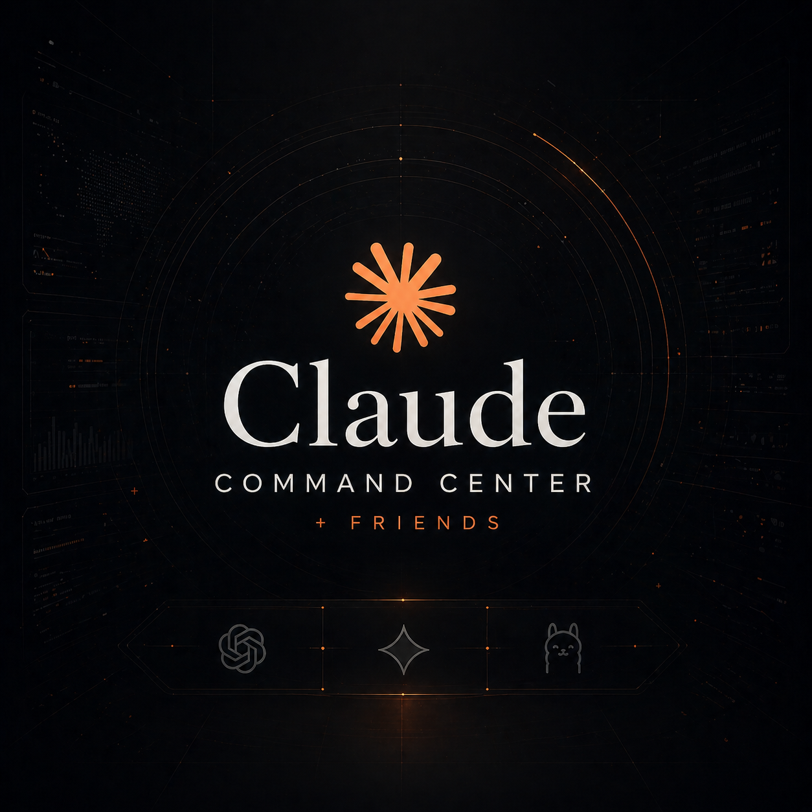
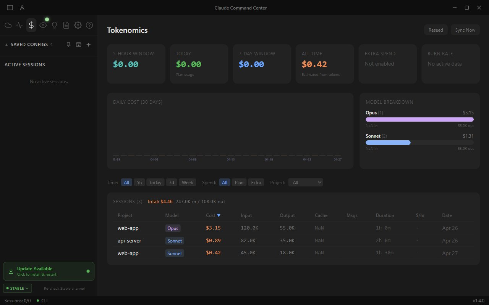
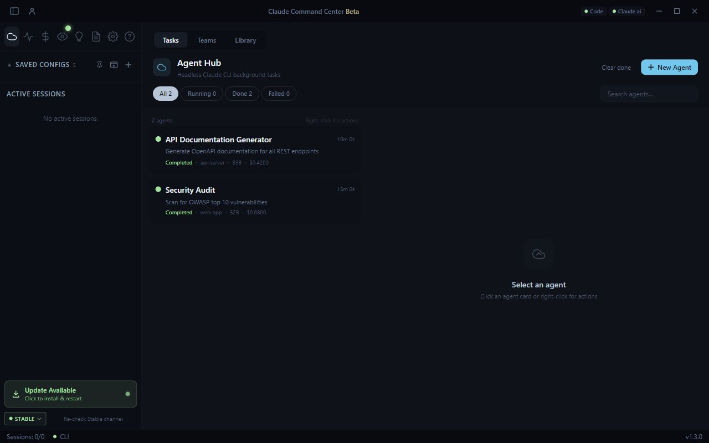
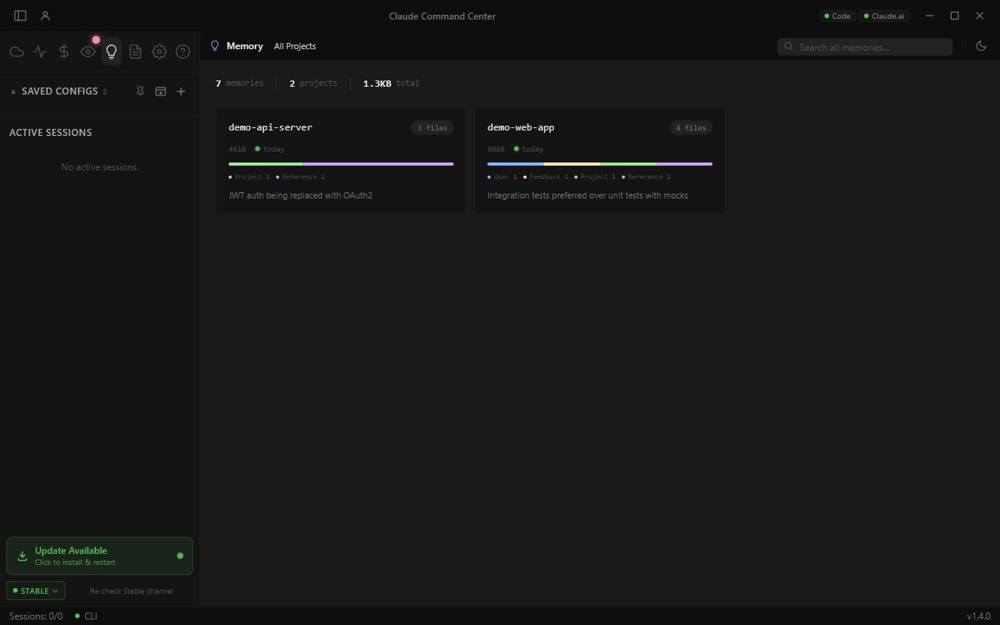
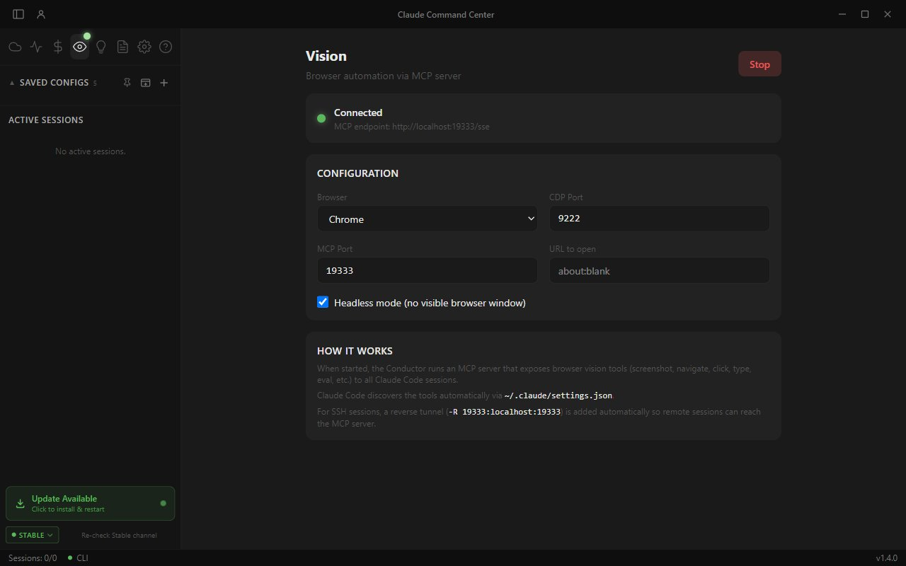
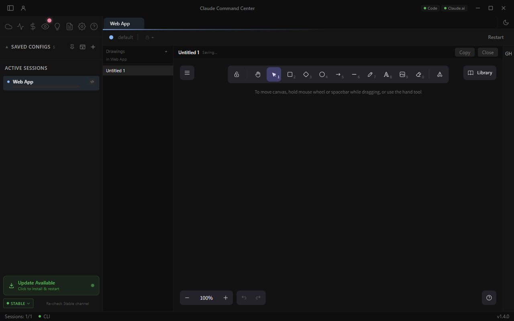
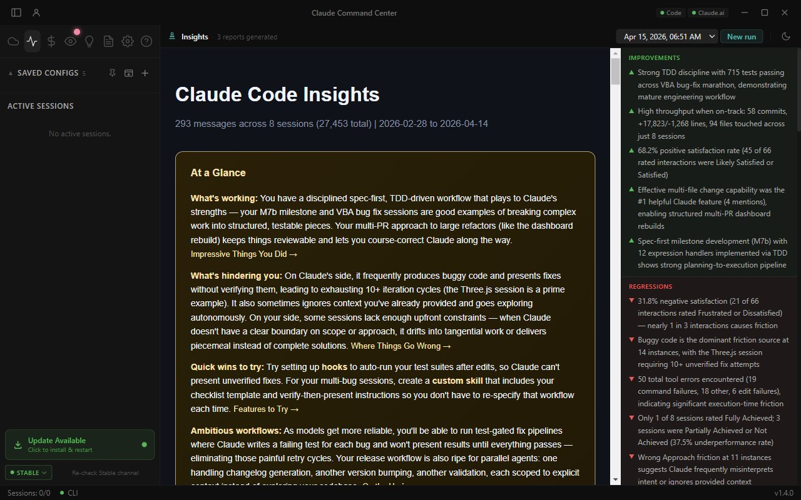
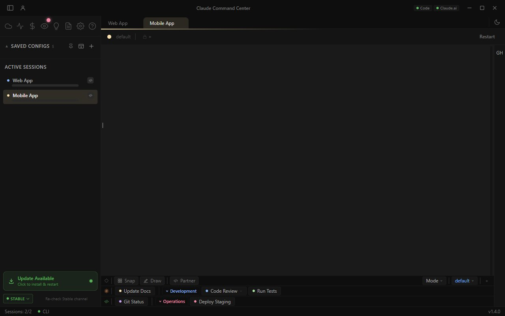
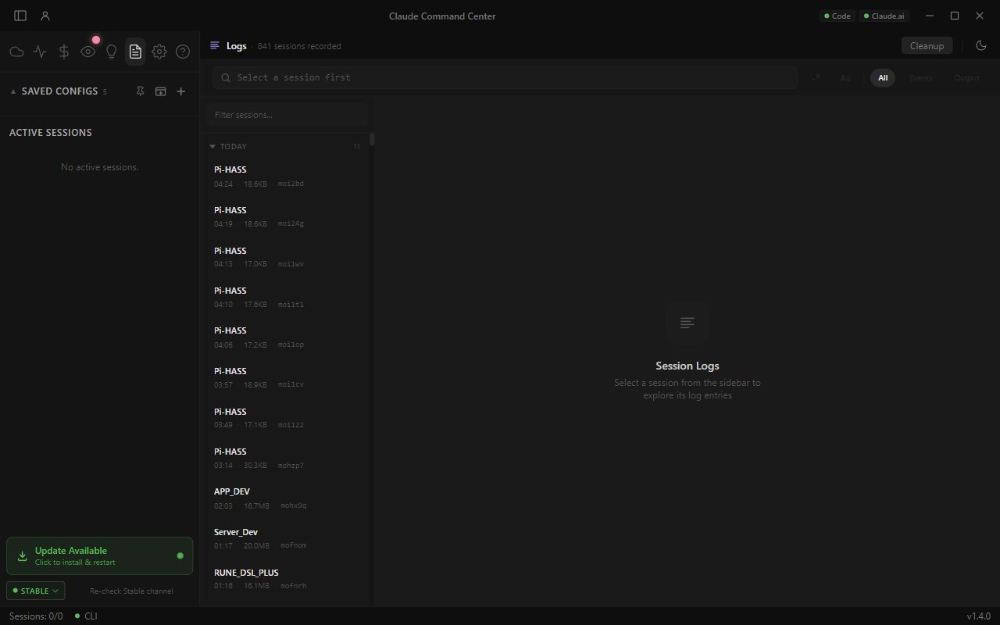

<p align="center">
  
</p>

<h1 align="center">Claude Command Center</h1>

<p align="center">
  <strong>Multi-session terminal orchestrator for <a href="https://docs.anthropic.com/en/docs/claude-code">Claude Code</a></strong><br/>
  Run dozens of Claude sessions simultaneously with tabbed management, SSH remote access, cloud agents, browser automation, an in-app webview, an Excalidraw scratchpad, GitHub PR context, and real-time usage analytics.
</p>

<p align="center">
  <a href="../../releases"></a>
  
  
  
  <a href="../../actions"></a>
</p>

<p align="center">
  <a href="#installation">Installation</a> &bull;
  <a href="#highlights">Highlights</a> &bull;
  <a href="#features">Features</a> &bull;
  <a href="#whats-new-in-v14">What's New in v1.4</a> &bull;
  <a href="#build-from-source">Build from Source</a> &bull;
  <a href="#security">Security</a>
</p>

---

> **Note** &nbsp;This project was developed privately since late 2025 and open-sourced in April 2026. Git history was squashed for the initial public release. All future development happens in the open.

> **Windows note** &nbsp;The Windows installer is not code-signed, so SmartScreen will warn on first run. Click **More info** then **Run anyway** to proceed. The macOS DMG is signed and notarized.

## Why?

Claude Code is a powerful CLI, but managing multiple sessions across projects, SSH hosts, and Docker containers means juggling terminal windows, losing context, and manually tracking costs.

**Claude Command Center** wraps Claude Code in a desktop app that gives you:

- **Tabbed sessions** with save/restore, attention indicators, and instant switching
- **SSH terminals** with encrypted credentials and automated remote setup
- **Cloud agents** that run headless tasks in the background, plus multi-agent teams
- **Browser automation** via MCP so Claude can see and interact with web pages
- **In-app webview** for a side-by-side browser pane that talks to the same Vision tools
- **Excalidraw scratchpad** for diagramming whose exports drop straight into Claude
- **GitHub sidebar** showing the PR for your branch, CI runs, reviews, and linked issues
- **Token analytics** with cost tracking, rate limit monitoring, and burn rate
- **Memory visualizer** to browse Claude's learned context across all your projects
- **Insights** &mdash; periodic Claude-driven analysis of your session logs

It doesn't replace Claude Code &mdash; it orchestrates it.

---

## Highlights

<table>
<tr>
<td width="50%">

### Tokenomics Dashboard
Track spending by model, daily cost trends, rate limit utilization, and burn rate across all sessions.


</td>
<td width="50%">

### GitHub Sidebar
PR snapshot for the current branch &mdash; status, CI runs, reviews, unresolved threads, linked issues, plus a session-context summary inferred from branch and transcript.


</td>
</tr>
<tr>
<td>

### Memory Visualizer
Browse Claude's auto-memory across all projects. See memory types, staleness, and content at a glance.


</td>
<td>

### Vision &amp; Browser Automation
MCP server exposes 17 browser tools (screenshot, navigate, click, type, scroll, eval JS) to all Claude sessions &mdash; including over SSH via reverse tunnel.


</td>
</tr>
<tr>
<td>

### Excalidraw Scratchpad
Tear off a side pane for whiteboarding flowcharts, architecture, sequence diagrams. One-click export drops the canvas straight into Claude as an image.


</td>
<td>

### Insights
Periodic Claude-driven analysis of your session logs &mdash; surfaces recurring patterns, frequent fixes, dependency risks, and stuck flows.


</td>
</tr>
<tr>
<td>

### Combined Mode
Run Claude alongside a partner shell in the same tab &mdash; ideal for `git`, `docker`, build commands, and anything you want one keystroke away from your prompt.


</td>
<td>

### Logs &amp; Session History
Full JSONL session logging with full-text and regex search across history, plus a project browser to discover and resume past sessions.


</td>
</tr>
</table>

---

## Features

### Session Management

- **Tabbed multi-session interface** &mdash; run dozens of Claude Code sessions in parallel
- **Session save/restore** &mdash; sessions persist across app restarts with automatic `/resume`
- **Attention indicators** &mdash; tab badges pulse when Claude needs input or finishes work
- **Config presets** &mdash; save terminal configurations as reusable presets with groups and sections
- **Group launch** &mdash; start all configs in a group with a single click
- **Session grouping** &mdash; organize active sessions into collapsible sidebar groups

### Local &amp; Remote Terminals

- **Local sessions** in any working directory with directory browser
- **SSH remote sessions** with encrypted password storage (DPAPI / Keychain)
- **Automated SSH setup** &mdash; statusline + Vision MCP auto-deployed to remote on first connect
- **Sudo password auto-entry** &mdash; encrypted and machine-bound
- **Combined mode** &mdash; optional partner shell pane alongside Claude in the same tab
- **Shell-only mode** &mdash; create terminals without Claude for manual tasks

### Custom Commands

- **Command buttons** &mdash; one-click prompt buttons in the command bar
- **Sections &amp; dividers** &mdash; organize buttons into named collapsible sections
- **Target routing** &mdash; send commands to Claude, partner terminal, or active terminal
- **Arguments system** &mdash; default args per button, Ctrl+click to override before sending
- **Drag-and-drop reordering** with custom colors and global/per-config scope

### Real-Time Status Line

- **Context window tracking** &mdash; live token count with color-coded progress bar
- **Model, cost, lines changed, session duration** &mdash; all visible at a glance
- **Rate limit monitoring** &mdash; 5-hour and weekly windows with reset countdown
- **Burn rate** &mdash; cost/hour and tokens/minute for the active session
- **Customizable** &mdash; font and size, plus subtle red/green deltas for line-count changes

### Screenshots, Excalidraw &amp; WebView

- **Region capture** &mdash; select any screen region and inject it into Claude's context (built on `electron-screenshots`)
- **Window capture** &mdash; pick a window from a visual list
- **Clipboard paste** (`Alt+V`) &mdash; paste images with auto-resize (1920px max edge, JPEG q85)
- **Excalidraw scratchpad** &mdash; full whiteboard pane, exports to image straight into Claude
- **In-app WebView** &mdash; pinned browser pane next to your terminal, talks to the same Vision tools
- **Unified MCP path** &mdash; all image transfer works identically on local and SSH sessions

### Cloud Agents &amp; Teams

- **Headless background agents** &mdash; dispatch Claude tasks that run without a terminal
- **Agent dashboard** &mdash; monitor status, duration, tokens, and cost for all agents
- **Agent teams** &mdash; orchestrate multi-agent pipelines with sequential / parallel steps
- **Agent Hub Library** &mdash; canonical place to author your own templates; built-ins are starter examples to copy and edit
- **Output viewer** &mdash; read full agent output with copy / retry / remove controls

### Vision &mdash; Browser Automation

- **MCP server with 17 tools** &mdash; screenshot, navigate, click, type, scroll, evaluate JS, and more
- **Auto-discovery** &mdash; tools registered in `~/.claude/settings.json` automatically
- **SSH reverse tunnel** &mdash; remote sessions access the MCP server transparently
- **Chrome &amp; Edge support** &mdash; connect via Chrome DevTools Protocol
- **Headless mode** &mdash; run browser automation without a visible window

### Tokenomics &amp; Analytics

- **Usage dashboard** &mdash; cost breakdown by model, time window (5h / today / 7d / all-time)
- **Clickable daily cost chart** &mdash; 30-day trend; click a bar to filter the table to that day
- **Model breakdown** &mdash; per-model token counts and costs (Opus, Sonnet, Haiku, etc.)
- **Rate limit utilization** &mdash; visual bars for 5-hour and weekly limits, with anomaly alerts
- **Burn rate calculation** &mdash; cost/hour and tokens/minute with peak detection
- **Extra spend tracking** &mdash; monitor overages beyond plan limit
- **Project filters** &mdash; view costs per project or globally

### Memory Visualizer

- **Project cards** &mdash; browse Claude's auto-memory organized by project
- **Type grouping** &mdash; User, Feedback, Project, Reference memory types
- **Full-text search** &mdash; find memories across all projects instantly
- **Staleness indicators** &mdash; color-coded age (green / yellow / red) to spot stale context
- **Markdown rendering** &mdash; read memory content with formatted display
- **Memory management** &mdash; delete outdated entries directly from the UI

### GitHub Sidebar

- **PR snapshot for current branch** &mdash; status, CI runs, reviews, unresolved threads, linked issues
- **Session context inference** &mdash; detect which issue/PR your terminal is working on from branch name, transcript, or PR body
- **Local git state** &mdash; ahead / behind, dirty / clean, staged / unstaged at a glance
- **Sign-in flexibility** &mdash; OAuth device flow, fine-grained PAT, or adopt your existing `gh` CLI auth
- **Per-session opt-in** &mdash; nothing runs until you enable it for a specific session
- **`Ctrl+/` toggle** (`Cmd+/` on macOS) &mdash; collapsible right panel keeps terminal space when hidden

### Insights &mdash; Log Analysis

- **Periodic analysis runs** &mdash; Claude reads your session logs in the background and generates a digest
- **Cross-project patterns** &mdash; surfaces recurring issues, frequent fixes, and stuck flows
- **Dependency risks** &mdash; highlights brittle areas you've debugged repeatedly
- **Browser-friendly reports** &mdash; reports open in your system browser as standalone HTML

### Session Logs &amp; History

- **Full session logging** &mdash; all terminal output recorded to JSONL files
- **Log search** &mdash; full-text and regex search across session history
- **Session browser** &mdash; discover and resume past sessions grouped by date
- **Project browser** &mdash; find sessions across all projects with metadata
- **Log rotation** &mdash; auto-rotate at 10 MB with configurable retention

### Security &amp; Credentials

- **Encrypted credential storage** &mdash; SSH passwords, sudo passwords, and notes encrypted with OS credential store
- **Machine-bound** &mdash; credentials only decrypt on the machine that stored them
- **Encrypted notes** &mdash; per-session secure notepad for API keys, SQL snippets, secrets
- **Daily CONFIG backups** &mdash; the app snapshots `CONFIG/*.json` to `CONFIG/_backups/YYYY-MM-DD/` on every launch (last 7 retained), so config files are always recoverable
- **No telemetry** &mdash; zero data collection or transmission
- **Local-only storage** &mdash; all data stays on your machine
- **VirusTotal scanned** &mdash; every release scanned against 70+ antivirus engines

---

## What's New in v1.4

- **GitHub sidebar** &mdash; collapsible right panel with PR snapshot, CI runs, reviews, unresolved threads, linked issues, and session-context inference
- **OAuth / PAT / `gh` CLI sign-in** &mdash; three ways to authenticate; encrypted profiles in OS credential store
- **In-app WebView pane** &mdash; pin any URL alongside the terminal, integrates with Vision tools
- **Excalidraw scratchpad** &mdash; full whiteboard pane with one-click export into Claude
- **Snap (region capture)** &mdash; rebuilt on `electron-screenshots`, far more reliable than the legacy overlay
- **Combined Mode** &mdash; Claude + partner shell side-by-side in one tab
- **Insights page** &mdash; periodic Claude-driven analysis of your logs
- **Branded splash** &mdash; new asset on launch
- **14-step hero-layout tour** &mdash; covers every major surface, keyboard-navigable
- **Daily CONFIG safety backups** (v1.4.2+) &mdash; last 7 days of `CONFIG/*.json` retained automatically under `CONFIG/_backups/`
- **YAML escape fix** for memory frontmatter writes (closes CodeQL alert &mdash; values with backslashes/newlines now round-trip correctly)
- **Settings audit** &mdash; dropped flicker-free, PowerShell tool, and Docker Container session toggles (the env vars they set were either obsolete or never wired)
- **Statusline polish** &mdash; configurable font / size, subtle red-green deltas for line-count changes

See [`src/renderer/changelog.ts`](src/renderer/changelog.ts) for the full revision history.

---

## Installation

### Download

1. Download the latest installer from [Releases](../../releases):
   - **Windows**: `ClaudeCommandCenter-x.y.z.exe`
   - **macOS**: `ClaudeCommandCenter-x.y.z-mac.dmg`
2. Verify the SHA-256 checksum against `CHECKSUMS.txt` in the release
3. Run the installer and choose your Data and Resources directories
4. The setup wizard will guide you through Claude CLI authentication

### Prerequisites

- [Claude Code CLI](https://docs.anthropic.com/en/docs/claude-code) installed and authenticated
- Node.js 20+ (for Claude Code)
- Windows 10 / 11 or macOS 12+

---

## Build from Source

Don't trust the installer? Build it yourself &mdash; the source is identical to what ships in releases.

**Prerequisites:** Node.js 20+, npm 9+, [Claude Code CLI](https://docs.anthropic.com/en/docs/claude-code) installed.

```bash
git clone https://github.com/nubbymong/claude-command-center.git
cd claude-command-center
npm install
npx vitest run       # 566 unit tests should pass
npm run dev          # Development with hot reload
npm run build        # Production build
```

### Package for distribution

```bash
# Windows NSIS installer
npm run package:win

# macOS DMG (signing + notarization requires Apple credentials)
npm run package:mac
```

Every release also includes `CHECKSUMS.txt` (SHA256) and is scanned by [VirusTotal](https://www.virustotal.com/) &mdash; check the release notes for scan links.

---

## Architecture

| Layer | Technology |
|-------|-----------|
| Shell | Electron 33 |
| UI | React 18 + Tailwind CSS v4 |
| State | Zustand 5 |
| Terminal | xterm.js 5.5 + node-pty |
| Build | electron-vite |
| MCP | `@modelcontextprotocol/sdk` |
| Diagramming | Excalidraw |
| Tests | Vitest (566 unit + Playwright E2E) |

The app runs a frameless Electron window with a React renderer. Each Claude session spawns a PTY process via `node-pty`. The Vision system runs a local MCP server that Claude Code discovers via `~/.claude/settings.json`. SSH sessions get a reverse tunnel to the MCP server automatically.

---

## Keyboard Shortcuts

| Shortcut | Action |
|----------|--------|
| `Ctrl+T` | New config |
| `Ctrl+W` | Close session |
| `Ctrl+Tab` / `Ctrl+Shift+Tab` | Next / previous session |
| `Ctrl+1`&hellip;`Ctrl+9` | Jump to session N |
| `Ctrl+B` | Toggle sidebar |
| `Ctrl+/` (`Cmd+/` on macOS) | Toggle GitHub sidebar |
| `Alt+V` | Paste clipboard image |
| `Escape` | Interrupt Claude (`Ctrl+C`) |
| `Shift+Enter` | New line without sending |

All shortcuts are customizable in **Settings &rarr; Shortcuts**.

---

## Security

### Credential Storage

SSH passwords and secrets are encrypted using the OS credential store:

| Platform | Backend | Scope |
|----------|---------|-------|
| Windows | DPAPI via Electron `safeStorage` | Machine + user account |
| macOS | Keychain via Electron `safeStorage` | Machine + user account |
| Linux | libsecret via Electron `safeStorage` | Machine + user account |

Credentials are stored as encrypted base64 blobs &mdash; never plaintext. They are machine-bound and cannot be extracted or transferred.

### Network Activity

The app makes **no** network calls of its own. All Claude API communication goes through the Claude CLI directly. The only network activity is:

- **Update checker** &mdash; fetches GitHub Releases API to check for new versions
- **Service status** &mdash; polls `status.claude.com` for API health indicators
- **GitHub sidebar** (opt-in only) &mdash; talks to the GitHub API after you sign in
- **VirusTotal** (release builds only) &mdash; scans installer via VT API during CI

### Defence in Depth

- **Daily CONFIG backups** &mdash; every launch snapshots `CONFIG/*.json` to `CONFIG/_backups/YYYY-MM-DD/`, keeping the last 7. Recover from a corrupted write by copying any prior day's snapshot back.
- **Atomic config writes** &mdash; all `writeConfig` operations write a `.tmp` then rename, so an interrupted save can never leave a half-written file.
- **Capture-script lock** &mdash; the release-time screenshot tool acquires an exclusive `.capture.lock` and only restores files it explicitly backed up; never blind-deletes by filename.

### Reporting Vulnerabilities

If you discover a security issue, please report it privately via [GitHub Security Advisories](../../security/advisories/new).

---

## Contributing

Contributions are welcome. See [CONTRIBUTING.md](CONTRIBUTING.md) for setup instructions, coding standards, and the PR process.

---

## License

[MIT](LICENSE) &mdash; see the LICENSE file for details.
