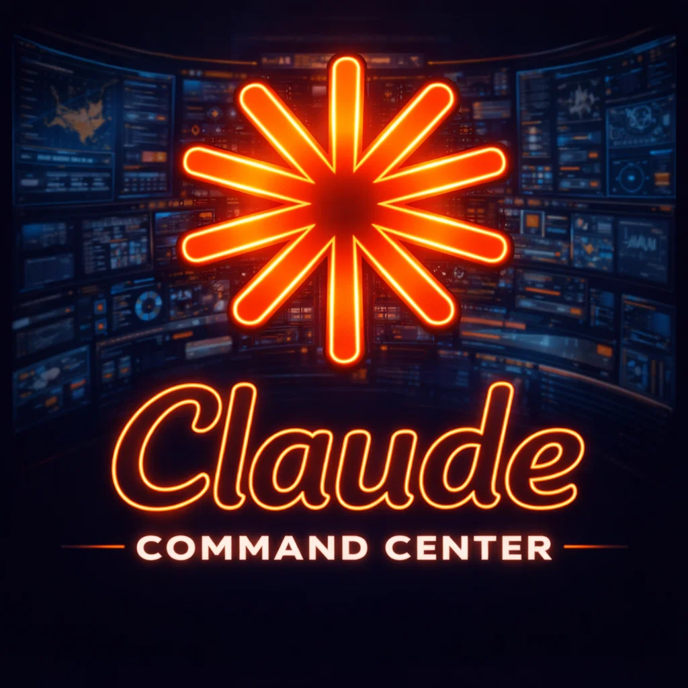
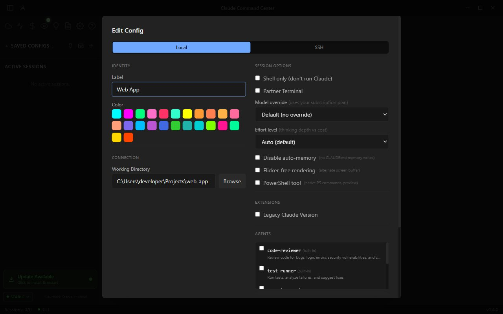
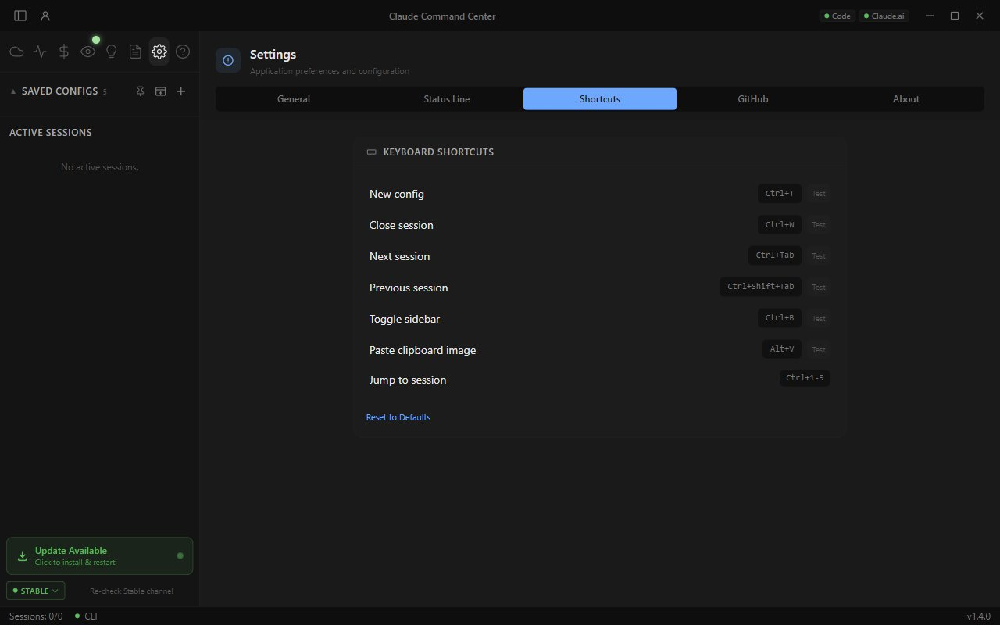

<p align="center">
  
</p>

<h1 align="center">Claude Command Center</h1>

<p align="center">
  <strong>Multi-session terminal orchestrator for <a href="https://docs.anthropic.com/en/docs/claude-code">Claude Code</a></strong><br/>
  Run dozens of Claude sessions simultaneously with tabbed management, SSH remote access, cloud agents, browser automation, and real-time usage analytics.
</p>

<p align="center">
  <a href="../../releases"></a>
  
  
  
</p>

<p align="center">
  <a href="#installation">Installation</a> &bull;
  <a href="#features">Features</a> &bull;
  <a href="#screenshots">Screenshots</a> &bull;
  <a href="#build-from-source">Build from Source</a> &bull;
  <a href="#security">Security</a> &bull;
  <a href="#contributing">Contributing</a>
</p>

---

> **Note** - This project was developed privately since late 2025 and open-sourced in April 2026. Git history was squashed for the initial public release. All future development happens in the open.

> **Windows note** - The Windows installer is not code-signed, so SmartScreen will warn on first run. Click **"More info"** then **"Run anyway"** to proceed. The macOS DMG is signed and notarized.

## Why?

Claude Code is a powerful CLI, but managing multiple sessions across projects, SSH hosts, and Docker containers means juggling terminal windows, losing context, and manually tracking costs.

**Claude Command Center** wraps Claude Code in a desktop app that gives you:

- **Tabbed sessions** with save/restore, attention indicators, and instant switching
- **SSH & Docker** terminals with encrypted credentials and auto-reconnect
- **Cloud agents** that run headless tasks in the background
- **Browser automation** via MCP so Claude can see and interact with web pages
- **Token analytics** with cost tracking, rate limit monitoring, and burn rate
- **Memory visualizer** to browse Claude's learned context across all your projects

It doesn't replace Claude Code - it orchestrates it.

---

## Screenshots

<table>
<tr>
<td width="50%">

**Tokenomics Dashboard**
Track spending by model, daily cost trends, rate limit utilization, and burn rate across all sessions.


</td>
<td width="50%">

**Agent Hub**
Dispatch headless Claude agents for background tasks. Monitor status, duration, cost, and read output when done.


</td>
</tr>
<tr>
<td>

**Memory Visualizer**
Browse Claude's auto-memory across all projects. See memory types, staleness, and content at a glance.


</td>
<td>

**Vision / Browser Automation**
MCP server exposes 17 browser tools (screenshot, navigate, click, type, scroll, eval JS) to all Claude sessions - including over SSH via reverse tunnel.


</td>
</tr>
<tr>
<td>

**Session Configuration**
Two-column config editor with local/SSH toggle, color coding, model override, effort level, partner terminal, and agent selection.


</td>
<td>

**Settings & Shortcuts**
Customizable keyboard shortcuts, status line metrics, font size, update channel, and debug logging.


</td>
</tr>
</table>

---

## Features

### Session Management

- **Tabbed multi-session interface** - run dozens of Claude Code sessions in parallel
- **Session save/restore** - sessions persist across app restarts with automatic `/resume`
- **Attention indicators** - tab badges pulse when Claude needs input or finishes work
- **Config presets** - save terminal configurations as reusable presets with groups and sections
- **Group launch** - start all configs in a group with a single click
- **Session grouping** - organize active sessions into collapsible sidebar groups

### Local & Remote Terminals

- **Local sessions** in any working directory with directory browser
- **SSH remote sessions** with encrypted password storage (DPAPI / Keychain)
- **Post-connect commands** - run setup commands after SSH connection (e.g., `docker exec`)
- **Sudo password auto-entry** - encrypted and machine-bound
- **Partner terminal** - optional second shell alongside Claude in the same tab
- **Shell-only mode** - create terminals without Claude for manual tasks

### Custom Commands

- **Command buttons** - one-click prompt buttons in the command bar
- **Sections & dividers** - organize buttons into named collapsible sections
- **Target routing** - send commands to Claude, partner terminal, or active terminal
- **Arguments system** - default args per button, Ctrl+click to override before sending
- **Drag-and-drop reordering** with custom colors and global/per-config scope

### Real-Time Status Line

- **Context window tracking** - live token count with color-coded progress bar
- **Model, cost, lines changed, session duration** - all visible at a glance
- **Rate limit monitoring** - 5-hour and 7-day windows with reset countdown
- **Burn rate** - cost/hour and tokens/minute for the active session
- **Compaction interrupt** - optionally auto-pause Claude when context reaches a threshold

### Screenshots & Storyboards

- **Rectangle capture** - select any screen region and inject it into Claude's context
- **Window capture** - pick a window from a visual list
- **Clipboard paste** (Alt+V) - paste images with auto-resize (1920px max edge, JPEG q85)
- **Storyboard recording** - timed screenshot sequences with per-frame annotations
- **Docker container screenshots** - capture from remote containers via `docker cp`
- **Unified MCP path** - all image transfer works identically on local and SSH sessions

### Cloud Agents

- **Headless background agents** - dispatch Claude tasks that run without a terminal
- **Agent dashboard** - monitor status, duration, tokens, and cost for all agents
- **Agent teams** - orchestrate multi-agent pipelines with sequential/parallel steps
- **Template library** - pre-built agent templates for common tasks (code review, docs, security audit)
- **Output viewer** - read full agent output with copy/retry/remove controls

### Vision / Browser Automation

- **MCP server with 17 tools** - screenshot, navigate, click, type, scroll, evaluate JS, and more
- **Auto-discovery** - tools registered in `~/.claude/settings.json` automatically
- **SSH reverse tunnel** - remote sessions access the MCP server transparently
- **Chrome & Edge support** - connect via Chrome DevTools Protocol
- **Headless mode** - run browser automation without a visible window

### Tokenomics & Analytics

- **Usage dashboard** - cost breakdown by model, time window (5h / today / 7d / all-time)
- **Daily cost chart** - 30-day spending trend visualization
- **Model breakdown** - per-model token counts and costs (Opus, Sonnet, Haiku, etc.)
- **Rate limit utilization** - visual percentage of 5-hour and weekly limits consumed
- **Burn rate calculation** - cost/hour and tokens/minute with peak detection
- **Extra spend tracking** - monitor overages beyond plan limit
- **Project filtering** - view costs per project or globally

### Memory Visualizer

- **Project cards** - browse Claude's auto-memory organized by project
- **Type grouping** - User, Feedback, Project, Reference memory types
- **Full-text search** - find memories across all projects instantly
- **Staleness indicators** - color-coded age (green/yellow/red) to spot stale context
- **Markdown rendering** - read memory content with formatted display
- **Memory management** - delete outdated entries directly from the UI

### GitHub Sidebar

- **PR snapshot for current branch** - status, CI runs, reviews, unresolved threads, linked issues
- **Session context inference** - detect which issue/PR your terminal is working on from branch name, transcript, or PR body
- **Local git state** - ahead/behind, dirty/clean, staged/unstaged at a glance
- **Sign-in flexibility** - OAuth device flow, fine-grained PAT, or adopt your existing `gh` CLI auth
- **Per-session opt-in** - nothing runs until you enable it for a specific session
- **Ctrl+/ toggle** (`Cmd+/` on macOS) - collapsible right panel keeps terminal space when hidden

### HTTP Hooks Gateway & Live Activity

- **Loopback hooks listener** - 127.0.0.1 HTTP server receives tool-call, permission, and lifecycle events from your Claude sessions
- **Per-session UUID secrets** - each session registers its own `X-CCC-Hook-Token`; other sessions can't read each other's events
- **Live Activity feed** - collapsible footer on each session shows a real-time timeline of recent hook events with Pause/Resume and type filters
- **Ring buffer** - 200 events per session cap with a "dropped" indicator when older events age out
- **SSH reverse tunnel** - remote sessions hook through the same gateway via an auto-added `-R` port forward
- **No telemetry** - listener is localhost-only; events never leave your machine

### Session Logs & History

- **Full session logging** - all terminal output recorded to JSONL files
- **Log search** - full-text and regex search across session history
- **Session browser** - discover and resume past sessions grouped by date
- **Project browser** - find sessions across all projects with metadata
- **Log rotation** - auto-rotate at 10MB with configurable retention

### Security & Credentials

- **Encrypted credential storage** - SSH passwords, sudo passwords, and notes encrypted with OS credential store
- **Machine-bound** - credentials only decrypt on the machine that stored them
- **Encrypted notes** - per-session secure notepad for API keys, SQL snippets, secrets
- **No telemetry** - zero data collection or transmission
- **Local-only storage** - all data stays on your machine
- **VirusTotal scanned** - every release scanned against 70+ antivirus engines

---

## Installation

### Download

1. Download the latest installer from [Releases](../../releases):
   - **Windows**: `ClaudeCommandCenter-Beta-x.y.z.exe`
   - **macOS**: `ClaudeCommandCenter-Beta-x.y.z.dmg`
2. Verify the SHA-256 checksum against `CHECKSUMS.txt` in the release
3. Run the installer and choose your Data and Resources directories
4. The setup wizard will guide you through Claude CLI authentication

### Prerequisites

- [Claude Code CLI](https://docs.anthropic.com/en/docs/claude-code) installed and authenticated
- Node.js 20+ (for Claude Code)
- Windows 10/11 or macOS 12+

---

## Build from Source

Don't trust the installer? Build it yourself - the source is identical to what ships in releases.

**Prerequisites:** Node.js 20+, npm 9+, [Claude Code CLI](https://docs.anthropic.com/en/docs/claude-code) installed.

```bash
git clone https://github.com/nubbymong/claude-command-center.git
cd claude-command-center
npm install
npx vitest run       # Run unit tests - verify everything passes
npm run dev          # Development with hot reload
npm run build        # Production build
```

### Package for distribution

```bash
# Windows NSIS installer
npm run package:win

# macOS DMG
npm run package:mac
```

Every release also includes `CHECKSUMS.txt` (SHA256) and is scanned by [VirusTotal](https://www.virustotal.com/) - check the release notes for scan links.

---

## Architecture

| Layer | Technology |
|-------|-----------|
| Shell | Electron 33 |
| UI | React 18 + Tailwind CSS v4 |
| State | Zustand 5 |
| Terminal | xterm.js 5.5 + node-pty |
| Build | electron-vite |
| MCP | @modelcontextprotocol/sdk |
| Tests | Vitest (536 tests) |

The app runs a frameless Electron window with a React renderer. Each Claude session spawns a PTY process via node-pty. The Vision system runs a local MCP server that Claude Code discovers via `settings.json`. SSH sessions get a reverse tunnel to the MCP server automatically.

---

## Keyboard Shortcuts

| Shortcut | Action |
|----------|--------|
| `Ctrl+T` | New config |
| `Ctrl+W` | Close session |
| `Ctrl+Tab` / `Ctrl+Shift+Tab` | Next / previous session |
| `Ctrl+1-9` | Jump to session N |
| `Ctrl+B` | Toggle sidebar |
| `Alt+V` | Paste clipboard image |
| `Escape` | Interrupt Claude (Ctrl+C) |
| `Shift+Enter` | New line without sending |

All shortcuts are customizable in Settings > Shortcuts.

---

## Security

### Credential Storage

SSH passwords and secrets are encrypted using the OS credential store:

| Platform | Backend | Scope |
|----------|---------|-------|
| Windows | DPAPI via Electron safeStorage | Machine + user account |
| macOS | Keychain via Electron safeStorage | Machine + user account |
| Linux | libsecret via Electron safeStorage | Machine + user account |

Credentials are stored as encrypted base64 blobs - never plaintext. They are machine-bound and cannot be extracted or transferred.

### Network Activity

The app makes **no** network calls of its own. All Claude API communication goes through the Claude CLI directly. The only network activity is:

- **Update checker** - fetches GitHub Releases API to check for new versions
- **Service status** - polls `status.claude.com` for API health indicators
- **VirusTotal** (release builds only) - scans installer via VT API during CI

### Reporting Vulnerabilities

If you discover a security issue, please report it privately via [GitHub Security Advisories](../../security/advisories/new).

---

## Contributing

Contributions are welcome. See [CONTRIBUTING.md](CONTRIBUTING.md) for setup instructions, coding standards, and the PR process.

---

## License

[MIT](LICENSE) - see the LICENSE file for details.
