<div align="center">

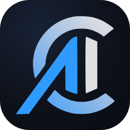

# AI Code Conductor

<sub>formerly **Claude Command Center**</sub>

### Mission control for [Claude Code](https://docs.anthropic.com/en/docs/claude-code).

Run dozens of Claude Code and Codex sessions in parallel, each with its own account, working directory, and saved config. See every session's spend, identity, and attention at a glance. Read back any conversation, track every cent, and prune your memory before it bloats your context.

<br/>

[](../../releases)
[](../../actions)
[%20%7C%20Linux%20(experimental)-89b4fa?labelColor=313244)](../../releases)
[](LICENSE)

[Download](#install) &middot; [Features](#what-it-does) &middot; [Architecture](#under-the-hood) &middot; [Security](#security)

<br/>

<sub>An independent, community-built project &middot; not affiliated with, endorsed by, or sponsored by Anthropic. See [Disclaimer](#disclaimer-and-trademarks).</sub>

<br/>

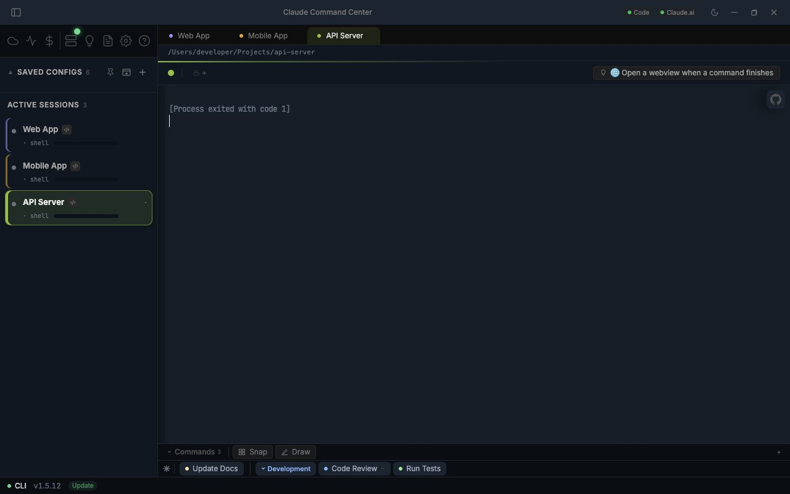

</div>

---

## What it does

Claude Code is a remarkable CLI. But the moment you have more than one project, more than one account, or more than one machine, the experience fragments. You lose track of which terminal is which, which sessions are paused, what they have spent, and where their attention is going.

AI Code Conductor wraps Claude Code and Codex in a desktop app that treats the session as the first-class object. Every session has a colour, a name, an account, a working directory, and a saved config. Every spawn surfaces its tokens, its model, its rate-limit window, and its identity. Every cent is captured and pivotable.

It does not replace Claude Code. It conducts it.

---

## Sessions and saved configs

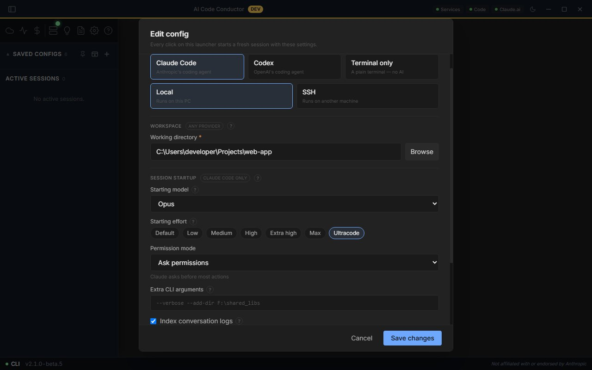

Every workspace starts as a **saved config**: a label, a colour, a working directory, a starting model, a starting effort, and any agent templates you want pre-loaded. Add per-config CLI arguments and a permission mode when a project needs them. Local or SSH, the same form drives both.

---

## Multiple accounts, real isolation

Run more than one Claude account side by side. Your existing login is captured into a protected **primary** account on first run, and every session runs under a saved, isolated home, so signing in to one never disturbs another or your default login.

You pick the account at **launch time**, the first time a session spawns this run, and you can switch account **mid-session** without losing the session. Accounts you are not using can be **parked** so they stay out of the picker without being deleted. Add one by running `/login` in any session — the Conductor detects the new login and offers to save it as a separate named account.

Name and colour each account in **Settings, Accounts**; the colour follows it onto the session card, the statusline, and the launch picker. Memory, settings, and history stay shared across all accounts.

Each account also carries its own **claude.ai web session**, signed in **inside the app** rather than by handing you off to a system browser.

---

## SSH sessions that survive the link

Remote sessions run over SSH with the same session model as local ones — same dialog, same statusline, same account handling, with the Conductor's MCP server reachable through an automatically injected reverse tunnel.

Mark a config **Detachable** and its remote session runs under `tmux`, so a dropped link, a closed lid, or a flaky VPN no longer kills the work. Reconnecting reattaches to the live session where you left it. Ending a session and leaving it running are separate, explicit actions, and a pill on the session shows when persistence is active.

---

## Agent Canvas

A visual review surface. Claude renders a design mockup, or the project's real built site, onto a canvas in the app; you mark it up directly — pin a note to an element, draw on a region, leave a general comment — and submit. Claude picks the review up as structured notes anchored to the actual elements you pointed at, works through them, and renders the result back for another pass.

It is a review loop rather than a screenshot: the page is laid out by a real browser engine, so what you annotate is what will ship. A library lists every canvas you have accumulated so you can prune them.

---

## Logs, a chat-transcript viewer

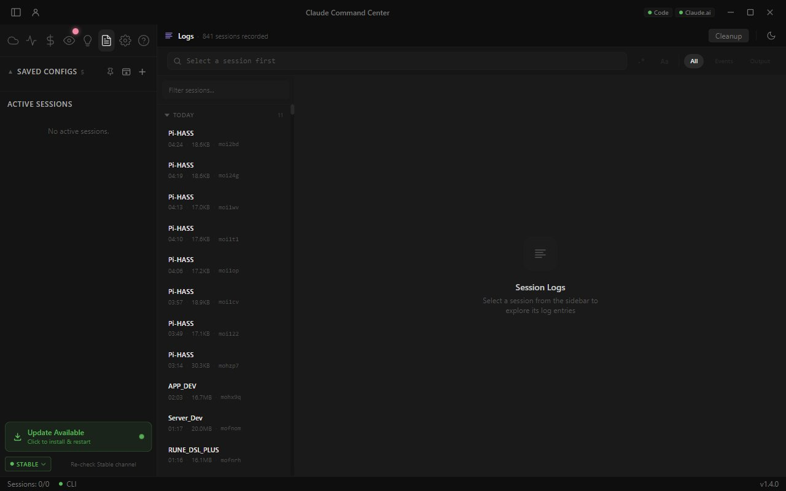

The Conductor indexes Claude's own conversation transcripts and renders them back as a readable chat: messages, tool calls, and thinking. A **timeline rail** beside the transcript scrubs the whole conversation; click to jump. **Full-text search** spans every conversation and jumps you straight to the matching turn. A per-session **Conversation** tab live-follows the running session. Deleting the index never touches your conversations, which stay in `~/.claude/projects`.

---

## Tokenomics

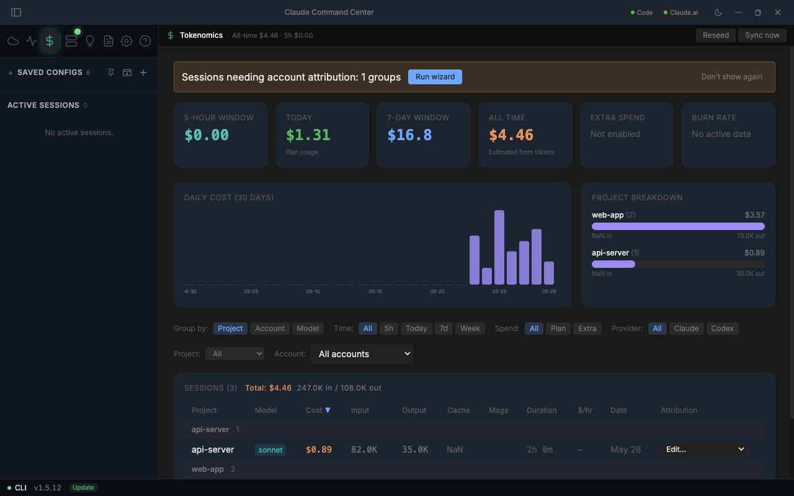

Track every dollar Claude and Codex cost you across every session. A background indexer reads all of your transcripts (including subagent and sidechain files), dedups globally, and computes cost at query time from live pricing, so the dashboard opens instantly with a **KPI row**, a **daily-spend chart**, a **per-model breakdown**, and a **sessions table** with cost, model, and config attribution. Filter the whole view by date, model, **account**, or project. Pricing comes from LiteLLM open pricing (cached 24 hours).

---

## Memory dashboard

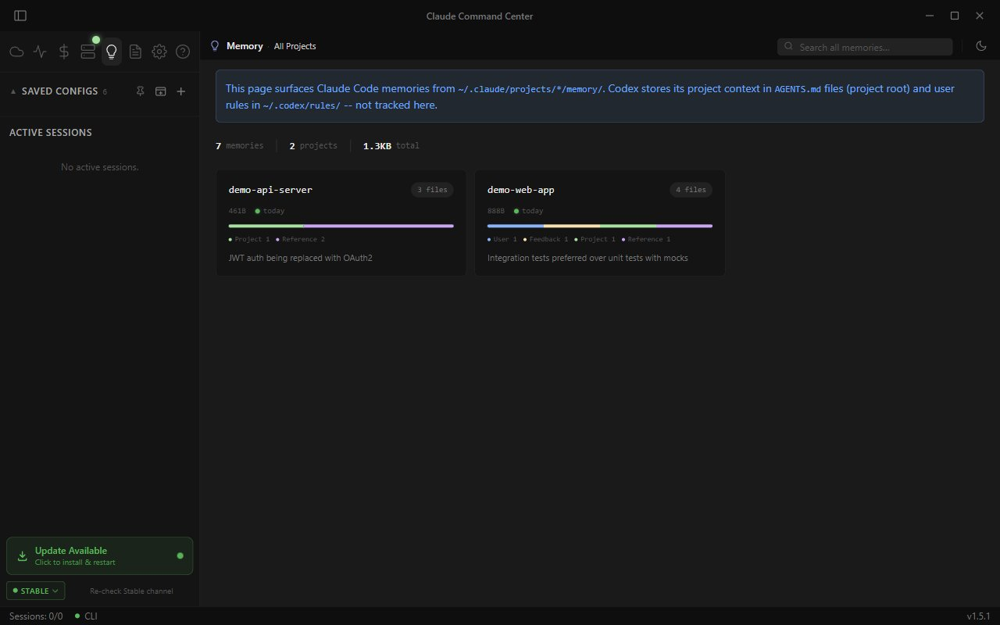

A dashboard over Claude's auto-memory across every project. A **KPI strip** (memories, projects, total size, stale-over-30-days, index health) and charts summarise the whole store; a **ranked project list** shows staleness dots, index warnings, and live-session activity. Drill into any project for a sortable memory table, then open a memory in the **reading drawer** to read it cleanly, write missing frontmatter, or delete it. Full-text search runs across everything. Catches drift before it bloats your context.

---

## The rest of the surface

<table>
<tr>
<td width="50%" valign="top">

### Sentinel

An opt-in watcher that notices when Claude Code updates and checks whether the new version might affect the Conductor. Findings surface in a labelled **Sentinel** chip in the title bar and a panel. It proposes **model and effort registry** fixes you apply yourself and never changes anything automatically. A hot-reloadable registry means brand-new models still get a colour, label, and pricing. Fail-open, so it never blocks the app.

</td>
<td width="50%" valign="top">

### Conductor MCP

A local MCP server giving Claude eighteen browser-vision tools (screenshot, navigate, click, type, eval), a host-screenshot fetch, the three Agent Canvas tools, and `codex_review` — so Claude can ask Codex to spot-check its own work. One global Chrome instance is shared across every session, so cookies and logins persist. SSH sessions reach the same server transparently through an auto-injected reverse tunnel.

</td>
</tr>
<tr>
<td valign="top">

### Agent Hub

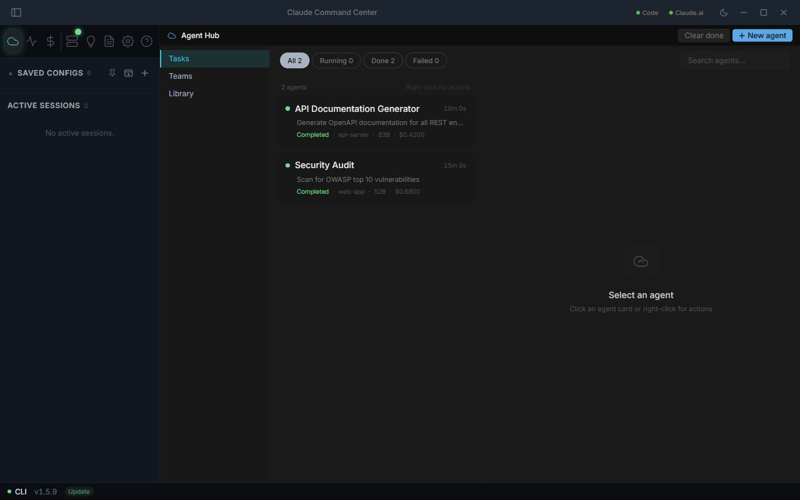

Two surfaces in one. **Tasks** dispatch headless Claude as background jobs with live status and output streaming. The **Library** is where you author agent templates (name, prompt, model, tool whitelist) that surface as tickable subagents in every Edit Config dialog, so Claude can delegate to them via the Task tool inside a running session. **Teams** chain agents with shared context and per-step prompts.

</td>
<td valign="top">

### Codex provider

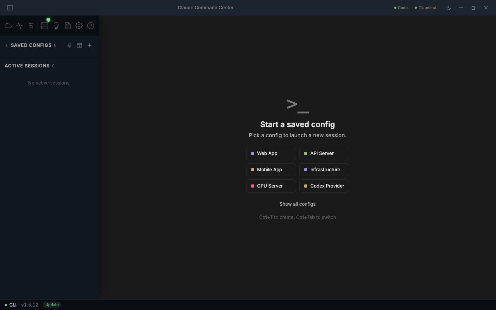

OpenAI Codex CLI sits alongside Claude in the New Session dialog — pick the provider per spawn. The gpt-5 series sits in the model dropdown, with read-only / standard / auto / unrestricted permission presets in the toolbar. The resume picker mirrors the Claude flow, and Tokenomics segments Codex spend automatically. Still marked Beta, behind a master switch in Settings.

</td>
</tr>
<tr>
<td valign="top">

### GitHub PR context where you work

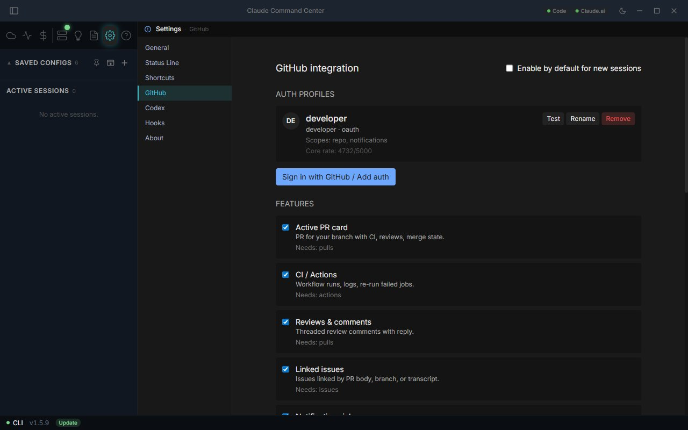

A collapsible right-rail panel surfaces PR status, CI runs, reviews, unresolved threads, and inferred issue context from your branch and transcript. Sign in via OAuth or PAT, or adopt your existing `gh` CLI auth. Per-session opt-in; toggles with `Ctrl+/` (`Cmd+/` on macOS).

</td>
<td valign="top">

### Partner terminal and the scratchpad

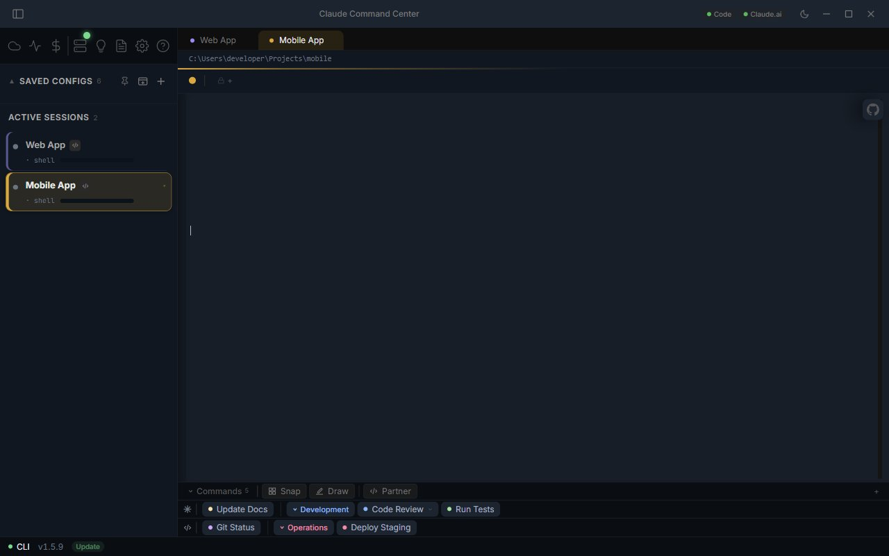

Every session carries a partner shell in the same tab, for the build, git, and docker commands you want one keystroke from your prompt. The **Canvas** scratchpad is a per-session Excalidraw whiteboard that persists with the config; freeze the webview pane to annotate a snapshot, or export the drawing straight into Claude as an image.

</td>
</tr>
<tr>
<td valign="top">

### Snap and Vision capture

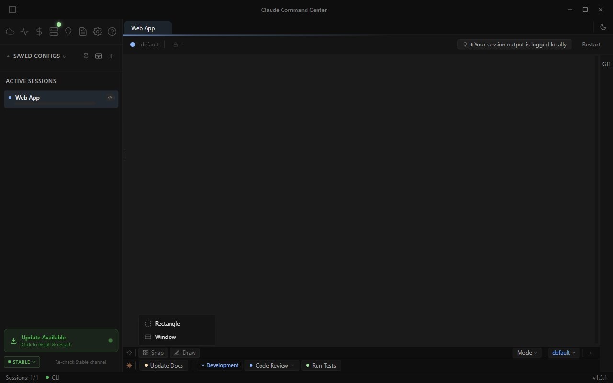

Region or window capture from any screen, encoded at 1920px / JPEG 85 to stay under Claude's image budget. Local sessions get a file path inline; SSH fetches the image over the Conductor MCP tunnel. Paste images from the clipboard with **Alt+V**.

</td>
<td valign="top">

### Insights

Scheduled and on-demand reports over your own usage, runnable across **every account at once** rather than one at a time. Sits alongside Tokenomics: where that answers what things cost, Insights answers what actually happened.

</td>
</tr>
</table>

---

## Install

### Download

1. Grab the latest installer from **[Releases](../../releases)**.
   - Windows: `AI-Code-Conductor-x.y.z.exe`
   - macOS (Apple Silicon): `AI-Code-Conductor-x.y.z-mac.dmg`
   - Linux (experimental): `AI-Code-Conductor-x.y.z-linux-x86_64.AppImage`
2. Verify the **SHA-256** of the file you downloaded against `CHECKSUMS.txt` on the release page.
3. Run the installer and choose your Data and Resources directories.
4. The setup wizard hands off to Claude CLI auth.

> Internally the app still identifies itself as `claude-conductor` (npm name) and `com.claudeconductor.app` (Windows application id). Those are frozen deliberately — changing them would break the upgrade path and orphan existing data directories — so you may see them in paths and installer metadata.

### Requirements

- [Claude Code CLI](https://docs.anthropic.com/en/docs/claude-code) installed and authenticated
- Node.js 20+ (a Claude Code dependency)
- Windows 10 or 11 (x64), or macOS 12+ on **Apple Silicon (arm64)**, or a Linux distro with **glibc 2.39+** (Ubuntu 24.04+, Rocky 10+, Fedora 40+) on x64

> **Linux (experimental)** &middot; Make the AppImage executable before first run (`chmod +x AI-Code-Conductor-*.AppImage`); it needs FUSE (`sudo apt install libfuse2` on Ubuntu) and the usual GTK 3 desktop libraries. Verified on Ubuntu 24.04 and Rocky Linux 10. Older glibc lines (Ubuntu 22.04, Rocky 8/9) are not covered by this build. The vision browser tool needs a **deb/rpm** Chrome or Chromium — the Ubuntu *snap* build's confinement blocks the debug profile, so vision stays disabled with snap-only Chromium.

> **Windows SmartScreen** &middot; Windows installers are **code-signed** (SSL.com certificate, publisher "Nicholas Moger"), so you'll see a named publisher rather than "unknown". SmartScreen builds reputation per-certificate over time, so a brand-new release may still show a prompt for a while: click **More info**, then **Run anyway**. Releases produced by the CI pipeline are additionally scanned through VirusTotal (70+ engines); the scan link is included in those release notes.

> **macOS** &middot; Builds are signed and **notarised**, so Gatekeeper should open them without a detour. On an older build from before notarisation shipped, right-click the app and choose **Open**.

---

## Build from source

```bash
git clone https://github.com/nubbymong/claude-command-center.git
cd claude-command-center
npm install
npm run typecheck    # tsc, no emit
npx vitest run       # unit suite
npm run dev          # HMR dev
npm run build        # production build
```

```bash
npm run package:win    # Windows NSIS installer
npm run package:mac    # macOS DMG (Apple Silicon)
npm run package:linux  # Linux AppImage (x64)
```

The repository ships over five thousand unit tests, plus a native suite that runs under Electron's own runtime — for better-sqlite3 and node-pty, and for anything whose behaviour differs between Electron and plain Node. Both run green on Windows and macOS in CI on every labelled PR. See the [Actions](../../actions) tab for current status.

---

## Under the hood

| Layer | Stack |
|:------|:------|
| Shell | Electron 43 (frameless, sandboxed renderer, zod-validated IPC) |
| UI | React 19 + Tailwind CSS v4 (`@theme` tokens, with dark, light and system themes) |
| State | Zustand 5 (hydrated from disk on boot) |
| Terminal | xterm.js 6 + node-pty (ConPTY on Windows) |
| Build | electron-vite |
| MCP | `@modelcontextprotocol/sdk` (Conductor MCP server: browser vision, Agent Canvas, Codex review) |
| Tests | Vitest unit + native suites, Playwright E2E |

The main process owns config persistence, the PTY pool, the hooks HTTP gateway (which drives the session attention pulse), the tokenomics aggregator, the statusline ingest, the Conductor MCP server, and cloud-agent dispatch. The renderer is a React SPA that hydrates from disk and talks to main exclusively through typed IPC channels. SSH sessions get a per-session settings file, a per-session MCP config, and a reverse tunnel injected automatically.

---

## Security

| Layer | What we do |
|:------|:-----------|
| **Credentials** | SSH passwords, sudo passwords, and encrypted notes are stored as encrypted blobs via the OS keystore (DPAPI on Windows, Keychain on macOS, libsecret on Linux). Machine-bound, never plaintext. |
| **Account isolation** | Each session runs under its own isolated home so signing in to one account never touches another or your default login. The original global login is snapshotted read-only on first run. |
| **Permissions** | Claude Code's own permission prompts are surfaced in the app, and you can grant a **standing approval** so a repeated prompt stops interrupting you. Standing approvals are yours to create and revoke, high-risk payloads are excluded from them, and nothing is ever approved that you have not chosen to approve. |
| **Telemetry** | None of our own — no analytics, no crash reporting, no account. Outbound traffic is limited to: GitHub Releases (update check), `status.claude.com` (status pills), `api.anthropic.com` (usage and rate-limit figures, with your own token), `claude.ai` (in-app sign-in and the per-account web session), the GitHub API (opt-in GitHub panel, after you sign in), and LiteLLM open-pricing JSON (cached 24 hours). The full list, with what each request carries, is in [PRIVACY.md](PRIVACY.md). |
| **Data integrity** | Atomic config writes (`.tmp` + rename). Daily snapshots of `CONFIG/*.json` to `CONFIG/_backups/YYYY-MM-DD/`, 7-day retention. Sandboxed renderer; typed IPC with schema validation on data-bearing channels. |
| **Releases** | Windows installers are code-signed (SSL.com cert) and macOS builds are signed + notarised; the Linux AppImage is unsigned by convention. Every download is verifiable by **SHA-256** against `CHECKSUMS.txt` on the release page — the in-app updater checks this on each update — and CI additionally scans installers through VirusTotal (70+ engines). |

Security-sensitive changes go through an adversarial review pass before merge: independent agents attack the change with distinct lenses, and the verdict is recorded on the pull request.

Report vulnerabilities privately via [GitHub Security Advisories](../../security/advisories/new). See [SECURITY.md](SECURITY.md) for scope.

---

## Keyboard shortcuts

| Shortcut | Action |
|:---------|:-------|
| `Ctrl+T` | New config |
| `Ctrl+W` | Close session |
| `Ctrl+Tab` / `Ctrl+Shift+Tab` | Next / previous session |
| `Ctrl+1` &hellip; `Ctrl+9` | Jump to session N |
| `Ctrl+B` | Toggle sidebar |
| `Ctrl+/` (`Cmd+/` on macOS) | Toggle GitHub panel |
| `Alt+V` | Paste clipboard image |
| `F2` | Rename session |

Most of these are rebindable in **Settings, Shortcuts**; `Ctrl+1`&hellip;`9` and `Ctrl+/` are fixed. Keys you press inside a session — `Escape` to interrupt, `Shift+Enter` for a newline — belong to Claude Code itself, not to the Conductor.

---

## Project history

The app was developed privately from late 2025 and open-sourced in April 2026 (as Claude Command Center). The git history was squashed for the initial public release; everything from v1.0 forward is in the open.

Per-release detail lives in [`src/renderer/changelog.ts`](src/renderer/changelog.ts), which is also what drives the in-app "What's New".

---

## Contributing

Contributions welcome. See [CONTRIBUTING.md](CONTRIBUTING.md) for setup, coding standards, and the PR process — and [AGENTS.md](AGENTS.md) if you are pointing an AI agent at this repository.

---

## Privacy

The app collects nothing — no analytics, no telemetry, no crash reporting, no
account. Everything it creates stays on your machine, and every network request
it makes is listed in full in [PRIVACY.md](PRIVACY.md).

---

## Disclaimer and trademarks

Claude and Claude Code are trademarks of Anthropic, PBC. OpenAI and Codex are trademarks of OpenAI. This project is an independent, community-built tool. It is **not affiliated with, endorsed by, sponsored by, or supported by Anthropic or OpenAI**.

All references to "Claude", "Claude Code", "Codex", "Anthropic", or "OpenAI" are nominative, used solely to identify the third-party software this tool interoperates with. AI Code Conductor (formerly Claude Command Center) is a separate work that wraps and orchestrates the official Claude Code and Codex CLIs. It does not include, modify, or redistribute their code, and it requires you to install and authenticate those tools yourself under their own terms.

If you are a rights holder with a concern about this project's use of a name or mark, please open a [GitHub issue](../../issues) or contact the maintainer and it will be addressed promptly.

---

## License

[MIT](LICENSE).
