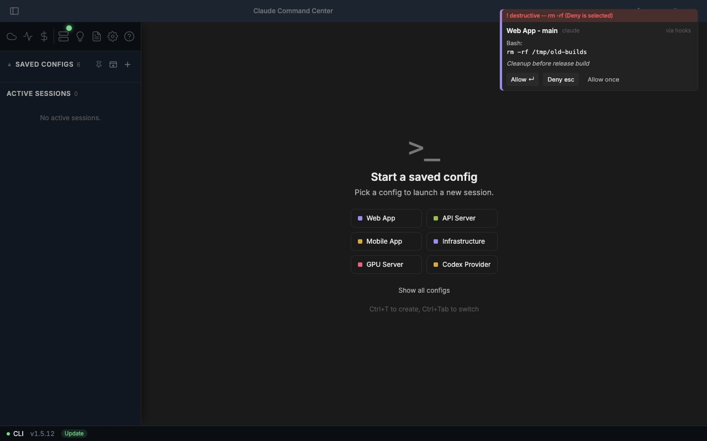
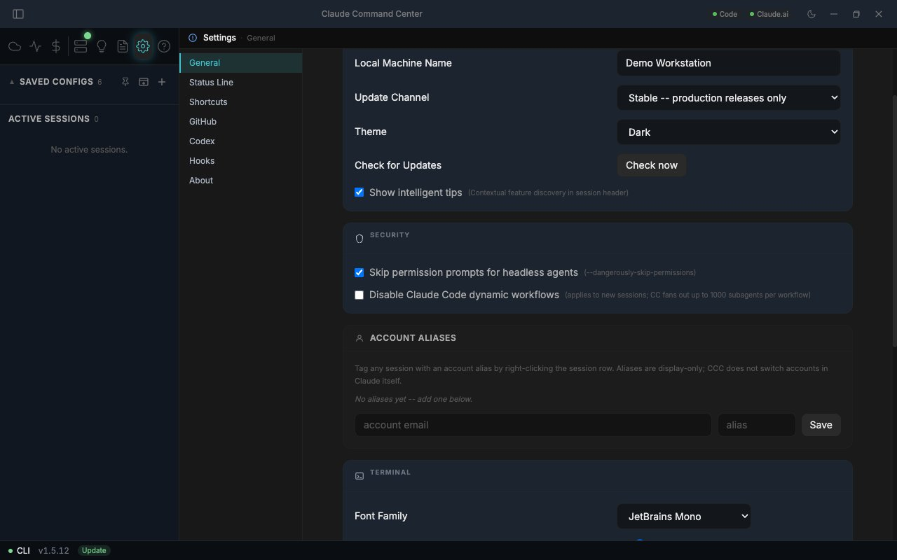
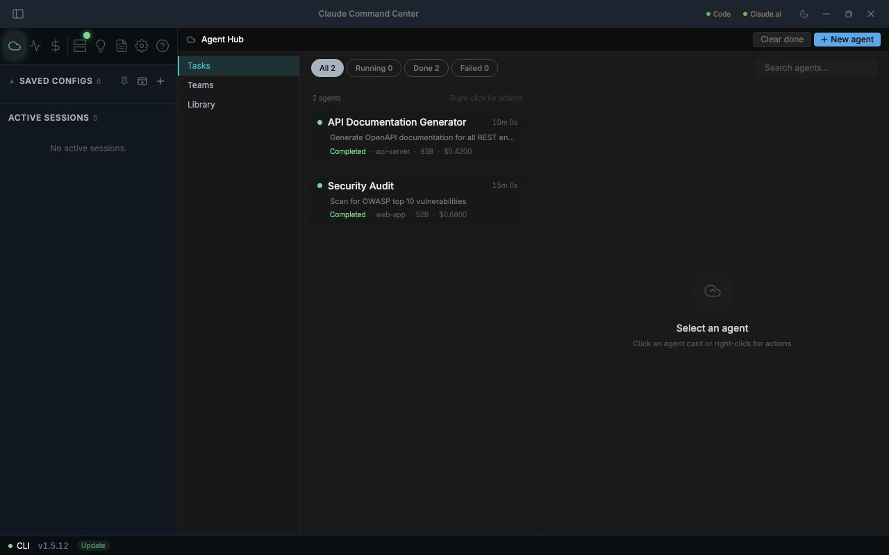

<div align="center">


# Claude Command Center

### **v2.0** &middot; The mission control built for [Claude Code](https://docs.anthropic.com/en/docs/claude-code) and Opus 4.8.

Conduct dozens of Claude and Codex sessions in parallel. Orchestrate up to **1,000 subagents** per workflow. Intercept every high-risk command before it runs. Track every cent. Ship from the keyboard.

<br/>

[](../../releases)
[](https://www.anthropic.com/news/claude-opus-4-8)
[](../../actions)
[](../../releases)
[](LICENSE)

[Download](#install) &middot; [What's new](#whats-new-in-v20) &middot; [Architecture](#under-the-hood) &middot; [Security](#security)

<br/>


</div>

---

## What's new in v2.0

Four releases of V2 work, condensed.

<br/>

### Opus 4.8 by default. Ultracode by request.


New sessions land on **Opus 4.8**. The full effort ladder is in the dropdown: Low, Medium, High, **Extra high**, **Max**, and **Ultracode** &mdash; the last setting hands Claude the keys to plan dynamic workflows automatically for every substantive task in the session. A **Fast mode** checkbox surfaces the cheaper $10 / $50 per million tokens 2.5&times; speed lane.

When you flip the global **Disable Claude Code dynamic workflows** toggle in Settings, CCC writes `disableWorkflows: true` into each new session&apos;s per-session Claude config. Existing sessions keep their boot-time setting; the next spawn picks it up.

<br/>

### Permission Attention Tray



CCC opens a local hooks gateway and rewrites the per-session Claude settings file so every `PreToolUse` event lands on the gateway before Claude executes the tool. A classifier inside CCC checks the Bash payload against destructive patterns &mdash; `rm -rf`, `sudo`, `dd if=`, `chmod 777`, `--force` / `--force-with-lease`, fork bombs &mdash; and surfaces matching prompts as toasts stacked in the top-right corner. Everything else auto-allows in microseconds so the tray stays quiet until it has something to say.

It catches commands invoked from **dynamic-workflow subagents** too. The same hook fires whether the call comes from your prompt or from agent number 743 of an Opus 4.8 orchestration. Tray caps at 50 entries; overflow auto-denies so a runaway agent can&apos;t bury you in prompts.

<br/>

### Dynamic workflows, surfaced end-to-end



Three ways to invoke an Opus 4.8 dynamic workflow from inside any Claude session:

| Trigger | What it does |
|:--------|:-------------|
| Include the word **`workflow`** in your prompt | One-off &mdash; Claude writes a JS orchestration script for the task |
| Set effort to **Ultracode** in Session Config | Every substantive task in the session auto-orchestrates |
| Run **`/deep-research <question>`** | The bundled cross-source research workflow |

Watch with `/workflows`. Save a useful run with `s` &mdash; it becomes `/<name>` in future sessions. CCC&apos;s Agent Hub library doubles as a definitive place to author and ship reusable agent templates, and tokenomics rolls workflow spend into your session totals automatically.

<br/>

### V2 UX uplift everywhere


The whole shell sits on a unified raised-surface tier. New primitives &mdash; **StatusDot**, **MetricChip**, **SectionLabel**, **Kbd** &mdash; replace the old one-off chrome and route every colour through semantic tokens (Catppuccin Mocha by default, with light + system themes also wired). Tokenomics gains a **Project / Account / Model** group-by lens that pivots the breakdown panel with one click. Insights drops the iframe for a native renderer that follows your theme. Logs paginates by 500 entries with incremental filter; big sessions no longer freeze the UI. Settings and Agent Hub take the same primitive pass.

---

## The rest of the surface

<table>
<tr>
<td width="50%" valign="top">

### Memory, browsable and prunable


Every Claude memory file across every project, surfaced as a card grid with size, type, recency, and search. Read rendered markdown in the right pane. Delete stale entries directly. Catches drift before it bloats your context.

</td>
<td width="50%" valign="top">

### Conductor MCP server



A local MCP server exposing 17 browser-vision tools (screenshot, navigate, click, type, eval) plus `codex_review`, so Claude can ask Codex to spot-check its own work. SSH sessions reach the same server transparently through an auto-injected reverse tunnel.

</td>
</tr>
<tr>
<td valign="top">

### GitHub PR context where you work


A collapsible right-rail panel surfaces PR status, CI runs, reviews, unresolved threads, and inferred issue context from your branch and transcript. OAuth, PAT, or adopt your existing `gh` CLI auth. Per-session opt-in; collapses to a floating icon when you don&apos;t need it.

</td>
<td valign="top">

### Codex provider, first-class


OpenAI Codex CLI sits alongside Claude in the New Session dialog. Pick the provider per spawn. Six gpt-5 models in the dropdown. Resume picker mirrors the Claude flow. Tokenomics segments Codex spend automatically.

</td>
</tr>
<tr>
<td valign="top">

### Combined Mode and Excalidraw


Pair Claude with a partner shell (`pwsh`, `bash`, `cmd`) in the same tab for the build / git / docker commands you want one keystroke from your prompt. Excalidraw scratchpad is a per-session whiteboard; export drops the canvas straight into Claude as an image.

</td>
<td valign="top">

### Snap and Vision capture


Region or window capture from any screen, encoded at 1920px / JPEG 85 to stay under Claude&apos;s image budget. Local sessions get a file path inline; SSH fetches the image over the Conductor MCP tunnel. Paste images from the clipboard with **Alt+V**.

</td>
</tr>
</table>

---

## Why CCC?

Claude Code is a remarkable CLI. But the moment you have more than one project, more than one account, more than one machine, the experience fragments. You lose track of which terminal is which, which sessions are paused, what they&apos;ve spent, where their attention is going. You hand-edit `~/.claude/settings.json` to tune behaviour. You guess about cost. And when Opus 4.8 spins up a thousand-subagent workflow in the background, you have no idea what it&apos;s about to do at the OS level.

CCC wraps Claude Code and Codex in a desktop app that treats the session as the first-class object. Every session has a colour, a name, an account, a working directory, a saved config. Every spawn surfaces its tokens, its model, its rate-limit window, and its identity. Every high-risk command stops at the tray before Claude runs it. Every cent is captured and pivotable.

It doesn&apos;t replace Claude Code. It conducts it.

---

## Install

### Download

1. Grab the latest installer from **[Releases](../../releases)**.
   - Windows: `ClaudeCommandCenter-x.y.z.exe`
   - macOS: `ClaudeCommandCenter-x.y.z-mac.dmg`
2. Verify the SHA-256 checksum against `CHECKSUMS.txt` in the release.
3. Run the installer and choose Data + Resources directories.
4. The setup wizard hands off Claude CLI auth.

### Prerequisites

- [Claude Code CLI](https://docs.anthropic.com/en/docs/claude-code) **2.1.154+** (Opus 4.8 + dynamic workflows)
- Node.js 20+ (Claude Code dependency)
- Windows 10 / 11 or macOS 12+

> **Windows note** &middot; The installer is not code-signed today, so SmartScreen will warn on first run. Click **More info** &rarr; **Run anyway**. The macOS DMG is signed and notarised. Every release is also VirusTotal-scanned across 70+ engines.

---

## Build from source

```bash
git clone https://github.com/nubbymong/claude-command-center.git
cd claude-command-center
npm install
npx vitest run       # 1338 unit tests
npm run dev          # HMR dev
npm run build        # production build
```

```bash
npm run package:win  # Windows NSIS installer
npm run package:mac  # macOS DMG (Apple credentials required for signing)
```

---

## Under the hood

| Layer | Stack |
|:------|:------|
| Shell | Electron 38 (frameless, sandboxed renderer, zod-validated IPC) |
| UI | React 18 + Tailwind CSS v4 (`@theme` tokens, Catppuccin Mocha by default) |
| State | Zustand 5 (hydrated from disk on boot) |
| Terminal | xterm.js 5.5 + node-pty (ConPTY on Windows) |
| Build | electron-vite |
| MCP | `@modelcontextprotocol/sdk` (Conductor MCP server: vision + codex review) |
| Tests | Vitest unit (1338) + Playwright E2E |

The main process owns config persistence, the PTY pool, the hooks HTTP gateway (drives the permission tray), the tokenomics aggregator, the statusline ingest, the Conductor MCP server, and cloud-agent dispatch. The renderer is a React SPA that hydrates from disk and talks to main exclusively through typed IPC channels. SSH sessions get a per-session settings file, a per-session MCP config, and a reverse tunnel injected automatically.

---

## Security

| Layer | What we do |
|:------|:-----------|
| **Credentials** | SSH passwords, sudo passwords, and encrypted notes stored as encrypted blobs via OS keystore (DPAPI on Windows, Keychain on macOS, libsecret on Linux). Machine-bound, never plaintext. |
| **Permissions** | High-risk Bash gates through the local hooks gateway before Claude executes. Overflow auto-denies. The PreToolUse path means a 1000-subagent workflow can&apos;t silently run `rm -rf` on you. |
| **Telemetry** | None of our own. The Claude API goes through the Claude CLI directly. Outbound is limited to: GitHub Releases (update check), `status.claude.com` (Code/Claude.ai status pills), GitHub API (opt-in GitHub sidebar after sign-in), LiteLLM open-pricing JSON (24h cached). |
| **Data integrity** | Atomic config writes (`.tmp` + rename). Daily snapshots of `CONFIG/*.json` to `CONFIG/_backups/YYYY-MM-DD/`, 7-day retention. Capture-script locks. Sandboxed renderer; zod-validated IPC at every boundary. |
| **Releases** | VirusTotal scan in CI across 70+ engines on every Windows and macOS build. macOS DMG signed and notarised. |

Report vulnerabilities privately via [GitHub Security Advisories](../../security/advisories/new).

---

## Keyboard shortcuts

| Shortcut | Action |
|:---------|:-------|
| `Ctrl+T` | New config |
| `Ctrl+W` | Close session |
| `Ctrl+Tab` / `Ctrl+Shift+Tab` | Next / previous session |
| `Ctrl+1` &hellip; `Ctrl+9` | Jump to session N |
| `Ctrl+B` | Toggle sidebar |
| `Ctrl+/` (`Cmd+/` on macOS) | Toggle GitHub sidebar |
| `Alt+V` | Paste clipboard image |
| `Escape` | Interrupt Claude |
| `Shift+Enter` | New line without sending |

All shortcuts are rebindable in **Settings &rarr; Shortcuts**.

---

## Project history

CCC was developed privately from late 2025 and open-sourced in April 2026. The git history was squashed for the initial public release; everything from v1.0 forward is in the open.

Per-release detail lives in [`src/renderer/changelog.ts`](src/renderer/changelog.ts).

---

## Contributing

Contributions welcome. See [CONTRIBUTING.md](CONTRIBUTING.md) for setup, coding standards, and the PR process.

---

## License

[MIT](LICENSE).
