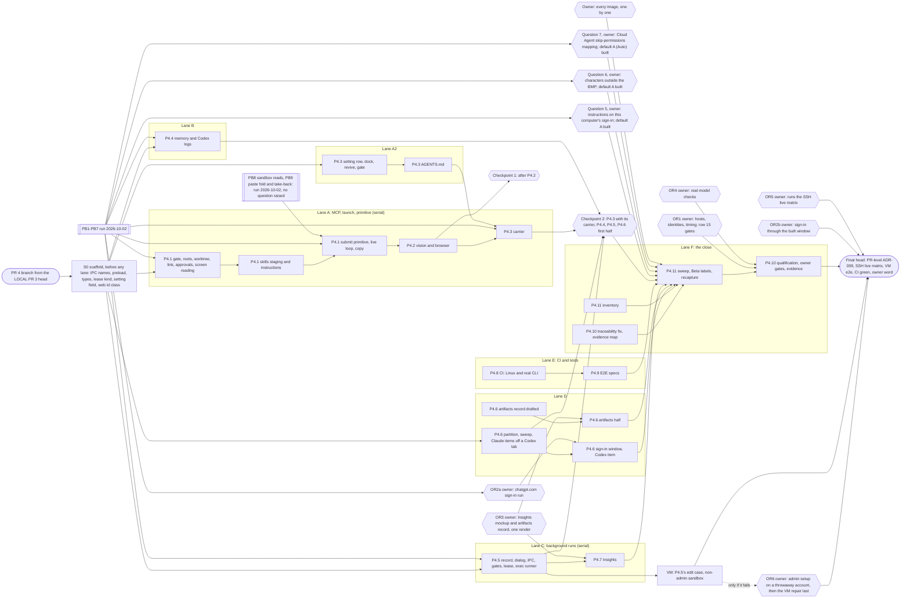

# 2.1.1 Codex parity: completion plan

Written 2026-09-27 against `e0d4ddbc`, the head of PR #625. It reconciles the
remaining 2.1.1 work with the owner's recorded decisions, row by row over all
75 rows of `docs/wp2/parity-checklist.md`, and sets the order of what is left.
It makes no new decision. Where the draft plan of the same day disagreed with
a record, the record wins (section 3).

The owner's instruction of 2026-09-27, in short: no interim release; finish
the agreed 2.1.1 parity work before any release is cut; do not reopen settled
questions or silently defer features; keep missing implementation apart from
missing verification, and package completion apart from release completion;
bring the owner only genuinely unresolved UX decisions; continue approved work
without asking per phase; keep the remaining PR structure where practical. The
objective is the full agreed Codex parity release, not closing PR #625.

## 1. How to read this

Sources, by short name:

- **OD20, OD26, OD27**: `docs/wp1/owner-decisions-2026-09-20.md`,
  `-2026-09-26.md` and `-2026-09-27.md`, with their decision ids (D8, U1, P1,
  M1 and so on).
- **ADR-022**: `architecture/decisions/2026-09-27-adr-022-codex-app-server-usage-read.md`.
- **PLAN**: `docs/wp2/plan.md`, section named. **HCS**: `docs/wp2/hello-codex-spec.md`.
- **Canvas**: an owner approval of a mockup on the Agent Canvas, recorded on
  the date given. The mockups are local and gitignored, as the checklist says
  of its screenshots.
- **Parity**: the parity rule (OD26 P1): Codex does what Claude does, the same
  way. The entry names the Claude behaviour copied. Section 5 says where these
  resolutions come from.
- **aicc_planning#N**: an issue in the private planning repository.
- **Design**: the approved WP1 design,
  `WORK-PACKAGE-1-PROVIDER-IDENTITY-SETUP-DESIGN.md`, in the private planning
  repository (PLAN names its digest). **Section 19** is its
  unsupported-capability escalation: where a shared feature cannot carry over
  to Codex, the evidence, the user impact, the alternatives and a recommended
  decision go to the owner, and the row stays in scope until the owner signs
  that record.

Status (verified against the code at `e0d4ddbc` where the row was in doubt):

- **DONE**: built, with an automated test on the Codex path. Anything left is
  verification.
- **PARTIAL**: part of it is built, or it is built and nothing proves it for
  Codex yet (the checklist's UNVERIFIED).
- **OPEN**: not built, or waiting on the owner.

Gap, meaning what stands between the row and the release:

- **none**;
- **implementation**: code still to write (its verification follows);
- **verification**: built, proof still owed (real CLI, per OS, packaged, or a
  first test on the Codex path);
- **owner**: an owner decision or action comes first.

PR: **2** is PR #625 (its branch also carries the usage track, MP1 to MP13, of
package P3); **3** is the sessions remainder, stacked on #625; **4** is agent
surfaces and qualification. "2, v4" means built in 2, with the verification it
still owes recorded in 4. "2; 3" means partly built in 2, the rest in 3.

## 2. Summary

- 75 rows: **61 DONE, 12 PARTIAL, 2 OPEN** (recounted after the owner's answers of 2026-10-04, the CI and VM records of 9.7 and the review fix pass: rows 41, 51, 52, 53, 57 and 63 leave PARTIAL with their questions answered and question 5's answer built; rows 59 and 67 are DONE with their runs, and row 60 PARTIAL until its release-candidate leg;
  they agree with the parity checklist). The rule applied: a row leaves PARTIAL once only verification is left. Rows 51, 52, 53 and 57, whose checklist entries named their question as the gap that kept them PARTIAL, and rows 41 and 63, which owed only the decision beyond verification, are DONE; row 22, whose question was answered too, stays PARTIAL, because it also owes the owner's real-account resume after a Switch, the gap that keeps row 35 PARTIAL (the records commit 1f199305 had counted row 22 DONE: 62 DONE, 11 PARTIAL). At the recount after PR 4's P4.1 to P4.6 records and question 8 it was 53 DONE, 18 PARTIAL and 4 OPEN, and after P3.15 52 DONE, 12 PARTIAL and 11 OPEN.
- The 14 rows not DONE, by gap: **implementation 2, verification 10, owner 2** (rows 14 and 68 under implementation; rows 15 and 58 under owner, an owner action and a record to sign, row 58's sign-in window waiting on OR2a; rows 11, 16, 22, 34, 35, 45, 54, 55, 60 and 66 under verification, row 22 the owner's real-account resume and the rest of its real-CLI walk, row 55 its delete check, row 54 its images' review and row 60 its release-candidate leg). At the recount before the owner's answers of 2026-10-04: implementation 5, verification 8, owner 9 (rows 22, 41, 51, 52, 53, 57 and 63 then under owner, each built as a default pending a question). At the recount after P3.15: implementation 9, verification 6, owner 8. Row 53
  moved from owner to implementation when the owner decided it
  (`docs/wp1/owner-decisions-2026-09-27.md`, M4), and back under owner with question 6 (PB4, 2026-10-02).
- By PR: **8 in PR 3, 15 in PR 4**. No row changes package. The Ask Conductor
  part of row 14 goes with row 53 into PR 4, because it is the same change.
- Of the 61 DONE rows now, 48 still owe verification, as their rows in section 4 list (rows 1, 2, 3, 4, 6, 7, 9, 12, 13, 17, 18, 20, 21, 23, 25, 27, 28, 29, 31, 32, 33, 36, 37, 39, 40, 42, 43, 44, 46, 47, 48, 49, 50, 51, 52, 53, 56, 57, 61, 62, 63, 64, 65, 69, 70, 71, 73 and 74), and 13 owe nothing: rows 5, 19, 26, 30, 59, 67 and 75 (gap none) and rows 8, 10, 24, 38, 41 and 72 (every check their gap names is done); 48 + 13 = 61. At the recount after P3.15 (52 DONE), 47 DONE rows still owed verification. The 27 built or verified in PR 3 (rows 7, 8, 10, 17, 20, 24, 28, 31, 32, 36, 37, 38, 39, 40, 42, 43, 44, 46, 47, 61, 62, 65, 69, 70, 71, 72 and 73) owed their VM checks under
  PR 3's gate 6 (section 6; 31, 32 and 65: done, their screenshot review owed). Gate 6's row checks ran at 525a00ac on 2026-10-02
  (P3.16): rows 8, 10, 24 and 72 passed every VM check their rows list, and the others still owe what their rows list (row 36's
  Duration check failed, is fixed in fixer 9 and passed its VM re-check at aca63cc7 and d0caf0bd; row 38's midnight UTC check is time-bound and was not run). The other 20 (rows 1, 2, 3, 4, 6, 9, 12, 13, 18, 21, 23, 25,
  27, 29, 33, 48, 49, 50, 64 and 74) owe real-CLI, per-OS or packaged
  verification, recorded in PR 4 and closed at release level. The other 5
  DONE rows (5, 19, 26, 30, 75) owed nothing; the 9 rows DONE since (41, 51,
  52, 53, 56, 57, 59, 63 and 67) make the 61.
- Row 17 was counted PARTIAL here, from the code, while the checklist marked
  it VERIFIED; the checklist marked it PARTIAL too until P3.14 (c65b359e) built
  the Codex credits row and removed the known issue in
  `src/shared/app-knowledge.ts`, and now marks it VERIFIED (mocked) with its
  verification owed. The checklist
  moved rows 52, 68 and 69 from OWNER to MISSING, since parity settles them
  (section 10); row 69 is now built (P3.8).
- Genuinely unresolved UX decisions: **none**. The seven built as defaults were decided on 2026-10-04: questions 2, 3, 4, 6 and 7 A and question 8 B, each kept as built, and question 5 C, superseding the default A and built in PR 4 (c0d79113, 07315265). They were: row 41 (P3.8 round 1, caef0d42: Codex has no one-line
  model or effort command; section 10, question 2), row 22 (P3.6 finding
  V3: a declined confirm after a Switch restores the previous account; question 3), row 63 (P3.10: Codex asks the user to review the app's hooks once per account; question 4), row 51 (PB1: the instruction channel on this computer's sign-in; question 5), row 53 (PB4: characters outside the BMP; question 6), row 57 (PB5: the Cloud Agent skip-permissions mapping; question 7) and rows 51 and 52 (the VM checkpoint at 69c98042: Codex's Auto preset cannot ask before the app's own tools; question 8). The one before them (row 53, both providers on) was decided by
  the owner on 2026-09-27 (option B; OD27 M4). Section 10.
- PR 3 waits on the owner for the owner actions in section 10 only (its
  questions 2, 3 and 4 were answered on 2026-10-04); nothing in it is blocked
  from being built. PR 4 no longer waits on a section 10 question (questions
  5 to 8 were answered on 2026-10-04); its owner-gated items are in 9.5.

## 3. Where the draft plan disagreed with the record

The draft (a local checkpoint, 2026-09-27) is superseded by this file.

| Draft said | The record | Resolution |
|---|---|---|
| Stage A: cut 2.1.1-beta.2 now as an interim beta | Owner instruction, 2026-09-27: no interim release | Dropped. Nothing is released until section 7 holds. |
| #625 has two open owner decisions: the `mcp-config.ts` adaptation, and "Sign in to Codex first" as a code fix or a known issue | Owner decision recorded 2026-09-26: keep the config heal as it is (ledger `retain`). The notice: settled by OD26 U1 (every upgrader answers "Do you use Codex?"; adding an account counts as yes) | Both settled. "Owner decision pending" in `CONTEXT.d/2026-09-25-wp2-accounts-surface-and-guidance.md` is out of date. The notice now shows only when Codex is answered on and has no account, which is the right instruction (`tests/unit/renderer/session-dialog-codex-account.test.tsx`). |
| Owner decisions are needed before code for rows 52, 53, 58, 68 and 69 | Section 10 | Only row 53 (both providers on) is a UX decision. Rows 52, 68 and 69 are decided by parity (row 68 already on 2026-09-26: a Conductor-native Codex report run with `codex exec`); row 58 splits into parity (the web session) and a section 19 record (artifacts). None of them gates PR 3. |
| Row 15 (keyring and sign-in runs) is an owner decision before code | OD20 D8: these resources block merge, not implementation | An owner action (hosts, disposable test identities, timing), owed before PR 4 merges. Not a UX decision. |
| aicc_planning#84 (the beta ruleset) is an owner decision before code | A repository-settings action for the owner | Not a parity row and not a code gate. Section 7 lists it as an owner action only. |
| Not in scope: Dependabot PRs #620 to #624 | Owner decision recorded 2026-09-26: roll them in before the release; #621 (Electron 44) is a runtime major | In the release criteria (section 7). |
| Whether to split package P3 into two PRs, asked 2026-09-26, is unanswered | Owner instruction, 2026-09-27: keep the remaining PR structure where practical | Settled: no split. Four implementation PRs in all (#619, #625, PR 3, PR 4), within the approved delivery shape. |
| 48 rows not done | The code at `e0d4ddbc` | 50: rows 17 and 28 (section 2). |

## 4. Row by row

### A. Accounts, identity, setup, onboarding, upgrade, Codex-only

| # | Feature | Status | Settled by | Gap | PR |
|---|---|---|---|---|---|
| 1 | Provider on/off, "not set up", last provider on | DONE | OD26 U1, U3 | verification: real CLI 0.153.4 and 0.155.1; packaged per OS | 2, v4 |
| 2 | CLI detect and version classes | DONE | OD20 D7; PLAN A8 | verification: the real maximum per OS (the minimum and pinned detected as supported on Windows, macOS and Linux in CI runs 37134624406 and 37156412028) | 2, v4 |
| 3 | Install and update | DONE | PLAN A9 | verification: one real install per OS (macOS, Linux; Homebrew unrun) | 2, v4 |
| 4 | Sign-in (browser, API key) | DONE | PLAN A6, A7; OD26 U2 | verification: real API-key sign-in and sign-out; macOS, Linux | 2, v4 |
| 5 | Device-code sign-in | DONE (off) | OD26 U3 (stays off, WP1.41) | none | 2 |
| 6 | Multiple isolated accounts | DONE | PLAN A5 | verification: a real two-account run; keyring scoping (WP1.10, WP1.11) | 2, v4 |
| 7 | Identity editing after creation (name, colour, link, unlink, group) | DONE (P3.2, 65612489, b4a5b665; the colour migration in P3.6, 57ce396a; mocked): the identity editor opens from every row's chip (name, colour, group, Link, Unlink); the chips read the identity's colour | Canvas 2026-09-26, "Accounts: identities across providers", option B: the editor opens from any row's chip, groups stay (WP1.40) | verification: an owner screenshot check of the chips' colours | 3 |
| 8 | One Accounts surface | DONE (P3.2, 65612489): one row component for both providers (AccountRow); the VM screenshots approved 2026-09-28 | The same canvas; design section 10; WP1.39 | verification: packaged: done on Windows, PASS on a packaged build of 525a00ac (PR 3 gate 6, WINDOWS_1, unsigned; P3.16) | 3 |
| 9 | Launch and resume in the exact account | DONE | PLAN A10, commit 4 | verification: a restored tab keeps its managed account, per OS | 2, v4 |
| 10 | Lifecycle blockers and archive | DONE (P3.2): a refused inactivate or archive names each session holding the account, with Go to; Archived (N) with Restore | The same canvas: blockers name each consumer with Go to; "Archived (N)" with Restore (design 5.3) | verification: real CLI; packaged: done, PASS on a packaged build of 525a00ac with the real CLI 0.155.1 (PR 3 gate 6, WINDOWS_1, fictional accounts; P3.16): a real restore, and a refused Make inactive naming its session with Go to (the restored account reads signed out, by design: archiving signs its folder out) | 3 |
| 11 | Staged re-authentication (WP1.52) | PARTIAL (P3.3): Sign in again is offered while signed in too, staged in a new journalled folder with the conversation history carried over, and the account moves only once the new sign-in is verified | Parity: Claude's "Refresh sign-in" works while signed in; WP1.52; PLAN "Out of this PR" | verification (owner action): a second real sign-in on the VM, file and keyring stores, proving the old folder's sign-out never signs the new one out | 3 |
| 12 | Upgrade question and the read-only sign-in check | DONE | OD26 U1, U2 | verification: real 0.153.4 and 0.155.1 | 2, v4 |
| 13 | Hello Codex | DONE | Canvas 2026-09-24 (v1) and the commit 6 canvas; HCS | verification: per OS | 2, v4 |
| 14 | Codex-only mode, no Claude noise | PARTIAL (P3.2, P3.4; mocked): with Claude Code off no Claude pills, no Claude status reads and no Claude sign-in prompts; the owner approved the P3.4 screens 2026-09-28; the AI usage popover follows D5 too (P3.16b follow-up, unit-tested), and opens above its chip, outside the status strip's clipped zone, where it never showed before (P3.16 final-head VM finding D2, pre-existing since June; unit-tested). Left: Ask (row 53) and the guide cards each later phase unlocks | Design section 2 (Claude is not a prerequisite); OD27 M1 D5 (a provider that is off shows one muted line or nothing); ADR-022 (the popover); parity | implementation (Ask with row 53; each card with its phase); verification: the cards on the VM, done: the guided tour's cards in each mode (Codex only, Claude Code only, both on) and the Feature Guide's productivity hero PASS at 525a00ac (PR 3 gate 6, P3.16), which also saw the Feature Guide's productivity cards name Claude in Codex-only mode (an observation, P3.16: not P3.16's text-only sweep; assigned to P4.11, which adds a provider filter to the guide's rendering); the AI usage popover in the real strip at a Status bars scale of 1 and of 1.2 (the most it goes), done: PASS on the VM at 1e14b611 (P3.16), and fixer 8b's changes (focus, Escape, a Settings link, a resize) PASS at 525a00ac (gate 6; the left-edge clamp not reachable there, unit-tested only); the owner's screenshot review | 3 (Ask part: 4) |
| 15 | Owner-run gates (native keyring, sign-ins with real accounts, packaged smoke) | OPEN | OD20 D8 (blocks merge, not implementation); WP1.11, WP1.64, WP1.72 | owner: hosts, disposable test identities, timing; then verification | 4 |
| 16 | WP1 traceability | PARTIAL: items still `planned` | OD20 D9; WP1.70, WP1.73 | verification: items move to evidenced as the evidence lands | 4 |

### B. Account summary, usage footer, switching, Tokenomics

| # | Feature | Status | Settled by | Gap | PR |
|---|---|---|---|---|---|
| 17 | All-accounts usage page | DONE (usage track MP3, MP4, MP8, screens approved; P3.14, c65b359e; mocked): a Codex card on paid credits shows a Credits row under its bars, in Codex credits (a count, not money): "N credits" or "Unlimited", placed and styled as Claude's row, from the live, fresh-read and last-seen reading alike; the known issue is removed (`rate-limits.test.ts`, `account-usage-panel.test.tsx`, `provider-account-usage.test.ts`, `codex-usage-read.test.ts`) | OD27 M1, M2; ADR-022 and ADR-023 (the credits count kept from the read, which widens ADR-022 bound 8, and the carry marks file `carry-marks.json`; the owner confirms both on return); credits: parity, the unit from P3.1's evidence (recorded with the usage plan, 2026-09-27) | verification: the VM live credits check (PR 3 gate 6): done for a stand-in reading (fake usage headers, "1,250.5 credits"), live and last-seen with its age, PASS on 0.155.1 and 0.153.4 at 525a00ac (P3.16), and owed on a real account with credits, a fresh read included (owner); the owner's screenshot review; macOS, Linux, packaged; ADR-009: done, PR 3's PR-level pass (P3.16), PASS at 525a00ac, P3.14's rounds 3 and 4 included | 2; 3, v4 |
| 18 | Session-strip meters | DONE | OD27 M1 (D2, D3); labels from `window_minutes` (decided by design, 2026-09-26) | verification: a 0.155.1 rollout fixture from a real session; a real-CLI run | 2, v4 |
| 19 | Strip cost wording | DONE | "API-equivalent estimate" wording (decided by design, 2026-09-26) | none | 2 |
| 20 | Account chip on the strip and in the sidebar | DONE (P3.6, 57ce396a, 68d00f62, 4439d7e2; mocked): a Codex session's account chip on the strip and its sidebar card, from the identity; Claude's chips read the identity's colour | Canvas 2026-09-26, "Switching a running Codex session's account": the strip's Codex account pill and its Switch account menu; the footer's label rule (a Codex identity shows its name); parity for the sidebar | verification: the VM check of W1, done: PASS at 427807fb (P3.7's VM run, MOCKED) and at 525a00ac (PR 3 gate 6, P3.16: the note's Dismiss 8 px from the floating GitHub button, a hit test landing on it); the owner's screenshot review; the SSH live matrix at PR 3's head | 2; 3 |
| 21 | Multi-account footer | DONE | Canvas 2026-09-26 (footer, option B); OD27 M1 | verification: real CLI, packaged | 2, v4 |
| 22 | Switch the account of a running session | PARTIAL (P3.6, 8274b3d1, 4439d7e2, bb99d2da; mocked): Switch account lists the Codex accounts, and a pick restarts the session on the new account with its conversation carried over. A declined confirm after a Switch restores the previous account, as the owner decided on 2026-10-04 (section 10, question 3: A, kept as built) | Canvas 2026-09-26 (as row 20): keep the conversation; copy its rollout into the new account's folder, then `codex resume` there | verification: the real-CLI walk on 0.153.4 and 0.155.1, done for a switch between managed accounts (the conversation carried and continued there) and a declined confirm as built, PASS at 525a00ac (PR 3 gate 6, fake-key accounts on a loopback fake model; P3.16); owed: the real-account resume (owner), the gap that keeps this row PARTIAL, as it keeps row 35; the carry to and from this computer's sign-in, a switch back and a conversation from an earlier day (P3.6); the SSH live matrix | 3 |
| 23 | Choose the account at launch | DONE | Commit 6 canvas, 2026-09-24 | verification: per OS | 2, v4 |
| 24 | Running sessions per account | DONE (P3.2, 65612489): "N running" on the account row | Canvas 2026-09-26 ("N running" pill on the row) | verification: real CLI: done, PASS with the real CLI 0.155.1 on a packaged build of 525a00ac (PR 3 gate 6, P3.16) | 3 |
| 25 | Tokenomics reads managed realms and `~/.codex` | DONE | OD20 D10; OD26 U3 | verification: real rollouts | 2, v4 |
| 26 | Tokenomics attribution and filters | DONE | Canvas 2026-09-26 (Tokenomics, option A); OD27 M1 | none | 2 |
| 27 | Subagent collision | DONE | The #307 fix (`7fc96639`) | verification: a real 0.155.1 subagent rollout | 2, v4 |
| 28 | Codex pricing | DONE (P3.8, 260d4abc; round 1, caef0d42): live OpenAI prices from the LiteLLM fetch Claude's prices come from, the static table as the fallback, "no price" for anything neither prices; Tokenomics prices a Codex turn by its model's exact id, as the strip does. A real fetch on the VM (3ff8c361) priced all six catalogue models | PLAN usage track MP11; parity: Claude's prices come from the live LiteLLM fetch with a fallback, and the same fetch extends to OpenAI models (resolution recorded 2026-09-26) | verification: round 1 on the VM (an unpriced Codex model reads "no price" in Tokenomics too); the native SQL tests: PASS on the VM at 525a00ac (PR 3 gate 6: 14 files, 225 tests; P3.16), owed in CI | 2; 3 |
| 29 | Plan type | DONE | OD27 M1 | verification: macOS, Linux, packaged | 2, v4 |
| 30 | Tokenomics totals split by provider | DONE | Canvas 2026-09-26 (Tokenomics, option A) | none | 2 |

### C. Sessions, statusline, model, Sentinel, Watchdog, status

| # | Feature | Status | Settled by | Gap | PR |
|---|---|---|---|---|---|
| 31 | Logs history, search and transcript | DONE (P3.12, d86fd80f and its fixes; mocked; VM at ff7be273 (WINDOWS_1, real Codex 0.155.1 and 0.153.4), and its re-check with the fixes: indexing, search, the switches for new sessions and a Claude session unchanged PASS): a local Codex session's run is recorded under the gates a Claude run has; its transcript is the rollout its own watcher claims in its own realm (the Codex log binder: held until the run is recorded, exact or heuristic, let go when the claim is, never a conversation another tab holds), tailed with the Codex normalizer by the binding's stored format; the Logs page, search, the per-session pane and the Logs button (live on a Codex tab: ADR-018 D3's dimmed Codex tool ends); a Codex config's Index conversation logs field; a logging switch turned off stops indexing the running sessions it covers, both assistants, every launch reads the switches as saved, and turning one on applies to sessions started after it; what a Codex session writes while it is not indexed is never indexed, whichever tab later resumes the conversation; a new run continues a conversation the same session indexed before, from where it was read (both assistants: Claude's by P3.16a, M1, with the same record-time windows); a Codex tail reads only the file its watcher claimed; a user_message of another kind than plain is not the user's words; a Codex run is recorded once the indexing notice naming Codex was seen, which a Codex user who saw only the earlier notice is shown once more; a new Claude conversation (and the next one after /clear), whose file Claude Code names before it writes it, is indexed from its first message: its tail waits for the file until its run ends, and only a file that was read and is gone fails (P3.16 final-head VM finding D1, pre-existing since June; Claude's heuristic already waited, a Codex bind is always of a file its watcher read) | Parity: index each realm's rollouts; realms never cross | verification: done, the VM checks at PR 3's earlier heads b3937173 and 1e14b611 (P3.16): C1, F6 and K1 PASS at b3937173, and at 1e14b611 the smoke with the stand-in Claude without its touch flag (a fresh conversation and one after /clear indexed, their rows complete, none failed; fixer 8b's change unit-tested only); ADR-009: done, PR 3's PR-level pass (P3.16), PASS at 525a00ac, which covers P3.12 (quarantined after its own bounded rounds) and confirmed D1 (lens C); owed: the owner's screenshot review; the SSH live matrix at PR 3's head (no Codex case: a Codex session over SSH is refused); the native SQL tests in CI (the identity column, the prior bindings a continuation reads, and a tail waiting for its file, across a worker restart too) | 3 |
| 32 | Resume picker | DONE (P3.5, 44729f29 and its fix rounds; mocked; VM c2c42e22; the name file P3.12, d86fd80f and its fixes; mocked; VM at ff7be273 (WINDOWS_1, real Codex 0.155.1 and 0.153.4), and its re-check with the fixes: the name file only at an exact claim, and in the picker after the tab closed, PASS): every git worktree's conversations, named and started in their own worktree; a name given to a Codex session is written next to the rollout it is exactly on (a rename, or a remembered name at the exact claim), inside its realm and never through a link, and Codex's picker leads with it, as Claude's does; the picker titles a conversation by its first user message as the index reads it, never the context Codex injects (AGENTS.md, the environment); the name file is written only into the realm's real day folder (the realm's real path taken before its folders are walked), a new file elsewhere, or one whose write fails, taken back (a path check: see P3.12's limits) | Parity | verification: done, the VM re-checks of P3.12's fixes (P3.12's record); ADR-009: done, PR 3's PR-level pass (P3.16), PASS at 525a00ac, which covers P3.12 (quarantined after its own bounded rounds); owed: the owner's screenshot review; the SSH live matrix at PR 3's head (no Codex case: a Codex session over SSH is refused) | 3 |
| 33 | Resume in the exact realm | DONE | PLAN A10 | verification: real, realm B never lists realm A | 2, v4 |
| 34 | Exact resume on app relaunch | PARTIAL (P3.5, 90a717df; mocked; VM c2c42e22): a restored session resumes its own conversation in its own realm, bypassing the picker | Parity: resume by the claimed session id, `codex resume <id>` in the same realm | verification: the SSH live matrix; a conversation carried over by a staged Sign in again on the VM (owner action) | 3 |
| 35 | Restart and Switch keep the conversation | PARTIAL (P3.5, 90a717df, Restart; P3.6, 4439d7e2, Switch; mocked): Restart resumes the conversation the session kept (VM c2c42e22); a Switch carries it into the new account and resumes it | Parity (Claude's Restart resumes); canvas 2026-09-26 for Switch | verification: the Switch half on the VM with a real CLI (row 22), done: PASS on 0.155.1 and 0.153.4 at 525a00ac (PR 3 gate 6, P3.16); owed: the real-account resume after a Switch (owner; row 22) | 3 |
| 36 | Statusline segments | DONE (the account chip in P3.6, 68d00f62; Lines changed and Duration in P3.7, 5de7a4c4, 9f2bd164; mocked) | Parity (line counts: evidence first; section 19 if Codex reports none) | verification: the VM run, done: PASS at 427807fb (MOCKED) and at 525a00ac (PR 3 gate 6, the real CLIs; P3.16): the line count of a new and a deleted file on 0.153.4 and 0.155.1, and the Duration on a new conversation, after a Restart, after a relaunch, outside the app and after a TUI resume (0.155.1); FAIL there: the Duration after the saved session file was cleared (P3.7), fixed in fixer 9 (86ae88ac) and re-checked PASS on 0.155.1 and 0.153.4 at aca63cc7 (fixer 9's head: "Close sessions", "Don't open", the last tab closed, and a TUI resume after a clear) and at d0caf0bd (fixer 10: "Close sessions" and a TUI resume after it; P3.7); the owner's screenshot review | 3 |
| 37 | Statusline settings | DONE (P2; P3.7, 5de7a4c4, 9f2bd164; mocked): the settings apply to Codex, and Lines changed and Duration show for a Codex session | Parity | verification: the VM screenshot of the Status Line tab with Codex on, both themes, done: PASS at 427807fb (MOCKED) and at 525a00ac (PR 3 gate 6, P3.16); the owner's screenshot review | 2; 3 |
| 38 | Statusline after resuming an old rollout | DONE (P3.5, 28f42af2, 90a717df; mocked; VM c2c42e22): the claim re-reads its date folders on every poll and finds a resumed conversation wherever it is | Parity | verification: a session crossing midnight UTC on a real CLI, done: PASS on the VM on 2026-10-04 (run cp4-row38; real Codex 0.155.1 on the loopback fake model, fictional data): the status line followed the tab across 00:00 UTC (381,011, then 763,033, then 1,146,055 input tokens), a Restart ran `codex resume` with the same conversation id and the turn after it updated, and the rollout stayed in its day folder and grew | 3 |
| 39 | Model catalogue | DONE: the registry's Codex models, the list the supported CLIs (0.153.4 and 0.155.1) offer in their own picker, Sentinel's check, and the release gate's Codex half (P3.8, 260d4abc; round 1, caef0d42); P3.9 (3a4ed400; mocked): Sentinel's Codex check compares the registry with the list the installed CLI offers, read from it (`codex debug models --bundled` in an empty folder, no sign-in), naming its version, else the shipped list | Parity: the model registry plus Sentinel's coverage check. Not app-server `model/list`: OD27 M2 allows usage reads only | verification: done on the VM at 7678c433 (`--bundled` accepted on 0.153.4 and 0.155.1, the same list as the plain command, no connection); the gpt-5.2 notice to the owner stands (section 10); ADR-009: P3.9, quarantined after its own bounded rounds, is covered by PR 3's PR-level pass (P3.16), PASS at 525a00ac | 3 |
| 40 | Effort | DONE (P3.8, 260d4abc; round 1, caef0d42): each Codex model's own levels, from the CLI's catalogue (0.155.1's are the same, VM); a launch drops a saved effort its model cannot run. The CLI accepts max and ultra at launch on both versions (VM) | Parity | verification: whether the server takes max and ultra (a real sign-in; the CLI does not check at launch) | 3 |
| 41 | Mid-session model and effort | DONE, as the owner decided on 2026-10-04 (section 10, question 2: A, kept as built; P3.8 round 1, caef0d42): on a live session the command bar's model pill types a bare `/model`, only at Codex's ready prompt, which opens Codex's own model-and-effort picker and keeps the conversation; a stopped session keeps the select, applied at its next start | Parity: applied live, keeping the conversation. Codex has no one-line form (VM: `/model <slug>` is sent as a message; there is no `/effort`), so Claude's one-step switch cannot carry over as it is | verification: the pill on the VM, done: PASS on 0.155.1 and 0.153.4 at 525a00ac (PR 3 gate 6, P3.16; a stopped session's select on 0.153.4) | 3 |
| 42 | Sentinel | DONE (P3.9, 3a4ed400; mocked): while Codex is on, its version against the supported range (a finding outside it), the live model list (row 39), and a newer version's release notes analysed against its launch flags, TUI, rollout session files and config and account files; the analysis runs on the provider that is on (both on: the one Ask Conductor runs on, Claude Code until PR 4's row); the same panel, dot, Settings section and Transparency card | Parity: version drift, flags and the rollout format checked, with findings; the analysis runs on whichever provider is on | verification: the VM run at 7678c433 (the findings as specified; a Codex-run analysis left config.toml unchanged; the notes read failed, fixed in round 1, e357fe33, with the ADR-009 pass 1 findings); the VM re-check at 82c78680, five of six passed, its bug and the ADR-009 pass 2 findings fixed in round 2, 1f010667); the VM re-check at 84fd2d03, the suspended git left by a fast failure fixed in round 3, 5fd82db8); ADR-009: FINDINGS after pass 3, P3.9 quarantined; covered by PR 3's PR-level pass (P3.16), PASS at 525a00ac, its rounds 3 to 5 included; the VM re-check at 2499766e: direct route 10/10 clean, npm route 1/15 left a suspended git (round 4 logs the kill's result; an access-denied result is an upstream residual); the reviews of rounds 4 and 5: done (P3.9); fixers 10 to 13 (P3.9): only a version above the highest checked is analysed at start, for Claude Code too, which keeps versions installed in turn within the three-analysis cap, and a Re-run makes the installed version the highest checked once its analysis is done (an unmatched Re-run of a version no start analyses says to use Re-run again); the seeded panel check PASS on the VM at be6ee406; limits: a Re-run reads notes from the version the panel names, so after a downgrade with a newer update pending its prompt also takes in versions already checked (bounded by the slice caps, never an extra analysis); on the npm shim route, a helper Codex starts after its scheduled reads have stopped (two in a row found its chain alone, about 1 s and 2 s in) and that outlives Codex is not ended; a version below the highest checked is never analysed at start, even a new one (a Re-run analyses it); owed: the VM read of a leftover kill's log line on the npm route (access denied or not), a completed real analysis (owner) and the owner's screenshot review | 3 |
| 43 | Watchdog | DONE (P3.10, d8f538b1; mocked): armed for a local Codex session (opt-in, off by default, as for Claude) with Codex's own detectors: its usage-limit and sustained server-error cells above the composer, the reset time, a turn running, Codex's own retry; the retry typed only into its ready, empty composer, Enter 300 ms later only when the pane shows it typed; the safeguard check shown unavailable (Codex has no such message). Round 1 (afae03f7): the session header's Watchdog pill shows on a Codex session and counts only the checks Codex has; the Feature Guide, tip and What's New cover it, under the one switch. VM at 6d576634: armed only when switched on, backoff and retry on a server error. Round 2 (5b178c7a): the header pill follows the watchdog live (it showed only after another change); one overload is retried once (an error above a newer turn is an earlier one's). VM at 6b465aef: the pill live on a Codex and a Claude session (R1); one retry per overload (R2); a persistent overload retried without backing off, fixed in round 3 (18029bb0): an episode lasts until two minutes of quiet after a retry, for Claude and Codex alike, so the backoff grows and the cap trips; VM at the round-3b build: a persistent overload backs off 30, 60, 120, 240 and 300 s and gives up, on a Codex and a Claude session, and an error after two quiet minutes starts afresh. Round 4: an episode whose recovering frame was the session's last output settles two minutes after it, and the backoff a retry logs is the one the episode then waits; VM at the round-4 build: a fresh episode after a last-output recovery, the logged backoff equal to the wait | Parity: auto-retry and silence detection; aicc_planning#72 (a CLI without its own patterns reports Watchdog unavailable, never Claude's) | verification: the Watchdog on an SSH Claude session (a persistent overload backing off, in the owner's live SSH matrix); a real usage limit and overload (a working model, owner); the owner's screenshot review; the SSH live matrix; ADR-009: done, P3.10's own pass (d8f538b1..4ba85a3a, PASS) and PR 3's PR-level pass (P3.16), PASS at 525a00ac | 3 |
| 44 | Services (PTY integrity) | DONE (P3.15; the VM at c11fb360, 0.155.1 and 0.153.4, re-checked under the bundled ConPTY at 7c52a432): a Codex tab is in the Services snapshot exactly as the Claude tab (bytes, gap 0, columns) | Parity | verification: macOS, Linux | 3 |
| 45 | Provider status pill | PARTIAL (P3.4, aa0411b0, 87ba9c2d; the VM walk PASS at c7f9a34a and f65de184): an OpenAI status pill beside Anthropic's, each read and shown only while its provider is on | Parity: an OpenAI status pill beside Anthropic's, each shown only while its provider is on | verification: the Desktop test gate (owner); macOS and Linux; packaged | 3 |
| 46 | Busy sweep and sleep moon | DONE (P3.10, d8f538b1; mocked): the sweep and the moon on a Codex card as on a Claude card (the moon, as Claude's, with the Watchdog on); the working pill names Codex. VM at 6d576634: the sweep, the pill and the moon on a Codex card | Parity: fed from output and silence | verification: the owner's screenshot review | 3 |
| 47 | Waiting-for-input and attention dot | DONE (P3.10, d8f538b1; mocked): fed by Codex's hooks (once trusted in Codex's review, row 63): an approval request raises the dot, a turn's end raises it after Claude's 60 s idle wait, a prompt or a tool clears it. Deviation: `notify` is not used (the Stop hook marks a turn's end; setting `notify` would replace the user's own). VM at 6d576634: the dot on an approval and 60 s after a turn's end; its bug (a PreToolUse landing after its approval cleared the dot) fixed in round 1 (afae03f7), passed 12 of 12 on the re-check; round 2 (5b178c7a) pairs an approval with its call's tool_use_id; VM at 6b465aef: 12 of 12 approval rounds pulsed, the bad order included (R3); round 3 (18029bb0) pairs an approval with an open call only when its PreToolUse came within 3 s before it; VM at the round-3b build: 12 of 12 approval rounds with the 3 s window. Round 4: the approval keeps that call as its own, so another call's PostToolUse leaves the dot up; VM at the round-4 build: 12 of 12 approval rounds | Parity: fed by Codex `notify` and hooks | verification: an approval request under a working model (owner); the owner's screenshot review | 3 |

### D. MCP, reviews, Canvas, browser, Ask, knowledge, Memory, logs, cloud, web

| # | Feature | Status | Settled by | Gap | PR |
|---|---|---|---|---|---|
| 48 | Conductor MCP transport | DONE | PLAN commits 4 and 5b | verification: a live 0.155.1 tool listing | 2, v4 |
| 49 | `codex_review` | DONE | PLAN commit 5a (its defaults stand unless the owner overturns them) | verification: a real run on a signed-in account | 2, v4 |
| 50 | `claude_review` | DONE | PLAN commit 5b, owner decisions 1 to 3 (2026-09-24) | verification: a live wait past 300 s | 2, v4 |
| 51 | Agent Canvas from Codex | DONE (P4.1, b98bc235 to b4413a24; question 5 answered C on 2026-10-04 and built in c0d79113 and 07315265, its review fix pass 374ab0fb; mocked): built, this computer's sign-in getting the canvas skills copied into its own Codex skills folder, and the Auto preset as question 8 was decided (B); was withheld (`src/main/conductor-mcp-server.ts:1106`) because a Codex session had no bound id | Parity: the tools, roots, instruction delivery and the live loop | verification: the VM walk (question 5's copy and removal on this computer's sign-in among it, a copy held open by another program while the tools are turned off, and its HOST QUARANTINE link files on CI and the VM), OR4 (a copied skill read from the Windows sandbox among it), OR5; the spec and quality reviews and the ADR-009 delta pass of question 5's C (c0d79113, 07315265), its one major (L1-1) fixed in 374ab0fb and confirmed, PASS, at 18269882; owed until the re-review and the round-2 re-attack of its fixes (374ab0fb, afc5ce7d) pass | 4 |
| 52 | Browser and vision tools | DONE (P4.2, 2eb403cf, 04ac6b96; mocked): built, the Auto preset as the owner decided on 2026-10-04 (question 8: B, kept as built); was withheld (`conductor-mcp-server.ts:911-913`, `:1042`, a "Claude-only for now" call of 2026-07-02) | Parity; the later owner decisions (the 2.1.1 gate, OD26 P1) end a call worded "for now" (section 10) | verification: the VM (vision and the push with the fake model, the per-preset approvals); OR4 | 4 |
| 53 | Ask Conductor on Codex | DONE (P4.3, 995148ea to b4413a24; mocked): built, the characters outside the BMP as the owner decided on 2026-10-04 (question 6: A, kept as built); was pinned to Claude (`src/renderer/lib/askConductor.ts:255`) and blocked with Claude Code off (`askConductorGate.ts`) | Codex only: design section 2 and parity (Ask runs on the provider that is on). Both on: OD27 M4 (option B, canvas "Ask Conductor provider choice" v1): a Settings, General row "Ask Conductor runs on", shown only while both are on, Claude Code by default | verification: the VM (the first Ask in a fresh account folder), OR4, OR5 | 4 |
| 54 | App knowledge, tour, tips | PARTIAL: the P2 fixes are done; P4.1 to P4.5's own copy landed with them (c4f1a62c, eecd1b75, 2be770ad); P4.11's sweep and the Beta labels done (31169913 to f1b96edd), the recaptured images waiting for the owner's review | The AGENTS.md surface sweep; recorded 2026-09-26: the Codex "Beta" labels come off in the release where parity lands | verification: the owner's review of the recaptured images; the Mac recapture | 2; 4 |
| 55 | Memory | PARTIAL (P4.4, 1a12160b to 41638f93; mocked): listing, guard and read built; delete built, hidden and refused in main until the VM check; frontmatter edit does not carry over (recorded) | Parity: each realm's Codex memories on the Memory page | verification: the delete check on the VM (else OR4); OR4: the real file format | 4 |
| 56 | Codex logs | DONE (P4.4, 1a12160b, 8fb60652; mocked) | Parity: each realm's `log` folder offered where the app offers its own log folder (Settings, Debug Logging) | verification: the VM (each account's folders open, `log_dir` from `config.toml` included) | 4 |
| 57 | Cloud Agents | DONE (P4.5, 5d0187c6 to d41c4a8b; mocked): built, the skip-permissions choice as the owner decided on 2026-10-04 (question 7: A, kept as built); was Claude only (`src/main/cloud-agent-manager.ts:192`) | Parity: background agents run with `codex exec` in the account's realm, as Claude's run its headless CLI; not the experimental `codex cloud` (WP1.41) | verification: the VM run, OR4 | 4 |
| 58 | Web sign-in and artifacts | PARTIAL (P4.6 first half, 27d62537 to 1064dbbf; mocked): a Codex account's own web partition, the orphan warning over both prefixes, Claude's items off a Codex tab's menu and pane | Web session: parity (chatgpt.com is to a Codex account what claude.ai is to a Claude account: the browser pane's account surface). Artifacts: no Codex equivalent is known, so a section 19 record (section 10) | owner (OR2a, then the artifacts record, OR3); implementation (the sign-in window and the pane's account surface, after OR2a) | 4 |

### E. Everything else

| # | Feature | Status | Settled by | Gap | PR |
|---|---|---|---|---|---|
| 59 | PR CI on Linux | DONE (P4.8; VERIFIED): `ubuntu-latest` in the test matrix, the whole suite green in CI run 37134624406 (fcfd2ae6, 2026-10-03), after which 2723b1ed made the Linux job blocking; green again in CI run 37156412028 (f073124e) (`docs/wp1/evidence/ci-matrix.md`). Was Windows and macOS only (`.github/workflows/ci.yml`) | OD20 D5 | none | 4 |
| 60 | Real-CLI coverage in CI | PARTIAL (P4.8): the `codex-conformance` job runs Codex 0.153.4 and 0.155.1 on Windows, macOS and Linux, all six legs green in CI run 37134624406 (fcfd2ae6) with the runner's own Codex home untouched and again in CI run 37156412028 (f073124e), and shown red once by the prove-red dispatch, CI run 37155296304 (dad42d3e). Was: no workflow installed Codex | OD20 D7; WP1.71 | verification: the release-candidate leg, at release (`-f codex_rc_version=<v>`) | 4 |
| 61 | Compact | DONE (P3.8, 260d4abc; round 1, caef0d42): the strip's Compact on a Codex session types Codex's own /compact only at its ready, empty prompt (otherwise it types nothing and says why) and presses Enter only in the same run; the real TUI submits it that way on 0.153.4 and 0.155.1 (VM) | Parity: Codex's own compact command (evidence first) | verification: round 1 on the VM, done: rounds 1 and 2 PASS on 0.155.1 and 0.153.4 at 525a00ac (PR 3 gate 6, a loopback fake model; P3.16); what a real /compact does to a conversation (a real sign-in, owner) | 3 |
| 62 | Extra CLI arguments | DONE (P3.11, 28739b19; round 1, 057fa776; mocked): a Codex config has the Extra CLI arguments field (the one field, in the Codex section), saved as `codexOptions.extraArgs`; each word is one launch argument after every flag the app sets; one rule refuses, in any spelling and under every alias the supported CLIs give them, the flags the app sets (the working folder and `--worktree` included), the account, provider and endpoint settings, and a word Codex reads as one of its commands; the dialog says why under the field and Save waits; a saved value that is refused is dropped at launch (logged) and the session starts without it; done: the VM run at 919385af (WINDOWS_1, real Codex 0.153.4 and 0.155.1): all five checks PASS on both versions (extra arguments on the direct and npm `.cmd` routes, through the picker and on a resume by id; a refused value said in the dialog, Save waiting; refused saved values dropped at launch with a log line, the session starting without them; the Claude Code field with the same dialog check and its launch unchanged), e2e 81; the round-1 re-review (spec, code quality) and ADR-009 pass 2 at 919385af PASS, the P3.11 verdict PASS | Parity: the same field and IPC character guard, plus a block-list of the flags the app manages and of any setting that changes the account, provider or endpoint | verification: the owner's screenshot review of the field and its message, both assistants, both themes (gallery `.ccc-canvas/screens/p3.11-919385af/`); the SSH live matrix at PR 3's head (no Codex case: a Codex session over SSH is refused); ADR-009: done, P3.11's pass and PR 3's PR-level pass (P3.16), PASS at 525a00ac | 3 |
| 63 | Hooks gateway and notification rules | DONE, as the owner decided on 2026-10-04 (section 10, question 4: A, kept as built; P3.10, d8f538b1; mocked): each local Codex launch gets six command hooks running the app's forwarder, which posts each event to the Hooks gateway as a Claude http hook does (loopback, the session's token, the size cap, redaction); Codex asks the user to review them once per account. Notification rules: the one rule on a hook event (Attention Pulse, Claude's idle Notification, filter-only) gets from a Codex idle mark what Claude's idle_prompt gives it (round 1). Round 1 (afae03f7) fixes ADR-009 pass 1 (the forwarder never through an environment proxy; no PowerShell call of a path it reads as a wildcard or cmd.exe expands; the hook folders in the app's own data folder, owner-only, read only at their real path) and gives an npm-installed Codex its hooks from a resources folder with a space (a checked plain-path copy). VM at 6d576634: all six events at the gateway on both versions and routes, the review once per account; the round 1 re-check passed V3 (the plain-path copy through the npm shim from the default resources folder, reused across starts) and S6 (a user's own hooks still run). Round 2 (5b178c7a): both plain-copy folders owner-only, bigint file ids, the root hardened once a run; VM at 6b465aef: both plain-copy folders and the root owner-only (R4), the picker told only of tabs on the same account (R10). Round 3 (18029bb0): a hook folder the app did not make this run is used only once it belongs to the user, and the root is hardened again when made again in the run. VM at the round-3b build: a hook folder from an earlier run used once it is the user's (an admin account). Rounds 3b and 4: the hook wrapper and the picker resolve their helpers from fixed locations; the hook folders are prepared asynchronously and only while Codex is on, by one call of the owner-only rule (on Windows one PowerShell call), used only when read back as this user's alone, and checked again before first use; VM at the round-4 build: the wrapper, the folders' real rights, the app's start with Codex on and off, an early launch that waited and got its hooks. Round 5: any folder name makes the round trip exactly, a name ending in a dot or a space is refused, a failed preparation waits five minutes before the same folders are tried again, and a launch waits only while the Hooks gateway listens (and for the wiring) | Parity: route Codex `notify` and hook events. Codex reviews hooks given at launch, which Claude does not, so the trust step cannot carry over as it is | verification: the VM re-run of the rule's real round trip at the final build, done at 525a00ac (PR 3 gate 6, P3.16: `owner-only-folders-real.test.ts` 4 of 4, `hook-wrapper-start-folder.test.ts` 2 of 2, the hook root the user's and SYSTEM's alone with inheritance cut, the six events at the gateway; the real test with the names fixer 9 added, aac1b46e, PASS on the VM at aca63cc7 and d0caf0bd, with `hook-wrapper-start-folder.test.ts`, 6 of 6 each time; in CI at the final head); a hook folder from an earlier run on a standard Windows account (owner); the POSIX hook runner; the SSH live matrix; ADR-009: done, P3.10's own pass (d8f538b1..4ba85a3a, PASS), its rounds 4 and 5 included, and PR 3's PR-level pass (P3.16), PASS at 525a00ac | 3 |
| 64 | Partner terminal wording | DONE | P2 | verification: per OS | 2, v4 |
| 65 | GitHub session context | DONE (P3.12, d86fd80f and its fixes; mocked; VM at ff7be273 (WINDOWS_1, real Codex 0.155.1 and 0.153.4), and its re-check with the fixes: a Codex session's commands and edited files, nothing before its first turn, the heading naming Codex, PASS): a Codex session reads the rollout its watcher holds, checked again inside its realm, with Claude's bounded tail, for the unchanged reference scanner and file-signal inspector (`src/main/github/session/codex-rollout-loader.ts`), read only from the realm's real day folder (a path check: see P3.12's limits); both assistants: a recent file shown as plain text, relative to the session's folder when inside it, once per file, under a heading that names the session's assistant; after Switch Account the earlier account's rollout is not read | Parity: read the session's realm rollouts | verification: done, the VM re-checks of P3.12's fixes (P3.12's record); ADR-009: done, PR 3's PR-level pass (P3.16), PASS at 525a00ac, which covers P3.12 (quarantined after its own bounded rounds); owed: the owner's screenshot review; the SSH live matrix at PR 3's head (no Codex case: a Codex session over SSH is refused) | 3 |
| 66 | Packaged smoke | PARTIAL: Windows only, an unsigned candidate on a used VM | OD20 D8; WP1.63 | verification (release level; owner hosts) | 4 |
| 67 | E2E mode matrix | DONE (P4.9, 7f15e2ec, d31d4940, b26079e9; VERIFIED): every cell of WP1.60's matrix has its e2e spec; on the Windows test VM the 26 specs passed 94 of 94, twice at 69c98042 (runs e2e-69c98042 and e2e-69c98042-run2) and at the final head f73f1785 (run e2e-f73f1785), the real launch of 0.153.4 (`codex.cmd`) and 0.155.1 (`codex.exe`) included | WP1.1, WP1.60 | none: the runs are recorded in `docs/wp1/evidence/mode-matrix.md`; WP1.1 and WP1.60 move to evidenced with row 16's traceability binding (P4.10) | 2; 4 |
| 68 | Insights | OPEN: Claude only; Claude's Insights types Claude Code's own `/insights` in a terminal (`src/main/insights-runner.ts:234-237`) | Parity, recorded 2026-09-26 (the parity reset's "Resolved by parity" list, sessions batch; not one of that day's open questions): a Conductor-native Codex report, run with `codex exec`. A mockup comes before the build (section 10) | implementation | 4 |
| 69 | Plan mode | DONE (P3.8 round 1, caef0d42; round 2, f1783110): a "Plan mode" permissions choice, as Claude's launch option: the session starts READ-ONLY and Codex's own `/plan` is typed into its first ready prompt only (never the folder-trust prompt, the user's typing or after a turn), within a bounded wait; otherwise a note says Plan mode is not on and the session is read-only. The pill reads "plan" only while Codex's footer shows its Plan mode | Parity: Claude's Plan mode launch option (`src/renderer/lib/claude-cli-options.ts:85`); Codex has `/plan` on both supported versions and no launch flag for it (VM), so no section 19 record | verification: Plan mode on the VM, done: round 3 PASS at c67b1041, and rounds 4 and 5 at 525a00ac (PR 3 gate 6, P3.16): 3 of 3 fresh launches on 0.155.1 and 5 of 5 on 0.153.4, a Restart and a tab switch PASS (no erase was needed in those runs, so the erase after a second read and the start-up row's place are unit-tested only); the attackers' confirmation of the launched answer on `pty:spawn`, done: PASS by ADR-009 lens C in its round 3 on fixer 11 (P3.8); the approval flow with a working model (owner-only) | 3 |
| 70 | Image paste | DONE (P3.15, bbcb6ef8; the focused key on the VM at c11fb360, both versions): with the terminal focused Alt+V goes to the CLI and Codex attaches the image itself ("[Image #1]"); with focus elsewhere a Codex session's line is ASCII and typed by the Codex typing rule, its notes in the paste hint (mocked: `codex-image-paste.test.ts`, `alt-v-image-route.test.tsx`); the tip and the Tips and Shortcuts card say both | Parity | verification: the wrapped line on the VM (round 1), done: PASS at 525a00ac (PR 3 gate 6, 0.155.1: a line over two composer rows at 91 columns, Enter 302 ms later; P3.16); real Claude Code's own Alt+V, signed in, and the focused key over SSH (owner); macOS, Linux | 3 |
| 71 | Copy, paste, scrollback, mouse | DONE (P3.15, bbcb6ef8; the VM at c11fb360): copy, paste (Ctrl+V and right-click, bracketed) and mouse (Codex sets no mouse mode) as Claude's; scrollback: a local Codex session on Windows runs under node-pty's bundled ConPTY, which keeps it (122 lines and the wheel scrolling in the VM's in-app trial, against 38 and an inert wheel under the system ConPTY), with the system ConPTY as the fallback (mocked: `bundled-conpty.test.ts`, `pty-conpty-per-provider.test.ts`) | Parity | verification: re-checked packaged at 7c52a432, 98455d52, 855e1484 and f2b1cf65 (the fallbacks, the input guard: 0 app exits in 40 tries, and again at f2b1cf65, where the input failure's cause was confirmed: keys typed after Codex ended); the TUI trace fixture replaced; macOS, Linux. A tab left open by a background command is a known issue | 3 |
| 72 | Multi Spawn and Quick Start with Codex | DONE (P2; P3.13, 3e45825d; round 1, 54422e2a; round 2, b86bed6d; round 2b, 86e3efb9; round 3, f16a756a; mocked): a Codex config that is not Multi Spawn runs one copy at a time in the sidebar (P2) and now in main at `pty:spawn` for NEW copies (a session that already runs, restored at this start or accepted in this run, keeps its right through a Restart, a Switch and a reattach), a new copy refused with the typed `already-running` before an account is prepared or leased; N copies of a Multi Spawn Codex config are N processes, each on its own account lease, a copy ending or closing letting go of its own lease only; Quick Start launches a Codex pin, with its x N control, blocked start and select lock, as a Claude pin's (`pty-spawn-one-at-a-time.test.ts`, `pty-spawn-one-at-a-time-rights.test.ts`, `codex-multi-spawn-leases.test.ts`, `multi-spawn-codex.test.tsx`) | Parity: N copies with one lease each; Quick Start | verification: the VM check (PR 3 gate 6), done: PASS on 0.155.1 and 0.153.4 at 525a00ac (P3.16) | 2; 3 |
| 73 | Channel rules delivery | DONE (P3.15; the VM at c11fb360, re-checked under the bundled ConPTY at 7c52a432): a rule's envelope reaches Codex's composer bracketed with no Enter, and its rollout verbatim after Enter; the ledger records it for both sessions | Parity | verification: macOS, Linux | 3 |
| 74 | Command buttons, preset pill, restart menu, theme | DONE | ADR-018 | verification: the real-CLI pass | 2, v4 |
| 75 | Claude-only environment switches | DONE (not a Codex feature) | Labelled Claude only | none | none |

## 5. Where the parity entries come from

Every "Parity" entry in section 4 applies OD26 P1. Most were resolved on
2026-09-26 (the usage ones on 2026-09-27) without a question to the owner, as
the rule directs: the Claude behaviour was named and Codex was given the same.
Until this file they were kept only in local working notes, so this section
and section 4 are their tracked record. Where this plan adds a detail (for
example where the Codex log folder is offered), the detail follows the Claude
code it names. Two carry a fallback that was recorded with them:

- **Switching a running session's account (row 22).** If the supported CLI
  cannot resume a copied rollout, the switch starts a new conversation with an
  honest notice, and the limit goes to the owner under design section 19.
- **Anything a capability lead promised (rows 36, 41, 61, 69).** The
  checklist's rule holds: a lead is checked on 0.153.4 and 0.155.1 before any
  work relies on it (P3.1). A capability absent at those versions goes to the
  owner as a section 19 record for that row; the row stays in scope until the
  owner signs it.

## 6. Package completion (per PR)

A PR is complete as a package when:

1. **Implemented.** Every row it carries is built to its settling record, or
   has a section 19 record the owner signed.
2. **Tested.** Failing tests first; the touched host-safe test files by name,
   `npm run typecheck`, and the WP1 gate (`tests/wp1/legacy-codex-gate.test.ts`,
   `tests/wp1/traceability.test.ts`, the dependency-boundary and provider
   conformance tests). The full suite and every file headed HOST QUARANTINE
   run on CI and the Windows test VM, never on the owner's machine.
3. **Reviewed.** Each phase has an independent spec-compliance review and a
   separate code-quality review; fixes are re-reviewed.
4. **ADR-009.** Each phase marked Y in sections 8 and 9 has an adversarial
   pass (one bounded round, then a confirmation by the same attackers), and the
   PR carries a PASS verdict with the marker line for its exact head.
5. **SSH live matrix.** When any phase edits the AGENTS.md blast radius
   (`pty-manager.ts` and the rest of that list), `npm run test:live:ssh` is run
   and its matrix reported in the PR before merge.
6. **VM verified.** The e2e suite on the Windows test VM at the final head
   (one pre-existing e2e failure, reproduced on beta, routed privately, is not
   waived); the PR's surfaces walked with a real Codex CLI where a row needs
   it; screenshots of new or changed screens reviewed by the owner, image by
   image.
7. **CI green** at the final head on Windows and macOS (and Linux once row 59
   lands), the Desktop test gate aside until the owner attests (#309).
8. **Recorded.** The checklist rows it moves, a `CONTEXT.d/` fragment, the WP1
   ledger and traceability, each in the commit that does the work; the
   user-facing sweep for what the PR changed; a PR body current for its head.

Per PR:

- **PR 2 (#625).** P2 and the usage track are built, reviewed, VM-checked (e2e
  81/81 at `7c2739bf`) and their screens approved. Left for the package: the PR
  body and the ADR-009 verdict comment for the final head, and CI at that head.
  The verification its rows still owe is recorded in PR 4 (section 2).
- **PR 3.** Phases P3.1 to P3.16 (section 8). Done: its PR-level ADR-009
  pass, PASS at 525a00ac; the VM checks at its earlier heads b3937173 and
  1e14b611, where the listed checks (section 8, P3.16) PASS at b3937173 and
  the run found D1 to D3, re-checked PASS at 1e14b611 (fixer 8; fixer 8b
  unit-tested only); gate 6 on the VM (WINDOWS_1) at 525a00ac on
  2026-10-02: the e2e suite, 81 of 81 tests in 22 spec files, the real
  home's assistant folders untouched, and the row checks on a packaged
  build of 525a00ac with the real CLIs 0.155.1 and 0.153.4 (P3.16), every
  one PASS but row 36's Duration after a cleared session file (FAIL, fixed
  in fixer 9, 86ae88ac), with row 38's midnight UTC check not run (time-bound), the
  popover's left-edge clamp not reachable there, and the checks only the
  owner can run listed there; and gate 3's owed
  reviews: every PR 3 commit swept against the review records and each
  review found missing run (P3.16), their findings fixed in fixer 9
  (86ae88ac..aca63cc7, six commits) or in these records. Fixer 9's own
  reviews (spec PASS with fixes, code quality PASS) and its ADR-009 delta
  pass (lenses C and D, round 1 PASS; round 2 on fixer 10's fixes PASS,
  no blocker or major) ran, and fixer 10 (ab1fbcc5, d0caf0bd) fixed what
  they found (P3.16); fixer 10's reviews (spec and code quality, PASS
  with fixes) and round 2's minors are fixed by fixer 11 (67b3b9a8,
  be6ee406), whose reviews (spec PASS with fixes, code quality PASS) and
  round 3 (lenses C and D PASS; lens C also confirmed P3.8's launched
  answer on `pty:spawn`, PASS) are answered by fixer 12 (e6859037), whose
  confirmations (spec PASS, code quality PASS, lenses C and D PASS) are
  answered by fixer 13 (ae05be60), confirmed in turn (spec PASS, code
  quality PASS, lens D PASS). The VM at aca63cc7, d0caf0bd and be6ee406:
  row 36's Duration after a clear PASS, the seeded Sentinel panel check
  PASS (be6ee406, both providers), the real owner-only test 6 of 6, the
  e2e suite 81 of 81 each time, the real home's folders untouched (P3.16).
  Gate status. Gate 3: CLOSED for PR 3; every commit has its spec and
  code-quality pair, and the final fixers 9 to 13 are reviewed. Gate 4:
  the ADR-009 pass on fixers 9 to 13 (rounds 1 to 3 and the confirmations
  of fixers 12 and 13) PASS at ae05be60, on top of the PR-level pass, PASS
  at 525a00ac; the marker line is regenerated at the final head and posted
  by the owner. Gate 6: the VM evidence at be6ee406 stands, since fixers 12
  and 13 change only Sentinel's Re-run path, its message and its text,
  covered by unit tests; two row checks are still owed on the VM, row 38's
  midnight UTC check (time-bound) and the read of a leftover kill's log
  line on the npm route (row 42), neither run since gate 6.
  Owed: CI at the final head (after the push), the native SQL tests among
  it (on the VM: PASS at 525a00ac); the PR body for the final head; and
  the owner's items, unchanged: the SSH live matrix at its head (PR 3
  changes `pty-manager.ts` and, in P3.2, `statusline-watcher.ts`); the
  screenshot review; the Desktop test gate (#309); posting the ADR-009
  marker and removing the needs-review label; the real-Mac and
  real-account checks its rows list (gate 6's owner-only list, P3.16).
  Questions 2 to 4 were answered on 2026-10-04 (section 10).
- **PR 4.** Phases P4.1 to P4.11 (section 9), including row 15, which OD20 D8
  makes a merge blocker. The SSH live matrix is owed (P4.1 and P4.3 edit
  `pty-manager.ts`; 9.7 gate 5). Questions 5 to 8 were answered on
  2026-10-04 (section 10).

Package completion is not release completion. A complete PR merges to beta
only on the owner's word, in the order #625, PR 3, PR 4, and nothing is
released from it until section 7 holds.

## 7. Release completion (2.1.1)

2.1.1 is released only when all of these hold:

1. **Every row is DONE with gap "none"**, or carries a section 19 record the
   owner signed. That is 75 rows; row 75 is not a Codex feature.
2. **Verified on the platforms the decisions require:** Windows, macOS and
   Linux (OD20 D2: Codex managed realms must work on macOS; D5: Linux in CI;
   WP1.63: packaged smoke on all three), with the Codex CLI at the minimum
   0.153.4, the pinned 0.155.1 and the release-candidate version, the last
   tested separately (D7, WP1.71). WP1.73: real-CLI qualification is not
   deferred.
3. **Owner-run gates done** (row 15; OD20 D8), on the owner's hosts and
   disposable test identities.
4. **Security alerts:** every open code-scanning or Dependabot alert fixed, or
   dismissed through an ADR-009 pass, and reported to the owner before the cut
   (owner rule recorded 2026-09-26).
5. **Dependabot PRs:** every Dependabot PR open at the cut (today #620 to
   #624) rolled in (owner decision recorded 2026-09-26); #621, the Electron 44
   major, with its own ADR-009 pass and a VM packaging run.
6. **Known defects settled.** The six C items in the checklist's P2
   acceptance section (the narrow-window overlap of the partner label, the
   renderer-only one-at-a-time rule, Resume replacing the tab list while its
   prompt is open, a session file written while the resume prompt is
   unanswered, a launch needing a dialog while that prompt is open, the
   untracked local Claude spawn) and the Codex statusline's
   midnight-UTC limitation (row 38; its VM check passed on 2026-10-04, run
   cp4-row38) are fixed or each given an explicit owner
   disposition; the one pre-existing e2e failure, reproduced on beta, routed
   privately, is settled through that route (owner rule: no release with known
   bugs). Section 8 names the phase that takes each.
7. **The AGENTS.md user-facing surface sweep** over everything since
   2.1.1-beta.1: `src/renderer/changelog.ts` with `CHANGELOG.md`;
   `src/shared/app-knowledge.ts`, with a known-issues entry for anything that
   ships with a workaround; `src/renderer/tips-library.ts`; the guided tour and
   the Feature Guide cards; `README.md` with its screenshots. Also the
   screenshot recapture the owner asked for on 2026-09-26 (the images listed in
   `docs/wp1/evidence/release-qualification.md`), and the Codex "Beta" labels
   removed.
8. **The release evidence record** (WP1.37: the tested commit, CLI versions,
   OS runners, commands, real-smoke scope and known limitations).
9. **The owner's desktop test and attestation** (the Desktop test gate, #309).
10. **A visual sweep per platform** (Windows, macOS, Linux) of the account,
    usage and sign-in surfaces, Claude's included, on the release candidate
    (owner rule on record).
11. **An in/out list by row number**, all 75 rows, put to the owner, and the
    owner's explicit go to cut (owner rule on record: no "done" claim and no
    cut while anything agreed is outstanding).
12. Then, in order: the merges, the version bump on beta (the beta-bump
    model), `release.yml` watched to green; promotion to stable afterwards, as
    AGENTS.md describes. aicc_planning#84 (adding the Desktop test gate to the
    beta ruleset) is an owner action, not a condition of this list. The
    version in that bump is the final `2.1.1` and the changelog entry is
    final, before the signed cut whose build carries the WP1.63 smoke; the
    stable promotion moves the same tree (below, "The WP1 candidate at a
    stable release").

**Verification that only the release can close** (not inside a PR's own VM
run):

- packaged smoke on a clean machine per OS, on a signed build (row 66): the
  signed build exists only at release;
- the upgrade walk repeated on the signed release candidate (the 2026-09-26
  walk used an unsigned candidate on a used Windows VM);
- the release-candidate Codex CLI version (D7);
- the macOS and Linux columns of the 20 DONE rows in section 2, apart from
  rows 4 and 6 (below);
- the owner's desktop attestation.

Not on that list: real sign-in, status and sign-out per OS on disposable
identities, the native keyring smoke and a real two-account run (rows 4, 6
and 15; WP1.10, WP1.11, WP1.20, WP1.64, WP1.72). OR1 runs them in PR 4, on
its final build and on every OS, before it merges (9.5, P4.10; the owner's
request: "on each system"). The packaged smoke of the signed release build
stays for release (row 66, above).

**The WP1 candidate at a stable release (P4.10, 90be62a6).** A stable,
non-dry-run `release.yml` run gives `WP1_PHASE=candidate` to both steps that
run the suite, and `tests/wp1/phase.ts` lets the environment only raise the
phase. That raises every WP1 gate, not only traceability's binding check:
traceability's completeness rules (nothing planned, every record taken at
`boundHead`, nothing but neutral paths changed since), dependency-boundaries
R4 (each deep-import allowlist entry needs an `owner-approved` exemption),
provider-conformance (every WP1-required capability `supported` in the
declaration the composition root registers, cf42972b), and the legacy gate,
which is at the candidate already (all 13 `delete` paths are gone). Run at
cf42972b with `WP1_PHASE=candidate`, it refuses:

- the 9 entries of `tests/wp1/deep-import-allowlist.json` (6 marked
  `pending-owner`: `conductor-mcp-server.ts` to `codex/mcp-config.ts`,
  `per-session-settings.ts` to `claude/statusline-command.ts` and
  `claude/ssh-shim.ts`, `statusline-watcher.ts` to `claude/telemetry.ts` and
  `claude/statusline.ts`, `tk-pricing.ts` to `codex/pricing.ts`; 3 with no
  exemption, held by `pty-manager.ts`'s ledger disposition: to
  `claude/ssh-shim.ts`, `claude/spawn.ts` and `claude/ui-detection.ts`): an
  owner decision on each (section 10). Settled by the owner's answers of
  2026-10-04 and built in PR 4 (73df9dfa): all nine are routed through the
  provider interfaces, reached from the registry (R3 allows a shared module
  no other route), and the deep-import, cross-package reach and
  package-orphan allowlists are empty;
- Claude's `cli.discovery`, `auth.status` and `auth.logout`, declared
  `unknown` ("wired in the Claude adapter slice"): wired in a recorded change,
  or the requirement decided by the owner (section 10). Codex passes on the
  table it registers. Settled by the owner's answers of 2026-10-04 and built
  in PR 4 (0bd670ce): discovery was already wired and is now declared; the
  status check and the sign-out reuse the app's `claude auth status` probe
  and a sign-out beside it, in the account's own profile home, run from the
  executable discovery proved with no shell. A sign-out of this computer's
  own sign-in (the primary profile; every profile on macOS, where each runs
  on the Mac's one keychain sign-in under the app's setup, D2) runs only with
  the user's acknowledgement, through the provider-neutral sign-out's
  existing acknowledgement (the review fix pass, FA). Provider conformance
  and dependency boundaries pass with `WP1_PHASE=candidate`, with no
  WP1-required key switched off on any platform;
- the 73 items still `planned`, each moving as its evidence lands (P4.10).

Two consequences, written down before the cut is planned:

- **The beta-channel build is not candidate-gated.** Only a stable,
  non-dry-run release declares the candidate from the workflow. The 2.1.1
  beta-channel cut runs with the manifest deciding the phase; it says
  `gate0` there, and a neutral edit can set it. Stable-only is deliberate:
  the signed build that carries the WP1.63 packaged smoke comes from that
  beta-channel cut (item 12), so forcing the candidate on it would make it
  red every time.
- **The version string must be final before the signed cut.**
  `package.json` and `changelog.ts` are not neutral paths
  (`tests/wp1/binding.ts`), so a `2.1.1-beta.N` cut whose signed build
  carries the smoke, followed by a bump to `2.1.1` for stable, can never
  pass: with `boundHead` at the beta head the bump breaks the binding, and
  with it at the bump head the smoke's record was not taken at `boundHead`.
  The one route that passes: the final `2.1.1` in `package.json` and the
  final changelog entry land before the signed beta-channel cut (tagged
  `v2.1.1-beta` under `release.yml`'s bare-version rule), the evidence is
  taken at that head, a manifest-only commit declares the candidate, and the
  same tree is promoted to stable.

## 8. PR 3 phase plan

One phase at a time, each one commit or a few, with the gates of section 6.
P3.1 runs on the VM while P3.2 to P3.4 are built, because those need none of
its answers. P3.5 comes before P3.6. Every phase is **APPROVED** (settled by a
record or by parity). The only way a row here stops is a section 19 finding
from P3.1, and then only that row.

| Phase | Rows | ADR-009 | SSH radius | State |
|---|---|---|---|---|
| P3.1 Capability evidence on the supported CLIs | none closed; feeds 17, 22, 34 to 36, 38, 41, 47, 61, 63, 69 and PR 4's 51, 55 to 58 | N | N | APPROVED |
| P3.2 Accounts: one row, identity editor, running pill, blockers, restore | 7, 8, 10, 24 (and the Accounts part of 14) | Y | Y (`statusline-watcher.ts`, 1fb3b6e7: the statusline's transcript path goes with the live usage figure, no SSH path changed): the live SSH matrix at PR 3's head, owed | APPROVED |
| P3.3 Staged re-authentication | 11 | Y | N | APPROVED |
| P3.4 Codex-only mode and provider status | 14, 45 | Y | N | APPROVED |
| P3.5 History and resume | 32, 34, 35, 38 | Y | Y | APPROVED |
| P3.6 Account chip and Switch account | 20, 22 | Y | Y | APPROVED |
| P3.7 Statusline segments and settings | 36, 37 | N | N | APPROVED |
| P3.8 Model, effort, pricing, compact, plan mode | 28, 39, 40, 41, 61, 69 | Y | N | APPROVED |
| P3.9 Sentinel for Codex | 42, 39 (live read) | Y | N | APPROVED |
| P3.10 Activity, attention, Watchdog and hooks | 43, 46, 47, 63 | Y | Y | APPROVED |
| P3.11 Extra CLI arguments | 62 | Y | Y | APPROVED |
| P3.12 Logs and GitHub context | 31, 32 (the name file), 65 | Y | Y | APPROVED |
| P3.13 Multi Spawn and Quick Start | 72 | Y | N | APPROVED |
| P3.14 Usage follow-up: Codex credits | 17 | Y (the read keeps three more fields; ADR-023) | N | APPROVED |
| P3.15 Terminal verification | 44, 70, 71, 73 | Y (the scrollback fix builds the Codex PTY with a new option and starts OpenConsole.exe): PASS at pass 2; round 3's input guard covered by the P3.16a pass (lens A and B minors only); the rest of the phase (rounds 2, 4 and 5) covered by PR 3's PR-level pass (P3.16), PASS at 525a00ac | Y (SSH sessions' PTY input and output are guarded, and the End and liveness-probe helper PTYs): the live SSH matrix owed, End with a password and the liveness probe included | APPROVED |
| P3.16 PR 3 records and user-facing sweep | none (the PR-level ADR-009 round 1 fixes and fixers 7 and 7b touch 14, 31, 70, 71, 72; fixers 8 and 8b, 14 and 31; fixer 9, 36 and the code findings of gate 3's owed reviews in P3.2 to P3.11; fixers 10 to 13, 36, 42, 62 and 69) | Y (PR-level pass, PASS at 525a00ac: round 1 FINDINGS (C1 MAJOR) fixed, round 2 PASS at 0aec9705, its minors fixed in fixers 7 and 7b, each confirmed by lenses C and D (e33c9ba8, 94026307), and fixer 8's D1 (92a04930) confirmed by lens C; the pass on fixer 9 by lenses C and D: round 1 PASS, round 2 on fixer 10 PASS, round 3 on fixer 11 PASS, with P3.8's launched answer on `pty:spawn` confirmed; the confirmations of fixer 12 (lenses C and D) and fixer 13 (lens D) PASS: the pass on fixers 9 to 13 is PASS at ae05be60, its marker regenerated at the final head and posted by the owner) | Y (pty-manager.ts: the not-indexed record (Codex folder window, Claude's past-cap cover), no SSH path): the live SSH matrix at PR 3's head, owed as before | APPROVED |

The 35 rows: 7, 8, 10, 11, 14, 17, 20, 22, 24, 28, 31, 32, 34, 35, 36, 37,
38, 39, 40, 41, 42, 43, 44, 45, 46, 47, 61, 62, 63, 65, 69, 70, 71, 72, 73.

**P3.1 Capability evidence on the supported CLIs.** On the Windows test VM,
with a managed signed-in account, on 0.153.4 and 0.155.1: whether a rollout
copied into another realm resumes there; Codex's own model, compact and plan
commands; what `notify` and hooks deliver; whether a rollout carries line
counts; a 0.155.1 rollout fixture from a real session (owed since MP8); the
unit of a credits figure, where an account shows one. For PR 4, in the same
visit: how MCP instructions or skills reach a Codex session, `codex exec
--json` for background agents and for the Insights report, the memories
and log folders, and the CLI command list for the artifacts record. Output:
fixtures under `tests/fixtures/codex/` and a short evidence record. ADR-009: no
(evidence only).

**P3.2 Accounts.** One row component for both providers; the identity editor
from any row's chip (name, colour, group, linked accounts; Claude's inline
name and colour fields move into it; the email-keyed colour overrides stay
Claude's colour store, kept in step with the identity's colour, and their
migration into the identity's colour moved to P3.6 with the chips that read
them, recorded at the P3.2 review, 2026-09-27); a "N running" pill; a refused inactivate or
archive names each consumer with Go to; "Archived (N)" with Restore, which
needs a new registry transition out of archived. Likely files:
`src/renderer/components/settings/accounts/*`, `AccountsPanel.tsx`,
`stores/providerAccountsStore.ts`, `src/shared/providers/registry.ts`,
`src/main/providers/core/accounts-service.ts`, the provider-accounts IPC
handlers, `src/preload/index.ts`. ADR-009: yes (IPC, preload, the account
registry).
Fix round after its ADR-009 pass (lenses L1 and L2, 2026-09-27; 4a02a830,
2711ceb7, dd0d76b2, 1fb3b6e7): Restore keeps the account's recorded
sign-in (its subject and authority) and is refused (subject-conflict)
while another account of the provider that is not archived holds the same
sign-in; Make inactive on an account already inactive writes nothing;
every account-profile handler goes through one wrapper and answers only
the app's own window, top frame; a session counts on the profile it runs
on now (the refusals, Go to, the live usage figure); and the live usage
figure is filed only under the profile whose folder holds the session's
transcript (the status line passes its transcript path on:
`statusline-watcher.ts`, the SSH radius in the table above). Reviewed:
code quality PASS on each commit; spec PASS on the code at the owed gate-3
review (2026-10-02, P3.16), whose finding on these records is answered
here and whose two comment nits are fixed in fixer 9 (aac1b46e).

**P3.3 Staged re-authentication.** Sign in again while still signed in, into a
replacement realm: subject match, a mismatch becomes a separate account, an
unverifiable one asks, the old realm is retired, and an interrupted run
recovers (WP1.52). Likely files: `accounts-service.ts`,
`providers/codex/auth-operations.ts`, `realm-paths.ts`, the registry journal,
the Sign in again dialog, IPC. ADR-009: yes. Built (review round 1,
2026-09-28): the old sign-in is removed only once design 9.2's proof exists;
until then it is kept, visible ("the old sign-in is kept"), and archiving
the account removes it. The proof is owed: a second real sign-in on the test
VM at 0.153.4 and 0.155.1 showing that signing out the old folder never signs
the new one out, for file and keyring stores (an owner action; it would turn
on the Codex capability `auth.retireReplaced`), and each folder's
credential store recorded as its own file. This computer's own sign-in is
signed in again in place, after its warning (design 9.2, last paragraph).
Review round 2: the account's conversation history (its `sessions` folder
and `history.jsonl`) is copied into the new folder before the switch, so
resume, restored tabs and Tokenomics keep earlier conversations (Tokenomics
keys a Codex turn on its session id and turn, so the copy is counted once);
a failed or torn switch is decided by what the registry file says, and a
Discard is written ahead of the sign-out and removal; a sign-out signs the
old sign-in out too. The kept old sign-in keeps the account needing
attention, as design 9.2 requires: "on failure or uncertain provider
semantics, it remains in a visible recoverable cleanup state and the
provider account stays `attention`".
Review round 3: the history is carried over asynchronously, a batch at a
time, each file as a second name of the same file (a hard link; the folders
share a volume and the old one is never written again), else a byte copy;
a file with any name the app did not give it (only the same place in the
account's earlier folders counts) is left behind and logged; the history
has its own bound (200,000 entries; beyond it the sign in again is refused
with nothing changed), and a replacement holding it is removed whole by its
Discard, which reads the registry again between batches. The provider's
on/off is read again inside the switch's lock. A sign-out whose CLI ran
records the account as needing a check whatever its read-back said.
Final review round: Cancel stops the copy at its next batch and nothing is
switched; files left behind are said in the dialog, and the copy step in its
status line; the too-large refusal names the way that keeps the history
(signed out, a sign in again runs in the account's own folder); a new name
is kept only when it landed in the replacement (else unsafe-path) and when
the link added exactly one name (else it goes and the file is left behind).
The final round's spec review (of 58ad7e2e) ran late, at the owed gate-3
review (2026-10-02, P3.16): PASS. That of the VM round's fixes (71f91c46)
found one minor: the Sign in again dialog's account card, a heading, named
this computer's own sign-in as it reads mid-sentence, in lower case; fixed
in fixer 9 (12b8049a: the card is headed with the row's name, and the
in-sentence name is used only in the dialog's title).

**P3.4 Codex-only mode and provider status.** Each provider's status pills
only while it is on, with an OpenAI status pill for Codex; no Claude prompts
with Claude Code off (the Accounts Claude card, Hello Codex page 1, the
onboarding and showcase pages), using OD27's D5 line where a Claude section
would be. Likely files: `TitleBar.tsx`, `src/main/service-status.ts`,
`AccountsPanel.tsx`, `onboarding/hello-codex.ts`, the onboarding steps,
`PRIVACY.md` (the new status host). ADR-009: yes (a new main-process fetch and
its IPC payload).
Built (2026-09-28, aa0411b0 and a0c0e9ba): main reads each provider's public
status page only while it is on (OpenAI's `status.openai.com` components list
for Codex: its CLI and Codex API components), drops an off provider's reading,
acts on a switch when the settings are saved, and reads a reply defensively;
the title bar shows Claude's pills only while Claude Code is on and a Codex
pill while Codex is on (the Codex API as its own pill only when not
operational, as Claude's API is); PRIVACY.md, the README and app-knowledge
name the host. With Claude Code off: Built-in Tools asks about your sessions,
blocks Claude review and notes Codex review (and Settings' Code review rows
say the same); the recap's Account row reads the D5 line and no Claude
sign-in is read; What's New and its showcase hide what needs Claude Code in
this release (`needsClaude`; each flag is lifted by the phase that brings its
feature to Codex, recorded in that phase's entry: P3.6, P3.10, P4.1, P4.3 and
P4.7; the remote resume page, and the SSH Persistent and Remote Resumable
lines, keep it, since Codex over SSH is outside this release); the registry
callout no longer says the Claude accounts still work. Hello Codex page 1
already read without Claude (unchanged). The partner terminal line stays unflagged (it
works beside a Codex session) and, since the ADR-009 round below, reads "beside your session". Left to their phases: the Sentinel card
(P3.9), the log indexing card (P3.12), Ask (row 53, PR 4).
Fix round 1 (the reviews and the ADR-009 thesis check): the on/off the pages
are read by fails closed on settings that cannot be read; each read has an
overall deadline, each provider's page settles on its own, a switch-off or
stop aborts a read in flight, and a second start is ignored; the renderer's
pull answers the app's own window only; no remote text reaches the renderer
(only the app's ids and labels and a known status).
ADR-009 round (c7f9a34a): only an ok settings read that says on counts, so
a missing, unreadable or unparseable settings file is off, and a fresh
first launch reads no status page until its settings are first saved (the
onboarding answer is a save): a recorded deviation for Claude Code, whose
page was read at start before. Each decision comes from one read, and the
accounts service must agree; a switch made in the accounts service reaches
the poller at once; a page that fails two polls in a row reads as status
unknown, with its read time kept (Claude's page too); a send to a closing
window never escapes. Its spec review ran late, at the owed gate-3 review
(2026-10-02, P3.16): two minors, this record (added here and to row 45) and
the poller's subscription wiring in `index.ts`, which no test read (a
source-scan test in fixer 9, aac1b46e).
Follow-up (87ba9c2d and 9056e021; the quality review's minor and the VM
walk's M1): the accounts-service changes of one turn of the event loop are
acted on once, in the next turn, so each provider's on/off is read from the
settings once per turn rather than once per change (a settings save in the
same turn is that one refresh); What's New's SSH Persistent and Remote
Resumable lines carry the flag with the remote resume page, since the
persistent remote session wraps the remote claude command and the only
agent an SSH session runs in this release is Claude Code. Its fix round: a
synchronous throw in that refresh never escapes, and with Claude Code off
the session dialog's SSH Persistent card is disabled for Terminal only, with
the reason, as it is for Codex (a terminal-only session launches no Claude
then, so nothing would persist).
Done: the ADR-009 pass, lenses N and G PASS at c7f9a34a, lens N
re-confirmed PASS at 87ba9c2d, and ADR-009 lens N re-confirmed PASS at
839ab591 (sync throw in the queued refresh cannot escape; no request to an
off provider); the VM walk in Codex-only mode PASS at c7f9a34a (e2e 81/81;
no request to OpenAI's status page while Codex was off or not answered), its
minor M1 fixed in 9056e021; the owner approved the screenshots (canvas
"P3.4 Codex-only screens" v1, 2026-09-28, the gallery at f65de184); the VM
re-check at f65de184 PASS (e2e 80 passed and 1 flaky, terminal-links.spec.ts
line 110, passed on retry and in 3 more runs of that spec alone; the VM-only
files as at c7f9a34a; What's New, the SSH dialog and the pills PASS). CI at
f65de184 is green but for the Desktop test gate, which the owner attests.
After that re-check, d2ea6e66 and 7811229f made the guided tour's cards 1,
3, 4 and 6 and the Feature Guide's productivity hero name only the
assistants in use (both on unchanged; guided-tour-provider-copy.test.tsx,
claude-off-launch.test.tsx), on the one rule both read
(onlyAssistantInUse). f9919574 then made the tour test read each card's
whole text, and scoped row 45's record; its reviews ran late, at the owed
gate-3 review (2026-10-02, P3.16): spec PASS (row 45's "complete" scoped to
Windows, there), code quality PASS (a nit: the test's walk returns both
texts, fixed in fixer 9, aac1b46e). Done on the VM at 525a00ac (PR 3
gate 6, P3.16): those cards in each mode (Codex only, Claude Code only,
both on) PASS, the hero switching with the mode. Owed: the owner's review
of those screenshots; and the Desktop test gate. The Feature Guide catalogue cards that name both providers are
P3.16's (see there).

**P3.5 History and resume.** The claimed session id kept with the tab; exact
resume on relaunch in the same realm; Restart resumes the same conversation
(picking another stays a choice); the picker lists worktree conversations and
names; the statusline after resuming a conversation from an earlier day or
across midnight UTC (the claim re-reads its date folder and finds a resumed
rollout wherever it is: row 38's defect). A staged Sign in again (P3.3)
copies the old folder's `sessions` and `history.jsonl` into the new folder
before the switch, so a conversation from before is found there by id (P3.1
evidence) and counted once by Tokenomics; P3.5 keeps it covered: a restored
tab's `codex resume <id>` of a pre-switch conversation, and the picker
listing it, in the account's new folder. Likely
files: `src/main/session-resume-enrich.ts`, `src/renderer/session-persistence.ts`,
`providers/codex/spawn.ts`, `providers/codex/resume-picker.ts`,
`scripts/lib/codex-resume-picker-lib.js`, `providers/codex/telemetry.ts`,
`SessionHeader.tsx`, `src/main/pty-manager.ts`. ADR-009: yes (launch argv).
SSH radius: yes. The C item "Resume replaces the tab list" (section 7) fits
here.
Built (2026-09-28, 28f42af2, 90a717df, 44729f29, 18f3e3f5; mocked). Row 38:
the status line's claim re-reads its day folders on every poll (today and
yesterday, by UTC and by local date: a rollout's name is local time and which
date its folder follows is unproven) and finds a resumed conversation by its
id anywhere in the account's own folder (the file name and its session_meta
must agree), or the one the resume picker opened, through a pick file the
picker writes (a conversation id, a new file only) once that rollout grows; a
picker launch waits for the user instead of giving up at 30 s. Rows 34 and
35: main keeps the conversation each Codex session is on (the claimed one,
or the one an exact resume starts; bounded); session:save persists it as
Claude's is; a restored session resumes it with `codex resume <id>` before
the flags, bypassing the picker as Claude's exact resume does, only when its
rollout is in the launch's own realm, in the directory the conversation
recorded while that still exists and is not home or above it (else the
configured one; a resume by id is not tied to a directory); the builder checks
the id again before argv. Restart resumes it; "Restart and pick a
conversation" still opens the picker; with no known conversation Restart
starts a new one. After a staged Sign in again the carried-over conversation
resumes in the account's new folder and the picker lists it there
(`spawn-resume.test.ts`, `codex-resume-picker-worktrees.test.ts`). Row 32:
the picker lists every git worktree's conversations (matched however Windows
spells the path, tagged, started in their own worktree), finds today's by the
local date too, leads with a session's name from the app's session state, and
shows names and labels as plain text, built in one place. The C item: Resume
keeps the tabs launched while its prompt was open, and Refresh never offers
them again. SSH radius: only the Codex local branch of `pty-manager.ts`; no
SSH code path changed. Row 38's midnight-UTC limitation (section 7, item 6)
is fixed, verification owed.
Fix round 1 (the reviews and the ADR-009 thesis check; 2026-09-28; 0cb77940,
16091336, 6400f8a8, 42bb5f5c): the
picker records every decision (`{ id }` for a resume; `{ fresh: true }` for a
new conversation, nothing to list, or the fallback after a resume failed),
each written whole (a new owner-only file renamed over the pick file); the
watcher claims nothing before a decision, after `{ id }` only that
conversation, after `{ fresh }` only a rollout created from the decision on;
the pick is read only as a small regular file, never through a link, and dealt
with once. A claimed rollout is read by size first and only what it gained,
at a claim its head and tail; a conversation another session holds is not
walked for again. The walk is bounded and follows no link at any level; of
two rollouts with one id the one recording the kept directory wins, then the
one in its own date folder, and a resume says in the log when none records
the kept directory. The review root stays the configured folder (asserted).
The picker finds git by an absolute path on PATH's absolute entries with a
hardened command line and fails safe. A second C item: a session file
written while the resume prompt is unanswered keeps its offer (every writer
goes through `buildSessionState`).
Fix round 2 (2026-09-28; 1616ff1f, 259847f0, cc4383ff): a resume walks the
realm once, stopping at the conversation's rollout in its own date folder,
and the watcher takes the rollout the launch chose without a second walk; a
claimed rollout's line split across two reads, or inside a character, is
read whole. After a claim the picker's watcher keeps reading the pick file:
a later decision (the fallback after a resume that failed) lets the claim
go, the session stops keeping that conversation, and it claims again by the
same rules. The pick file sits in a folder made for each launch, owner-only
where the platform keeps modes, removed with it. A rename the platform
refuses for a moment is tried again briefly (150 ms in all); a decision
still not recorded is said in the terminal and the launch goes on (the
watcher claims nothing new, never a conversation the picker did not name).
The picker starts a conversation in its worktree only when that is a
directory, as main checks.
Fix round 3 (2026-09-28; 17c6d1ab, 2989d876, 770a4fb6): the walk stops
early only at a rollout in its own date folder that records the directory
the session kept (with none kept, at the end of that rollout's day folder);
a copy recording another directory, dated in a newer folder or listed first
in the same one, no longer hides it. When no rollout records the kept
directory the walk goes on to its bounds (once per lookup). The pick folder's
identity (its device and file id, and its real path) is recorded when it is
made; the watcher reads a pick, removes it and at stop empties and removes
the folder, and the picker writes there, only while it is still that folder,
never a link, a junction or another folder in its place. A claim let go
clears the status line's tokens, cost and context until the next claim
reports; at stop a pick file a picker left half-written is removed before
the folder, never recursively. The tests remove recursively only folders
they made themselves. A pick names a conversation, not a folder: its lookup
keeps no directory, so it ends with its rollout's day folder (c2c42e22); a
resume by id still prefers the session's folder. Round 3 and c2c42e22
reviewed: code quality PASS; spec PASS at the owed gate-3 review
(2026-10-02, P3.16).
Limits and deviations, recorded, none a UX decision: the name file Claude's
picker prefers (written by the logs binder against an exact bind) is written
for Codex too (P3.12), next to the rollout a session is exactly on, so a
renamed Codex conversation keeps its name after its tab closes; before an
exact claim a Codex name comes from the session state while the session is
open or saved (P3.12's limits).
Two NEW sessions of one account in one folder, launched directly or choosing
New conversation in the picker, started within seconds of each other, can
still take each other's rollout until the exact claim from the SessionStart
hook (P3.10); each then keeps the other's conversation, so a Restart or a
relaunch resumes the swapped one. Since P3.10 (d8f538b1; round 1 afae03f7), where the sessions' own Codex hooks run, the first message of the session whose Codex started the conversation corrects it (only a conversation a session's Codex started proves another's inferred claim wrong), and once a session's own hooks are heard a claim still only inferred is never carried by a Switch; before that, and where they do not run, the limit stays (P3.10's limits). A picker session that resumes a
conversation takes only that one, and so does a resume by id. Since P3.6
(VM finding V2), a conversation a picker session resumes while another tab
holds its rollout is kept for the session too (its rollout stays the
holder's to read), so that session's plain Restart and a relaunch resume it,
as they do any conversation the picker decided.
A conversation switched inside the Codex TUI (its own resume or new) was not followed until P3.10; since P3.10 (d8f538b1) it is, where the session's hooks run (its SessionStart names the rollout). A file with a second hard name is accepted (a staged
Sign in again links each carried file, and copies it where linking is
refused) and checked like any other. The pick file is writable by the same
user. Since b969e828 an `{ id }` pick is taken when the decision is read,
not once its rollout grows; it can still only name a conversation in the
session's own account folder, and the resume folder and id are checked again
by main. Its folder is looked at before each use; the check and the read
or removal are separate steps.
Row 35 deviates from Claude by the F7 menu: with no known conversation
Claude's Restart opens the picker, Codex's plain Restart starts a new
conversation ("Restart and pick a conversation" is the picker). Switch
account (row 35's other half) is P3.6.
VM check (2026-09-28, at c2c42e22; real Codex CLI 0.155.1 with both
providers on, and 0.153.4 with Codex only): passed rows 34 (a relaunch
resumes the same conversation), 35 (Restart keeps it), 32 (worktree
conversations listed, named and started in their worktree; names and labels
shown as plain text) and 38 for a conversation from an earlier date folder,
and both C items. Row 38's midnight UTC case is covered by unit tests with
fake timers only, not on the VM. Two findings, fixed after it (mocked; VM
recheck PASS at 33329a78, below): V1, a launch that needs a dialog (the account choice with two
or more accounts, or the confirm for a sign-in already on this computer) made
while the resume offer was up showed nothing and started nothing until the
offer was answered; those dialogs are now held back by every boot gate but
the resume offer, since no restore has started while it is up (2e70e744,
05f1e01a). V2, a conversation resumed from the picker showed its status line
only at its first new turn; it is now claimed at the pick with the checks a
launch's chosen rollout gets, as a resume by id is at its launch (b969e828).
For Claude the app claims no transcript (Claude Code sends its own status
line), so its picker and exact resumes reach the status line the same way.
V1 and V2 reviewed: spec PASS, quality PASS, ADR-009 lens A PASS.
Final round (mocked): a conversation claimed by id (a pick, or a resume by
id) that cannot be found (removed after the picker listed it, say) is walked
for with a growing wait, 1 s doubling to 30 s, and at most ten times until a
new decision or a claim let go; the
tail re-checks it is still reading the claimed file: each read compares the
opened file with the one claimed (device and file id, recorded at the
claim), and another file at that path is not read, the claim is let go as a
new decision would let it go, and claiming goes on by the same rules.
The final round reviewed PASS (its spec turn checked the records; the
code's spec review, at the owed gate-3 review on 2026-10-02, PASS, with a
records nit: the backoff covers every claim by id, said above). VM recheck at 33329a78 (2026-09-28, real Codex 0.155.1 with both providers on): the e2e suite
passed 81/81; V1, the launch dialogs show while the resume offer is up and
stay held back under the Multi Spawn page; V2, a picker resume shows its
status line about 0.3 s after the pick; rows 34, 35 and 32 pass again. The
owner approved the P3.5 screenshots on 2026-09-28 (the canvas "P3.5 History
and resume screens", v1; `.ccc-canvas/screens/p3.5-33329a78/`, local and
gitignored).
33329a78 (the follow-up to ADR-009 lens A's minor and a quality nit):
realm walks stay at least a second apart however often the pick changes; a
claim whose file identity could not be recorded at the claim takes it from
its first read. Reviewed: quality PASS, spec PASS (the owed gate-3 review,
2026-10-02).
Owed: the SSH live matrix at the final head
(`pty-manager.ts` edited); the carried-over conversation after a staged Sign
in again (P3.3) with a real CLI on the VM, an owner action, since it needs a
second real sign-in; a session crossing midnight UTC on the VM (time-bound,
not run at PR 3 gate 6); whether
`codex resume <id>` in the recorded directory asks anything.

**P3.6 Account chip and Switch account** (after P3.5). The strip's Codex
account pill with its Switch account menu (inactive accounts greyed, this
computer's sign-in marked "confirm at launch"); the sidebar chip from the
identity; the email-keyed Claude colour overrides migrate into the identity's
colour, and every chip that read them (header, strip, sidebar, launch gate,
remote list) reads the identity (moved here from P3.2, row 7); a switch pins the new account, copies the conversation's rollout
into its folder while both accounts are held, then resumes there, with the
fallback of section 5. Likely files: `SessionStatusStrip.tsx`,
`sidebar/SessionRow.tsx`, `hooks/useSwitchAccount.ts`, `utils/sessionLaunch.ts`,
`accounts-service.ts`, a main-side rollout copy, IPC. ADR-009: yes (a copy
between realm folders inside the resources directory, leases, IPC). SSH
radius: no, unless `pty-manager.ts` changes. Lifts P3.4's `needsClaude` from
the showcase's accounts page (`showcase-pages.ts`) and What's New's "Switch
mid-session." line (`WhatsNewV2Step.tsx`) once a Codex account switches
mid-session, rewording them for both providers.
Built (2026-09-28; 57ce396a, 68d00f62, 8274b3d1, 4439d7e2, bb99d2da; mocked).
Row 7's migration and row 20: the chips that read the email-keyed Claude
colour overrides (the strip, the sidebar card, the session header local and
SSH, the launch picker, the Remote Resumable list) read the identity's colour
when the account list names it, by the one Claude profile with that email
(design 19: an email-keyed value migrates only when it resolves uniquely), or
by the profile id in the launch picker; otherwise the override path is
unchanged (no list yet, a profile not mirrored yet, an email no profile has
or two share). The values were already carried into the identity's colour by
the reconcile (the Claude legacy snapshot); nothing writes or removes an
override, which stays the way back (no list, a downgrade) and is kept in step
by the identity editor. The footer's plain Claude pill keeps its approved
rule (usage track MP5), the same colour while the two are in step
(`utils/accountChip.ts`). A Codex session carries its account chip on the
strip (far left, as Claude's; hidden by the Account item of the Status Line
settings; kept with the master switch off) and on line 3 of its sidebar card:
the account it runs under, else the provider default, named by the footer's
label rule and coloured by its identity. Row 36's account-chip segment is so
built here; the Status Line settings and their Codex note stay P3.7's.
Row 22 (and row 35's Switch half): the strip's pill and the right-click
Switch Account list a Codex session's Codex accounts from one rule for every
provider (`utils/switchAccountItems.ts`: current marked, inactive and
needs-attention greyed, this computer's sign-in marked confirm at launch,
archived left out; Claude's rows unchanged), offered for a local Codex
session with two or more accounts, on every platform. A pick pins the account
and saves it, then restarts the session on it, as Claude's switch does; main's
respawn of that session carries the conversation (fix round 1: kill, carry,
spawn, in `pty:spawn`, once the old process has ended, waiting at most 5 s,
else nothing is carried; a killed run that never reports its end counts as
over once the grace its account lease is released after has passed, so a
later respawn carries, and lines such a run writes after that can be missed;
the conversation and the account it ran under are main's own record of the
session being respawned, pty-manager keeping the launch's account with the
kept conversation, and the destination is the account the launch was prepared
on; no renderer channel names a conversation, so the first build's
`providerAccounts:carryConversation` is gone; ADR-009 round 1: a
conversation another open session is on, as main recorded it, is never
carried, so it is neither forked nor added to under that session, and the
tab says why; a tab that picks a conversation another tab holds is recorded
on it too, VM finding V2), holding an operation lease on both accounts under the
registry lock and both realm locks for the copy (`realm-folders.ts`
copyConversation; a copy the other way at once is waited for, briefly; a
spawn superseded or closed meanwhile carries nothing, and a copy already
running is told so once it holds the realms and before each step, and stops
leaving nothing behind; the copy has 60 s inside the respawn, after which the
session starts without it, in the failed-carry words), the file work in
`conversation-carry.ts` (P3.5's lookup in the source realm only, bounded at
256 MiB, whole lines, no link followed below a realm's home; an exclusive
temporary file in the destination's sessions folder, checked to be there
before anything is written to it; a new copy takes its name with a hard link
from a second name made and checked inside the day folder (ADR-009 round 2),
which replaces nothing, and is checked after it lands, and taken back from
where it landed if that is anywhere else; a temporary file or second name a
stopped carry left is swept by the next one once stale; the same bytes already
there are present; an earlier copy that is exactly the start of the
conversation, and still that size, is replaced under its own name only by the
whole copy (ADR-009 round 1: renamed from a second name made and checked
inside the same day folder, so it can replace no name elsewhere; nothing is
ever written through the earlier copy, and another name of it, as a staged
Sign in again leaves in the kept earlier folder, keeps what it had; a rename
something holds open for a moment is tried again, briefly); anything else is
refused; a folder the copy made through a folder swapped for a link is taken
back while empty, and anything the copy takes back is removed only while the
file at its real path is still the one it made); the launch then resumes it
by id in the new account's folder through P3.5's path and checks.
Recorded as intended (ADR-009 round 1, B3; Claude parity): any respawn onto
another account carries the conversation, a plain Restart of a tab that names
no account after the default account changed included, as any respawn of a
Claude session under another profile resumes the same conversation from the
one shared projects folder (`launch-handoff-pty.test.ts`).
Guard and its limit, recorded (owner decision on ADR-009 round 1, B1, option
2): P3.5's claim and its recorded limit are unchanged, but a claim of a new
conversation is marked not certain when another launch waiting for a new one
in the same realm and folder could have taken the same rollout (a launch that
has claimed nothing waits until its process ends, past its no-claim deadline
too; ADR-009 round 2), when the launch saw more than one it could take, and
for every launch such a claim competed with (`providers/codex/telemetry.ts`). A Switch account never
carries or brings up to date a conversation claimed that way: the respawn
on the new account starts a new conversation and the tab says, in its
own words, that the app could not be sure which conversation was this one; a
Restart on the same account resumes it as P3.5 does. Main keeps these by
conversation id and saves them with the session state, so a relaunch that
resumes one keeps it uncertain (`telemetry-claim-anywhere.test.ts`,
`launch-handoff-pty.test.ts`, `session-resume-enrich.test.ts`,
`session-durability.test.ts`). A conversation another open session is on is
not resumed on the new account either (ADR-009 round 2): a new one starts
there. The limits, until P3.10's exact claim: two new sessions of one account
started together in one folder cannot take their conversation to another
account; and a writer outside the app (the user's own Codex CLI started in
the same folder on this computer's own sign-in, or a second copy of the app)
can still make a claim look certain, so a switch could copy the
conversation that writer is on (owner decision: this computer's sign-in keeps
carrying, rather than every claim there being marked not certain; PR 3 does
not leave draft before P3.10). Also until P3.10's exact claim, and fail-safe:
a new session that never claims its rollout (for example one left more than
30 s at a Codex startup prompt, where the rollout watch stops at its
deadline) counts as a possible holder until its process ends, so a claim of a
new conversation in that account and folder meanwhile is not certain, and a
conversation claimed then stays uncertain across relaunches: a Switch starts
a new conversation on the new account for it. Narrowed by P3.10 (d8f538b1; round 1 afae03f7 keys it to the session, S3 and S4): once a session's own Codex hooks have been heard, a conversation its hook named is certain and carried, one still only inferred is never carried, and a conversation a live launch resumed by id from a record in doubt stays in doubt whoever's hook names it; and a session's own hook confirms its claim whatever launch has not yet claimed, which closes the fail-safe case. Before a session's own hooks are heard (its first message), and for a session whose hooks do not run (Codex's review declined, the gateway off; P3.10's limits), these P3.6 rules still hold, so a writer outside the app can still make a claim look certain there.
Narrowed, not closed (ADR-009 round 2, N5): a day folder swapped for a link in
the moment between a new copy landing and the check of where it landed can
leave the app's own copy at the folder's earlier target. Nothing is deleted,
and only a program running as the same user can make that swap.
Deviation, recorded (fix round 1, accepted in review round 2): the "no link
followed" rule starts at a realm's home. This computer's own home is taken at
its real path, as the CLI takes it and as a Claude account's home is
(`account-profiles.ts`), so a `~/.codex` that is a link is followed to where
it leads; any link below it is refused, and one that leads into the app's own
account folders makes every Codex realm unavailable (overlaps-external). Section 5's fallback: when the conversation did not come along
whole, the spawn answers main's reason and whether the launch resumed it from
a copy already there, and the tab says so once, above its terminal and
outside its buffer, in the app's muted text, until dismissed, in words true
for that (`utils/launchNote.ts`, with the app's spoofing-character rule; VM
findings V1 and V4). The default, kept by the owner on 2026-10-04 (section
10, question 3, A; VM finding V3; a Claude switch never asks at launch, so
parity cannot settle it): a Switch
whose launch then asks for confirmation and is declined takes the tab back
to the account it came from, or to the default account when that one can no
longer launch, and says which.
No usage read is started for the pick (ADR-022). A second pick is ignored
while the first is still being saved; once its restart begins, a pick is a
switch of its own. What's New's line and the accounts page show with Claude Code off,
reworded; the claude.ai sign-in the line also named is its own Claude-only
line; the page's Insights point keeps the flag, per point. SSH radius: yes,
`pty-manager.ts` changed (the Codex local branch, the kept-conversation
map, and the Codex-only branch of killPty that records a run's end).
The two questions the first build stopped on were settled by the owner in the
P3.6 review and built in fix round 1: (1) a switch TO this computer's own
sign-in carries the conversation into its sessions folder under the same rules
as a managed one's, by parity (every Claude profile's projects folder is the
one ~/.claude/projects); (2) a switch BACK to an account whose copy is exactly
the start of the conversation brings that copy up to date; only a copy that
went its own way there is left as it is, the session carrying on from it and
the note saying so.
Done: the ADR-009 pass (the copy, the leases, the respawn's carry in pty:spawn,
the pty-manager record; independent attacker sub-agents, bounded rounds: pass 1 at cf8f42d4 FINDINGS (one major, the cross-tab claim), fixed in 62cf7d8b and 31da7fb1; pass 2 at 31da7fb1 PASS; the cleanup at 78f2fcec confirmed by both lenses); the independent spec and quality reviews,
PASS at 78f2fcec; the VM walk at 1063e3d9 (WINDOWS_1, MOCKED: fake CLI, fictional accounts; e2e 81/81): main's switch logic passed every case, and its findings are fixed: V1, the note was written into the terminal and the new session's first frame on Windows (ConPTY's) cleared it, so it is now shown in the new-account notice's place above the terminal, outside its buffer, until dismissed; V2, a tab that picked a conversation another tab holds on the same account was never recorded on it, so its Switch started a new conversation silently, and it is now recorded (the rollout stays the holder's to read), so its Switch refuses it as in use and says so; V3, Cancel on the confirm-at-launch question after a Switch left the tab on the new account; a Claude switch never asks at launch, so this was the owner's call (decided on 2026-10-04: A, as built), and the default takes the tab back to the account it came from (or to the default account when that one can no longer launch); V4, the note is the app's muted text, which the token-contrast tests hold in both themes; V5, the claude.ai items in a Codex tab's right-click menu, predates P3.6 (#216) and is P4.6's (row 58, the per-account web session).
Done too: the VM re-check at 2cbf27ac (MOCKED; e2e 81/81) passed V1 to V4,
and its findings are dealt with: W1, the note's dismiss sat under the GitHub
button that floats over the terminal's top-right corner, so the bar now keeps
that corner clear; W2, a declined switch goes back to a signed-out account and
the Switch list gives a signed-out account no state, which parity settles
unchanged (Claude's list shows a signed-out profile with no state, and a
switch to it launches, the sign-in done inside the session); N1, a switch
whose restart is refused now puts the pin back on the account the tab is on;
its limit: a decline that lands during the switch's own pin save
(milliseconds, and the user must act inside them) can still be overwritten
when that switch's restart is refused.
CI at 1063e3d9 (the Windows and macOS test jobs): the two carry test files
failed because a runner's temp folder is not at its canonical path (an 8.3
short name on Windows, /var -> /private/var on macOS) and the carry refuses a
root that is not, by design. Users are not affected: the app derives every
account folder from its roots taken at their real path (realm-folders
resolveCodexRealmRoots) with the carry's own realpath flavour
(realpathSync.native, which also expands a short name). The tests now take
their temp folder at its real path, and pins were added: the carry's input
contract, the app's own path with a resources folder reached through a
junction or typed with an 8.3 short name, and one realpath flavour
(`conversation-carry.test.ts`). CI at 1b6e713b (macOS): the carry tests
removed a symbolic link with rmdir, which fails there; 4045df81 removes a
link as a link, and 97b3b864 has each re-point test record any throw in the
re-point (test-only). Both reviewed: code quality PASS; spec PASS at the
owed gate-3 review (2026-10-02, P3.16), with a test nit (one re-point test
also asserts the re-point never ran) fixed in fixer 9 (aac1b46e).
W1: done, PASS on the VM at 427807fb (P3.7's run, MOCKED) and at 525a00ac
(PR 3 gate 6, P3.16).
Decided on 2026-10-04: V3 as built (question 3, A: restore the previous
account on a declined confirm). Owed: the owner's review of the screenshots (the strip pill and its menu, the right-click menu,
the sidebar card's Codex line, the chips' colours, the note, a declined
confirm after a Switch, and the reworded What's New and accounts pages, both
themes); the owner's real-account resume (the server half of P3.1 answer
1: whether OpenAI accepts a conversation resumed under another account; a
second signed-in account, row 15's disposable identities) and the real-CLI
walk of the switch with Codex 0.153.4 and 0.155.1 (managed to managed: done,
PASS on both at 525a00ac, PR 3 gate 6, with a declined confirm of a switch
to this computer's sign-in as built; owed: the carry from and to this
computer's sign-in, back again, a conversation from an earlier day); the
e2e suite (81 of 81 on the VM at 525a00ac, P3.16; again at the final head,
since fixer 9 changes code after it); the SSH live matrix at PR 3's final
head.

**P3.7 Statusline segments and settings.** Duration and line counts if Codex
reports them (P3.1; the account chip landed in P3.6); the Status Line settings cover them
and the Codex note there is updated. Likely files: `providers/codex/telemetry.ts`,
`SessionStatusStrip.tsx`, `SettingsPage.tsx`. The C item "narrow-window
overlap" fits here.
Built (2026-09-29; 5de7a4c4, b1cffc71, 9f2bd164; mocked). Row 36, lines changed: the
strip was already one for every provider, so the work is the figure. It is
counted from the completed FileChange edits a Codex rollout records (P3.1
evidence, answer 5): an update by its unified diff's hunk headers, a new
file's content as added, a deleted one's as removed; a failed, declined or
unfinished edit counts nothing. It covers the whole conversation, as Claude
Code's does: its CLI restores lines and duration from the transcript when it
resumes (the cost ledger of the pinned 2.1.284 build), so a resumed Codex
conversation counts the edits it made before. It is zero until an edit lands,
as Claude reports, and a claim let go clears it with the tokens
(`providers/codex/telemetry.ts`, `telemetry-lines.test.ts`). A large rollout
is read as its head and tail (P3.5); the edits between them are counted once
in the background, a chunk at a time, only while the file is the one claimed,
and it stops, closing the rollout, once the watch ends or the claim is let
go. Its limit: no more than 8 MiB of one
line is held (review fix: one huge line never takes hundreds of MB or stalls
main), so an edit record longer than that (a file of about that size written
in one patch) between the head and the tail is not counted. The add and delete shapes are the Codex protocol's; P3.1 recorded
only an update. Row 36, duration (9f2bd164; settled by parity, the
coordinator's ruling after the first build stopped on it): the same quantity
as Claude Code's, the conversation's wall-clock running time, idle included,
carried on across runs (Claude's CLI restores it from the transcript when it
resumes; the pinned 2.1.284 build's cost ledger). The rollout cannot tell
Codex's runs apart (P3.1: a resume writes no second session_meta; the one mark
seen, thread_settings_applied, was seen only on `codex exec resume`, neither
proven for the TUI's resume nor proven absent mid-run; nothing records a run's
start before its first turn or its exit), so main keeps it. What is counted:
each run of the conversation in the app, from the launch (for the resume
picker, from the choice made in it, as Claude counts from its restore) until
its process ends (the status line watch's end), kept by main by conversation
id as it goes and at the end (`src/main/conversation-running-time.ts`,
provider-neutral, the 1000 most recent), saved with the session state at every
save and read back at load, schema-checked, as the uncertain list is
(`app-session-durability.ts`, `session-resume-enrich.ts`); plus, for time
main did not see (before the app first ran the conversation, and runs outside
the app since its last run), what the rollout proves: the turns it records as
completed in that time (`task_complete.duration_ms`), each only for its part
inside it; a large rollout's turns between its head and tail are added by the
background count. A claim let go settles its time and clears the figure.
Review fixes: two tabs on one conversation count the time they both ran it
once (a run is counted from no earlier than the time main already kept). A
run that ends before a large rollout's background count lands is kept at
once, without the turns that count had yet to confirm; the spans of time
holding them are kept with it as gaps (at most 8 per conversation, the
latest; saved and read back with it, schema-checked), which the next run
counts. So a count never reads on after its watch has ended or its claim was
let go: it starts no further read and closes the rollout when the read in
hand returns (CI at 427807fb: on Windows a rollout still open kept its folder
from being removed; that runner removes a file deleted while open only once
it is closed). A background count also stops after 60 s, as the carry does (a
volume that stops answering), and what it would have found (lines, and turns
between a large rollout's head and tail) is then not counted, the turns' span
kept as a gap; a read held up by such a volume keeps the rollout open until
the system returns it. Parity checked: the Duration moves when the rollout changes,
as Claude's moves when its status line updates on Claude's own events (the
app's Claude status line sets no refresh interval). Every save writes the
kept list: at the 1000-entry limit about 110 KB of the session file,
accepted. Its limits: a conversation's gaps past the latest 8 are dropped and
their turns not counted; of a run outside the app only its completed turns count (its idle
time, an unfinished turn, and the time from its start to its first turn and
from its last event to its exit are not recorded); a run in the app is kept up
to its last status line update when the app itself closes before the watch
ends; time kept for a conversation drops out once 1000 more recent ones are
kept; the pick time of a New conversation is the pick file's time
(`telemetry-duration.test.ts`, `conversation-running-time.test.ts`).
Row 37: the Status Line settings' Codex note says only that they apply to
Codex sessions too, as every item now fills for one, and the Model and
Account items name no provider (the Account item hides a Codex chip since
P3.6). The C item: the
partner terminal strip keeps the floating GitHub button's corner clear
(pr-12, as the switch note since P3.6's W1); its note wraps and its Back
button never shrinks, on Claude and Codex tabs alike (`session-launch.test.ts`).
SSH radius: no (`pty-manager.ts` and the SSH files untouched; the store is
reached from the Codex package and from `app-session-durability.ts`).
Reviews: the spec review of 8e175ced..564fd646 PASS (one nit, fixed in
7c91d1e0); its code-quality review (four findings), PASS after the rounds
that answered it, 7c91d1e0 (PASS with fixes) and 713061f8 (PASS, one
nit, answered in 427807fb); 4f99955e (the CI root cause above) spec and
code-quality PASS. The spec reviews of 7c91d1e0, 713061f8
and 427807fb ran late, at the owed gate-3 review (2026-10-02, P3.16):
PASS, with two nits fixed in fixer 9: a comment in
`session-resume-enrich.ts` that cited a precedent the code does not
follow (f83026f8), and the ledger's P3.7 evidence (aca63cc7). 427807fb's own reviews are
subsumed by 4f99955e's, which replaced its code, and by that gate (its
code-quality review PASS, with a nit on the guard that survives: a store
that keeps failing now warns once a run, and again after a keep that
works, fixed in fixer 9, f83026f8).
The VM run at 427807fb (WINDOWS_1, MOCKED: the fake CLI; e2e 81 of 81)
PASS: lines changed after each kind of edit, after a Restart and with two
tabs on one conversation; Duration on a new conversation, after a
Restart, after an app relaunch and on a large conversation started
outside the app (its background count); the Status Line tab with
Codex on; the partner strip at 1600 and 1280 wide on a Claude and a Codex
tab (the C item); and P3.6's W1.
Gate 6 at 525a00ac (WINDOWS_1, a packaged build, the real CLIs 0.155.1
and 0.153.4 on a loopback fake model; P3.16) PASS: the count of a new
and a deleted file on both versions (the delete under the unrestricted
preset: the CLI's own sandbox helper failed its read on that VM); Duration
on a new conversation, after a Restart, after a relaunch, on a
conversation started outside the app and after a TUI resume (0.155.1;
it shows from the first turn after the resume); the Status Line tab, both
themes; the partner strip at 1280 wide. FAIL: Duration after the saved
session file was cleared. The running time kept in the app (idle
included) lived only in that file, which "Close sessions", "Don't open"
and closing the last tab remove, so a conversation resumed after them
showed only its rollout's completed turns ("2m 29s" became "2s"), where
Claude Code restores its own from its transcript: a parity gap, not among
the limits above. Fixed in fixer 9 (86ae88ac), settled by parity (Claude
Code keeps a cost-state entry in the conversation's own transcript and
restores its Duration from it at every resume, read in the pinned 2.1.287
build): a clear discards the session set only, and main's running times
are written back on their own (a saved state with no sessions: no Resume
offer, nothing of the discarded set) at the clear and at each exit flush
until the next save, so a run that settles as its process ends after the
clear is kept too; with none kept nothing is written and the file stays
cleared, as before; the read-back at load is the existing schema-checked
one, and the list keeps its bound of 1000 conversations
(`session-durability.ts`, `session-clear-keeps-running-time.test.ts`).
Its limits: after a clear the session file stays, holding only those
times, whenever any time is kept; a write at the clear that fails or is
refused is logged and the exit flush tries again; a hard stop after the
clear loses each run's time since its last status line update, as before
(above); the time is kept in the app's resources folder, not with the
rollout, so a resume on another computer, from another resources folder or
outside the app sees only the rollout's completed turns, as before
(Claude's travels with its transcript).
Fixer 10 (d0caf0bd; ADR-009 lens C, C2): a `.bak` the clear could not
remove means no running times are written in front of it, at the clear or
at an exit flush, until the next save (logged once), so a damaged file
cannot bring the cleared set back from it; main's "has saved sessions"
answer reads yes only for a saved state that holds a session (the file, or
its `.bak` when the file does not parse). Fixer 11 (be6ee406):
`session:clear` is the durability core's clear, which drops the set main
holds whatever the clear did (a file that cannot be removed is a failed
clear, and the exit flush no longer writes the set back), any copy of the
set left on disk means nothing is written until the next save, the clear's
report is required, and a save whose copy over the `.bak` fails removes
the older `.bak` (one that can be neither written nor removed is left and
logged: the one case left, stated in the code); fixer 12 (e6859037) makes
its comments say so. Reviewed: fixer 11's spec PASS with fixes and code
quality PASS, and ADR-009 round 3 (lenses C and D) PASS (P3.16).
Limits, recorded (ADR-009 round 3, lens C): a clear whose session file
cannot be removed (held by another program) fails: `session:clear`
answers false and, since fixer 11, the cache is dropped, so nothing writes
the set back. But the file still holds the cleared set, and the next start
offers it, because nothing retries the removal and the renderer ignores
the false (pre-existing). PR 4 fixed it (3fede225, then 97d94a01): the
clear is retried at each later save, exit flush and load, and a clear
still owed is kept across a restart in a small marker beside the file, so
the next start offers nothing and tries the removal again; a later save,
or every copy removed, ends it. A clear refused by the read-failure latch
(the last load of session-state.json was a read failure) deletes nothing,
because what could not be read is never deleted (by design). The set stays
on disk and the next start with a readable file offers it again; since
97d94a01 such a clear arms no retry, and the next load still reads the
file (PR 4 review C-Q1).
Limit (P3.7, fixer 9 A1; ADR-009 lens D finding 2, recorded): one
transient read failure of session-state.json at start (an EBUSY from a
scanner) sets the read-failure latch, so saves are refused for that run;
a tab opened then is not saved and the next start restores no sessions.
This already held whenever a save had left a file. Since fixer 9 it also
holds after a clear that kept a running time (a user who also runs Codex);
a Claude-only clear leaves no file and is unchanged. The latch fails safe
by design; retrying a transient read before latching is the possible
follow-up.
The VM re-checks of that case (WINDOWS_1, a packaged build, the real CLIs
0.155.1 and 0.153.4 on a loopback fake model): at aca63cc7 (fixer 9's
head) a new conversation, a Restart and a Save sessions relaunch, then
"Close sessions", "Don't open", the last tab closed and quit, and a TUI
resume after a clear each kept the running time, PASS on both versions;
at d0caf0bd (fixer 10) a Save sessions relaunch that offers and restores,
then "Close sessions" (nothing came back: no Resume offer, no cards, "has
saved sessions" no) and a TUI resume after it, PASS on both versions; at
be6ee406 (fixer 11, through the core's clear) "Close sessions" then a pick
on 0.155.1, and a Save sessions relaunch that restores on 0.153.4, PASS;
the e2e suite 81 of 81 at each, the real home untouched.
Owed: the owner's review of the
screenshots (the p3.7-427807fb gallery and gate 6's), both themes. The P3.7 VM finding (a second tab on a conversation another tab holds showed an empty status line, where Claude shows figures in both) is addressed in P3.10 (d8f538b1, mocked): both tabs show its figures. The P3.10 VM run showed Codex itself lets one live tab write a conversation (0.155.1 shows its own lock screen; 0.153.4 refuses the resume), so this shows the figures while that refusal is on screen and hands the running time over when the first tab closes; P3.10 round 1 (V2) has the picker say such a conversation is open in another tab (P3.10's entry).

**P3.8 Model, effort, pricing, compact and plan mode.** The catalogue from the
model registry with Sentinel's coverage check; per-model effort levels; model
and effort changed live with Codex's own command, keeping the conversation;
Compact; Plan mode as a launch option, as Claude has it; live OpenAI prices from the
LiteLLM source Claude uses, the static table as the fallback, and "no price"
kept for anything unpriced. Likely files: `src/renderer/codex-models.ts`,
`SessionDialog/CodexFormFields.tsx`, the strip's controls, `CommandBar.tsx`,
`providers/codex/spawn.ts`, `providers/codex/pricing.ts`,
`src/main/tokenomics/tk-pricing.ts`, `src/main/sentinel/sentinel-models.ts`.
ADR-009: yes (launch argv; keystrokes written into the terminal).
Built (2026-09-29; 260d4abc; mocked). Evidence first: the 0.153.4 binary on the
development machine, read as bytes and never run (P3.1 evidence, addendum 12):
its bundled model catalogue (the list `codex debug models` renders) offers
gpt-6-astra, gpt-5.6-sol, gpt-5.6-terra, gpt-5.6-luna, gpt-5.5 and gpt-5.2, each
with its own reasoning levels (low to ultra at most); gpt-5.4, gpt-5.4-mini,
gpt-5.3-codex and gpt-5.3-codex-spark, four of the six the app offered, are not
offered by it. Row 39: every Codex model list (the session dialog, the command
bar pill) is the model registry's, as Claude's is: the codex family in
`resources/model-registry.json` holds that list, in its order, with Default
(no `-m`, Codex's own choice) first and a saved model the list no longer
offers shown and kept; Claude's pickers never show a Codex row, and the codex
family is Codex's by a rule in code, so an overlay cannot move a Codex model
into a Claude picker (`codex-model-registry.test.ts`, `codex-models.test.ts`,
`commandbar-codex-toolbar.test.ts`). Sentinel checks the registry's Codex
models against that list as shipped with the build
(`resources/codex-model-catalogue.json`), only while Codex is on, as Claude's
half checks the article snapshot (`sentinel-codex-models.test.ts`,
`sentinel-and-cli-setup-provider-off.test.ts`). Row 40: each Codex model offers
its own levels from Codex's level list (low, medium, high, xhigh, max, ultra),
the ones it lacks disabled; a model change, a load and a save drop an effort
the model cannot run, as Claude's are dropped; the launch allowlist adds max
and ultra (the CLI's values) and a restored effort off it is dropped
(`session-dialog-codex-model.test.tsx`, `codex-effort-allowlist.test.ts`); an
edit reopens what is stored rather than rewriting a Default to gpt-5.5 and
medium. Row 28: the LiteLLM fetch that prices Claude takes the OpenAI prices
too, checked (an OpenAI chat or responses model, a plain id, bounded
non-negative prices, a bounded count), saved beside Claude's for a day and read
back checked; a Codex model is priced live, else by the table, else "no price",
by its own id only, and the strip and Tokenomics price a turn alike
(`pricing-live.test.ts`, `tk-pricing-live-codex.test.ts`). Row 61: a Codex
session's strip has the controls cluster (Compact and Restart, kept with the
status line off); Compact types Codex's own `/compact` and, 300 ms later,
Enter, because Codex's composer takes a fast burst ending in Enter as a paste
(its `disable_paste_burst` handling), and only into the same run: a Restart,
the run ending or the strip going cancels the Enter
(`session-status-strip-codex-controls.test.tsx`). SSH radius: `pty-manager.ts`
changes one type only (its compiled output is byte-identical), as does the
preload. Not built in round 0 (round 1, below, builds rows 41 and 69 and the
release gate's Codex half), with the orchestrator for the owner: row 41 (the evidence
shows no argument form for `/model` and no `/effort` command: effort is
`/model`'s second step; whether `/model <slug>` is taken inline is unproven,
so how the strip applies a model and effort live needs a VM probe and a
choice); row 69 (the first screen can be the folder-trust prompt, or a model
notice, where a typed Enter answers it, so `/plan` needs a proven marker that
the composer is ready: a VM capture of the raw output of a new and a resumed
session, in a trusted and an untrusted folder, on both versions); Sentinel's
live read of the Codex list (Claude's half reads the article when online) and
the release gate's Codex half. Owed after round 0 (the VM run was made at
3ff8c361, evidence addendum 13): the independent reviews and the ADR-009
pass; the VM run (0.155.1's catalogue read the same way; the Codex fields and
the command bar pill; Compact on a real 0.153.4 and 0.155.1 TUI; a launch at
max and ultra; a real price fetch) and the owner's review of its screenshots,
both themes.

Round 1 (2026-09-29; caef0d42; mocked), after the VM run at 3ff8c361, the reviews and
the ADR-009 attackers. The VM probe of the real 0.153.4 and 0.155.1 TUIs
(evidence addendum 13) settled rows 41 and 69 and gave the marker every
typed command now waits for: Codex's composer is ready when the screen's last
line is its footer (model, effort and folder) with the composer row above it
and no blocking prompt on screen; the placeholder is drawn before the trust
prompt, so it is no marker. One gate types every Codex command the app sends
(Compact's `/compact`, the model pill's `/model`, Plan mode's `/plan`;
`src/renderer/lib/codexComposer.ts`, over the terminal's live screen,
`terminal/screenRegistry.ts`): only into the ready, empty composer; Enter
300 ms later, only in the same run (the session's start and its PTY) and only
when the composer holds exactly that command; otherwise nothing is typed and
the strip or the pill says why for a moment (`codex-composer.test.ts`,
`screen-registry.test.ts`, `session-status-strip-codex-controls.test.tsx`).
The one strip App renders drops a press's Enter when it is re-pointed at
another tab. Row 41, built as the default and kept by the owner on
2026-10-04 (section 10, question 2, A): Codex has no one-line model or effort command
(`/model <slug>` is sent as a message; there is no `/effort`), so on a live
session the model pill types a bare `/model`, which opens Codex's own
two-step picker and keeps the conversation, and the strip then shows what
Codex reports; a stopped session keeps the select, applied at its next start
(`commandbar-codex-toolbar.test.ts`). Row 69: a "Plan mode" permissions
choice in the dialog and the pill, as Claude's launch option: it launches as
Standard, then `/plan` is typed once the composer is ready, never into the
trust prompt, within two minutes, else a note above the terminal says to type
it (`terminalview-account-launch.test.tsx`, `spawn.test.ts`,
`codex-effort-allowlist.test.ts`). Row 28: Tokenomics prices a Codex turn by
its model's exact id, as the strip does (it took the longest price key the
model started with, so gpt-5.3-codex-spark was priced as gpt-5.3-codex), and
stored Codex rows are re-keyed once (`tk-parse.test.ts`;
`tk-db-codex-exact-price.native.test.ts`, CI and VM); a query binds only the
price keys the stored usage names (`tk-pricing-cte.test.ts`). Both
providers' prices, fetched and saved, are read through the same checks
(`src/main/tokenomics/price-checks.ts`; valid Claude data prices exactly as
before); the list's two halves are read independently; an empty OpenAI result
is saved, so the day's window holds; a copy dated in the future is stale;
calls made together share one request; a Codex price never replaces a Claude
one (`price-checks.test.ts`, `tk-pricing-checks.test.ts`). Row 39: the Codex
picker offers only ids the launch takes, and an overlay cannot move a shipped
model to the other provider (`codex-model-registry.test.ts`). The release gate
has its Codex half (`scripts/release-gate.mjs`, check 3: the registry's
pickable codex-family models against `resources/codex-model-catalogue.json`;
a missing model refuses, an extra one warns, an empty list fails closed;
`model-coverage-parity.test.ts` holds it to Sentinel's verdicts,
`release-gate.test.ts`). The list names both supported CLIs and keeps gpt-5.2,
which 0.153.4 lists and 0.155.1 does not (section 10). Sentinel's Codex check
stays snapshot-only until P3.9's live read (`codex debug models`, which needs
no sign-in or network): both its inputs ship with the build, so at runtime it
reports only an overlay's changes and a stale list. Row 40: a launch drops a
saved effort its model cannot run (a luna config saved at ultra and launched
from the list started at ultra; `pty-spawn-provider-off.test.ts`). A new
Codex config starts as a new Claude one does: on the first model of the list,
at Default effort (it started on gpt-5.5 at Medium). A pill's "Restart
session to apply" goes with the Restart. Unchanged, by parity: the strip shows
no cost for an unpriced Codex model, as it shows none when a Claude session
reports none (`SessionStatusStrip.tsx:436`, the one path); Codex findings
stay after Codex is turned off, as Claude's do. Owed: the reviews and the
ADR-009 re-attack of round 1; the VM run of round 1 (the gate on the real
TUIs, the pill's `/model`, Plan mode, Tokenomics' exact prices, and the
native test there); with a real sign-in, whether the server takes max and
ultra and what a real `/compact` does.

Round 2 (2026-09-29; f1783110; mocked), the last bounded fix round, after the ADR-009
pass 2 (lens A PASS with three minor findings, lens B one major), the spec
and quality reviews and the VM pass. Row 69 (the major): a Plan mode launch
now starts Codex READ-ONLY (the CLI's own sandbox option; it was Standard),
so no turn can write before Plan mode is on, and `/plan` is typed into the
run's first ready prompt only: when that first ready screen already holds
text, or a turn is seen running first, nothing is typed and a note above the
terminal says Plan mode is not on, that the session is read-only, and to type
`/plan` or `/permissions`; the same note when the Enter is withheld or the
prompt never comes (`codex-composer.test.ts`, `spawn.test.ts`,
`terminalview-account-launch.test.tsx`). The permissions pill of a live Plan
mode session reads "plan" only while Codex's own footer shows its Plan mode,
else "read-only (Plan mode off)" (`commandbar-codex-toolbar.test.ts`); the
dialog's Plan mode says it starts read-only. Deviation, recorded: Claude's Plan mode starts in plan
(`--permission-mode plan`) and its accepted plan moves on to the mode the user
picks; Codex's accepted plan leaves Plan mode, not read-only, and the user
widens it with Codex's own `/permissions` (section 10). The composer gate:
the Enter goes only to a screen showing the command typed with nothing in the
way (no prompt, no turn, only its popup or the footer under it); a second
command is refused while one's Enter is pending for the session, app-wide (a
second press, or the pill and Compact, before Codex redraws typed it twice);
the footer is anchored (a model then one of Codex's levels, or "default", and
the model one of the session's or the registry's), so Codex's own hint lines
never read as a ready prompt; only Codex's two dim placeholders read as an
empty composer (a dim paste marker is content); Codex's approval requests, as
its binaries word them, block (defence in depth: the modal is not reachable on
the VM without a working model, so the real check is owner-only); a footer
that is not the last row is said as "could not be read" rather than "not at its
prompt" (`codex-composer.test.ts`, `session-status-strip-codex-controls.test.tsx`).
Row 28: the re-key of stored Codex rows runs on every open (in the Tokenomics
worker, off the main thread), not once behind a marker, so rows an older
build stores later are keyed at the next open; the used price keys are read
again only after a write (a row change, another connection's commit or a
rollup swap) rather than on every query (`tk-db-codex-exact-price.native.test.ts`,
CI and VM). The legacy `tk_daily` table (v1, read by no page) keeps its old
keys. Row 39: the release gate and Sentinel's check refuse a Codex id the
registry lists twice (Sentinel says so as its own finding), count only an id
the Codex picker offers, and read a file whose `models` is not a list as empty
(`model-coverage-parity.test.ts`, `release-gate.test.ts`,
`sentinel-codex-models.test.ts`). Owed: the ADR-009 re-attack and the reviews
of round 2; the VM run of round 2 (Plan mode read-only, its note and the
pill's reading; the composer gate on the real TUIs); the native tests on CI
and the VM.

Round 3 (2026-09-29; e9f2cd51; mocked), after ADR-009 pass 3 (PASS on both
lenses, three minors), the spec and quality reviews, and the VM re-check at
25616c3f. Row 69, the VM finding: 0.153.4 boots its MCP servers after drawing
its prompt, under a status row that reads like a turn ("Booting MCP server:
conductor (0s . esc to interrupt)"); fresh Plan mode launches left `/plan`
typed (6 of 7) or gave up saying something was typed (1 of 7). That row now
reads as "still starting": nothing is typed while it shows (Compact says so),
and Plan mode waits it out. Every typed command whose Enter is withheld is
erased again, only the app's own characters, only in the same run, only while
the composer holds exactly them and never while a prompt is up; Plan mode
then waits for the prompt and types `/plan` again (at most four tries), and
its note names the real reason (`codex-composer.test.ts`, from the VM's raw
screens). The permissions pill compares the choice for the next start with
the preset the run launched with, which main now reports with each Codex
spawn (a Standard run with Plan mode picked for its next start reads "plan"
and keeps "Restart session to apply" across a tab switch), and reads Codex's
Plan mode only from the footer row under the composer, in the right-aligned
segment after the folder (`commandbar-codex-toolbar.test.ts`,
`terminalview-account-launch.test.tsx`, `pty-spawn-provider-off.test.ts`); the
pill is Codex's only (Claude's mode picker is the bottom bar's), so nothing
changes for Claude. A write that throws at the Enter still settles the
typing. Row 28: a re-key that cannot run (a read-only or locked file) is
logged and the open goes on; with nothing to change it only scans (30 ms at
200,000 rows on the VM), so no index is added; an open that fails while it
is set up closes the handle it opened (`tk-db-open-failure.test.ts`,
`tk-db-codex-exact-price.native.test.ts`). Pre-existing, fixed here (VM S5):
the terminal's context reading took Codex's footer "N% context left" as the
share used, so a Codex tab showed a full, red meter; a figure followed by
"left" or "remaining" now reads as the share left
(`terminal/contextPercent.ts`, `context-percent.test.ts`).

ADR-009 for P3.8: pass 1 at 3ff8c361, FINDINGS (one major: Tokenomics
priced a Codex turn by a model-name prefix), fixed in caef0d42; pass 2 at
3f458ac4, FINDINGS (one major: a Plan mode run's first turn could run before
Plan mode was on), fixed in f1783110; pass 3 at 25616c3f, PASS on both lenses
(its minors fixed in round 3). VM: the round 2 re-check at 25616c3f (e2e
81/81; native 11 files, 135 tests; Plan mode read-only launches, 6 of 6 clean
starts on 0.155.1; `/permissions` on both versions; the 0.153.4 start-up
finding above). The reviews of round 3 PASS; lens A's re-attack of round 3
PASS. The VM re-check at c67b1041 PASS: Plan mode on 0.153.4, 5 of 5 fresh
launches, the erase and the retype included; on 0.155.1, 3 of 3; the context
meter fixed; the pill across a tab switch; native 136 passed; e2e 81.

Round 4 (2026-09-29; the commit that records it; mocked), the last edges. The erase waits one poll
and reads again: only when the composer still holds exactly the app's
command is it erased; otherwise nothing is, and Plan mode gives up with the
note (the user's keys echoed late are never erased). Codex's start-up row
counts only in its own place, the status row directly above the composer,
and only during the run's start-up (until a turn is seen or a command sent
in that run), so a "Booting MCP server" line printed in the transcript
never hides a running turn (see the residual limits below); "before the first ready screen" would undo the
0.153.4 fix, whose first ready screen comes before its start-up row. The
Plan mode reading holds Codex's right segment to where Codex draws it: its
last cell two cells from the right edge (the raw footer bytes: the segment,
then two spaces), so a folder named with spaces and "Plan mode" does not
read as it unless the name reaches the footer's right edge (see the
residual limits below). A Restart clears the launched preset with the other per-run
fields, and a launch that started nothing records none
(`codex-composer.test.ts`, `screen-registry.test.ts`,
`use-restart-session.test.ts`, `terminalview-account-launch.test.tsx`).
The reviews of round 4 PASS (its spec turn checked the records; the code's
spec review, at the owed gate-3 review on 2026-10-02, P3.16, PASS); lens
A's confirmation of rounds 3 and 4 PASS (the typed-input erase, the
start-up row and the Plan mode segment). Round 3's launched answer on
`pty:spawn` was not probed by those turns, nor by the PR-level pass; ADR-009
lens C confirmed it in its round 3 on fixer 11 (2026-10-03, P3.16): PASS,
no finding. Driving the real `pty:spawn` handler, the answer always names
the preset main started (every preset; a preset outside the list repaired
to read-only before the schema check, and the answer says so; every
override spelling of the permission flags refused, so a Plan mode run
launches read-only and says "plan" truthfully), no answer comes when
nothing started (a spawn that throws, one superseded or closed, a shell or
Claude run, a launch over SSH), and the renderer can set only its own pill
with it.
Round 5 (d9a4990f; mocked) bounds the record of runs past
their start-up: one run per session (its latest), a session seen with no
live run let go, at most 256 sessions (`codex-composer.test.ts`; past
that, a run let go reads its start-up row again until its next turn). Its
reviews ran late, at the owed gate-3 review (2026-10-02): code quality
PASS (a nit: a test that the Plan mode wait lets the record go when the
run ends, fixed in fixer 9, aac1b46e); spec FINDINGS on the records only
(this entry's owed list, corrected below; the ledger's round-5 evidence,
fixed in fixer 9, aca63cc7; the clause above). Residual
limits, recorded: a folder name with three or more spaces before "Plan
mode", reaching the footer's right edge, can still make the pill read
"plan" (the label only; the read-only launch bounds it); and if Codex's
status header follows the model's reasoning heading (not verified on the
VM), a heading that reads like the MCP start-up row can hide a user-sent
first turn, so `/plan` lands after it (the read-only launch bounds it).
Rounds 4 and 5 on the VM, gate 6 at 525a00ac (WINDOWS_1, a packaged build,
a loopback fake model; P3.16): Plan mode PASS on 3 of 3 fresh launches on
0.155.1 and 5 of 5 on 0.153.4, `/plan` typed once into the first ready
prompt and the pill reading "plan", after a tab switch and a Restart too
(no erase was needed in those runs, so the erase after a second read and
the start-up row's place are unit-tested only); the model pill and a
stopped session's select (row 41), and Compact's rounds 1 and 2 (row 61),
PASS on both versions; the native tests on the VM PASS (14 files, 225
tests). The attackers' confirmation of the launched answer on `pty:spawn`:
done (above). Owed: the native tests in CI; with a working model
(owner): whether the server takes max and ultra, what a real `/compact`
does, and the approval flow under Plan mode.

**P3.9 Sentinel for Codex.** Codex version drift against the supported range
raises a finding; flags and the rollout format are checked; row 39's live
read of the Codex model list: `codex debug models` (no sign-in, no network,
JSON: slug, levels, visibility and default level; P3.8 evidence addendum 13)
per installed version, so Sentinel's Codex model check compares the registry
with the list the installed CLI offers rather than the shipped snapshot; the analysis
(today `claude -p`, `src/main/sentinel/sentinel-analysis.ts:158`) runs on
whichever provider is on. With both on it runs on the provider the "Ask
Conductor runs on" setting names (question 1, decided: OD27 M4).
Likely files: `src/main/sentinel/*`, the Sentinel page and dot,
`providers/codex/discovery.ts`. ADR-009: yes (a new CLI run). The onboarding
Transparency page's Sentinel card still says it watches Claude Code updates
and spends Claude tokens (left by P3.4): it says what Sentinel watches and
runs on once this lands.

Built (2026-09-29; 3a4ed400; mocked). Row 39, the live read: the Codex package
reads the model list the installed CLI offers in its own picker,
`codex debug models --bundled` (a constant argv; `--bundled` prints the
catalogue shipped in the binary and skips the refresh a signed-in home makes
from the account; 0.153.4's strings), run only on the executable discovery
proved, re-verified before and after the run, never for a version the
managed flows may not use, in a fresh empty Codex home made for the read and
removed after it, under the allowlisted environment, 15 s and 4 Mi
characters, and parsed strictly (`model-catalogue.ts`,
`model-catalogue.test.ts`; the accounts service's `readModelCatalogue` runs
it behind the launch rule, before and after the wait for the CLI's proof).
Deviation, recorded: the read runs in an empty folder, not an account's.
In a signed-in folder Codex refreshes its list from OpenAI with that account's
sign-in and writes its model cache (PRIVACY.md's usage row), so the empty
folder is what keeps this entry's "no sign-in, no network", as discovery's
`--version` already does. Sentinel's Codex check compares both arms with that
list and names the version (live mode), so with 0.155.1 installed gpt-5.2 is
said as a model that version no longer lists (section 10's notice, resolved
per installed version); without a live list the shipped one answers as
before, its stale note only then (`sentinel-codex-models.test.ts`). Row 42:
while Codex is on, the start-up check and a Re-run check the installed Codex
version (a fresh `codex --version` through the accounts service's discovery,
as Claude's check runs `claude --version`) against the supported range: too
old is a severe break (its sessions will not start), newer than tested a
notice (`sentinel-codex.ts`). A newer version (the first check is a
baseline, as Claude's; a newer one only since fixer 10, below) has its release notes (openai/codex GitHub releases,
published stable ones only, capped, headings demoted, control characters
dropped; `sentinel-codex-changelog.ts`) analysed against the four surfaces
the app relies on in Codex: its launch flags, the TUI, the rollout session
files and CODEX_HOME's config and account files, so the flags and the
rollout format are checked as Claude's statusline contract is
(`sentinel-analysis.ts`). The analysis runs on the provider that is on; with
both on, on the one Ask Conductor runs on (OD27 M4, read from its saved
choice, `src/shared/ask-conductor-provider.ts`; the Settings row is PR 4's,
so Claude Code until then). On Codex it is a prepared reviewer launch (the
account leased, the proven executable, the account's folder with ambient
credentials removed, read-only, the prompt on stdin) in a fresh empty temp
folder, removed after it and after any kill still under way; the account is
Settings' Sentinel choice, else the review default, as Claude's analysis
account falls back to the primary (`sentinel-codex-service.test.ts`). Codex
off or not set up: nothing of it runs or is said; Sentinel's Codex runs count
as Codex in use (`provider-in-use.test.ts`). The same panel, dot and Settings
section, no parallel UI: they name the assistants in use and their versions,
say whose update is analysed and tag a Codex finding, and the Analysis account
select lists the Codex accounts when the analysis runs on Codex
(`sentinel-panel-copy.test.tsx`, `settings-sentinel-codex.test.tsx`); the
Transparency page's Sentinel card says what Sentinel watches and runs on
(`onboarding-transparency-recap.test.tsx`); app knowledge, the Feature Guide's
Sentinel card and PRIVACY.md say the same. SSH radius: none. Mutation: 53
mutants, all red. Owed: the independent reviews (since done: spec and code
quality PASS with fixes, made in round 1) and the ADR-009 pass (since done:
pass 1, below); the VM
run (`codex debug models --bundled` on 0.153.4 and 0.155.1: accepted, the
same list as the plain command, no request, nothing left outside its empty
folder; the start-up check and a Re-run with Codex only and both on, the
newer-than-tested finding on 0.157.1 and the gpt-5.2 notice on 0.155.1; a
Codex analysis with a real sign-in, its folder removed and the account's
config.toml unchanged; the release-notes read from GitHub; the fake-CLI case,
CI and VM only); the owner's review of the screenshots (the panel, the dot's
tooltip while analysing, Settings' Sentinel section and the Transparency
card, with Codex only and both on, both themes).

ADR-009 pass 1 (2026-09-29, at 7678c433): FINDINGS, two major, with minor
items from it and the spec and code-quality reviews; all fixed in round 1
(e357fe33; mocked). The analysis is text only on both providers. Claude Code's
`claude -p` loads no MCP server (`--strict-mcp-config`) and may use no
tool (`--disallowedTools`, each by name). Codex's is the reviewer's own
`analysis` run (`cli-runner.ts`): no user config or rules files
(`--ignore-user-config`, `--ignore-rules`); no tool that runs a command,
browses, connects an app or a plugin, makes or views an image or starts
another agent (`--disable` per feature; every name in both supported CLIs,
and an unknown one fails the run); web search off; no project instructions
(`project_doc_max_bytes=0`); and the working folder is the project root
(`project_root_markers=[]`, and an empty `.git` file in it), so no folder
above it is searched. That folder is made in Sentinel's own runs folder in
the resources folder (a real folder, never a link, this user's), no longer
the shared temp folder, and the Claude reviewer refuses a text-only run
(`cli-discovery.test.ts`, `claude-reviewer.test.ts`,
`sentinel-codex-service.test.ts`). The notes sit between two lines that
carry a fresh random marker, called data and never instructions; a finding
whose evidence is not a quote of the notes is dropped; every finding's text
is made prose-safe and redacted; and a finding's id comes from what it says,
for both providers (`sentinel-analysis.test.ts`). The release notes are
read one version at a time (`/releases/tags/rust-v<version>`, each reply
capped at 2 MiB, at most 16 requests and 45 s): the VM's list reply was
29.6 MB, over the old cap, so every read had failed. The installed
version's own notes come first (none, no analysis), then the stable versions
since the last one seen, newest first; a Re-run, a new major or a
prerelease installed reads the installed version's notes only, and so does
a downgrade on a Re-run (since fixer 10 a downgrade is not analysed at
start), so nothing newer is analysed under its id; each version's notes get their share of
20,000 characters, and notes read only in part are said in the panel
(`sentinel-codex-changelog.test.ts`). The start-up check uses the look the
app took at start (no second `codex --version`; a Re-run still looks
afresh), runs beside Claude Code's, and nothing in the Codex half stops
Claude Code's. Folders a run leaves behind (a crash or a quit) are swept by
the next run: its own prefix, real folders only, an hour old
(`stale-folder-sweep.test.ts`, `models-scratch-home.test.ts`). The Codex
CLI environment keeps only absolute PATH entries, as the reviewer's does
(`env-allowlist.test.ts`). PRIVACY.md says the analysis account falls back
to the review default, the notes are read one version at a time, and the
analysis uses no tools. Mutation: 72 mutants, 71 red and one equivalent red. VM at
7678c433: the bundled read accepted on 0.153.4 and 0.155.1 (the same list as
the plain command, no connection, nothing written); the version and model
findings as specified with Codex only and both on; a Codex-run analysis left
both accounts' config.toml byte-identical and its folder removed; the
release-notes read failed on every run (the oversized list, fixed above).
Owed: the VM re-check of round 1 (both CLIs honour the override keys and
feature names, no AGENTS.md above the run's folder is read, the tools are
off), a completed real analysis (the owner, a real model), the ADR-009
re-attack and the owner's screenshot review.

ADR-009 pass 2 (2026-09-29, at 82c78680): FINDINGS, one major (the same in
both lenses), with minor items from it and the spec and code-quality
reviews; the VM re-check at 82c78680 passed five of six checks and found
one bug. All fixed in round 2, the last bounded fix round (1f010667; mocked).
Claude Code's analysis (its changelog's and, with both on, Codex's notes)
runs with an empty tool list (`--tools=`: the CLI's "" that disables every
tool, written with `=` so the one argument survives the headless
spawner's shell) and no settings sources (`--setting-sources=`: no user,
project or local settings file, so none of their permissions, hooks,
plugins or instructions), the names denied as a second layer, no memory
files, auto memory or git context (`CLAUDE_CODE_DISABLE_CLAUDE_MDS`,
`CLAUDE_CODE_DISABLE_AUTO_MEMORY`, `CLAUDE_CODE_DISABLE_GIT_INSTRUCTIONS`),
in a fresh empty folder of its own in Sentinel's runs folder, removed
after; the flags and switches were read from the pinned 2.1.284 binary as
bytes (`sentinel-analysis.test.ts`, `claude-headless-run-folder.test.ts`,
and `claude-headless-real-argv.test.ts` through a real shell, CI and VM
only). A finding's evidence must be one passage of the notes, at least 16
characters, after the one normalisation the panel shows; a title or
what-breaks line is capped and keeps nothing shaped like a token; a
finding's id comes from its quote, and one of the same version with the
same quote keeps an earlier finding's status, older ids included
(`sentinel-state.test.ts`). The VM bug: codex exited 0.2 s after a failed
request while a helper it had started (a suspended git) held the output
pipes, and the run waited out its deadline and was reported as a busy
account. An exec run (a review or an analysis) now settles two seconds
after codex exits, with its real error; what is provably left of it is
ended (on POSIX its process group; on Windows the root's children, and its
chain's from the early read of a run past two seconds, started while it
ran, never with its pid in use again); a stop takes the whole tree below
a still-running root; git in the run stops at the runs folder and never
prompts (`cli-discovery.test.ts`; `fake-cli.test.ts`, CI and VM). The
runs folder is checked by real path once the run's folder is made. The
notes' patches are read newest first, an older minor cut short is not
kept, the fence marker is tried eight times at most, the Codex analysis
names no model (Codex runs its default), a Claude Code check that fails no
longer drops a Codex update, and a cut is said whether or not the analysis
completed. PRIVACY.md says what each analysis runs with. Mutation:
55 mutants, all red, every run bounded. Residuals: Codex's request still offers
apply_patch (refused by the read-only sandbox) and request_user_input
(inert in exec); Codex loads the account's own `$CODEX_HOME/AGENTS.md`
(the user's own global instructions); on the npm shim route a helper left
by a run that ends within about two seconds is not ended (nothing then
vouches for its parent), though the run no longer waits for it; Windows
resources-folder ACLs inherit from the drive (#103). If the re-attack is
not a PASS, the verdict stays FINDINGS and P3.9 goes to the owner. Owed:
the independent reviews of round 2 (since done: spec PASS, code quality
PASS with fixes, made in round 3), the ADR-009 re-attack (since done: pass
3, below), the VM re-check
(the Claude argv and switches through the real CLI, no tool offered, no
settings or CLAUDE.md read; a fast Codex failure settles at once with its
error and leaves no suspended git), a completed real analysis (the owner,
a real model) and the owner's screenshot review.

ADR-009 history: pass 1 (at 7678c433) FINDINGS, two major, fixed in round
1; pass 2 (at 82c78680) FINDINGS, one major, fixed in round 2; pass 3 (at
84fd2d03) lens B PASS with five minor items, lens A FINDINGS with one major
in the round-2 run cleanup. The bounded rounds are then exhausted: the
phase verdict is FINDINGS and P3.9 is quarantined. The fixes were still
made (round 3, 5fd82db8; mocked), and a fresh independent ADR-009 pass
(PR-level) was owed: PR 3's PR-level pass (P3.16) covers P3.9, its rounds 3
to 5 included, and is PASS at 525a00ac. The VM re-check at 84fd2d03:
Claude Code's analysis offered no tools, read none of the planted
instruction or settings files and ran in the runs folder; the Codex
analysis with no model named reached the model; a fast Codex failure
settled about 2.5 s after it exited with its real error; but in two of six
fast failures a suspended git that Codex had started was left running
(fixed here; the VM re-check is owed). Round 3: after an exec run's root
has exited, a process is ended only when reads of the process table taken
while the run ran prove it the run's (its pid with its start time recorded
under the root, or a child started while a read saw its recorded parent
running); a pid now held by another process is never touched. Those reads
are taken at the run's start, at its first output and on a bounded
schedule (eight at most, two at once), so a run that exits within a
second can still be proved; the process group on POSIX is signalled only
while a recorded member still runs with its recorded start time (macOS's
ps now reports start times). Limit (PR-level ADR-009 round 1, A4): on Windows
the start times come from CIM in local time, which is ambiguous in the hour
repeated when the clocks go back in autumn; a run in that hour may have a
leftover left running (the proof fails), never a process ended that is not
the run's. The Windows sandbox appears to start Codex's
own helpers suspended and a helper can be left that way when Codex exits
at once (an upstream behaviour); no setting in the 0.153.4 binary stops
Codex collecting git information in exec. Claude Code's analysis keeps no
transcript (`--no-session-persistence`) and gets the proxy and
certificate settings of its account's settings file, the transport
variables the authority manifest keeps (`transport-settings-env.test.ts`).
The quote check reads past markdown code marks and typographic quotes,
accepts a whole notes line however short and an elided line whose pieces
are in order; findings it cannot match are counted, keep the version
unchecked and are said in the panel. A title or what-breaks line loses
credential shapes, taken apart or not (a defence in depth), and keeps
names (UPPER_SNAKE variables, flags, model names, paths); an old finding
keys by its redacted quote, so a dismissal made before quotes were
redacted holds; a failure reads as one plain line; the Codex analysis
also disables code_mode and code_mode_host (both CLIs list them;
js_repl and apply_patch_freeform are removed, off, in both). Mutation:
52 mutants, all red, every run bounded. Residuals: a sub-second
Codex failure on the npm shim route may still leave a helper if no read
captured it (the VM measures how often); natural-language spellings of a
secret are not caught by the title filter; Codex still offers apply_patch
(refused by the read-only sandbox) and request_user_input (inert in exec)
and loads the account's own `$CODEX_HOME/AGENTS.md`; Windows
resources-folder ACLs inherit from the drive (#103). Owed: the independent
spec and code-quality reviews of round 3 (since done: round 4, 0638cf37,
made their fixes), the fresh ADR-009 pass (since
done: the PR-level pass, P3.16), the VM
re-check (since done at 2499766e, below: fast failures leave no helper; the Claude run keeps no
transcript and reaches the API through a proxy set only in the account's
settings file), a completed real analysis (the owner, a real model) and
the owner's screenshot review.

The VM re-check at 2499766e: on the direct route 10 of 10 sub-second
Codex failures left nothing behind; on the npm route 1 of 15 left a
suspended git that Codex had started 3 ms before it exited, which the
app's exact-pid taskkill (about 3 s later) did not end; all 75 decoy
processes survived; the Claude analysis kept no transcript and reached the
API through a proxy set only in the account's settings file; the
code_mode disables were accepted by both CLIs; findings that could not be
matched were shown as such; e2e 81, native 136. Round 4 (the last small
round; mocked): an update whose findings cannot be matched is analysed at
most three times in all, then recorded as checked with a note; the
scheduled process-table reads stop once two scheduled reads in a row
find the run's chain alone (round 5: the reads at its start and first
output never count toward that; eight at most); and a leftover kill logs taskkill's exit code and message in one
line. The kill is not widened and no privilege is raised: if that log
shows access denied, the helper is held by Codex's own sandbox, an
upstream residual (the VM reads the log). Residual (round 5's read-stop):
on the npm shim route, a helper the CLI starts after the run's scheduled
reads have stopped (two in a row found its chain alone, about 1 s and 2 s
in) and that outlives the CLI is not ended. Round 4's code-quality review:
done, its finding fixed in round 5 (97f18bca). Round 4's spec review and
round 5's spec and code-quality reviews ran late, at the owed gate-3
review (2026-10-02, P3.16): round 4 FINDINGS, two minors (the count read
as three more analyses, not three in all, here, in row 42, in app
knowledge and in the ledger: corrected here and in row 42, and in fixer
9, aca63cc7, for app knowledge ("at most three analyses in all") and the
ledger; row 42's owed lists, completed); round 5 spec FINDINGS, one minor
(the residual above, recorded now) and a nit on its message only, and code
quality PASS with fixes: a count of unverified versions dropped every
other version's count, not only lower ones, so two versions installed in
turn reset each other's count and their analyses were no longer capped
(fixer 9, f86727c5, drops only the provider's lower versions' counts;
`sentinel-state.test.ts` alternates two versions up to the cap), and a
nit on the message only. That alone did not keep versions installed in
turn within the cap (fixer 9's spec review, F9; ADR-009 lens C, C1, and
lens D, finding 1): fixer 10 does (below).
Fixer 10 (ab1fbcc5): one start-up rule for both providers, so Claude
Code's start-up check changed identically. A version is an update at start
only when it is higher than the one recorded, so a downgrade is neither
analysed nor recorded at start (a Re-run still analyses it); counting an
unverified version drops no other version's count (the count made now and
the 7 highest others are kept, per provider), and recording a version
drops the provider's counts at or below it. With findings that never
match, two versions installed in turn over 40 starts cost 6 analyses (26
with fixer 9's change alone), and 2 when they match (40 before); each
version is analysed at most three times. Reviews: spec PASS with fixes
(F10: after a downgrade the panel named the higher version, which is not
installed; F11: these records and the user-facing text; F13: the bound's
wording), code quality PASS with fixes (the same panel minor; a Re-run of
the lower install lowered the recorded version and re-opened the higher
one's cap); ADR-009 round 2 (lenses C and D) PASS, no blocker or major,
with R2-1 (a recorded version that is not a string stopped the check for
good, new in ab1fbcc5), R2-2 (recorded below), and lens D's findings 1
(the Re-run, as above) and 5 (no user-facing record of the downgrade
change). Fixer 11 (67b3b9a8) fixes them: the start-up rule and the cap
go by the highest version checked, which no start lowers, and the panel
names the version installed again (a downgrade is recorded for the panel,
with no analysis); a recorded version that is not a string loads as none,
so the next start re-baselines; an older file's recorded version becomes
its highest checked; the bound's comment reads the count made now and the
7 highest others; app knowledge and a What's New fix line say a start
analyses only a newer version, a downgrade runs no analysis, and a Re-run
still analyses it. Its reviews: spec PASS with fixes (F14: the text said
"newer than the last one it checked", where the rule goes by the highest
checked; F15: the What's New line's wording), code quality PASS (nits: the
same wording; a stale comment; the Re-run's notes, below); ADR-009 round 3
PASS: lens C (R3-1: a highest version checked stuck far ahead, from a
hand-edited file or a prerelease far ahead, stopped every later analysis
at start, and a Re-run could no longer undo it) and lens D (two nits: the
wording; three equivalent mutants).
Fixer 12 (e6859037): what a Re-run records, the user's own act, becomes
the highest version checked, down as well as up; no start and no other
analysis lowers it; after a Re-run of a lower version, a higher one taken
in turn is an update again at start, at most three analyses, a cost of
that Re-run. App knowledge and the What's New line say "newer than the
newest one it has checked" and that a Re-run makes the installed version
the newest one checked, and the What's New line is worded for Claude
Code's release, which it changes (F15). Its confirmations: spec PASS
(two wording nits: F16, a Re-run makes the installed version the newest
one checked only once its analysis is recorded; F17, "no analysis lowers
it" overstated, since a Re-run is one), code quality PASS (a nit: an
unmatched analysis said it would run again "at the next check", untrue
for a version no start analyses), ADR-009 lens C PASS (R3-1 fixed; any
added cost comes only from Re-runs the user asks for, each a paid
analysis as before PR 3) and lens D PASS (a coverage minor: the Re-run's
mark was untested with both providers on, or with a problem carried from
one; a nit, the Re-run's notes, recorded below).
Fixer 13 (ae05be60) answers them: an unmatched Re-run of a version no
start would analyse (at or below the highest checked, or with none
checked yet) says to use Re-run again, and otherwise still says it is
analysed again at the next check; app knowledge says so, and app knowledge
and the What's New line say a Re-run, once its analysis is done, makes the
installed version the newest one checked; the comments say "no start-up
analysis lowers it" (F17), and the analysis's doc names its two callers;
tests pin a Re-run with both providers on and with Claude Code's version
unavailable. Its reviews: spec PASS and code quality PASS, with notes
for these records only, and ADR-009 lens D PASS (two nits: nothing pins
that the message reads the highest checked rather than the version shown,
which differ only when the install changes during a run; "once that
analysis is done" holds when the findings match or at the third unmatched
analysis, and app knowledge's next sentence covers the rest, which the
What's New line leaves out for brevity).
Fixers 12 and 13 change only the Re-run path, its message and the text,
covered by unit tests, so the VM evidence at be6ee406 (fixer 11)
stands for the rest: a seeded state whose highest checked versions were
above the installed ones named the installed versions in the panel and
ran no analysis at start, both providers (no request reached the fake
model, and the stand-in Claude was asked only its version); a file from
before the new fields loaded and the panel drew normally; PASS (WINDOWS_1,
a packaged build, nothing signed in; P3.16).
Limits, recorded: R2-2 still holds at start: a version below the highest
checked is never analysed at start, even a new one (after a prerelease, or
any version the user has gone back from); a Re-run analyses it, and a
Re-run of the installed version, once its analysis is done, makes it the
highest checked.
Limit (P3.9, row 42; fixers 12 and 13, recorded): a Re-run builds its
update from the version the panel names, not from the highest version
checked. Usually the two are the same and the slice is empty (Claude Code
falls back to its newest changelog sections, Codex reads the installed version's own notes). After a downgrade with a newer update pending, though, a Re-run's notes also take in versions already checked, for example (0.155.1, 0.157.0] when 0.156.0 was checked. That costs a larger prompt, bounded by the slice caps (Claude Code's slice size, Codex's 16
requests and 20,000 characters), never an extra analysis; once the
Re-run's analysis is done, its record sets the highest version checked to
the installed version.
Pre-existing, recorded (not changed by PR 3): two app processes sharing
one resources folder each keep Sentinel's state in memory, and the last
writer wins on `sentinel-state.json`.
Owed: the VM read of a leftover kill's log line on the npm route
(access denied or not); a completed real analysis (the owner, a real
model); the owner's screenshot review.

**P3.10 Activity, attention, Watchdog and hooks.** Codex `notify` and hook
events feed the attention dot, waiting-for-input, the busy sweep and the sleep
moon; the Hooks gateway and notification rules route them; the Watchdog is
armed for local Codex sessions with Codex's own patterns (still opt-in and off
by default). Likely files: `providers/codex/spawn.ts`, the hooks gateway,
`src/main/watchdog/*`, `src/main/pty-manager.ts`, `stores/activeStore.ts`,
`HooksGatewaySection.tsx`. ADR-009: yes (launch argv, a loopback listener,
automated input). SSH radius: yes. The C item "untracked local Claude spawn"
(section 7) is in the same part of `pty-manager.ts` as the Watchdog's local
arm site, so it is fixed here. Lifts P3.4's `needsClaude` from the showcase's
watchdog page and What's New's "Session Watchdog." line once the Watchdog
arms for Codex. From P3.5: the exact claim of a NEW Codex conversation from
the SessionStart hook's `transcript_path` (P3.1 evidence, answer 4), as
Claude's exact bind (#480); until then two new sessions of one account in one
folder (launched directly or choosing New conversation), started within
seconds of each other, can take each other's rollout, and each then keeps the
other's conversation for Restart and relaunch (P3.5's pick protocol already
keeps a picker session that resumes a conversation from taking another's,
and a resume by id takes only its own); the exact claim also clears P3.6's
uncertain case (a claim that could have been another session's is never
carried by a Switch account), so a Switch then carries every conversation,
and closes P3.6's other limit (a writer outside the app, such as the user's
own Codex CLI in the same folder on this computer's own sign-in, making a
claim look certain) and its fail-safe case (a new session that never claimed
its rollout counting as a possible holder until its process ends, so claims
in its account and folder meanwhile are not certain);
and following a
conversation switched inside the Codex TUI (its own resume or new: the
SessionStart hook's `source` and `transcript_path`), so the session keeps,
persists and on Restart resumes the conversation it is on.

Built (2026-09-30; d8f538b1; mocked). Row 63, the hooks: Codex has no http
hook, so each local Codex launch gets six command hooks through `-c`
(SessionStart, UserPromptSubmit, PreToolUse, PostToolUse, PermissionRequest
and Stop; async, 10 s), all running the app's forwarder
(`scripts/ccc-codex-hook.js`, on Windows through its `.cmd` wrapper), which
the app deploys into its resources folder at boot. The forwarder posts each
event to the Hooks gateway as a Claude http hook does: to 127.0.0.1 only, on
the session's own path with its token, within the gateway's 4 MiB cap, and
the gateway redacts it as it does Claude's. The session and its token come
from the environment Codex passes down and a hook file the app writes for
each launch (owner-only, in a folder of the app's naming, removed with the
session; stale ones swept at boot, never recursively); they are never on a
command line or in Codex's config. The forwarder refuses a malformed file, a
link or another session's, prints nothing and always exits 0
(`providers/codex/hooks.ts`, `hooks.test.ts`, `codex-hook-forwarder.test.ts`,
`spawn-hooks.test.ts`). The gateway only skips its held-open path for a
request marked as the Codex forwarder's (Codex's hooks are async; nothing reads
an answer); the token is checked first and Claude's path is unchanged
(`hooks-gateway-codex.test.ts`). The command is given only in a form its
route cannot reinterpret: the wrapper's plain path, or, on a direct launch,
PowerShell's call of a quoted path (Codex runs hook commands through
PowerShell on Windows; VM); a launch through the npm `.cmd` shim from a
resources folder whose path is not a plain word gets no hooks, and so does one
where the forwarder is not deployed. Codex asks the user to review hooks given
this way, once per account folder ("Hooks need review"); the command is the
same for every launch, so it asks once, and until they are trusted a Codex
session sends no events (section 10, question 4). The app's typed commands and
the Watchdog read that review as blocking and type nothing into it
(`codex-screen-hooks-review.test.ts`). Every event reaches the gateway's
subscribers as Claude's do; a Codex session's transcript path goes to its own
status line watch, never to Claude's binder.
Row 47: a Codex approval request (PermissionRequest) raises the attention dot,
as Claude's permission prompt does; a turn's end (Stop) raises it after the
60 s Claude's idle prompt waits, unless a prompt or a tool event came
meanwhile, and only while the tab is still a Codex session; a prompt or a tool
clears it. Which sessions are Codex's comes from main's own record, never the
payload (`attention-source.ts`, `attention-source-codex.test.ts`).
Row 46: the busy sweep and the sleep moon show on a Codex card as on a Claude
card (a shell card has neither), from output and silence; the moon, as
Claude's, rides the Watchdog's silence watch, so it shows with the Watchdog
on; the working pill names Codex on a Codex card (`SessionRow.tsx`,
`Badges.tsx`, `active-indicator.test.tsx`, `sleep-indicator.test.tsx`).
Row 43: the Watchdog arms for a local Codex session (never an SSH one), still
opt-in and off by default, with Codex's own detectors
(`watchdog/codex-patterns.ts`, `watchdog/detectors.ts`), never Claude's
(aicc_planning#72): a usage-limit error cell in the rows above Codex's
composer ("You've hit your usage limit", "Usage limit reached") and its reset
time (today's "try again at 3:05 PM", a later day's date, or none: the
fallback wait); a sustained server error cell after Codex's own retries (high
demand, at capacity, the retry limit exceeded on 429 or 5xx, a stream
disconnected, server overloaded, internal server error; "Reconnecting...
2/5" is Codex still retrying, not recovery); a turn running ("esc to
interrupt"). Its send gate is the app's own reading of a Codex pane (moved
unchanged to `src/shared/codex-screen.ts`, so main and the renderer read it
the same way): only Codex's ready, empty composer; a draft, a prompt, a turn
or a screen it cannot read defers. The retry is typed, then Enter 300 ms later
only when the pane shows exactly it typed at the composer, in the same watcher
(a respawn or a teardown in between types nothing more); when the composer
still holds exactly it but something else changed, only its own characters are
erased, never under a prompt; anything else is left and logged
(`codex-watchdog.test.ts`, `codex-watchdog-submit.test.ts`). The safeguard
check is unavailable for Codex (it has no flagged-safeguard message a retry
clears): off, not switchable, and the session's menu says why; the Settings
hint says the safeguard check is for Claude Code sessions. P3.4's
`needsClaude` is lifted from the showcase's watchdog page and What's New's
"Session Watchdog." line; with Claude Code off that section reads "Working
with Codex" (`whatsnew-showcase.test.tsx`).
The exact claim (from P3.5 and P3.6): every Codex hook event carries the
conversation's rollout (`transcript_path`; SessionStart comes with the
conversation's first turn, a new one or one resumed inside the TUI). The
session's watch takes it only when it is a rollout of its own realm, in real
day folders (no link), a plain file named `rollout-...-<id>.jsonl` whose
session_meta names that id; anything else changes nothing. It confirms an
inferred claim of the same rollout, or lets a wrong one go and claims the right
one, so two new sessions in one folder that took each other's rollout are
corrected at their first message, and a conversation switched inside the TUI
(its own resume or new) is followed: the session keeps, persists and on Restart
resumes the conversation it is on. A conversation another session's Codex
started (its SessionStart hook with `source: startup`; round 1, B4) proves an
inferred claim of that rollout here wrong: it is let go and never taken by
inference again; one that session only resumed proves nothing, since this tab
may have made it and still be writing it (`telemetry-exact-claim.test.ts`,
`pty-codex-hooks.test.ts`). A conversation the session's own hook named is
certain, so P3.6's doubt is cleared and a Switch carries it; the doubt about a
conversation a live launch resumed by id from a record in doubt stays, whoever's
hook names it (the app's choice, not the user's; round 1, S4), as P3.6 keeps
it. Where the session's own hooks have been heard (round 1, S4: keyed to the
session, not its account, so a tab that declined Codex's review keeps P3.6's
rules whatever another tab of the account chose), a conversation still only
inferred is not carried by a Switch: the session starts a new conversation on
the new account and says so, and nothing said is lost. So once a session's own
Codex has spoken, a conversation is carried only when that Codex named it,
which narrows P3.6's residual of a writer outside the app to the time before a
session's own hooks are heard; and a claim a session's hook named is certain
whatever launch has not yet claimed, which closes its fail-safe case
(`launch-handoff-pty.test.ts`).
The P3.7 VM finding: a tab on a conversation another tab holds showed an empty
status line, where Claude shows figures in both. It is now read beside the
holder, so both tabs show its figures, one tab at a time keeping its running
time, which the other takes over when that one lets go
(`telemetry-claim-anywhere.test.ts`, `telemetry-duration.test.ts`,
`telemetry-bounded-reads.test.ts`). What that buys, re-checked on the P3.10 VM
run: Codex itself lets one live tab write a conversation, on both tested
versions (0.155.1 shows its own "This conversation is open in another app"
screen until the first tab closes and the user presses R; 0.153.4 refuses the
resume, "already has an active writer", and the app's picker starts a new
conversation). So in practice the second tab shows the conversation's figures
while Codex's own refusal is on screen, and on 0.155.1 takes the running time
over as soon as the first tab closes and it retries; two tabs never both write
one conversation. Round 1 (V2) has the picker say plainly that such a
conversation is open in another tab.
The C item "untracked local Claude spawn": a local spawn that throws after its
process started now ends that process, unregisters its gateway token, removes
its per-session files and clears its account capture, then throws to the
caller as before (`pty-codex-hooks.test.ts`).
Round 1 (2026-09-30; afae03f7, f1d608f3; mocked). The ADR-009 pass
1 at 6d576634 returned FINDINGS: lens A, two major (the forwarder's request
honoured an environment proxy -- Node's NODE_USE_ENV_PROXY with HTTP_PROXY
has no loopback exception -- so the token and the event could reach a proxy;
Windows PowerShell 5.1 resolves `[ ]` in `& '<path>'` as a wildcard and could
run a wrapper in a sibling folder) and three minor (cmd.exe expanding `%` in
that path; a transcript path naming a Windows stream, or an id spelled in
capitals, taken apart from the walk's own spelling; where the per-launch hook
folders lived, now the app's own data folder, one per install); lens B PASS, with minor
findings (a killed session's late transcript path reaching the Claude sinks;
a failed or hookless launch keeping its gateway token; the hook of a tab that
resumed another tab's conversation proving that tab's correct claim wrong)
and a coverage gap (a live Claude session's path to the Claude sinks). The
spec review found two major (the Watchdog pill counting the check Codex does
not have as off; the Feature Guide saying the Watchdog is Claude-only) and
three minor; the quality review passed with fixes. The VM run found one bug
(below, V1) and two points to judge (V2, V3). Fixed: the forwarder posts with
no shared agent, so no proxy (A1); PowerShell's call is given only for a path
holding none of `[ ] * ?`, `% ! & ^` or a quote, and otherwise the launch
starts without hooks (A2, A3); a transcript path with a `:` after the drive
is refused, and a rollout is keyed by its day folder's own spelling (A4); the
per-launch hook folders live in the app's own data folder (this install's: a
dev build, the installed app and a test run each have theirs), in a real
`codex-hooks` folder made owner-only by the app's folder rule (every
inherited grant removed on Windows, 0700 elsewhere) and swept only there, and
the forwarder reads a hook file only at its real path below that data folder
(no link or junction the app made), with one name, opened without following
a link and still the file it looked at (A5). V1: Codex fires PreToolUse and
PermissionRequest for one shell command at the same moment, both async, and
when PreToolUse landed second it cleared the dot while the approval waited
(3 of 6 rounds on 0.153.4, seen on 0.155.1 too); a PreToolUse that may be its
approval's own call (the same turn and tool: Codex's PermissionRequest carries
no tool call id) no longer clears it, and a tool that ran, a prompt or a
turn's end ends the approval. A hook's transcript path is Codex's for as long
as the Codex launch's gateway token is registered, killed or not (B1); a
token nothing will use goes at once (no hook file, hooks the route cannot
carry, a failed spawn) (B2); only a conversation a session's Codex started
proves another's inferred claim wrong (B4, above); the route to Claude's sinks
is tested with a live Claude session (B5). A turn's pending idle mark goes
with its run (an exit, a Restart, a Switch) (Q1); a released claim's path is
handed to the watch again (Q3); claiming by inference after a refuted claim
stops at the 30 s no-claim deadline (Q4). A Codex session's header shows its
Watchdog pill (it has no account pill set) and counts only the checks Codex
has, so both on reads green, as three on does for Claude (S1). The Feature
Guide, the Watchdog tip and What's New say the Watchdog covers local Codex
sessions under its one switch (lens B's design note: as the SSH widening
did), and the Feature Guide's known issues explain Codex's one-time "Hooks
need review": what to choose, what declining costs (the attention dot and a
sure carry on that account) and how to trust later (S2). "Unconfirmed" and
the doubt are keyed to the session (S4, above), and the Switch notice says
Codex did not confirm the conversation, which is true in every case it is
shown. A Codex idle mark feeds the notification rules exactly what Claude's
Notification idle_prompt does (S5). V2: the picker, told which conversations
the other open tabs are on (ids only, from main's own record, as the launch
saw them), marks those rows "open in another tab", and when Codex refuses one
says so instead of "Conversation no longer available"; nothing else changes.
V3: the default resources folder has a space in its path, so a Codex
installed with npm (its `.cmd` shim runs under cmd.exe, which can carry the
hook only as a plain word) got no hooks by default. The app now keeps a
plain-path copy of the forwarder and its wrapper under the user's local app
data folder, `ai-code-conductor\codex-hooks-<tag>`, where the tag is a hash of
the install's resources folder, so a dev build and the installed app never
share it and an update keeps the same path (and so the same command, which
Codex keeps trusted); it is made owner-only, staged at boot, and checked again
before each launch uses it (real folders at both levels, plain files with one
name, the bytes of the resources folder's copy); a changed copy is never run.
The shim route alone uses it; a direct launch keeps its PowerShell call of the
resources folder's path. A user name with a space still gets no hooks on the
shim route. Also: the refused-path warning is logged once a launch (N1); the
C item's test checks the session files and the account capture (spec 7); the
P3.9 test's drive path (red on macOS CI at 97f18bca) is replaced
(`hooks.test.ts`, `codex-hook-forwarder.test.ts`, `spawn-hooks.test.ts`,
`telemetry-exact-claim.test.ts`, `attention-source-codex.test.ts`,
`channel-rules-idle-prompt.test.ts`, `pty-codex-hooks.test.ts`,
`launch-handoff-pty.test.ts`, `codex-resume-picker-open-elsewhere.test.ts`,
`session-header.test.tsx`, `app-knowledge.test.ts`). Every fix was red on
6d576634 first; 61 mutants, 55 red, and the six that stay green are
overlapping or equivalent checks and one host-limited case (on Windows a
stream name is refused twice), each recorded with the pair or call site that
is red.
The VM run at 6d576634 (WINDOWS_1, real Codex 0.153.4 and 0.155.1, a local
fake model, no paid model): passed, the review once per account folder and
nothing typed into it (1); all six events at the gateway on both versions and
both routes, the token on no command line, in no config.toml and in no log (2);
the exact claim of a new conversation with a rival tab, and Codex's own
/resume followed (4); a Switch carrying the conversation the session's hook
named (5); hooks through the npm shim from a plain resources path (6); the
P3.10 unit files on Windows (7); the Watchdog armed only when switched on, its
backoff and retry on a server error, the busy sweep, the pill and the moon
(8); e2e 81 of 81 (9). Found: V1 (a bug, fixed above), V2 and V3 (judged,
fixed above).
Round 2 (2026-09-30; 5b178c7a; mocked). The re-review of round 1: the spec and
quality reviews passed with fixes; ADR-009 lens A PASS on A1 to A4 (V3 not
assessed), lens B PASS with one minor finding. The VM re-check at the round 1
head (the same tree as ec16e61c): V1 passed, 12 of 12 approval rounds pulsed
on 0.153.4 and 0.155.1, the 6 that came in the bad order included; V2 on
0.153.4 the picker's row mark and its words, on 0.155.1 the row mark (Codex's
own lock screen never exits, so no picker words there); V3 the plain-path copy
staged at boot on both versions, used through the npm shim from the default
spaced resources folder, and reused under the same path on the next start with
no new review; the hook files in the app's own data folder, owner-only, the
token on no command line, in no config.toml and in no log; a user's own hooks
in the account's config.toml still ran beside the app's (S6); Q1 and the brief
regressions passed; e2e 80 passed and 1 flaky (a terminal-links case,
unrelated). Found: the header's Watchdog pill showed only after some other
change to the session list, and stayed green with a check switched off; and
one overload got two retries a minute apart though the first had worked.
Fixed: the pill reads the session's live watchdog state from the store, for a
Claude and a Codex session alike: the shell hands the header a copy refreshed
only on structural changes, which the watchdog is not (R1). An error or
usage-limit cell above a newer user message in a Codex pane is an earlier
turn's: Codex leaves the cell on screen after the turn that follows succeeds,
so it was read again; now one overload gets one retry, and a new error after a
retry that worked is a new incident (R2). Claude's detector has no such rule
(its twelve-line tail and the exact-render memo only). An approval request
that comes before its own call's PreToolUse takes that call's tool_use_id, and
while it waits only that call's PostToolUse, a prompt, the turn's end or a
newer turn ends it, so a call running beside it clears nothing; one that comes
after its own call's PreToolUse takes nothing, so the model's next call clears
the dot (R3). Both folders of the plain-path copy are made owner-only, and the
copy is used only when staged so in this run (R4); the forwarder compares file
ids as bigints (R5); the hook root is hardened once a run (R6); a copy that
could not be made is logged at boot (R7); a killed Codex session's gateway
token goes at the kill, its hooks staying Codex's until the process exits
(R8); the Feature Guide says the hooks send the app each event's details, on
this computer only, as Claude Code's do (R9); the picker is told only of tabs
on the same account, since Codex's writer lock is per account folder (R10)
(`session-header.test.tsx`, `codex-watchdog.test.ts`,
`attention-source-codex.test.ts`, `hooks.test.ts`, `spawn-hooks.test.ts`,
`codex-hook-forwarder.test.ts`, `pty-codex-hooks.test.ts`,
`app-knowledge.test.ts`). Each fix was red on ec16e61c first; 17 mutants, all
red.
The VM re-check of round 2 at 6b465aef (WINDOWS_1, real Codex 0.153.4 and
0.155.1, a local fake model): R1 passed, the header pill at once and following
a check switched off and on, on a Codex and a Claude session; R3 passed, 12 of
12 approval rounds pulsed, the four in the bad order included; R4 passed, both
plain-copy folders and the hook root with exactly the user's and SYSTEM's
grants and nothing inherited, and hooks on the shim route; R10 passed, a
conversation open on another account not marked as open in another tab; R2
passed for one retry per overload and for a new error after a retry that
worked, and failed for a persistent overload: every retry opened a new episode
at attempt 1 (8 retries in 5 min on 0.155.1, 6 in 3.4 min on 0.153.4), fixed in
round 3 (F2). Also seen: an approval declined with Esc ends Codex's turn with
no further event, so the dot stays up until the next prompt (limits, below);
and the Claude resume picker could not start a Claude CLI whose path has a
space (fixed in round 3, F5). e2e 81 of 81.
Round 3 (2026-09-30; 18029bb0; mocked). The re-review of round 2 and that
re-check. An approval request pairs with an open call only when that call's
PreToolUse reached the gateway within 3 s before it (CODEX_OWN_PRE_WINDOW_MS:
the VM's slowest own pair was an apply_patch, 2156 ms apart, and the model's
next call came about 7 s later), so a previous call's late PostToolUse, or a
stale open call, no longer clears a real raise (F1). The shared Watchdog state
machine keeps an overload episode that ended with the session moving on after a
retry until the session has been quiet for two minutes (OVERLOAD_SETTLE_MS: a
failing retry's error came back within seconds on the VM, and the CLIs' own
retries are not quiet), and an error before then continues it, for Claude and
Codex alike: a persistent overload now backs off 30, 60, 120, 240, then 300 s
and gives up at the two-hour cap (about 26 retries with the default settings),
where it retried about every 35 s (Codex, VM) or 40 s (Claude, lens B) without
end. No incident opens while the session works on, and a screen that moved on
ends the render memo, so a repeated error in a scrolled pane is seen (F2). A
hook folder the app did not make this run is used only once it belongs to the
user; otherwise the launch has no hooks, logged at boot and at the launch (F3).
The hook root is hardened once a run per folder identity, so one made again in
the run is hardened again (F4); a launch runs only the two verified names from
the plain-path copy (tested). The Claude resume picker runs an npm `.cmd` shim
as the Codex picker and the version probe do (`/d /v:off /s /c`, verbatim, the
shim path quoted, each argument as Node writes it), so a Claude CLI in a folder
with a space or brackets starts, as for an npm install under a Windows user
name with a space (F5). The Feature Guide's hooks text says a tool that has run
sends its result too, and that the hooks feed the notification rules (F8);
What's New has the fix lines (F7) (`attention-source-codex.test.ts`,
`overload-episode.test.ts`, `session-watchdog.test.ts`, `hooks.test.ts`,
`spawn-hooks.test.ts`, `harden-take-ownership.test.ts`,
`resume-picker-spawn-target.test.ts`, `app-knowledge.test.ts`). Each fix was
red on 6b465aef first; 39 mutants, 38 red, one equivalent on NTFS (the folder
identity alone catches a root made again).
Rounds 3b and 4 (2026-09-30; mocked; the wrapper and the folders' real rights
also on the VM). The re-reviews of round 3 and the VM re-check of the round-3b build: a
persistent overload backs off 30, 60, 120, 240 and 300 s and gives up, on a
Codex and a Claude session, and an error after two quiet minutes starts afresh
(F2); 12 of 12 approval rounds pulse with the 3 s window (F1); a hook folder
from an earlier run is used once it is the user's (F3, an admin account); the
Claude picker starts a CLI in a folder with a space (F5); V3 verified PASS. The
hook wrapper and the picker resolve their helpers from fixed locations: the
wrapper sets NoDefaultCurrentDirectoryInExePath=1 itself before it names a
program and asks `where` for node on the PATH, so node resolves the same way
from any start folder (VM: `hook-wrapper-start-folder.test.ts`, 2 of 2); the
command Codex trusts is unchanged, and the plain-path copy is staged again from
the resources copy. On macOS and Linux the launch environment keeps only
absolute PATH entries in every case (`codexOperationBaseEnv`). The Claude resume
picker runs a `.cmd` shim through `<SystemRoot>\System32\cmd.exe` by its full
path (ComSpec only when it names that file, C:\Windows only when SystemRoot is
not set, and a SystemRoot that is not a plain absolute folder refuses the
start); the line it runs is as before, and the Codex picker names cmd.exe by an
absolute path already. The hook folders are prepared asynchronously and only
while Codex is on (`codex-hook-folders.ts`): after the app's first paint, again
when Codex is switched on, and before a local Codex launch, which waits for them
at most 5 s and otherwise starts without hooks, logged. One call of the
owner-only rule (`owner-only-folders.ts`; on Windows one Windows PowerShell call,
started asynchronously from the system folder by its full path) makes each
folder, made now or found, this user's alone, a parent before a folder is made
inside it, and reads owner and rights back by SID; a folder is used only when
that read holds exactly the user and SYSTEM (the Administrators group
accepted), owned by the user, nothing inherited, and the two files are written
only after it; each folder is checked again before first use, and a launch
uses only a root this run prepared that is still the same folder (VM:
`owner-only-folders-real.test.ts`, 2 of 2: a folder open to Everyone and a new
one both left owner-only, a link refused with its target unchanged). It takes
the place of round 3's option on the credential-folder rule, which returns to
what it was (its test, `harden-take-ownership.test.ts`, goes with it). At the
app's start the main thread runs no PowerShell or icacls for the hook folders
(the round 3 VM run measured the navigation rail 0.45 to 0.9 s later with
them). An approval request after its own call's PreToolUse keeps that call, so
another call's PostToolUse leaves the dot up (P3); an overload episode whose
recovering frame was the session's last output settles two minutes after it
(P4); the backoff a retry logs is the one the episode then waits (P7); the
Feature Guide gives the overload backoff as the defaults do (P6)
(`hooks.test.ts`, `owner-only-folders.test.ts`, `codex-hook-folders.test.ts`,
`spawn-hooks.test.ts`, `pty-codex-hooks.test.ts`,
`pty-spawn-provider-off.test.ts`, `process-env-path.test.ts`,
`resume-picker-spawn-target.test.ts`, `attention-source-codex.test.ts`,
`overload-episode.test.ts`, `session-watchdog.test.ts`, `app-knowledge.test.ts`;
`hook-wrapper-start-folder.test.ts` and `owner-only-folders-real.test.ts`, CI
and VM only). Each change red first; 31 and 38 mutants (rounds 3b and 4), all red, four of them once a test was added for them; on the VM the wrapper without its variable, and the rule without inheritance off, are red too.
Round 5 (2026-09-30; mocked; the rule's real round trip also on the VM). The VM
confirmation of the round-4 build passed: the app's start against the 6b465aef
baseline with Codex on and off, no PowerShell or icacls with Codex off, one
asynchronous call after first paint with Codex on, an early launch that waited
and got its hooks, the folders' rights, 12 of 12 approval rounds, a fresh
episode after a last-output recovery, the logged backoff equal to the wait, e2e
81, and the VM-only files (`owner-only-folders-real.test.ts`,
`hook-wrapper-start-folder.test.ts`). The owner-only rule makes the round trip
exactly for any folder name: the script writes its answer in ASCII only, every
other character escaped, and each answer is matched to its folder by its place
in the call (G1; the names tested include accented, CJK and emoji names, the
typographic quotes, U+0085 and U+2028). A folder whose path has a name ending
in a dot or a space is refused, since Windows would act on another folder (G2).
A preparation that left no hook root is the answer for the same folders for
five minutes, so launches and the accounts service's changes meanwhile get it
at once; other folders are prepared at once (G3). A launch waits for the folders
only while the Hooks gateway listens (G4), and one that comes before the
preparation is wired waits for the wiring within the same 5 s (G5)
(`owner-only-folders.test.ts`, `hooks.test.ts`, `spawn-hooks.test.ts`,
`codex-hook-folders.test.ts`, `pty-spawn-provider-off.test.ts`; on the VM
`owner-only-folders-real.test.ts` with the round-5 module: 3 of 3, and red with
the round-4 module and with the answer unescaped). Each change red first; 13
mutants, all red.
Deviations, recorded: Codex's `notify` is not used. The Stop hook marks a
turn's end as `notify`'s turn-complete call would, and setting `notify`
through `-c` replaces the user's own notify program rather than adding to it.
Notification rules: the only rule on a hook event is the built-in Attention
Pulse (Claude's idle Notification; filter-only, it counts and sends nothing).
Codex has no Notification event; since round 1 (S5) its 60 s idle mark feeds
the rules the same input Claude's idle_prompt does, so the rule treats both
alike. That rule asks for a wait of at least 120000 ms, and Claude Code's
Notification payload carries no duration (its hook input is the event name,
message, title and notification type), so it matches neither assistant: left
unchanged here, a P3.16 sweep item. A conversation only inferred is not
carried by a Switch once the session's own hooks run, and a conversation
resumed by id from a record in doubt stays in doubt whoever's hook names it
(S3). A turn's end does not clear the dot (as Claude's Stop does not): it ends
a pending approval and arms the idle mark.
Limits, recorded: where Codex's hooks do not run for a session (Codex's review
declined or not yet answered, the Hooks gateway off, a Codex installed with npm
when neither the resources folder's path nor the user's local app data folder's
is a plain word, or no node on the PATH), it has no attention dot and P3.5's
and P3.6's rules and limits hold as before; the sweep, the moon and the
Watchdog read the terminal and still work. SessionStart comes with the first
turn, so until a session's own hooks are heard its claim is inferred and keeps
P3.6's rules (carried when certain), so a writer outside the app can still make
it look certain in that window, as P3.6 recorded. Stop does not fire for a turn
interrupted with Esc or failed (VM), so no idle mark follows one. How a POSIX
Codex runs the command is not yet seen (macOS and Linux). The hook files sit in
the app's own data folder, owner-only. The picker's "open in another tab" is as
the launch saw it: a tab opened on that conversation after the picker started
is not marked; and on 0.155.1 Codex shows its own lock screen and does not
exit, so the picker's words cannot appear there (its row mark does). An
approval request pairs with the open call whose PreToolUse came within 3 s
before it (a PermissionRequest carries no call id): a previous call of the same
tool in that window is taken for its own, and its PostToolUse then clears the
dot (none seen on the VM, where calls came about 7 s apart). The hook folders
are prepared asynchronously: a Codex launch that finds them not ready within
5 s starts without hooks (logged); the next launch has them. After a
preparation that left no hook root, the same folders are tried again after five
minutes (or at the next start). An approval declined with Esc: Codex ends the turn with no further
event (VM, both versions), so the dot stays up until the next prompt; Claude
Code sends none for a decline either (its Stop does not run on an interrupt,
and the app maps no other event), so a Claude session's dot does the same (from
the mapping and Claude Code's hooks reference, not run on the VM). A new error
within two minutes of a retry that worked continues that episode, with the
longer backoff, for Claude and Codex alike (F2). The plain-path copies are one
folder per resources folder path under `ai-code-conductor`; the app never
removes another's (another install or a dev build may use it), so one is left
behind after the resources folder moves. The forwarder's "never reads through a
file link" test skips on a Windows host without the right to make one; it runs
where links can be made (the CI unit jobs, Test (windows-2025) and Test
(macos-latest); CI has no Linux unit job), and the junction cases run
everywhere. The owner-only rule refuses a folder name ending in a dot or a
space, not one ending in another character Windows may trim from the end
of a full path (U+0085 or U+00A0: unverified); every folder the app gives
it ends in a fixed ASCII name, so none is reached (round 5's code-quality
review).
ADR-009: yes. Pass 1 at 6d576634 FINDINGS (lens A two major, three minor; lens
B PASS with minor findings), all fixed in round 1; the re-attacks of rounds 1
to 4: lens A PASS on A1 to A4, lens B PASS, V3 verified PASS (P1 to P5 at the
round-4 build); their findings are fixed in rounds 2 to 5. SSH radius: yes; `pty-manager.ts` changes the Codex
launch branch, the local branch (the C item), the Claude branch's gateway token
record (one line), the shared exit and resource cleanup (the same token removal
plus that record, and a Codex idle mark dropped), killPty's removal of a Codex
session's token, and the local Watchdog arm site; and the shared Watchdog state
machine (rounds 3 and 4) also runs for Claude sessions over SSH, so the owner's
live SSH matrix includes the Watchdog on an SSH Claude session. ADR-009 on
rounds 4 and 5: done, P3.10's own pass (d8f538b1..4ba85a3a, PASS). The
PR-level pass: done (PR 3's PR-level pass, P3.16, PASS at 525a00ac; fixer
9's changes after it attacked by lenses C and D, PASS, P3.16). The independent spec and code-quality
reviews of round 3b (spec FINDINGS, one blocker, one minor and one nit;
code quality PASS with fixes, one major and two minors) and of round 4
(spec FINDINGS, one blocker, in commits
since collapsed; code quality PASS with fixes, one minor and two nits):
done, on that code before it was collapsed into 37a1a62f, their findings
fixed in rounds 4 and 5. The spec and code-quality reviews of round 5 (on
its code before the collapse, 15e85aea..d6b427d0, byte-identical in
37a1a62f) and of 4ba85a3a ran late, at the owed gate-3 review (2026-10-02,
P3.16): round 5 spec PASS, with a minor (the verifier's ASCII names, such
as `$`, `;`, a backtick, `&` and a leading `-`, were not in the tests' name
lists: added to both in fixer 9, aac1b46e), and code quality PASS with
fixes (a minor: a test modelled a gateway that is not listening as none,
where the app has one that says so; three nits on a comment and two tests;
all fixed in fixer 9, aac1b46e; and the limit above, recorded); 4ba85a3a
spec PASS and code quality PASS. The VM re-run of the rule's real round
trip at the final build: done at 525a00ac (PR 3 gate 6, P3.16:
`owner-only-folders-real.test.ts` 4 of 4 and
`hook-wrapper-start-folder.test.ts` 2 of 2; the hook root the user's and
SYSTEM's alone, inheritance cut; the six events at the gateway, the dot
raised by an approval request from the loopback fake model); the real
test with the names fixer 9 added (`owner-only-folders-real.test.ts`,
never run on the host) PASS on the VM at aca63cc7 and d0caf0bd, with
`hook-wrapper-start-folder.test.ts`, 6 of 6 each time. Owed: that test in
CI at the final head; a hook
folder from an earlier run on a standard Windows account (owner); the Watchdog on an SSH Claude session (a persistent overload backing off), in the
owner's live SSH matrix; a real paid-model turn (owner): an approval request
raising the dot, and the Watchdog on a real usage limit and overload; the POSIX
hook runner on macOS and Linux; the SSH live matrix at PR 3's head; the owner's
review of the P3.10 gallery and screenshots. Question 4 was answered on
2026-10-04: A, kept as built.

**P3.11 Extra CLI arguments.** Claude's field and IPC character guard for
Codex, rejecting the flags the app manages (model, effort, permissions, MCP,
resume) and any setting that changes the account, provider or endpoint. Likely
files: `src/shared/types.ts`, `CodexFormFields.tsx`,
`src/main/ipc/pty-handlers.ts`, `providers/codex/spawn.ts`, `pty-manager.ts`.
Built (28739b19; round 1, 057fa776; mocked), settled by parity. The session
dialog renders the one Extra CLI arguments field (the same label, help button,
input and hint in both sections) in the Codex section, after the Permissions,
saved as the config's `codexOptions.extraArgs`, trimmed (nothing for a blank),
so it rides every path `codexOptions` takes (the launch, the saved session,
Restart and Switch). The rule (`codexExtraArgsProblem`,
`src/shared/extra-args.ts` since round 1) holds it to the shared guard (512
characters, the charset, no trailing backslash) and refuses, in any spelling
(shortened, extended with a hyphen, another case, with backslashes, a short
option clustered or with an attached value) and under every alias the
supported CLIs give it (their tagged sources, rust-v0.153.4 and rust-v0.155.1;
round 1, B1): the model (`--model`, `-m`); `-c`/`--config` whole, with
`--enable` and `--disable`, since the app delivers its effort, MCP server and
hooks through `-c` and a `-c` key can set any other setting; the permission
flags (`--sandbox`, `-s`, `--ask-for-approval`, `-a`, `--approve-for-me` and
its alias `--not-so-yolo`, `--full-auto`, `--yolo` and every `--dangerously-`
flag, the hook-trust one included); `--last`; the working folder (`--cd`,
`-C`, and `--worktree`, 0.155.1, which starts the session in a new folder;
round 1, B3: the app starts Codex in the configured folder or the resumed
conversation's, and finds a new conversation by that folder); and what changes
the account, provider or endpoint (`--profile`, `-p`, `--oss`,
`--local-provider`, `--remote`, `--remote-auth-token-env`). A plain lowercase
word, or one shaped like a slash command, is refused too: Codex reads the
first such word as one of its commands (`login`, `logout`, `mcp`, `resume`;
the list differs between versions and has names its help does not show) and a
word that is not a flag or a flag's value as its opening prompt. The one rule
serves the dialog, the pty:spawn schema, the restore sanitizer and the launch
builder. In the dialog (round 1, B2), while the value is one the rule refuses,
the field says why under it, the footer names it and Save waits; a Claude Code
config's field does the same by its own rule (the cap, charset and
trailing-backslash checks are one helper both rules call; the Claude Code
launch path is unchanged). At launch, pty:spawn repairs every spawn's
persisted fields before its strict parse, so a refused value that reaches a
launch (a config saved before the dialog checked it, a hand edit, a saved
session) is dropped with one log line and the session starts without it; the
builder checks again and ends a launch that reaches it with one. Each word is
one argument, after every flag the app sets, on the direct, resume-by-id,
picker and npm `.cmd` routes, exactly as typed (every allowed punctuation
character, share paths, doubled backslashes); no shell reads a Codex launch,
and the charset leaves nothing the cmd.exe route refuses
(`codex-extra-args-guard.test.ts`, `codex-extra-args-launch.test.ts`,
`spawn-extra-args.test.ts`, `session-dialog-codex-extra-args.test.tsx`,
`app-knowledge.test.ts`). Each change red first; 25 mutants in the build, 20
in round 1, and the 24 rule mutants re-run on the moved rule, all red.
Deviation, recorded: the field is rendered in `SessionDialog.tsx`, not
`CodexFormFields.tsx`, so that both sections render literally the same field.
Allowed for Codex: `--add-dir`, `--image`/`-i`, `--search`,
`--no-alt-screen`, `--strict-config`, `-h`, `-V` and the rest not named.
Limits, recorded: a folder or file named with a plain lowercase word, or a
one-part absolute path, is given as the value of `--add-dir`, with `=`
(`--add-dir=docs`) or as a path (`--add-dir ./docs`, or with its closing
slash); a Codex setting that rides `-c` cannot be given here; a word that is
not a flag or a flag's value is sent as Codex's opening prompt at every launch
and resume. Not yet seen: whether Codex runs an opening prompt such as
`/logout` as its command (such a word is refused either way).
Round 1 (057fa776, mocked): ADR-009 pass 1 at ed90b24d, lens A PASS (two test
gaps: a resume by id on the cmd.exe route, the exact words) and lens B PASS
(three minor items: the `--not-so-yolo` alias; a launch drops a refused value
and starts, where the text said it did not start; `--worktree`; and a test
gap, `-a x.y`); the spec review's findings (the allowed list on the rule's
own terms, the text) and the quality review's nits (the message, one helper,
the opening-prompt limit): all fixed. Before it, ed90b24d fixed two tests CI
ran red at 4ba85a3a after P3.10: the MP10 wiring scan in
`tokenomics-attribution.test.ts` follows main's route through
`routeHookTranscriptPath`, and `owner-only-folders-real.test.ts` compares the
folders' rights by full SID (SDDL writes the built-in Administrator, the CI
runner's account, as `LA`): 4 of 4 on the VM; the product's read already
compared full SIDs.
ADR-009: yes (the IPC schema, the restore sanitizer, the launch argv, the
dialog's check). SSH radius: yes; `pty-manager.ts` changes its inline
`codexOptions` type only, and no SSH path changes (a Codex session over SSH
is refused before anything is built), so the SSH live matrix at PR 3's head
has no Codex case for it. Done: the VM run at 919385af (WINDOWS_1, real Codex 0.153.4 and 0.155.1): all five checks PASS on both versions (extra arguments on the direct and npm `.cmd` routes, through the picker and on a resume by id; a refused value said in the dialog, Save waiting; refused saved values dropped at launch with a log line, the session starting without them; the Claude Code field with the same dialog check and its launch unchanged), e2e 81; the round-1 re-review at 919385af, spec PASS and code quality PASS (its nits closed in 31387231, whose own reviews ran late, at the owed gate-3 review on 2026-10-02, P3.16: spec PASS with a changelog nit, and code quality PASS with fixes, a minor (the field's message was a live region added with its text, which a screen reader seldom announces) and a nit (no test of a Claude Code config saved with a refused value), all three fixed in fixer 9: the message tied to its field with aria-invalid and aria-describedby, the live region dropped, and the test added (12b8049a), and the changelog line (aca63cc7)); fixer 10 (d0caf0bd) ties the field's label to its input (htmlFor and id, both assistants) and pins the footer's status line (role status, always present), the field named by its label on the VM at d0caf0bd for both assistants; ADR-009 pass 2 at 919385af, lens A PASS (no mismatch on any of the 12 routes over 644 values; nothing the first rule refused passes, over 61,998 values; the mutants that survived pass 1, S7, W1 to W4 and the picker pre-check, now red) and lens B PASS (the alias list re-derived from both tagged sources, only `yolo` and `not-so-yolo`, both refused; the schema, the rule, the restore and the builder agree on 6,000 values; the dialog can only hold Save; the Claude Code launch unchanged over 6,009 values); the ADR-009 verdict for P3.11 is PASS (the marker is the owner's to post). Owed: the owner's screenshot review of the field and its message, both assistants, both themes (gallery `.ccc-canvas/screens/p3.11-919385af/`); the SSH live matrix at PR 3's head (no Codex case: a Codex session over SSH is refused); the PR-level ADR-009 pass, done (PASS at 525a00ac, P3.16), the pass on fixers 9 to 13 by lenses C and D, PASS at ae05be60 (P3.16), with its marker regenerated at the final head and posted by the owner (gate 4).

**P3.12 Logs and GitHub context.** Each realm's rollouts indexed for Logs
(history, search, transcript), realms never crossing; the Logs tool live on
Codex tabs; the GitHub panel's session context reads the session's realm
rollouts. Likely files: `src/main/logging/*`, `session-capabilities.ts`,
`CommandBar.tsx`, `src/main/github/session/transcript-loader.ts`,
`pty-manager.ts` (run registration). ADR-009: yes (paths inside the resources
directory, IPC). SSH radius: yes. The onboarding Transparency page's "Index
conversation logs" card still names only Claude's transcripts (left by
P3.4): it names what is indexed once Codex's are. From P3.5: the name file
Claude's picker prefers (`<transcript>.ccc-name.json`, written by the logs
binder on a rename and on an exact bind, session-name-sidecar.ts) is written
next to a Codex rollout too, against an exact claim only, so a renamed Codex
conversation keeps its name in the resume picker after its tab is closed
(today the picker names it from the session state while the tab is open or
saved).
Built (d86fd80f; mocked), settled by parity. A local Codex session records a
run under the gates a Claude run has (`shouldRegisterRun`: not a shell, not
SSH, not the Ask pane, the per-config and global switches). Its transcript is
the rollout its own watcher claims: the watcher tells a new `onRollout`
listener the rollout it claimed (the plain rollout file of the session's own
realm its P3.5 and P3.10 checks found; a hook's path only through
`noteExactRollout`), whether it is exact and whether another tab holds it,
and null when it lets the claim go. The Codex log binder
(`src/main/logging/codex-log-binder.ts`) holds a claim until the run is
recorded (a resume claims at once, and a Restart reuses the session id),
binds it exact (a resume by id, a pick, the session's own hook) or heuristic
(folder and time), binds it again as exact when the hook confirms it and
never the other way, retires its tail when the claim is let go (a new worker
message, `transcript-unbind`: drained, marked complete, its rows kept) and
never indexes a conversation another tab holds, as Claude's binder refuses a
conversation another live session holds (#480). It is not Claude's binder,
whose canonicalising, scan of `~/.claude/projects`, resume-bind and durable
resume record are Claude's; none of them is armed for a Codex run. The worker
picks the normalizer by the binding's stored format (the existing
`sourceFormat` column; a worker restart resumes with it): the Codex
normalizer (`src/main/logging/codex-rollout-normalizer.ts`, beside Claude's)
indexes the conversation as Codex shows it (the `event_msg` user and agent
messages of legacy history, the item_completed UserMessage and AgentMessage
of paginated history; a rollout persists one of the two), a tool_call row per
call from the response items both histories persist, with Claude's bounded
preview (the command, the shell's own script when wrapped; the first file an
apply_patch names; a search's query), and never injected context (the
response-item messages), reasoning or tool output; an unknown record type is
kept as an unsupported entry. Each page row carries its run's provider, so a
Codex turn reads codex with the Codex mark. The Memory page's recent-sessions
rail keeps to Claude runs. The Logs tool is live on a local Codex tab (the
'codex' empty reason is gone); a Codex config has the one Index conversation
logs field (the same render in both sections), saved as
`codexOptions.loggingEnabled` and carried at launch and on restore. The
onboarding card names what is indexed by the assistants in use; Settings,
the consent prompt and the Logs page's delete confirms name Codex's folders.
The name file: an exact claim writes the name remembered for the session
next to the rollout (`rollout-....ccc-name.json`) and forgets it, and a
rename writes against the exact claim (else remembers it), as Claude's
binder and rename do; only inside the realm's real YYYY/MM/DD folders, never
through a link (a new file created exclusively, then renamed into place; a
link or folder there is left alone). Codex's picker leads a row with it
before the session-state names. The GitHub Session Context of a Codex
session reads the rollout its watcher holds (kept per session by pty-manager,
bounded, replaced by the next claim, dropped when let go), checked again
inside its realm (a rollout's name in a day folder of real folders, which is
the containment too), with Claude's bounded tail (the last 1 MB and 500
lines), mapped for the unchanged scanner and inspector (a shell command as
`Bash`, a file an edit names as `Edit` or `Write`); nothing when it holds
none.
Limits, recorded, none a UX decision: two new sessions of one account in one
folder started within seconds (P3.5's limit, until the session's own hook
claims exactly) may index each other's conversation until the claim is
corrected, which retires that tail (what was indexed stays, as a Claude
heuristic bind's does); a tab on a conversation another tab holds does not
index it while the holder runs, and indexes it once the holder stops (in its
own slot, from its start: each session's slot holds the conversation it had,
and search lists each of its turns once); the name file is written against an
exact claim
only, so a new conversation in a session whose hooks were declined is named
in the picker only while its tab is open or saved, and after Switch Account
the copy in the other account's folder has no name file until the session is
renamed again (known issue, with that workaround); a Codex tab that has
claimed nothing yet reads no Session Context; what a Codex conversation holds
is left out by record time (a record stamped inside a window when it was
written while not indexed), so a record stamped at a moment a session not
indexed held the conversation is left out whichever session wrote it (two tabs
writing one conversation at once; a conversation another session indexed, taken
up by a session not indexed (Codex's /resume inside it), is left out from the
moment that session became not indexed (a known limit: the turns another
session indexed in between are left out of a later reader's read from the
start, toward not indexing, and stay in the index from the session that
indexed them); a quit or a crash leaves a window open until the next start, so
a record Codex writes in between, in a run outside the app, is left out of a
later read; a killed session's window closes when its process has ended, so a
launch that is indexed straight after a Restart or a Switch has the old
process's wind-down, a few seconds at most, left out too, and if Codex's
exit is reported after that grace, what it writes between the grace and the
exit is in no window, which the VM never saw: Codex wrote nothing after any
kill and its exit was reported 0.13 to 0.38 s after it); a record
of those windows found damaged at start makes every record stamped before then
count as so written, and a full one does the same for the conversations it
drops; the name file and the GitHub loader check paths (the realm's
real path and its real day folder, the file opened the one looked at), so
repeated swaps of a day folder between a junction and the real folder, which
need write access to the account's sessions folder, can still let a name file
be written, or a stray temporary file be left, outside the realm, or another
file be read: inherent to a path check on a folder the user's own processes
can change (Node has no directory-handle-relative open or handle-to-path call
on Windows to do better without a native module); a resumed
conversation continues from what was indexed (Claude's by P3.16a, M1).
Deviations: a separate `onRollout` listener rather than a path on
`onClaim`/`onShared` (whose payloads stay as they are); a worker message
of its own for a claim let go (Claude has no release); the Memory rail kept
to Claude runs; `CommandBar.tsx` needed no change (it reads
`session-capabilities`). Left to P3.16's tour sweep: `training-steps.ts`
lines 595 to 612 describe Logs over Claude's transcripts (incomplete, not
false).
ADR-009: yes (the path the worker tails, the name file written into a
realm's folder, the picker's and the Session Context's reads of a realm's
files; no new IPC channel, and the rename channel routes a Codex session to
its exact claim; every logs2 channel answers only the app's own window, its
main frame, by the account handlers' check, `trusted-sender.ts`).
SSH radius: yes; `pty-manager.ts` changes the Codex
branch (the binder told of each launch and claim), the shared run block (the
Codex run recorded, Claude's discovery kept to Claude runs), the exit (the
binder told) and a bounded record for the Session Context; no SSH path
changes (a Codex session over SSH is refused before anything is built, and
the gate still refuses SSH runs; the shared spawn block reads the config's
switch as saved, marks the conversations a local Codex session not indexed is
on (from the moment it became not indexed, the launch time taken before the
Codex process starts), and ends the
open run of a spawn that is not indexed, which an SSH spawn never has; the
session cleanup clears the Codex log binder's state and re-checks the other
Codex sessions).
Reviews of the build (d86fd80f, docs ff7be273): the ADR-009 pass 1, lens A
PASS (three minor findings and a test gap) and lens B PASS (two minor
behaviour findings, two coverage findings and one on the consent notice); the
spec and code-quality reviews PASS with fixes. Reviews of the first fixes:
code quality PASS (three nits); spec, wording findings; the ADR-009 pass 2,
lens A and lens B one major finding each, with minor ones. Reviews of the
second fixes: the ADR-009 pass 3, the last bounded one, lens A PASS (two minor
findings) and lens B one major finding; spec, one blocker (a changelog
sentence); code quality PASS with fixes (two minor). P3.12 is QUARANTINED under
ADR-009: its bounded rounds are exhausted, the third fix list landed without a
further re-attack, and the fresh PR-level ADR-009 pass covers it. After the
quarantine, the code-quality review and the VM re-check of the third fixes
gave a fourth, small list; it is done too, below, and the same PR-level pass
covers it. The VM re-check of the fourth fixes gave a fifth (the rule by
record time); the independent spec and code-quality reviews of that rule gave
a sixth, small one (a major finding on where a window starts, a minor one on
the quit, two nits); both are done, below. The independent reviews and the VM
re-check of the sixth fixes gave a seventh, also small (a major finding on a
killed session's window, two minor ones, and a limit accepted); it is done too,
below. The independent reviews of the seventh fixes gave an eighth, tiny one (a
merged-away window left open when its session ends, a test that now reads a
Switch's copy, and a limit recorded); it is done as well, below, and the same
PR-level pass covers them all (P3.16: PASS at 525a00ac).
The VM check at ff7be273 (WINDOWS_1, real Codex 0.155.1 direct and 0.153.4
through the npm shim): (1) a Codex session's turns and tool calls indexed and
searchable, injected context, reasoning and tool output not: PASS; (2) a
session started with logging off, per config or globally, records nothing,
and the consent notice and the onboarding card name Codex: PASS, with
finding V1 (the switch and running sessions); (3) two tabs, a Switch, Codex's
/new and /resume: each tab's index only its own conversation, the binding
following: PASS, with finding V2 (a resumed conversation in search); (4) the
name file only at an exact claim, and the picker's name after the tab closed:
PASS, with finding V3 (the picker's titles and injected AGENTS.md text); (5)
a Codex session's Session Context, its commands and edited files, nothing
before its first turn: PASS, with two points (its heading, and one file named
two ways); (6) a Claude session's logs and Session Context unchanged: PASS;
(7) e2e 81 passed; the VM-only, P3.10, P3.11 and P3.12 files and the native
files (transcripts-db 46, transcripts-worker 29) exit 0. Its re-check with
the first fixes (the same versions): V1, V2, V3, the notice once more (B5),
the Session Context heading and list (A4) and Switch Account's Session
Context (B2, on 0.153.4) PASS; one finding (turns written while indexing was
off), fixed in the second list (W4); e2e 81 passed; the vitest and native
files exit 0 (transcripts-db 49, transcripts-worker 29). Its re-check with the
second fixes (the same versions): W4, W3, W9, W2 and W7, and the regressions,
PASS on both; Switch Account's not-carried case (B2) last seen at the re-check
before. Its re-check with the third fixes (the same versions): a new tab
resuming a conversation written while not indexed, through the picker and by
id, never indexes what was written then (X1); a conversation begun elsewhere
afterwards is indexed in full (X1); a damaged record is set aside (X2); the
changelog line (T1); and the regressions: PASS. One observation: search listed
a conversation twice when two tabs' sessions had each held it (item 3 of the
fourth list). Its re-check with the fourth fixes (the same versions): search
listing a conversation two tabs had once, the damaged records kept, and a copy
after a Switch carrying a digest (also after an app restart): PASS; three
findings: the first turn after returning from a stretch not indexed was lost
(F1), a Switch after such a stretch read its copy from the start and indexed
the turns written while off (F2a), and a new tab reading the conversation from
its start did the same (F2b); all three came from a rule by position in the
file, replaced by the rule by record time (the fifth list). Its re-check with
the sixth fixes (45dae0db, the same versions): the first turn after returning
kept, A then B then A, a Switch after a stretch not indexed, a new tab through
the picker and by id after an app restart, Settings and a config switched
on, off, on, before the consent notice, an app crash, a damaged record, two
tabs, a session's session_meta and first prompt never indexed (Z1), a resumed
conversation keeping the turns it had indexed, a quit while not indexed, a
tab killed and the conversation read from the start, and the audit of the index
(search once per turn: 47 markers, no mismatch, on both versions): PASS. One
failure, on an upgraded round-4 folder (a record of the version only unpushed
P3.12 builds wrote: a null digest let three turns be indexed on 0.155.1, and
one marker mismatched on both): not user-reachable, because no pushed build or
release ever wrote that record version, so no migration is built. One
observation: on a Save-sessions quit the app exits each session gracefully
first, and each window closes at its session's reported exit (after Codex's
last write); a kill of the app leaves them open for the next start. Its
re-check with the seventh fixes (ff245238, the same versions): a Switch while
not indexed with Codex killed mid-turn, the copy and the original read from the
start; a Restart into an indexed launch, read from the start; a tab closed and
the conversation taken up in a new tab by id through the picker; the window
closing at the process's reported exit (0.13 to 0.38 s after the kill) and
nothing written by Codex after the kill; a session's first prompt never
indexed (Z1) and a resumed conversation keeping its turns; a quit with Save
sessions while not indexed and an app crash; F1, A then B then A, F2a and F2b;
and the audit of the index (search once per turn: 30 turns, no mismatch, on
both versions): all PASS on 0.153.4 and 0.155.1, no mismatch (the one marker
collision was the harness's, checked by exact text). The null-digest case is
not producible on fresh data (only an upgraded record, declared not
user-reachable above).
The fixes (mocked). The logging switches, both assistants (V1, W3): turning
Index conversation logs off, in Settings or in a config, stops indexing the
running sessions it covers at once (their runs end as stopped, their tails
drain and retire, a Codex session's later claims bind nothing); every launch
(a new one, a Restart, a Switch Account, a restore) reads the Settings switch
and the config's own field as saved, so a relaunch while it is off records
nothing and ends any run the session still had open; turning it on applies to
sessions started after it, and every text about the switch says so. What a
Codex session writes while it is not indexed is never indexed (W4, X1-X3,
Y1, Z1-Z4): main keeps, per conversation (its rollout id, so an account copy is
the same conversation), the wall-clock windows during which a local Codex
session not indexed held it (logging off in Settings or in its config, or
before the notice naming Codex was seen): a window opens at the moment the
session became not indexed (its launch, taken before the process starts, or a
switch-off), whichever conversation it goes on to claim, and not at the claim,
because Codex writes a conversation's session_meta and first prompt before the
claim, whatever the rollout's own first record says (main does not read the
rollout). A conversation begun before that moment (a resume) opens at that
moment, so what it had indexed stays indexed. A window closes in these ways,
each exactly: (1) a session that ends on its own, or exits gracefully before a
quit, closes its window when its exit is reported; (2) a session that is killed
(a tab closed, a Restart, a Switch) is released from its window at the kill and
the window is closed when that process's exit is reported, or when the grace
its account lease uses (6 s) has passed with none, by a closer bound to that
exact window (never another session's, never a newer launch's; a window merged
into an older one, past 64 on a conversation, is left open when its session
ends or is killed: toward not indexing), because a
killed Codex goes on writing while it winds down and a Switch's carry copies
what it writes; (3) a claim of another conversation closes the first window at
the claim; (4) a quit (the quit teardown, SIGTERM) flushes the record with a
latch: the windows still open stay open, here and on disk, and nothing closes
them while the app tears down, because Codex's last records land after the
quit; the next start closes them at its time, as after a crash; (5) an OS
shutdown that may be vetoed flushes the record without the latch, so the
windows still close if the app runs on. The record is kept in the app's data
folder whether or not logging is on (a new window written at once, the rest
coalesced, atomically, and what is pending at a flush); nothing clears a
window. The worker starts with every window and is
told of each change, and every read of that conversation, from any tab,
session, copy or offset, leaves out each record stamped inside a window (a
record at a window's start is inside it, one at its end is not; a stamp with
no zone designator is no time, which Date.parse would have read as the
machine's local time; a record with no time of its own takes the time of the
record before it in that read, and with none is left out whenever the
conversation has a window; the conversation's key is worked out once per
tail), with one
divider saying the turns while logging was off are not indexed where a
skipped run of records was. Nothing written while indexed is left out, so the
turn that comes with a resume is kept. A record found damaged at start is kept
aside (the newest three), and every record stamped before then counts as
written while not indexed; a full one merges a conversation's oldest windows,
and drops the least recently changed conversation only after that rule covers
its windows. Otherwise a new run continues a conversation (V2,
W5, W8, X4, Codex) from what the same session's earlier run read of it: the
same file (by its identity), or after a Switch the conversation's copy in the
other account where its own first bytes have the digest of the bytes that
earlier binding read (stored with that binding's cursor, so it holds across
app and worker restarts, and a tail resumed after a restart goes on vouching
for what it read), whatever the earlier file holds now; another file at a path
is read from its start, and a copy that went its own way whole (the digest of
a resumed tail is checked when it next reads, not at the worker's start).
Search lists each turn of a Codex conversation once, whichever sessions
indexed it (a turn is the same when it is of the same conversation, a rollout
id both runs read, and its role, its record time and a hash of its words are);
P3.16a (M1) brings Claude's search and resume to the same rules
(below, in P3.16). A Codex tail reads only the file
its watcher claimed (A1, W6): the file's device and file id ride on the bind
and are kept across a worker restart, another file at the path is not read
(its tail retires), and a bind without that identity binds nothing. The
picker (V3, B6, Q2): a conversation's title is its first user message as the
index reads it (the plain user_message and the item_completed UserMessage
events, never the response items, which carry AGENTS.md and the environment;
a head with no such event falls back to the response items, skipping that
context), and a user_message of another kind than plain (user_instructions,
environment_context) is not the user's words, in the index or the picker; a
test feeds both the same records. The Session Context (A4, W7, B2, both
assistants): a recent file is shown as plain text, relative to the session's
folder when inside it, and once per file (by its path, case-folded for a
Windows folder, and the list keys its rows on that path); the heading names
the session's assistant; after Switch
Account the earlier account's rollout is not read until the new launch
claims one. The name file and the GitHub loader (A2, W2, Q3, A3): the file
written or read must sit in the realm's real day folder (the realm's real
path taken before its folders are walked, compared case-folded on Windows); a
new file elsewhere is taken back, as is one whose write fails (the limits
above say where a path check stops); the picker's and the loader's same-file
checks are tested by a swap. The logs2 channels
answer only the app's own window, its main frame, by the account handlers'
check; a rename takes the Codex binder's path only while the session runs as
Codex, and the binder's state goes with the session's resources (Q1). A
session whose own hook named the conversation is indexed once another tab's
inferred claim on it is refuted, and a session reading a conversation beside
a holder that stops holds it then (B1, Q3). A run that goes back to a
transcript it held (A, B, A) marks it with a divider (Q2). The indexing
notice (B5, W9): shown once more to a Codex user whose seen notice predates
Codex's indexing (a notice version), and before the first-config dialog when
due; a Claude-only user, or one who turned indexing off, sees nothing new;
main records a Codex run only once that notice was seen. Tests only: an
unbind stays within the sending session (B3); the rename asks about the
caller's own session (B4). The sixth list (Z1-Z4), mocked: a window opens
when the session became not indexed (Z1: tests for the launch, a resume
claimed during the launch, a switch-off before any claim, a later claim of
another conversation, a reader from the start leaving the first prompt out, and
a resumed conversation keeping the turns it had indexed); a quit leaves the
windows open and the next start closes them (Z2); a stamp with no zone
designator is no time (Z3); the key is worked out once per tail (Z4). Red on
the fifth list's commit: 14 tests in the 4 touched test files. Its first cut
also bounded a window below by the rollout's own first record, read in main;
the seventh list removed that (below). The seventh list (K1-K6), mocked: a
killed session's window closes when its process's exit is reported, or after
the grace, not at the kill (K1: tests for a tab closed, the grace with no
exit, a Restart whose new launch keeps its own window, a quit during the
wind-down, two sessions on one conversation, a closer after a final flush, a
window merged into an older one, and a reader from the start leaving out what
is written between the kill and the exit; a session that ends normally closes
its own window and not another tab's); the window starts at the moment the
session became not indexed and nothing of the rollout is read in main (K2: the
bound by its first record changed no outcome for a well-ordered rollout, let a
stamp out of order narrow the window, and was a new read surface; its tests
and the two survivors it had go with it); an OS shutdown that may be vetoed
flushes without the latch (K3, tested at the unit and at the call site); the
in-session /resume limit and the quit and kill paths are recorded exactly (K4,
K5, above). Red on the sixth list's commit: 13 tests in 4 of the 5 touched test
files. Counts: the sixth list's fix commit says 392 affected and tree-scanner
files; 391 ran (this corrects that; the history is not rewritten); the seventh
list's run is 391 files, all green on the host. Mutation: every guard broken
alone turns a test red (172 mutants through the fifth list; the one
equivalent is recorded; the sixth list ran 30, 28 red and two equivalent, both
on the first-record read, which the seventh list removed; the seventh list ran
21, all red). The eighth list (L1-L3), mocked: a session that ends while its
window was merged into an older one leaves that window open and closes no other
session's on the conversation (L1: tested with a second open window, red on
the seventh list's commit, 3 mutants all red; the fallback to the latest open
window, and the guard it needed, are gone); the test of a killed session's
records read from the start also reads a Switch's copy in another folder under
the same rollout id (L2); the late-exit limit and the seventh fixes' VM
re-check are recorded above (L3). Run: 391 affected and tree-scanner files, all
green on the host. The eighth list needs no VM re-check: L1 takes more than 64
windows on one conversation, so the unit test covers it.
Owed: the native SQL tests in CI (the identity column
and its migration, the prior bindings by session, the read digest stored with
the cursor, search through the repeat check); the owner's screenshot review (the VM checks' galleries);
the SSH live matrix at PR 3's head (no Codex
case: a Codex session over SSH is refused). ADR-009: P3.12, quarantined after
its own bounded rounds, is covered by PR 3's PR-level pass (P3.16), PASS at
525a00ac.

**P3.13 Multi Spawn and Quick Start.** N copies of a Multi Spawn Codex config,
one lease each; Quick Start with Codex; a test on the Codex path. Enforcing the
one-at-a-time rule in main also closes that C item. Likely files:
`sidebar/QuickStartPanel.tsx`, `sidebar/MultiSpawnControl.tsx`, the launch gate
and leases. ADR-009: yes (the launch gate).
Built (3e45825d; round 1, 54422e2a; round 2, b86bed6d; round 2b, 86e3efb9; round 3, f16a756a; mocked), settled by
parity. The sidebar's half was already provider-neutral (its pins, rows, popover and select lock ask
one rule and read each provider's own launch gate), so the work is main's half
and the tests on the Codex path. A saved config that is not Multi Spawn runs one
copy at a time in main, at `pty:spawn`, the one path every launch takes, for
every config: Claude, Codex, terminal-only and SSH. The rule gates NEW copies
only: a session that already has the right to run keeps it (below), so no
Claude behaviour changes except that main now enforces for new copies what the
sidebar already enforced. The rule and its words are one definition
(`src/shared/multi-spawn-rule.ts`), and the sidebar's `isMultiSpawnLaunchBlocked`
and popover copy delegate to it. The gate (`src/main/launch-one-at-a-time.ts`,
called in `pty-handlers.ts` straight after the provider rule) reads whether the
config is Multi Spawn from the saved configs on disk (the first with that id, as
every other reader takes it), never from the request. It asks and claims in one
synchronous step, before the first await and before anything is installed,
prepared, leased or spawned (every path with an await registers its spawn with
pty-manager before it), so a second copy asked for while the first is still
preparing its account finds it. Whether a copy is still live comes from
pty-manager at the moment of asking (`isSessionLiveOrStarting`, the end of
`pty-manager.ts`: a PTY, or a spawn parked or preparing), so nothing is released
and a launch that fails after the gate leaves nothing behind. A refused copy
answers with the typed refusal `already-running`, takes no account lease and
starts nothing. The refusal is its own type (`SpawnRefusal`, in
`shared/providers/launch-refusal.ts`), so the provider gate's refusal type, which
the accounts service and the other entry points branch on, is unchanged. The tab
says it as it says a provider that is off ("Not started. <config> is already
running. It isn't a Multi Spawn config, so it runs one at a time. Close the other
copy, or turn on Allow Multi Spawn for it, then Restart this tab."), is kept, and
a restore's conversation target goes back on its record. The config's name in
the refusal is made safe to show in a terminal (`stripSpoofableText`) and is
never logged; the config's id in the log is made safe too.
Round 1 (the spec and code-quality reviews and two ADR-009 lenses; the rule gates
new copies and a session that already runs keeps its right: the orchestrator's
decision, pending the owner's confirmation, in the owner queue).
Who keeps the right to run, never refused: (a) a session accepted for the config
in this run, through a Restart, a Switch account, a Recover or an SSH reattach,
with another copy live or not, whatever the config says now (Multi Spawn may have
been unticked while the copies ran): the right outlives the process, because a
Restart kills it first, and is bounded (512: a session that has ended goes before
one that is live, the oldest first); (b) a session
restored at this start: main seeds the ids it read from the saved session state
at the first load of the run (the session load's read-back, `app-session-durability.ts`;
never a flag the renderer sends), the saved sessions and the remotes left running,
each for the config it was saved with, until its first accepted spawn. A right is
for one config. A spawn is recorded as a copy only once pty-manager accepted it
(`settleConfigLaunch`, called by `pty:spawn` straight after the spawn call), so a
live session's record is never re-pointed by a spawn that is refused or throws,
and a session later spawned as a non-copy stops counting as one. Not copies: a
spawn that names no saved config; and the renderer's own partner terminal in its
exact shape (shell-only, the session id plus a suffix the renderer and main share,
with a test that the renderer's three files use it, no ssh block, no terminal
options, no elevation), never a copy and never counted, whether or not main holds
its session: round 1 counted the shell of a tab that started nothing (its provider
was off) as a copy, so a plain shell blocked a new tab and the tab itself. The shape
reads no SSH credential and no secret argument, which a test asserts. The first cut
also exempted
an Ask flag and an `ssh.reconnect` flag; both are gone, because a request could
name a config's credentials (an SSH password, a terminal secret argument) and set
either to start a second credentialed copy. Every legitimate reattach is a
session of this run or a restored remote, so the flag was never needed. When main
refuses a copy while the screen shows Multi Spawn on (a save that did not land),
the tab asks main for the saved config and the toggle is made the saved one
(`src/renderer/utils/refusedMultiSpawn.ts`; screen only, nothing is written; it looks
at the toggle again after the read and leaves a change the user made meanwhile alone).
Round 2 (the second ADR-009 pass, lens A passing with two minor findings and lens B
finding the partner major above; the spec and code-quality reviews). Round 2 added a
lapse of rights (a right lapsed when a new copy of its config was accepted while the
holder was not live) and round 2b exempted the restored ones; round 3 removed it
altogether (below). A restored right is one-shot and bounded to the ids saved at the
last quit (round 2b, the orchestrator's decision: the shipped app resumed a restored
remote or tab on its first view even beside a new copy); its first accepted spawn
consumes it, and what is left is a right of this run. `claimConfigLaunch` hands back a ticket per spawn that passes the gate and
`pty:spawn` settles that ticket only: a forged spawn of the same session id that
throws after the gate cannot overwrite a pending spawn and re-label it at settle;
each pending spawn keeps its own ticket (at most 8 per session), a ticket settles
once, and one the gate did not hand out settles nothing. A restored tab spawns on its
first view (settled by the spec review and ADR-009 lens B), so a restored set starts
as its tabs are shown; the rule does not depend on it.
Round 3 (the third and last bounded ADR-009 pass: lens A passed with two minor
findings, lens B and the spec review found the same two cases, the code-quality
review passed with one nit, and the VM check passed at 7c52a432; the orchestrator's
decision). The lapse of rights is removed. It protected nothing against a
compromised renderer, which the rule is not a boundary against (limit 4), and it
refused what the shipped app allowed: Leave running on an SSH Persistent tab, then a
new copy of its config, then Resume was refused with its card dropped and the remote
orphaned, and a Restart of an ended tab after Multi Spawn was turned off was refused.
A session id accepted in this run now keeps its right for the run (the store stays
bounded, an ended session going before a live one), a restored right stays one-shot
and bounded to the saved ids, and only an id that was never accepted and never
restored is gated, so main refuses what the sidebar refuses, a NEW copy. Pending
tickets: a ticket still pending when `pty:spawn` ends is discarded (the body is
`spawnSession`, and the registered handler looks in a `finally`; a ticket already
settled is gone, so nothing happens then), except, since round 4 (c0e4b231), when
the call reached pty-manager's spawn and the session is live or starting: that
session is running (it threw after pty-manager registered its PTY), so the ticket is
settled; a spawn that never reached pty-manager's spawn is discarded even when its
session id is live (a forged same-id spawn does not re-point it). A spawn that is
not a copy keeps no pending ticket, and a session that already has 8 spawns of its id under way is
refused the NEW claim (`already-running`) instead of the oldest being pushed out
(lens A's N4c: nine forged same-id spawns that threw pushed a real launch's ticket
out while it prepared, and a second copy then got through). The toggle's second look
also compares the config object, so a toggle put off and back on during the read is
not overwritten with the stale saved value.
Limits, recorded: (1) rights live in main's memory for this run, bounded (512
accepted, 1024 restored); a tab the user opens while the resume prompt is up is a
new tab, since only the first load of the run seeds, and a session that ended and whose
entry went past the bound is a new copy. (2) A Restart of a tab that
never started (a Not started tab) is a launch of its config: main refuses it
while another copy runs, as the sidebar does (`restartLaunchRefusal`). (3) Main counts only the copies it holds:
a tab whose process has ended still counts in the sidebar and not in main, so the
sidebar is the stricter of the two. (4) Not a boundary against a compromised
renderer, as the rule was not one in the sidebar: it holds the sidebar's rule for honest
launches (a spawn that names no config is not a copy of one). (5) A
parked spawn that main accepted and that then fails after the wait leaves its
right behind; it can only restart that tab. (6) Not new: copies of one config
started together in one folder claim their rollouts by folder and time unless
Codex's hooks are trusted (P3.5's recorded limit, P3.10's exact claim); a x N of
a Codex config is that case. (7) A right of this run is kept for the run, so a
session that was accepted can always come back beside live copies of its config, as
the shipped app let it; main cannot tell an honest Resume from the same id spawned
again (limit 4).
Tests, 10 files, red first. Round 0: `launch-one-at-a-time.test.ts` (the gate on
its own: the rule, the rights, the restored sessions, the partner shape, the
bound), `pty-spawn-one-at-a-time.test.ts` (the real handler: a Codex, Claude,
terminal-only and SSH config, never chosen and declined, each refused on the
second copy before anything is prepared, leased or spawned; the preparation
window; the provider rule first; the saved flag read from disk),
`codex-multi-spawn-leases.test.ts` (the real handler, the real pty-manager and a
real lease registry: three copies are three processes on three leases, one
ending or closing lets go of its own only, a refused copy takes none, a Restart
and a Switch after Multi Spawn is unticked, restored copies),
`multi-spawn-codex.test.tsx` (a Codex config through the launch backstop, a x N
launch, a Restart of a tab that started nothing, a Codex pin's x N control,
blocked start and select lock, and the sidebar's rule, the shared rule and main's
refusal agreeing over every stored value and copy count) and
`shared/multi-spawn-rule.test.ts`. Round 1 adds
`pty-spawn-one-at-a-time-rights.test.ts` (the real handler, the real gate and the
real session load: restored copies of a declined Claude and Codex config start
and a new tab is refused; a Restart and a Switch of a copy beside another;
reattach; no exemption carries credentials; the live session's record is not
re-pointed; the log id), `claude-managed-launch-one-at-a-time.test.ts` (the real
pty-manager: a Claude managed launch parked by the profile wait or the project
gate is held), `refused-multi-spawn.test.ts` and cases in the tab, durability,
lease and shared tests: 82 new tests. Round 2 adds the partner of a tab that started
nothing (lens B's probe, adopted: the provider off, the partner opened, the provider
on), the forged cycle, the lapse rules with their exceptions, a forged same-id spawn
during a Codex preparation (two cases), the eviction order, the ticket rules and the
toggle recheck, and the sleep of the Claude managed-launch test is a zero-delay
flush: 28 more tests net. Red on the first round's code: 22 of the 34 cases of the
rights file, and 2 of the tab cases; on round 1's, 10 of the 47 cases of the rights
file and 3 of the toggle file. Mutation: round 0, 59 mutants;
round 1, 37 mutants of the gate, the seeding, the wiring, the refusal types and
the reconcile, every one red (one of round 0's is killed by the existing
provider-neutral launch test; the lens B mutant that kept a claim only for a
config that is not Multi Spawn is among round 1's); round 2, 20 mutants of the gate,
the lapse, the tickets, the bound, the toggle and the handler wiring, every one red
(two of them after a test was added for a first survivor); round 2b, 4 mutants (restored
rights lapsing again, a restored right not consumed by its first spawn, a lapse for
remotes only, the rights of this run not lapsing), every one red. Round 2b adds the
restored remote that resumes on first view after a new copy started (Claude SSH, and a
Claude and a Codex tab), and only once: 2 more tests net, 3 cases red on b409c8c8. Round 3
replaces the lapse cases with cases that keep the right for the run (lens B's SSH
resume probe adopted; a Restart after Multi Spawn was turned off, for a Claude, Codex,
SSH and terminal-only config; every closed session coming back and a new id still
refused) and adds the discard, the refused overflow, the tickets of a spawn that is not
a copy, a launch closed while it prepared, nine forged spawns while a launch prepares
(two kinds) and the toggle put off and back on: 20 cases red on round 2b's code (of
129 in the three files edited). Round 3 mutation, 13 mutants (the lapse put
back, the rights of this run not honoured, a restored right not consumed, a spawn that
is not a copy among the pending tickets, the cap pushing the oldest out, no cap, a
discard that does nothing, that can still settle, or that takes the accepted right,
pty:spawn never discarding, never handing its ticket over, or discarding only on a
throw, and the toggle's second look without the config object), every one red. On
the host: 168 affected and tree-scanner files pass (3,066 passed, 29 skipped), the WP1
gate, traceability, boundaries and conformance files pass, and `npm run typecheck` and `tsc` of the touched tests are clean.
ADR-009: the gate is a refusal in `pty-handlers.ts`, before any credential read,
lease or spawn; it reads the saved configs and the session state main already
reads, and nothing the request says about itself except the exact partner shape
and its own session id; it is not a way round a credential binding (the first
cut was, and round 1 closed it). SSH radius: `pty-manager.ts` gains one read-only
export and no SSH branch, sentinel parser or statusline route changed, but the
gate does run for an SSH session's spawn, so PR 3's SSH live matrix (owed) is the
check for a second SSH copy and a reattach (no Codex case: a Codex session over
SSH is refused).
Its rounds 3 and 4 (f16a756a, c0e4b231) came after its last bounded pass; PR 3's
PR-level pass (P3.16) covers them (its minor B1, in this gate, fixed there), PASS
at 525a00ac.
Owed on the VM (WINDOWS_1, real Codex 0.155.1 and 0.153.4): three copies of a
Multi Spawn Codex config on one account are three Codex processes and three
sessions on the account, a closed copy letting go of its session once its process
has ended, and with Multi Spawn unticked meanwhile a Restart and a Switch account
of one copy start and a new copy is refused; a second launch of a config that is
not Multi Spawn, from the Saved row and from a Quick Start pin, is refused on
screen, and forced past the sidebar (the screen on, the saved config off) the tab
says so and the toggle shows off (screenshot for the owner); a restart of the app
with two saved copies of a declined config, and of a config never chosen, starts
both, for Claude and for Codex, and a new tab for the config while they run is
refused, and a remote left running reattaches by its own id beside another copy;
the end-to-end suite at PR 3's head, which no spec of the restore path may break;
and a x N of a Codex config in one folder, each copy on its own rollout and a
Restart resuming its own; a tab that started nothing (a provider that was off)
whose partner shell was opened, then the provider turned on: a new tab and the tab
itself start; a remote left running resumes even after a new copy was launched (a
restored one on its first view, one left running in this run from its card), a Restart
of an ended tab after Multi Spawn was turned off starts, and a new tab beside a live
copy is still refused (round 3; the VM check passed at 7c52a432, before the lapse was
removed, so these are owed again). A restored tab spawns on its first view
(a hidden tab does not start until it is shown), so the others of a restored set
start as they are shown; the rule does not depend on it.

**P3.14 Usage follow-up: Codex credits.** A credits row on a Codex card once
P3.1 shows the unit, as Claude's card has one; the known issue removed. Likely
files: `AccountUsagePanel.tsx`, `providers/codex/usage.ts`,
`providers/codex/rate-limits.ts`. ADR-009 only if the read itself changes
(ADR-022's bounds). If no account P3.1 can use shows a credits figure, the row
is built from the credits fields the supported versions' schema declares
(`tests/fixtures/codex/app-server/<version>/usage-schema.json`) and proved at
release on an account with credits the owner provides (as for row 15); if the
schema does not say the unit, the known issue stays and the row goes to the
owner as a section 19 record.
Built (c65b359e; mocked), settled by parity and by P3.1's evidence of the unit.
The build branch applied, not the fallback: P3.1 ran on a managed account that
has credits (`docs/wp2/evidence/codex-cli-capabilities-2026-09-27.md`, answer 7:
the real balance is a decimal string with ten fraction digits, and the CLI's own
status view prints it followed by "credits", so the unit is Codex credits, a
count, not money). The schemas declare the three fields (`hasCredits`,
`unlimited`, `balance`, identical in 0.153.4, 0.155.1 and 0.157.1) and state no
unit, so the unit rests on that evidence, which is a string search of the binary
and not a live read of the screen. A Codex card on paid credits shows a Credits
row under its bars: "N credits" (the balance, two fraction digits, and "<0.01
credits" for a positive balance under 0.005) or "Unlimited". No row when the
account has no credits, when `hasCredits` is false and the credits are not
unlimited (never observed, so nothing is invented for it), or when the balance is
missing or not readable. It is a
count and never formatted as money, so Claude's `CreditsInfo` (an ISO currency)
is not reused: the new type is `AllowanceCredits` (`hasCredits`, `unlimited`,
`balance`). The row is placed and styled as Claude's through one shared
`CreditsRow` in `AccountUsagePanel.tsx` whose markup for Claude is unchanged (the
Codex row alone names a test id, `account-usage-credits`). The footer and the
strip show no credits for Claude and so none for Codex.
The credits come with the reading, so they follow every source: the live figure
of an open session, a fresh read of a closed account, and the last-seen reading,
a signed-out account's too, with its "As of" line below the row. They are read
from a rollout's `token_count` (`credits`, snake_case) or from the answer's own
`rateLimits.credits`, never from an entry of the per-limit map, and never the
reset-credit grants (`rateLimitResetCredits`, a different thing). Untrusted
input, as bound 8 treats the rest: own properties of a plain object only, a flag
that is not a boolean drops the whole credits, a balance must match
`^\d{1,13}(\.\d{1,12})?$` or it is null (the flags kept), no other key is copied,
and credits alone never make a reading. The credits are the newest default-limit
report's, the one the main bars come from (round 1): a null there, which is what
an account without credits writes, is "none now" and clears an older figure; a
report with no credits key, or a sub-limit's, leaves it. The key is omitted from
the merged reading, the port's reading and the page's view when there is no
figure.
The read itself does not change: the three code-built messages, argv, realm,
lease, lifecycle, supported versions, triggers and the client's schema checks
(`snapshotOk` and `readResultOk` do not look at credits, so a malformed credits
object is dropped by the normaliser and can never make a CLI "unsupported"; bound
5 unchanged) are as before, and no IPC channel or preload file is touched (the
page's view gains an optional `credits`). Records: ADR-023 (2026-10-01) widens
ADR-022 bound 8 by exactly the three fields and says the owner confirms it on
return, with a one-line pointer in ADR-022; `PRIVACY.md` names the credits
count beside the allowance figures and the plan; the known issue "no credits row
yet" is removed from `src/shared/app-knowledge.ts` and its Usage page paragraph
gains the clause for the row (the changelog, tips, tour and Feature Guide stay
with P3.16). Files: `src/shared/usage-types.ts`, `src/main/providers/codex/
rate-limits.ts` (`readCredits`, the `NAMES` flag spelling per source, the merge),
`usage.ts` (`toUsageReading`), `core/package.ts` (`UsageReading`),
`core/accounts-service.ts` (the view's copy), `shared/providers/accounts-view.ts`,
`AccountUsagePanel.tsx`, and comments in `app-server-client.ts`.
Limits and deviations, recorded: (1) a fresh read replaces last-seen whole, so a
read whose answer has no credits shows none even where last-seen had them (the
row is of the same reading as the bars, as Claude's is); (2) the unit rests on
P3.1's strings evidence: if a reviewer rejects that, the fallback above applies
(the known issue returns and row 17 goes to the owner as a section 19 record);
(3) `hasCredits` false has never been seen, so it draws no row; (4) a balance
with more than 13 integer or 12 fraction digits is not read and shows no row.
Tests, red first on 624eff9f (57 of the new tests failed in the eight touched
files; all 345 now pass): `rate-limits.test.ts` (the three fields from a rollout
and from the answer's own `rateLimits`; a per-limit entry's credits never kept;
each source's own spelling; 23 hostile balances and 6 hostile flags, credits that
are lists, class instances, inherited, with no prototype or a JSON `__proto__`
key; no other key copied; the merge; both supported CLIs' real rollouts, balance
1250; the schema excerpts declare exactly the three fields and no unit),
`app-server-client.test.ts` (a valid object on the verdict; a malformed one still
an ok verdict, so bound 5 is pinned), `usage-last-seen.test.ts`,
`telemetry.test.ts` (the live record), `provider-account-usage.test.ts` and
`codex-usage-read.test.ts` (the view for the live, read, last-seen and
signed-out sources, and no `credits` key when there are none),
`account-usage-panel.test.tsx` (the row, "Unlimited", no row for no credits, no
balance, no bars or the parked, no-session and per-token cards, the row above
"As of", and the missing parity pin for Claude's own row) and
`app-knowledge.test.ts`. Mutation: 46 mutants, each alone and restored
byte-identically with a sha check, every one red (28 on the parser, the flag and
balance rules, the merge, each source, the map entry, the copies and the client's
validator; 14 on the card and Claude's row; 4 on app knowledge); one survivor, a
redundant guard on the card, was removed from the code and replaced by a mutant
that is red. On the host: 55 affected and 65 tree-scanner and WP1 gate files
pass, `npm run typecheck` and `tsc` of the touched tests are clean, and the
legacy Codex manifest is unchanged (path digest as before; "codex" kept out of
`usage-types.ts`, which the catch-all predicate would otherwise add).
ADR-009: yes. The exact change for the attackers is bound 8's addition and the
one reader that implements it (`readCredits` and its two call sites in
`rate-limits.ts`), the merge, and the copies down to the view; the client's
validators and every other bound are untouched. SSH radius: none.
Owed on the VM (WINDOWS_1, real Codex 0.155.1 and 0.153.4, the managed account
that has credits): a closed account read afresh shows "N credits" under its
bars, N matching the CLI's own status view; an open session shows it live; the
last-seen reading shows it with its "As of" line; an account with no credits and
an API-key account show no row; a screenshot for the owner, both themes. The
owner confirms ADR-023.
Round 1 (897cb345; reviews of c65b359e and f70a57fd: spec PASS-WITH-FIXES, code
quality PASS, ADR-009 lens A PASS and lens B FINDINGS), built on 469e65b9. (C1) The
credits are now the newest default-limit report's, the one the main bars come
from. A real account without credits writes `credits: null` on every event
(`tests/fixtures/codex/rollout-sample.jsonl` line 8), and the first round
kept an older figure through it, so a card could show a balance the account no
longer had. Now a snapshot's credits have three states: a figure; null, "none
now" (the key is null, or present and unusable); and no statement (the key is
absent, or the snapshot is a sub-limit's, whose credits are never read). A later
null clears an earlier figure and no statement leaves it, in a merge and in the
watcher's one-at-a-time fold; a merged reading never carries null. The app
knowledge clause now says the balance is taken from the same report as the main
bars and that a newer report with no credits takes the row away, and drops "so it
carries the same age". (C3) A test pollutes `Object.prototype` and shows only
own properties are read. (C4) A test shows the status line built from a reading
with credits has exactly the keys of one without, and the session's emitted
updates carry no credits key or text. (N1) The `Number.isFinite` that the regex
made unreachable is gone. (N2) A positive balance under 0.005 reads "<0.01
credits", never "0 credits"; ADR-023 now records that a balance with more than 13
integer or 12 fraction digits shows no row. (N3) The telemetry test's folder is
removed in a `finally` after the watcher stops, only if it is named like the
test's own prefix and made directly in the OS temp folder. (N4) ADR-023 item 5
lists every no-row case. Red first on the round 0 source: 24 of the changed and
new tests failed in 5 files; now all 357 tests of the 8 touched files pass.
Mutation: 63 runs, every one red, each alone and restored byte-identically (30
new on the three states, the sub-limit and map-entry rules, own properties, the
status line, the small balance and the clause; the round 0 set re-run on the new
code, 33 red, and 9 of its mutants re-anchored where the code changed). On the
host: 55 affected and 65 tree-scanner files and the WP1 gate files pass,
`npm run typecheck` and `tsc` of the touched tests are clean, and the manifest
check is complete. (C2) Built in the next paragraph, by time and without the
launch files.
Round 1, C2 (the carry marks; 96979a4c and f00540a8). After Switch Account the new
account's folder holds a copy of the conversation's rollout, with the earlier
account's events in it. The carry is marked, and what reads that rollout counts
only the events written after the mark, so the new account's card shows none of
the earlier account's bars, plan or credits until its own session reports. When `copyConversation` lands a
copy under both realm locks (`realm-folders.ts`, `markCarried`), it records
`{destination realm, its sessions folder, the conversation id, the carry's time}`
in a store the Codex package owns (`createCodexCarryMarks` in `usage.ts`): in
memory and in `carry-marks.json` in the app's `providers/` folder next to the
account registry (`src/main/carry-marks-port.ts`, handed to the package by
`compose.ts`; never a file in an account's folder), written atomically, owner-only
where there are modes, read back with every field validated, the newest 256
kept. A copy or an extension is marked now (an extension replaces the older
record: A, B, A); a copy already there keeps the record it has. A realm's records
go when its account is archived (a new optional `forget` on the realm folder
operations, called by the accounts service after the archive lands) and when its
folder is removed. The live watcher asks for the mark at every read
(`claimOpts.allowanceAfter`, set by `CodexProvider` from the store) and the
last-seen reader asks for it per rollout (the file name carries the conversation
id; the marks are part of what a cached reading was read under). In a marked
rollout only a `token_count` dated after the carry counts, and one with no zoned
time counts for nothing (`zonedTimeMs`, the transcript reader's rule); the same
rollout unmarked reads whole. `pty-handlers.ts` and `pty-manager.ts` are not
touched: the hook is in the folder work the service already calls. Records:
ADR-023 ("Carry marks": what, where, how long, what reads it, the limits),
`PRIVACY.md` (what the app stores) and the Usage page clause in app knowledge.
Limits: the folder is recorded as a path, so a moved data folder reads a carried
rollout whole, as before; a conversation coming back to an account (A, B, A)
leaves that account's own earlier events uncounted until its next report; a
carry made before this change has no record. Tests, red first on 897cb345 (36 of
the new tests failed in 5 files): the marks store (what it records and refuses,
the bound, a conversation carried again, dropping a realm, a restart over the
same file, a file that reads back as junk, an unreadable file, a port that
throws), the last-seen reader (nothing of the earlier account before the new
account's own event, then its own with its own plan, bars and no credits; the
carry's own moment is the earlier account's; a zoneless time counts for
nothing; a mark applies to its own conversation and folder only; A, B, A; a
cache is not reused across a carry; the usage port), the live watcher (a real
temp-folder rollout through `CodexProvider`), the realm folders (a copy,
extension, present, failed or cancelled carry; a mark or clock that throws;
forget; a removed folder; the package over a marks file and a restart), the
accounts service end to end (A with Pro and 1250 credits switches to B with Plus
and none: B's card never shows A's bars, plan or credits, last-seen or with a
session open, nor after a restart; B's own event shows; A, B, A; an archive
drops the marks; a throwing forget never fails the archive), the marks file
port and the composition wiring. Mutation: 59 mutants of the reader, the store,
the watcher, the wiring, the folder work, the archive hook and the port, each
alone and restored byte-identically, all red (six survived once: five were
answered by a test, one by removing a redundant check). ADR-009: yes, the carry
hook and the new file (the pass covers them). Owed on the VM: a real Switch
Account between two Codex accounts (one with credits), the new account's card
and strip empty until its first report, then its own; the same after an app
restart.
Round 2 (e050a266; the reviews of the carry marks: spec PASS-WITH-FIXES, code quality
PASS, ADR-009 pass 2 lens A PASS and lens B PASS, each with minor items; VM PASS at
7c52a432). (D1) The mark is the later of the carry's moment and the newest zoned
event time in the copied bytes (`newestCarriedStamp` in `usage.ts`; a stamp over 7
days ahead is ignored), so a machine clock stepped back before the move cannot let
the earlier account's later-dated events count. (D2) The marks file fails closed.
`carry-marks-port.ts` looks before it reads (a plain file within 4 MiB); one that is
not what the app wrote is renamed `carry-marks.json.bad-<ms>` (the newest 3 kept),
never overwritten, and a floor at that moment is kept so nothing dated before it
counts; a file that cannot be read now is asked for again after a wait of 1 to 30
seconds, and until it can be read no Codex rollout counts an event, no mark is
recorded and no carry is made (the Usage page shows no last-seen Codex figure and
the strip no Codex allowance until it reads; this covers every Codex account, because
which rollouts are carried is not known). The file is trimmed oldest first at write
time, a realm dropped while it could not be read is not brought back by it, and only
own properties are read (D8). (D3) Past 256 marks the realm with the most evicts its
own oldest, never another's; recorded as a limit. (D4) Sign in again re-keys the old
folder's marks to the replacement folder, and refuses to go on if they cannot be kept.
(D6) Archiving an account forgets the marks of every realm it has had
(`AccountsService.forgetRealms`). (D7) `copyConversation` marks before it copies and
takes the mark back if the copy fails; a mark that cannot be kept stops the carry
("not carried over"). (D5) Recorded as a limit, not changed: the reports carry no
account identifier, and removing older sub-limit bars on a newer main report would
hide an account's own, so in a rollout with no mark (a carry made before marks
existed) an earlier account's sub-limit bars can still show; after a mark they are
dated like every other event. (D8) The zoneless last-seen test no longer depends on
the machine's time zone (also run under four zones). (D9) The Usage page clause says
the credits come from the newest main report that states them (an absent credits key
keeps the older figure) and what the app does while the marks file cannot be read;
`PRIVACY.md` and ADR-023 say the same. Tests, red first on 1446f237 (67 of the new
and changed tests failed in 5 files): the store and its file (parse, fail closed, wait,
floor, set-aside, trim, dropped realms, eviction, adopt), the newest-stamp read, the
folder work (mark before, undo, finish, adopt), the accounts service end to end (a
clock stepped back; a marks file that cannot be read, then can; a file that is not
what was written; a Sign in again; archive of every realm, signed-out and external),
the port and the app knowledge clause. Mutation: 71 mutants of the store, the reader,
the folder work, the archive hook and the port, each alone and restored
byte-identically, all red (one survived once and was answered by a test). ADR-009:
yes, the same pass as round 1 (a file that is read, set aside and trimmed; the
sign-in-again and archive paths). Owed on the VM: the Switch Account check above; with
the marks file made unreadable, no Codex last-seen figure until it is readable again,
and a corrupt one set aside with its copy beside it. (Round 3 below replaces what
D2 and D4 do while the file cannot be read.)
Round 3 (c61d889e; the reviews of round 2: ADR-009 pass 3 lens A PASS and lens B PASS,
so P3.14's ADR-009 pass stands at e050a266; spec FINDINGS with one major; code quality
PASS-WITH-FIXES). The proportion that rules it: the harm guarded against is a temporary
display of the user's other account's figures on the wrong card, so it is never a reason to
refuse a carry or a Sign in again, and never a reason to blank every card. (H1) Round 2
refused both, and withheld every Codex figure, while `carry-marks.json` could not be read.
Now carries, Sign in again and archives go on and no card shows an error for it: marks,
dropped realms (up to 256) and adoptions (up to 64) are kept in memory and written once the
file reads, beside its own marks, and a mark that cannot be written is kept and tried again
after a wait. The failure fails closed by time: the first failed read is a floor, in memory,
for the folders this run has carried into or adopted a history into (nothing dated at or
before it counts there); every other folder reads whole, so a conversation carried in an
earlier run can show the earlier account's figures until that account's session reports or
the file can be read. The file is tried again every 1 to 30 seconds, but one that stays
unreadable is never read in the run, so this may be the whole run: the VM check at 855e1484,
with the file unreadable from the start, showed them for the whole run (wording corrected in
P3.16a UI round 1).
`adopt` and `record` never fail for the file; `markOf` says "not known yet" until it is read.
The user-facing sentence in app knowledge, `PRIVACY.md` and ADR-023 say so. (H2) A file that is
not what the app wrote is set aside and, in the same step, replaced by a file holding the floor
and this run's marks (`setAside(replacement)` in `carry-marks-port.ts`); if the replacement
cannot be written the file is put back, so the next start finds it again, never as a missing
file. (H3) The scan of a copy for its newest time reads the last 256 KiB and, when that holds
no time, the last 2 MiB, as the last-seen reader does. (H4) A mark that throws in the live
watcher closes that rollout. (H5) The resources folder not being known yet is "not ready", not
a failed read: no wait. (H6, records) ADR-023 and `PRIVACY.md` now state: a deleted marks file
reads as no marks (a limit); the up to 3 `.bad-<ms>` copies hold the same kind of notes, an
archived account's included, are not edited, and stay until three newer ones replace them;
marks and drops held in memory are lost if the app quits before the file can be read or
written (an archived account's notes then stay in the file); the floor of a set-aside holds in
every folder; a final line over 2 MiB hides a copy's newest time. Tests, red first on the
round 2 sources (40 failed in 6 files, 33 of them for the new behaviour; seven fail only
because the harness no longer has the removed `unavailable()`): the store (carry kept and
written when the file reads, the floor by time and which folders it holds, adoptions in order
and their bound, a realm dropped meanwhile, not-ready without a wait, a write that fails and
is tried again, a set-aside that cannot be done), the port (not-ready, replace and put back),
the stamp scan over a 300 KiB and a 2 MiB final line, the live watcher (unreadable, held, a
throwing mark), the folder work (a carry never stopped, a present or failed copy with the
earlier mark unknown), the accounts service end to end (an unreadable file: no card is an
error, a carry and a Sign in again go on, the marks follow once it reads) and the app
knowledge sentence. Mutation: 48 mutants of the store, the port, the folder work and the
watcher, each alone and restored byte-identically, all red (three survived once and were
answered by tests; one dead line was removed). Host: 143 affected and scanner files, 3237
passed, 12 skipped. ADR-009: the pass stands at e050a266 and was
not re-run for round 3, which changes how the store behaves on a failed read or write and the
order of the set-aside; the orchestrator decides whether to re-attack it. Owed on the VM:
with the marks file made unreadable, a Switch Account and a Sign in again go on and no card
is an error; a corrupt file set aside with its copy beside it, and put back when its
replacement cannot be written.
Round 4 (the round 3 reviews: code quality PASS with two nits, spec PASS with one nit).
(1) A copy the carry found already there (`present`) while the marks file could not be
read had the mark made for the carry taken back so the file's would stand; when the file
then held no mark for it (a carry made before marks existed) it read whole for good, where
with the file readable it would have been marked. The store now keeps a "mark it if the
file has none" for such a copy (`markIfNone`; up to 64, and past that the mark made for
the carry stays, which only hides more): applied when the file reads, after the
adoptions made meanwhile, so the file's own mark (or one an adoption brings) stands;
dropped with its realm, and carried to the new folder by an adoption (the later time
kept, as for a mark). Meanwhile its folder is held to the first failed read, as any
folder carried into is. A copy whose marks file reads while it is being copied keeps the
mark made for the carry. (2) A set-aside whose replacement cannot be written is tried 3
times in a run and then left, with one log line: the file stays where it is and is read
again after each wait (a file put right is taken), and the store stays as for a file it
cannot read, instead of renaming it aside and back up to every 30 seconds. (3) The app
knowledge sentence on a conversation moved in an earlier run ends "until that account's
session reports or the note can be read, which may be the whole run" (the last clause added
by P3.16a UI round 1, after the VM check at 855e1484). ADR-023 says the same. Tests, red first on 2d432a6d
(9 failed: 7 of the store, 2 of the folder work; a new case, fewer than 3 failed
set-asides retried with nothing logged, is a control proved by mutants). Mutation: 28
mutants of the store, the cap and its log, and the folder work, each alone and restored
byte-identically, all red (removing the queue's reset at load is equivalent: nothing
reads it once the file is read). Host: 130 affected and scanner files, 2801 passed, 8
skipped. ADR-009: not re-run for round 4, which changes what the store does for a
present copy and a failing set-aside while the file is unread; the orchestrator decides.
Since then, PR 3's PR-level pass (P3.16) covers rounds 3 and 4: PASS at 525a00ac.
Owed on the VM: a copy carried while the marks file is unreadable and found already
there is marked once the file reads; a corrupt file whose replacement cannot be written
is tried 3 times and then left in place.

**P3.15 Terminal verification.** On the VM with real Codex 0.155.1: a Codex
session in the Services snapshot; Alt+V image paste reaching Codex (and the tip
fixed); copy, paste, scrollback and mouse re-captured
(`tests/fixtures/codex/tui-trace.txt`); channel rules delivered into the Codex
terminal. On Windows, Codex 0.155.1 under workspace-write with the unelevated
sandbox refused a file edit (`docs/wp2/evidence/codex-cli-capabilities-2026-09-27.md`, answer 5): P3.15 checks that the app's
default sandbox settings let a Codex session edit files. A failure becomes a
fix in this phase with its own reviews, and its own ADR-009 pass if it touches
a listed path.
The VM run (2026-10-01, the unsigned candidate c11fb360, real Codex 0.155.1,
and 0.153.4 for checks 1, 2 and 5; a Claude session on the same build to
compare, a fake Claude because real Claude Code was signed out; evidence
addendum 15 of `docs/wp2/evidence/codex-cli-capabilities-2026-09-27.md`):
(1) Services: PASS, a Codex tab in the snapshot exactly as the Claude tab.
(2) Alt+V: PASS with the terminal focused (the key goes to the CLI and Codex
attaches the image itself, "[Image #1]"); the tip FAILED (it said the app
pastes a path into Claude's prompt, which happens only with focus elsewhere,
and there Codex dropped the line's em dash and did not submit it).
(3) Copy, paste and mouse: PASS (Codex sets no mouse mode); scrollback FAILED:
the ConPTY built into Windows repaints Codex in place, 38 lines kept after 16
turns and the wheel inert, with `--no-alt-screen` too. (4) Channel rules:
PASS. (5) The default edit FAILED, upstream: Codex's non-admin Windows sandbox
cannot write the workspace (Standard asks before every edit, Auto fails): in
the app on 0.155.1 at High and Medium integrity and on 0.153.4 at High
(Standard only), and outside it with the app's arguments on 0.155.1 at High and
Medium; after Codex's own administrator setup, run outside the app only and
from an elevated session (so no administrator prompt was seen), a Medium
session's Standard and Auto edit with no prompt and an elevated one stalls (in
the app: owed). The fixes (bbcb6ef8, mocked):
S1 (row 71): a local Codex session on Windows runs under node-pty's bundled
ConPTY (`useConptyDll`: its conpty.dll and the OpenConsole.exe beside it, the
console host Windows Terminal ships; the VM's in-app trial kept 122 lines and
the wheel scrolled), chosen by `src/main/bundled-conpty.ts` only when both
files are beside the native module node-pty will load (found as node-pty's
own loader finds it, under app.asar.unpacked when packaged), else the system
ConPTY, said in the launch line ("conpty=bundled", or "conpty=system" and why)
and logged once (`pty-manager.ts`, the Codex branch's spawn). Claude
sessions, plain terminals of either provider and SSH sessions keep exactly
the options they had. Packaging is unchanged: `asarUnpack` already unpacks all
of node-pty, and the VM install holds both files. S2 (row 70): with focus
outside the terminal, a Codex session's line is ASCII ("I just pasted an
image - please view it." and the path) and goes through the rule the app types
into Codex by (P3.8: the ready, empty composer only, Enter on its own after
the burst, only when the screen shows exactly the line; `sendImagePathToCodex`
in `codexComposer.ts`, routed from `useKeyboardShortcuts.ts`); when it cannot
be sent the paste hint says why. The Alt+V tip and the Tips and Shortcuts
card's line say what happens in each case, for both assistants. S3: a known
issue in app knowledge and a tip (`tip.codex-windows-sandbox`): choose Codex's
"1. Set up default sandbox" once; the non-admin sandbox, or none, asks before
every edit on Standard and fails on Auto; never run the app as administrator.
No preset and no sandbox argument changed. Rows 44, 70, 71 and 73 move to
DONE (verification owed for the fixes). Limits and deviations: (1) a Codex
line goes in only when Codex's composer is ready and empty, where Claude's is
typed into whatever is there, because that is the rule the app types into
Codex by and it keeps the line's letters out of Codex's approval prompts; a
line too long for one composer row is typed but not sent, and the hint says to
check it and press Enter; (2) `tests/fixtures/codex/tui-trace.txt` is not
replaced: the VM's traces were taken under the system ConPTY this phase
replaces for Codex, so the re-capture is owed under the bundled one (and
anonymised); (3) real Claude Code's own Alt+V was not seen (signed out), and
macOS and Linux were not run. Tests, red first on 965c8bb6: the new
`bundled-conpty.test.ts` (11, all red as the module did not exist),
`pty-conpty-per-provider.test.ts` (2 of 5 red; the Claude, plain-terminal and
off-Windows pins green before and after), `codex-image-paste.test.ts` (6 of
6 red; a seventh, the question case, added after), `alt-v-image-route.test.tsx`
(1 of 4 red; the Claude, plain-terminal and no-image pins green) and three new
`app-knowledge.test.ts` cases (red); `ssh-spawn-callsite.test.ts` gains the
SSH options pin. Mutation: 28 mutants, each alone and restored byte-identically
with a sha check, all red (7 on the spawn options and launch line, 9 on the
ConPTY choice, 5 on the Codex line, 3 on the routing, 4 on the texts). On the
host 124 affected and 72 tree-scanner files pass, the WP1 gate, traceability,
boundaries and conformance files pass, `npm run typecheck` and `tsc` of the
touched tests are clean, and `electron-vite build` keeps the choice in
`out/main`. The legacy Codex manifest is rewritten (653 paths): rows for the
three new tests that name Codex, and `useKeyboardShortcuts.ts`
re-dispositioned for its provider conditional (P05). ADR-009: yes (the fix
constructs the Codex PTY with a new option, and a new executable,
OpenConsole.exe, starts for every local Codex session on Windows). The exact
change for the attackers: in the Codex branch of `spawnPtyResolved`, the
spawn options gain `useConptyDll: true` when `bundledConptyChoice()` says
"bundled", and the launch line gains the choice; the choice reads
`require.resolve('node-pty')`, maps an `app.asar` path segment to
`app.asar.unpacked`, and checks that `conpty.node`, `conpty/conpty.dll` and
`conpty/OpenConsole.exe` are files in the first of node-pty's own native
module folders that holds `conpty.node`. node-pty loads that conpty.dll by full
path beside its own module, and conpty.dll starts the OpenConsole.exe beside
it (conpty.dll keeps Microsoft's signature; in a signed release
electron-builder signs OpenConsole.exe again with the app's certificate, as it
signs every executable it packages); argv, environment, working folder, account
realm and lease are untouched. SSH radius: `pty-manager.ts` is in it by file;
no SSH path changed (the options pinned), and the live SSH matrix is owed as
for any change to that file. Owed on the VM (WINDOWS_1, the packaged build of
this commit, 0.155.1 and 0.153.4): the launch line reads "conpty=bundled";
scrollback after a dozen turns and the wheel scrolling it, a resize and a
Restart (resume) without a damaged scrollback; copy, paste, right-click,
mouse, the channel envelope, the Services snapshot, typing, Enter, Esc,
Ctrl+C, arrows, Shift+Tab, Ctrl+T and Codex's own Alt+V under the bundled
ConPTY; the unfocused Alt+V line typed and submitted, and its notes; closing
the tab, Restart, Switch account and quitting Codex leave no codex.exe or
OpenConsole.exe behind and release the account lease; the fallback (the
bundled files renamed in a test install: the system ConPTY, the launch line
and the one log line); a Claude session and a plain terminal unchanged (no
OpenConsole.exe for them); the TUI trace re-captured; the known issue's
administrator setup in the app at Medium integrity.
P3.15 round 1 (the spec review PASS-WITH-FIXES, the code-quality review with
one major finding, the ADR-009 lenses A and B PASS with minor findings, and the
VM re-check of the packaged 7c52a432 on 0.155.1 and 0.153.4: PASS for the
launch line, scrollback and the wheel, resize and Restart, copy, paste, mouse,
keys, both Alt+V paths, channel rules, the Services snapshot, teardown and the
fallback with either file renamed; one finding, "[Process exited with code
undefined]" after Codex's own /quit). Built in 497fddb0 (mocked). F1: a bundled ConPTY that fails as a
session starts (node-pty throws before any process starts: a blocked or
damaged file, OpenConsole.exe unable to start, files gone since) no longer
fails every Codex start for the rest of the run: the session is started again
on the system ConPTY, `bundledConptyFailed` turns the app's choice to the
system one with the reason (logged once), and later sessions go straight to
it; a start that fails on the system ConPTY too (a missing executable) keeps
the first error and the choice. F2: node-pty builds the conpty.dll path in a
wchar_t[MAX_PATH] (`src/win/conpty.cc`, LoadConptyDll: GetModuleFileNameW,
then PathCombineW), so a conpty.dll path of 260 characters or more (a long
install folder) gets the system ConPTY, with the reason (`NODE_PTY_MAX_PATH`).
F3: the exit line names a code only when one is known ("[Process exited]"
otherwise; `processExitLine` in `spawnExitHold.ts`, both TerminalView sites).
Investigated, not built (a limit): under the bundled ConPTY node-pty reports
the end only when OpenConsole closes, which waits for every process attached
to the console, and once Codex's own process has exited node-pty has released
its handle to the pseudo console, so no public node-pty call can close it
(kill() then only closes the input pipe); a watch on Codex's pid could see it
gone, but ending the session from there needs node-pty's internals or the
attached processes' pids, which the app does not have. So a Codex that quits
while a process it started stays attached may leave its tab open (the run
record reading crashed for an unknown code is fixed in round 2, J1). F4: the records now say conpty.dll keeps Microsoft's signature
and a signed release re-signs OpenConsole.exe with the app's certificate; the
signing configuration is unchanged. F5: tests of the app's own lookup with
nothing handed in (node-pty's lib folder pinned, the installed prebuild found,
a folder named conpty.dll refused), and the same launch spawned under both
ConPTYs compared field by field. F6: the launch line names the folder of the
bundled ConPTY; `postinstall` now runs node-pty's own post-install after
electron-rebuild, so a dev install that builds node-pty from source has
conpty.dll and OpenConsole.exe beside the module it loads (CI and release
install with `--ignore-scripts` and package the prebuilds, unchanged). F7: the
SSH options pin offers the bundled ConPTY on every runner. F8: the image line
is read over the composer rows Codex wraps it onto in a narrow pane
(`codexTextTyped` in `codex-screen.ts`, used for that line only; commands keep
their rule). F9: the checklist legend says what "yes (Win)" and a VERIFIED row
with no mocked test mean; the evidence and this entry scope the sandbox claims
to what was run; the known issue and the tip use Codex's own words for the
administrator permission, say that Codex asks only when a new folder is
trusted, and that a way back to option 1 from an earlier choice, or for a
folder trusted before, has not been confirmed (until then: approve each edit,
use Standard); the Alt+V tip and card line are scoped to sessions on this
computer (over SSH, the app's own fetch request). Nits: the ConPTY options
come from the choice only; `onDisk` is `asarUnpackedPath`; the warning lines
are stripped as the launch line is; the Alt+V test waits for the handler; a
tip may name its platforms (`platforms`, filtered in the tip store) and the
sandbox tip is Windows only. Tests, red first on 7c52a432 (17 of 123 in the
eight files: F1, F2, F3, F5, F6, F8, the tip platforms); F7 could not be shown
red on this Windows host, where the real choice is the bundled one, and is
shown by its mutant; `findNodePtyLibDir`'s pin and the direct
`codexTextTyped` cases were added after, each killing a mutant. Mutation: 41
mutants, each alone and restored with a sha check, all red (one, the package
folder taken as the lib folder, survived until the lib folder was pinned).
ADR-009, the change for the attackers: the Codex spawn's options are the
choice's own (`...conptyOptions`); a synchronous throw under the bundled
choice starts the same command, arguments, environment and folder once more
under `SYSTEM_CONPTY_OPTIONS`, and only when that succeeds is the choice
turned to the system one; the choice also refuses a conpty.dll path of 260
characters or more; nothing else in the spawn changed. Owed on the VM
(WINDOWS_1, the packaged build of the round 1 commit, 0.155.1 and 0.153.4):
the launch line names the bundled folder; a narrow pane where the Alt+V line
wraps (sent); "[Process exited]" after /quit; a Codex that quits while a
process it started stays attached (does the tab report the end, and does
closing it end OpenConsole and that process); MCP servers and a running tool
command end with the tab, Restart and Switch account; the spawn-time fallback
(a conpty.dll that cannot load, for example an empty file in a test install:
the session starts, one warning, later sessions on the system ConPTY); the
sandbox tip absent on macOS and Linux; the TUI trace fixture replaced from the
re-capture; the known issue's administrator setup in the app at Medium, and a
way back to option 1 (for example removing the account's `[windows] sandbox`
setting and trusting a new folder).
P3.15 round 2 (the round 1 spec and code-quality reviews, PASS with fixes, and
ADR-009 pass 2: lenses A and B PASS with minor findings, so P3.15's ADR-009 is
PASS). Built in 7296dd43 (mocked). J1: an exit with no known code is logged as
"code unknown" and ends the run as exited (a normal Codex /quit under the
bundled ConPTY); a known non-zero code still ends it as crashed. J2: the
real-tree tests compare real paths and expect the first folder node-pty's
loader would load from (a tree built from source, a junctioned node_modules).
J3: every node-pty attempt is recorded, and the retry must equal the first
attempt but for `useConptyDll` (lens A's retry mutants with another
environment, folder or arguments survived round 1's test). J4: Node loads a
.node file through its \\?\ namespaced path, so the module name node-pty
reads back is 4 characters longer than the path measured (lens A's probe of the
loaded conpty.node): the conpty.dll path may be 255 characters at most
(`LOADED_MODULE_PREFIX`). J5: a Codex PTY under the bundled ConPTY that ends
within 5 s having drawn nothing (its console host's setup sequences aside),
and that the app did not end itself (a close, a Restart, a Switch account), is
taken as the bundled ConPTY failing after node-pty started it (OpenConsole.exe
ended at once, or unable to create Codex): the next launch uses the system
ConPTY, said once; nothing is relaunched. A real Codex draws at once, even to
say it cannot start, so a real quick exit is not expected to be mistaken for
it (not observed on the VM either way: see the VM runs below). J6: the known
issue and the tip name /setup-default-sandbox, which both supported CLIs list
in their slash popup (the CLI fixtures), as not yet confirmed. J7: the fallback
assigns the started PTY before reporting; the comment says a throw after
node-pty's startProcess could leave its connect pending (not handled); a
withheld wrapped image line is never taken back and its hint says it was not
sent. Tests, red first on bbaf05d2: J1 (2), J4 (2) and J5 (1); J3's three
retry mutants survived round 1's test and are red now. Mutation: 14 round 2
mutants and 6 round 1 mutants re-run, all red, restored with a sha check. On
the host 161 affected files (160 pass, 1 skipped) and 71 tree-scanner files
pass, the WP1 gate passes, `npm run typecheck` and `tsc` of the touched tests
are clean. ADR-009 delta: the run-end status for an unknown code; the early
end watch (it reads the PTY's output only to tell whether anything was drawn,
and only turns the choice to the system one); the path bound 4 characters
tighter; the start order in the fallback. Owed on the VM (the packaged build of
this round, 0.155.1 and 0.153.4), beyond round 1's list: /setup-default-sandbox
tried first, in a session at Medium integrity after option 2 and in a folder
trusted before (then the known issue and the tip name it, or drop it); the
early end (OpenConsole.exe ended right after a launch in a test install: the
next launch on the system ConPTY, one warning; a normal /quit, and a Codex
that quits at once with an error, change nothing); the Logs record of a /quit
reads exited; if a Codex that quits leaving a process attached keeps its tab
open, a known issue (close the tab).
P3.15 round 3 (the VM blocker at 98455d52: under the bundled ConPTY a key
typed right after Codex ended, on Ctrl+C at an empty prompt, failed with
"write EAGAIN" and the whole app quit, in 4 of 5 fast-typing tries at Medium
and High; 0 of 5 under the system ConPTY). Fixed in ccda8f07 (mocked), the
bundled ConPTY kept. Why the app quit: node-pty writes a Windows PTY's input
to a net.Socket over the console's input pipe and gives it no 'error'
listener, and the app's uncaught-exception handler ends the app on all but
EPIPE and EIO. Why the write failed, CONFIRMED by the VM run at f2b1cf65
(below): keys typed after Codex had ended. The console host lets go of the
pipe as Codex ends (node-pty releases the bundled pseudo console when it
starts the program, so OpenConsole.exe ends with the program; the system host
keeps the pipe until the PTY is killed). The journal had also fitted a write
that failed while Codex was alive (EAGAIN 3 ms after the Ctrl+C; once on the
first write after the composer, before any exit line), so round 4 had the VM
log, on each try, whether Codex's exit text came before the "input ...
failed" line, and type fast right after the start screen with no Ctrl+C; a
"stopped taking input" line on a live Codex would have meant the bundled
ConPTY refusing input itself (K3: turn it off for Codex again), and none
came. Nothing to retry: the writes block until there is room,
and a failed write destroys the socket. Change: `guardPtyInput`
(`src/main/pty-input-guard.ts`) gives that socket a listener for every
session's PTY (Claude, Codex on either ConPTY, plain terminals, SSH) and the
End and liveness helper PTYs; every error is caught and the first logged once;
a session that then ends by itself is left to end, one that has not ended
within 3 s is ended with a line in its terminal. The guard reaches node-pty's
internal agent, and a test pins that shape in the installed node-pty. Also a
known issue the VM confirmed: a Codex tab stays open after Codex quits while a
command it started in the background still runs (close the tab). Tests, red
first on 98455d52: 4 new session cases and the new pty-input-guard file;
mutation 10 of 10 red. ADR-009 delta: the input socket's listener and the
grace end (a kill of the session's own PTY, as killPty does); nothing written
to any PTY changed. Owed on the VM (the packaged build of this round, 0.155.1
and 0.153.4, Medium and High): 0 app exits in 10 fast-typing tries per
version and integrity (Ctrl+C at an empty prompt then keys at once), the
"input to session ... failed" log line seen and the tab ending normally; the
earlier P3.15 list; and the headless vision Chrome that outlived the app and
held its debug port (pre-existing, for P3.16).
The VM runs. At 98455d52 (round 2): the regression sweep passed again; the
round 2 fixes held ("[Process exited]", "code unknown", the run "exited");
/setup-default-sandbox is listed only after a choice of 2 (with no setting on
a machine whose elevated sandbox already exists Codex calls it unrecognised),
and run at Medium it raises a UAC prompt and blocks Codex's input until
answered, so without a yes the tab stays stuck; whether a yes then lets Codex
edit on its own needs the owner. The running tool command and an MCP server
end with the tab, Restart and Switch account; a background command left
running keeps the tab open after /quit (now a known issue: close the tab).
OpenConsole.exe killed 126 ms after a launch: Codex had already drawn, the
session ended normally and the next launch stayed bundled, so J5's early end
was not exercised by a real failure; its one false-positive case (a real
Codex ending within 5 s having drawn nothing) has not been observed either.
The spawn-time fallback (conpty.dll renamed live, and a 0-byte conpty.dll)
started the session on the system ConPTY with one warning, as built. And the
write EAGAIN that quit the app (round 3). At 855e1484 (round 3): 0 app exits
in 40 fast-typing tries (0.155.1 and 0.153.4, Medium and High), each failed
write logged once as "input to session ... failed (EAGAIN)" and the tab then
"[Process exited with code 0]"; 0 failures in 10 under the system ConPTY;
Claude and a plain terminal typed into as they ended: no exit.
P3.15 round 4 (the rounds 2-3 reviews and the P3.16a ADR-009 lenses). Built in
1801f7e6 (mocked). P4: node-pty's own handler on a PTY's output socket throws
any error but EIO unless the PTY has an 'error' listener of the app's own, the
same way to quit the app: every session's PTY, and the End and liveness helper
PTYs, are guarded on both sides (`guardPtyIo`); the first error of each side
is logged once, EIO (the program's end) is not reported, and a session that
has not ended within the grace is ended once. P2: the first-run CLI setup
terminal and the /insights PTY are guarded on both sides (log only). P3: tests
for an SSH session's guard (adopted from lens B's B-K-1) and the liveness
probe's helper. P8: the path bound adds the loader's prefix as
path.toNamespacedPath does (6 for a UNC install). P6: the known issue and the
tip say /setup-default-sandbox is listed only after a choice of 2, asks for
administrator permission and blocks Codex's input until answered; the owner
is to confirm the yes path. P1 and P7: above. Tests, red first on d082f6e8 (7
of 59 in three files); the setup, insights and SSH input guards red by their
mutants; mutation 11 round 4 mutants and 3 round 3 mutants re-run, all red.
Owed on the VM (the packaged build of this round): per fast-typing try, the
order of Codex's exit text and the "input ... failed" line; fast typing right
after the start screen with no Ctrl+C (0 failures); no "stopped taking input"
line on a live Codex (else K3); the earlier list; the live SSH matrix with End
by password and the liveness probe (owner).
The VM run at f2b1cf65 (round 4, the packaged build; 0.155.1 and 0.153.4,
Medium and High): 0 app exits. The cause is confirmed: in all 38 fast-typing
tries (Ctrl+C at an empty prompt, then 40 keys) that logged "input to session
... failed (EAGAIN)", Codex's exit text had reached the tab 9 to 70 ms before
that line (the renderer's arrival time, so the real lead is larger), and the
PTY's exit followed it. Fast typing into the live composer right after the
start screen with no Ctrl+C: no input or output failure and no "stopped
taking input" line in 39 tries, Codex live after each, so K3 does not apply.
Under the system ConPTY no failure in 10 tries; no "output of session ...
failed" line in any run; the CLI setup terminal took 40 fast keys and an
Insights run settled, with no error from the guard.
P3.15 round 5 (the round 4 reviews: spec PASS with 2 nits, code quality PASS
with 1 minor). Built in 9368d228 (mocked). R1: node-pty's unix handler
(unixTerminal.js, macOS and Linux) returns on an EAGAIN on a PTY's output
socket, ignoring it, where round 4's output guard reported it, so a session
there would have been ended 3 s after it. Off Windows an
output EAGAIN is now not a failure (`guardPtyOutput`, by the platform node-pty
builds its PTY for); on Windows, where node-pty closes the PTY on one, it stays
a failure (logged, the grace end). The input side is unchanged. R2: the
guard's header and round 3's entry say the cause is confirmed (above); the J5
sentence says a real quick exit is not expected to be mistaken for the early
end; the known issue says that left unanswered, the administrator prompt of
/setup-default-sandbox leaves the session stuck, so unless you answer yes,
close its tab (a No was not tried). Tests, red first on f2b1cf65 (3 of 38 in
two files: a unix PTY's output EAGAIN reported, and a Codex session on Linux
ended after the grace); mutation: 7 round 5 mutants (5 on the guard, 2 on the
known issue) and 2 round 4 output mutants re-run, all red, restored with a
sha check. On the host the touched, affected and tree-scanner files pass (213
run, the 2 native files CI-only), typecheck is clean and the WP1 gate passes
with no predicate change. ADR-009 delta: off
Windows an output EAGAIN is no longer reported, so it neither logs nor ends a
session; nothing else changed. Owed: a macOS and a Linux run (the unix
handler is mocked here), with the earlier list.
P3.15 fixer 3 (the round 5 reviews: spec PASS with 1 minor and 2 nits, code
quality PASS with 2 nits; no behaviour change). The guard's header names
Codex as what the failing tries ran (Codex, under the bundled ConPTY), and it,
its comments and the test titles say that off Windows an output EAGAIN is
ignored, as node-pty's unix handler ignores it; the test that checked only its
own model of node-pty's handlers is dropped (the pin on the installed
node-pty's sources is the check); row 71 names round 5's build; the WP1 ledger
rows of the known issue, its test and the per-provider test carry round 5.
Mutation: the round 5 guard mutants and P4b re-run on the reworded code, 6 of
6 red. The VM run at d536ca5d (WINDOWS_1, check 8): no app exits in 20 fast
typing tries (one void), every real end detected.

**P3.16 PR 3 records and user-facing sweep.** App knowledge (with known
issues), tips, tour and Feature Guide, the changelog entry, the user guide,
`PRIVACY.md`; the `CONTEXT.d/` fragment; the WP1 ledger and traceability; the
PR body, the ADR-009 verdict and the SSH matrix. Left to this sweep by
P3.4: the Feature Guide catalogue cards that name both providers,
`training-steps.ts` lines 90 (the Usage page), 132 (the Accounts section)
and 748 (the usage meter). From P3.12: Claude's resume to continue from what
was indexed, as Codex's does (done: P3.16a, M1, below).

P3.16a, UI track (items U1 to U7; the main-track items are recorded
separately). Pre-existing bugs queued during PR 3, each confirmed at HEAD,
root-caused, fixed red first, with mutation proof (commits 97ceb424, 271c5099,
76018b92 and 8ee4e9d3). U1: the Logs pane's Close sat under the floating GitHub
button; the pane chrome keeps pr-12 clear of it (`LogsPane.tsx`). U2: the
onboarding card for Index conversation logs, the Session Activity Logging tip
and `PRIVACY.md` said the conversation index powers Tokenomics; they say it
powers the Logs page and the Memory page's recent sessions, and that Tokenomics
has an index of its own which the switch does not change (`log-index-text.ts`,
`tips-library.ts`). U3: the Status Line Live Preview's rows wrap and keep each
value whole, so the last value shows at any width (`SettingsPage.tsx`). U4: the
attention card and tab were unreadable because the pulse overlay set no opacity
of its own (opaque identity colour whenever the animation does not run) and its
peak (35%) left the card's muted lines and the tab label at 2.8 to 3.2:1; the
peak is 16%, the rest 10% with reduced motion holding it, the card's muted
lines use `--text-secondary` and the
tab label `--color-text` while attention shows, and the pill is mixed over
`--surface-panel`; `token-contrast.test.ts` holds every identity colour in both
themes to 4.5:1. U5: `parseHdropBuffer` read fWide at byte 13, the struct has it
at offset 16 (fixture fixed too, with a real-shaped 20-byte DROPFILES). U6: Alt+V
in a plain terminal types only the path, quoted for its shell, with no sentence
and no Enter; over SSH it types nothing and the hint says where the file is.
U7: no Restart control passes isShowingPartner true, so a Restart pressed in the
partner view restarts the main tab, whose remounted view is hidden and starts
only when shown; the Restart now keeps a Not started tab's flag, so the sidebar
counts it only once its view has started it. Mutants: 2, 4, 4, 11, 3, 6 and 2
for U1 to U7, all red and restored. Checks: typecheck, tsc of the touched
tests, 66 affected and scanner files, and the WP1 files (the path digest equals
the ledger's without other agents' in-flight watchdog files). Owed on the VM:
the Logs pane Close with the GitHub button showing, the preview at 1600px and a
narrower window, an attention card and tab in both themes, Alt+V in a plain
terminal (local, and over SSH), and a Restart in the partner view of a Not
started tab. Left to the sweep: the Alt+V tip and `training-steps.ts` line 695
describe the assistant routes only.
UI track round 1 (8278c740; the spec review and the code-quality review, both
PASS-WITH-FIXES). Alt+V in a plain terminal that is not running (its process
ended, or it never started) types nothing, and the paste hint says so and where
the image was saved, as the other refusals do; the handler's comment and
`imageTransfer.ts`'s header name every route. `parseHdropBuffer` needs pFiles of
20 or more (inside the header it read the header as paths) and stops at the
list's first empty entry (the double NUL), so the rest of a larger clipboard
block is not read as paths. The attention card's `--text-muted` is redefined on
its muted text only (the `.meta` lines and the #N ordinal, which gets a
`session-ordinal` class), so the context meter's fill keeps its colour; the text
stays at 4.5:1. The U2 scans split sentences on a full stop and a space (the dot
in `~/.claude` ended the old span, and a regression after the path passed); the
tint pin covers the multi-select tint too; the Alt+V route test deletes
`electronPlatform` in `afterEach`; the comments in `TerminalView.tsx`,
`sessionStore.ts` and `useRestartSession.ts` say a Restart keeps neverStarted
and the view clears it at its pre-spawn check. Red first: 2, 1 and 1 failures
(the parser, the meter scope, the stopped terminal); the U2 scan and the tint pin
were proved by a regression the old test passes and the new one fails. 14
mutants, all red and restored. Host: 191 affected and scanner files, 2851
passed. Owed on the VM: Alt+V in a stopped plain terminal, and an attention card
with an ordinal and its context meter in both themes.

P3.16a, main track (items M1 to M9; round 1, N1 to N10). Each confirmed at
HEAD, root-caused, fixed red first with mutation proof, or recorded with its
evidence or a design.
M1 (8cb070d9, round 1 eef49197; ADR-009): Claude's resume continues from what
was indexed, as Codex's does, and a local Claude session uses P3.12's
record-time windows, provider-neutral. The worker continues a Claude
transcript a new run of the
same session binds from that session's earlier binding of it (the digest of
what was read vouches for the file when it can be compared; where it cannot,
an earlier binding that kept none or more than the compare limit read, from
its cursor, as across a worker restart), a Claude tail keeps the digest of what
it read, and it leaves out the records stamped inside a not-indexed window of
its conversation or of its projects folder, with the divider (Claude's
normalizer takes the rule: a stamp without a zone is no time, a record with
none takes the time before it). The earlier bindings are read by format;
search lists a turn once whichever sessions indexed it, a Claude turn as a
Codex one. Main marks what a local Claude session writes while its run is one
the logging switches and rules leave out (not one whose log service is missing
that time): while it has named no transcript, its projects folder (the
canonical folder its transcripts are bound under, the one Claude Code names
for its launch folder), and each transcript it names (only a `<uuid>.jsonl`
directly in that folder or, round 2, in another project's folder under the
projects root, from its hooks and status line, or its exact resume at launch),
each from the moment it became not indexed (its launch, or the switch-off), the
folder until its first name, each name until the session ends. A killed
session's windows close when its exit is reported (its exit handler) or the
account lease's grace passes. A session holds at most 32 windows of names, and
past them the windows that cover the names (round 2, Q2); its first is written
at once, the rest in the coalesced write. Shells and SSH sessions mark nothing.
M2 (19b26919; round 1 N10, ASCII source): the Claude Code overload and
safeguard detectors read only the current turn, the rows below the newest user
message in the 12-row tail, as Codex's do (`patterns.ts`); a draft in the input
is not a user message; an overload whose retry is answered in one line is
retried once. M3 (19b26919, round 1 N6): a notification rule's duration is how
long the session's turn ran, from its UserPromptSubmit to its Stop as the Hooks
gateway received them, for both assistants (`channel-rules.ts`; Claude Code's
Notification input carries no duration), and the rules hear the gateway
whenever it is set (`onGateway`, `hooks/index.ts`), so the built-in Attention
Pulse fires after a turn of two minutes or more of either assistant. M4
(2bb5ffc9): a run's gaps that touch or overlap are one span, past the 8-gap cap
the shortest go (never the span of the history before the app ran the
conversation), and the part of the gaps' turns a run counted is kept with them
(`gapMs`), so the Duration carries on through a Restart while a large
rollout's count runs (`conversation-running-time.ts`, `telemetry.ts`). M5
(636a96f7, round 1 e8440b20 and eef49197; ADR-009): the Services byte count of
a session starts again with each new process (the per-spawn teardown restarts
it quietly, with no "session ended" event) and with each new terminal mount
(each mount names itself in its reports, so a Restart from the partner view
starts it again too). M6: already fixed at HEAD by P3.10 (d8f538b1): a tab on a
conversation another tab holds reads it beside the holder and shows its
figures (`telemetry-claim-anywhere.test.ts`, `telemetry-exact-claim.test.ts`,
`telemetry-duration.test.ts`); no change. M7 (4e5cfbc8): every e2e app
instance runs with a home inside its own data dir (`isolated-env.ts`), the
runner's Claude config folder and Codex home removed, and each Electron launch
of the suite uses it (a unit scan holds that). M8 (c2973d1b, round 1 b1d5759e;
ADR-009): vision clears a browser an earlier run left before it starts its
own. The browser the app starts is ended by its process while its exit has
not been
observed; one an earlier run left is found by its profile, whether or not it
listens, and ended once identified by its name, its whole port and profile
arguments and its creation time, read again at the kill (a profile path is
compared by its long real path, case-insensitively on Windows); while the
debug port stays in use, vision is not started. N9 (6903fad2): an unfocused
Alt+V goes to the pane on screen; in a tab's partner view the partner shell
gets the image's quoted path, with no sentence and no Enter. M9: stopped, not a
contained change: the realm's last-seen reading after a Codex Sign in again
needs an owner decision. Two designs for the owner: learn the account from the
app-server's account read and record it with the realm (it widens the
app-server exception scoped to usage); or drop the realm's last-seen reading
at every Codex Sign in again by a per-folder floor in the carry marks document
that the last-seen reader's cutoff applies, so a Sign in again shows no
reading until its next session.
Limits (round 1, N5): a record stamped before the moment its session became
not indexed (the machine's clock set back while it was not indexed) is in no
window, and a later reader indexes it, for both assistants; a Claude projects
folder's window covers every transcript in that folder for its stretch, so
what another session indexed there in that stretch is left out of a later
reader's read (toward not indexing); the folder is worked out from the launch
folder as the transcript binder's discovery works it out (round 2: as Claude
Code names it, below).
Mutants: round 0, M1 29 of 30 red (one equivalent, unreachable), M2 4, M3 5,
M4 11, M5 2, M7 7, M8 21; round 1, N1 to N4 19, N6 and N10 7, N7 44, N8 20, N9
11; all red and restored. Checks: typecheck, tsc of the touched tests, the
affected and scanner files (round 1: 181), the WP1 files (manifest rebound,
round 1 fa175eaf).
VM at 855e1484 (WINDOWS_1, the fake Claude and Codex models): PASS M1 (nothing
listed twice; the record-time windows as for Codex; a run stays not indexed
until its next start once the switch is on again), M2, M4, M5 (a
Restart: gap 0 on both ConPTYs), M8 with the debug port in use (vision not
started); the Attention Pulse and a crash's vision browser are round 1's N6
and N7; M7 inconclusive (the real home untouched, but no e2e Claude session
started). Owed on the VM for round 1: the Attention Pulse after a turn of two
minutes or more of each assistant; after a crash, the next start ends the
earlier browser and vision recovers; Stop and quit end the app's browser; a
Restart from the partner view (Services gap 0) and no "session ended" event at
a Restart; Alt+V in a partner view; the projects folder window of a Claude
session whose hooks and status line are off (N1); an e2e Claude session with
the isolated home. Left to the sweep: a changelog line names Codex only; the
Alt+V tip and `training-steps.ts` line 695
do not mention the partner view.
VM re-check of round 1 at f2b1cf65 (WINDOWS_1): PASS the Attention Pulse after
a turn of two minutes or more of each assistant; Alt+V in the partner view of a
Codex and a Claude tab (the quoted path into the partner shell, nothing to the
session behind it); Services gaps 0 after Restarts from the partner and the
main view and at a close; the record-time windows of a Claude session with
hooks, status line and the index off, and a later indexed run indexing its
own; a crash's vision browser found by its profile and ended at the next
start; with the debug port in use at start, vision not started;
e2e (5 passed, the real home untouched).
Judge: one "session ended" event at a Restart pressed in the partner view
(round 2, Q5); vision never became reachable on WINDOWS_1 (round 2, Q6).
Round 2 (Q1 to Q8; the round 1 spec and code-quality reviews, ADR-009 pass 2
lens A and B, the VM re-check above). Q1 (lens A and B): Claude Code 2.1.285 to
2.1.287 (their own function, read from the pinned binaries) cut a projects
folder name longer than 200 characters at 200 and add `-` and the base-36
absolute value of a 32-bit hash of the whole launch folder; the shared rule
does the same, byte for byte (`src/shared/project-key.ts`, and its copy in
`scripts/resume-picker.js`), and main names the real path of the launch folder
(on Linux and macOS; fixer 3, F6: on Windows too), as Claude Code takes it
(`claudeProjectDirName`, `transcript-discovery.ts`). So the folder a session
not indexed marks, the names it takes, the exact resume's transcript and its
bind and the heuristic bind name the folder Claude Code writes to. The resume
picker names a folder by the same rule from the path as given (a worktree's
path, or its own working folder), with no real path (`scripts/resume-picker.js`
resolveProjectDir), so for a launch folder reached through a junction (a
Windows working folder keeps one) it can miss that folder. Q2 (lens A CAP,
lens B B2-2): past the 32 names a session holds windows for, a name gets no
window of its own, and none is left in no window: its own projects folder's
window opens again, from the moment the session became not indexed until it
ends, and a name in another project's folder opens one on the projects root
(a Claude tail leaves out what is stamped in its folder's root window too); a
session holds at most 34. Q3: a `<uuid>.jsonl` directly in another project's
folder under the projects root (a /resume across projects) is taken, within
the cap. Q4 (lens B): when the query of the browsers on the debug port fails or
times out, nothing is ended, and a profile folder that is still locked (or
whose lock cannot be read) keeps vision from starting, as does one an ended
leftover still holds; the lock is read as the browser keeps it (`lockfile` held
open on Windows, `SingletonLock` on Linux and macOS; `vision-browser-owner.ts`
profileLockOf). Q5: with nothing on the debug port and neither profile folder
locked, a launch runs no process query; on Windows a relaunch ends the app's
own browser through its own process handle (no taskkill, nothing blocking);
the Services count ignores the reports of a terminal mount a later mount
replaced; a Restart's kill says so (`pty:kill`), and the exit of the process it
ended restarts the count quietly, so a Restart pressed in the partner view
logs no "session ended", while a close logs one, also for a tab whose process
had ended before. Q6: on WINDOWS_1 the browser the app starts did not open its
debug port, while the same command line started there by hand did; the same
relaunch cadence shows in P3.15's VM runs of 2026-10-01, before P3.16a changed
vision, so it is not from P3.16a. The cause, found by the VM run at d536ca5d,
is the test harness, not the app: the harness's stand-in home had no
`AppData\Local`, so the browser refused its debug port ("requires a
non-default data directory"); with that folder present, vision connects in
the app. Q7: Alt+V in the
partner view with the partner shell not running types nothing, and the hint
says so and where the image was saved; the route comment names each route; the
attention card's muted-text scan pins its count exactly.
Limits (round 2, Q8): while a session that is not indexed runs, a transcript
it named stays marked, so an indexed tab that resumes it in that stretch has
those turns left out (toward not indexing); a window on the projects root (a
session not indexed, past its cap, that named another project's transcript)
runs from the moment that session became not indexed until it ends, and leaves
out what any session wrote in any project's folder in that stretch, including
the turns of other sessions that are indexed meanwhile (toward not indexing,
fixer 3, D8); for a folder name longer than 200 characters, Claude Code
2.1.287 also finds a folder named with the same first 200 characters and a
`-` (any hash), while the app binds only the folder with the exact hash
(fixer 3, D6); on Windows, as on Linux and macOS, the folder is named from the
real path of the launch folder (Node's JS `realpathSync`, the function Claude
Code applies: a junction is resolved, a subst drive kept; fixer 3, F6), but
Claude Code applies it to the folder its own process starts in, after the
shells the app starts it through have rewritten that folder (PowerShell writes
the drive letter in upper case and expands 8.3 names, cmd.exe gives each name
its case on disk), which the app does not reproduce: in the VM probe's 34 runs
(Claude Code 2.1.280 with `-p`, signed out, Windows PowerShell 5.1; not
covered: a PTY, pwsh 7, a mapped drive) the app names as Claude Code does 11
of the 20 through the chain the app's tabs use (PowerShell, then claude.cmd
through cmd.exe, or claude.exe), 7 of 7 with claude.exe started directly and 5
of 7 through cmd.exe (23 of 34; named as given, 14), and the other 11 are a
launch folder typed in another case than on disk or with a lower-case drive
letter (a name that differs only in case, and past 200 characters another
hash) or given by its 8.3 short name; each local Claude spawn reads the
launch folder's real path 2 to 4 times, synchronously on the main thread and
with no cache (the folder mark, the exact resume, the orphan recovery, each
bind), on Windows too since F6, which is slow on a network share: accepted,
no change (fixer 4, Q2); one copy of
the app per vision debug port: two copies on the same port (a development copy
beside the installed one) share one vision browser profile folder, so they are
run on different vision ports (lens B B-M8-1).
Every local Claude launch has a launch folder (the configured one, or the home
folder), so a session with none (round 1, spec nit 3) does not occur.
Mutants: round 2, Q1 to Q3 18, Q4 to Q7 23; all red and restored.
Checks: typecheck, tsc of the touched tests, 193 affected and scanner
files, the WP1 files (manifest rebound at 2aef62a0, path digest fa175eaf
unchanged at that rebind; fixer 3 moved it, below).
Owed on the VM for round 2: vision on WINDOWS_1 (its cause, Q6 above); a
launch with nothing on the port and no profile locked runs no PowerShell, and
a relaunch ends the browser with no taskkill; a Restart pressed in the partner
view logs no "session ended", a close one; a launch folder longer than 200
characters, not indexed, then resumed in an indexed tab (its windows and the
exact resume's bind); a /resume across projects in a
session not indexed; Alt+V in the partner view after the partner shell exited;
the round 1 items not yet seen (an e2e Claude session with the isolated home,
Linux without lsof, macOS).
VM at d536ca5d (WINDOWS_1, the packaged build): PASS 8 of 8. Q6's cause found
(above). With the port free, no PowerShell runs (the process-creation log; with
the port held, the query runs). Three relaunches, no taskkill. No "session
ended" at a Restart in the partner view and Services gaps 0; a close logs its
end. The real Claude Code 2.1.280, signed out, in a 222-character folder made a
207-character folder name that the app's rule gives exactly, and the folder
key, the exact bind, the resume bind and the heuristic bind use it. A /resume
across projects got its own window, as the record-time windows give. Alt+V in
the partner view after the
partner shell exited types nothing and shows the hint, in a Codex and a Claude
tab. P3.15: no app exits in 20 fast typing tries, every real end detected.
Fixer 3 (the round 2 reviews: spec PASS with 2 minor and 2 nits, code quality
PASS with 1 minor and 3 nits; ADR-009 pass 3, lens A PASS with 2 minor, lens B
PASS with 4 minor; the VM run above). F1: a close always kills the session's
partner terminal (`ptyTracker.ts`), so a tab whose Restart or Recover ended
the partner's process, closed before the partner view was shown again, ends
the partner's Services record too. F2: every spawn clears the session's
Restart mark (`spawnPtyResolved`), so after a Restart the next process's own
end is the session's end also when main prepares the launch first (a Codex
session, or a pinned Claude Code version installed first). F3: on Linux and
macOS a process
naming the debug port that exits between the process list and its own read is
skipped (no process has that pid any more), and the browsers identified are
kept; one that may still run and cannot be read makes the query no answer, as
before. F4: a test of a query with no answer whose profile locks then read
free (the launch goes ahead). F5: a test of the preload passing a Restart's
`pty:kill` reason on, and nothing else. D5: direct tests of
`keepNotIndexedWindow` (opened, held, full, invalid, the 34-window bound, a
cover left open by `closeHeldNotIndexedWindow`). Tests, red first on d536ca5d
(7 of 156 in 4 files); mutation: 22 of 22 red, restored with a sha check.
F6: on Windows too the projects folder is named from the JS real path of the
launch folder (`claudeProjectDirName`, one rule on every platform), the
function the VM probe found Claude Code applies, so a launch folder reached
through a junction is named by its target. The drive letter is left as the
real path gives it: not every local Claude Code launch reaches it through
PowerShell (the Insights run and the CLI setup terminal start it directly,
headless runs and Cloud Agents through cmd.exe, and the resume picker starts
it in another folder when it moves to one), and writing the letter in upper
case would name 2 of the probe's runs otherwise. Of the probe's 34 runs (its
scope: the limits above), 11 of 20 through the chain the app's tabs use
(PowerShell, then claude.cmd or claude.exe), 7 of 7 with claude.exe started
directly and 5 of 7 through cmd.exe are named as Claude Code names them (23;
named as given, 14); the others are a limit (above). Tests, red first on
91e2aac2 (2 of 47); mutation: 5 of 5 red.
Checks: typecheck, tsc of the touched tests, the affected and scanner files
(F1 to F5 and D5, 137; F6, 127), the WP1 files: `pty-input-guard.ts` entered
the manifest (P14, a ledger row `added`), so the path digest moved from
fa175eaf to d9a7de51 at the rebind at f9604882, unchanged at the rebinds at
62c03b32 and bb4936b2.
Done on the VM at b3937173 (PR 3's head before fixer 8; P3.16), all PASS: F1
(a Restart, then a close before the
partner view is shown again: the partner's Services row ends), F2 (a Codex
session Restarted, then its next process's own end: one "session ended") and
F6 (a Claude session launched in a folder reached through a junction, not
indexed, then resumed in an indexed tab: its windows and the exact resume's
bind). Owed: the round 1 items not yet seen (an e2e
Claude session with
the isolated home, Linux without lsof, macOS); on macOS and Linux, the real
path Claude Code names the folder from (the case on disk, NFD names).

P3.16b, the user-facing sweep (text only, no behaviour change). Each surface
for every PR 3 change, written from the code as it is: What's New (the
2.1.1-beta.2 entry: a Codex Restart keeps its conversation, the Logs line for
both assistants, and lines for P3.2 to P3.9 and P3.13 to P3.16a) and
`CHANGELOG.md`; app knowledge (the identity editor, Sign in again while
signed in, Codex models, Plan mode, Compact and the model pill, the Codex
status line, Multi Spawn, the Watchdog's current turn, Alt+V's routes,
privacy, and three known issues with their workarounds: Codex's lock screen
on a second tab, a Windows Claude config's folder spelling, vision in one
copy of the app); the tips (Alt+V, Sign in again, the Watchdog's backoff,
Switch Account, network activity, Multi Spawn, credits, and three new tips:
the identity editor, Switch Account on a Codex session, and Codex's Plan
mode, Compact and model pill); the guide cards (the Codex card's model list
and Logs line, the Logs card, Alt+V, and the cards that name both assistants
reworded to read true with either on alone, since this phase changes text
only, not the cards' rendering); Hello Codex's table (Plan mode; the spec's
"Copy changed for truth"); the user guide; `PRIVACY.md` (the not-indexed
record, the Codex name file, Sign in again's carry-over, the hooks' event
details); one README line (the model list, Plan mode, Switch Account); the
`CONTEXT.d/` fragment. Pinned by `app-knowledge.test.ts` ("the PR 3
user-facing sweep", 8 tests red on the old text), the Hello Codex table and
the P3.12 changelog test moved to both assistants. Found, not changed here:
the AI usage popover shows its Claude and Codex sections whichever provider
is on (row 14). The README screenshots and the Codex "Beta" labels are
P4.11's.

P3.16b follow-up, the AI usage popover (row 14; OD27 M1 D5). The popover
under the Copilot chip reads the same on/off as the Account usage page
(`useClaudeOff`, `usesCodex`): no Codex section while Codex is off or not set
up, and the one muted D5 line in place of its Claude section while Claude Code
is off; both on unchanged. Pinned by `ai-usage-popover-provider-off.test.tsx`
(4 of its 5 tests red on the old popover, the fifth the both-on case; 5
mutants red). On the VM at b3937173 (P3.16), each mode PASS
(Codex only, Claude Code only, both on; a Settings flip updates the open
popover), its pictures taken from a harness copy, since the strip then
clipped the popover (D2, fixed in fixer 8).

P3.16, the PR-level ADR-009 pass, round 1 (PR 3's own commits, e0d4ddbc to
08a12ada, four lenses): FINDINGS (one major, C1; minors A1, A3, A4, B1, C2;
coverage D1 to D6), all fixed or recorded in this pass; re-attacked in round 2,
below (bound: two fix and re-attack rounds). Built on 24574276.
C1 (major; row 31): a Codex session that is not indexed also marks the
folder it runs in (round 2, K2: in every realm, no longer inside its own),
from the moment it became not indexed
until it ends, as a Claude session marks its projects folder
(`src/main/logging/codex-folder-key.ts`; a cover window in `indexing-gaps.ts`,
which its claims and a claim let go leave open, and a kill leaves open until
the process has ended, as its conversation's; `pty-manager.ts` records each
Codex launch's folder). The transcripts worker leaves a rollout's
records out where the folder its session_meta records was marked, whichever
realm the rollout lies in (worked out once per tail, from its first line); a rollout whose
first line records no folder is left out wherever any Codex folder window
covers the record's time. So the rollouts the session's own watcher never
claimed are left out too: one another tab took by folder and time (two new
sessions in one folder), one Codex began inside the session with no hook to
say so (its /new, a backtrack, a /resume of a conversation of that folder).
Limits, recorded (toward not indexing): while such a session runs, an indexed
Codex session of any account in the same folder (round 2, K2; a folder reached
through a link: by either spelling, round 2 K1) has its turns left out
for that stretch, as Claude's folder window does in kind, but for the whole
session; a conversation of another
folder taken up inside the session with its hooks off is outside that window
(with its hooks on, the hook names it and its own window opens).
C2 (minor): the record of windows never drops a conversation whose window is
still open; past its cap it drops the least recently changed one whose windows
are all closed (`before` raised past them, as before). Past the cap with every
conversation open, a Claude session's name is covered by its folder's window
(or the projects root's), as past its own cap; a cover and a Codex session's
one conversation are still opened (bounded by the sessions holding them).
B1 (minor; row 72): a pending spawn whose preparation was cancelled or
superseded (a close, a newer Restart) no longer counts toward the spawns one
session may have under way, so Restart pressed again and again while a Codex
account preparation is slow starts the session, never refused as already
running (`launch-one-at-a-time.ts`, `pty-handlers.ts`).
A1 (minor; row 70): off Windows, Alt+V types an image path into a plain
terminal or a partner shell only when main says the shell it spawns them with
is of the sh family by its name (sh, bash, zsh, dash, ksh: the saved image's
answer, worked out in `login-shell.ts`), and only
when the path holds no control character; otherwise nothing is typed and the
hint says where the image was saved. Windows is unchanged.
A3 (minor; Claude's own picker, the parity reference for row 32): the Claude
resume picker names the projects folder from
the real path of the folder (Node's JS `realpathSync`, the function the app
uses since fixer 3, F6; the folder as given when that cannot be read), so a
launch folder reached through a link or a junction finds its conversations.
A4 (minor): recorded as a limit under P3.9.
D1: a test row for the leftover walk (a pid the records hold with another
start time, below a process the walk names, is never named; mutant S6 now
red). D5 (row 71): `npm run verify:package` also fails a Windows package
without node-pty's conpty.dll or OpenConsole.exe beside the conpty.node it
loads (`scripts/verify-bundled-conpty.mjs`; since fixer 7 (K6) the release
workflow runs the verify step right after each package it ships, Windows, macOS
and Linux, and CI on release/* branches). D6: a clipboard path that is not a plain file is no
image and nothing is copied (mutant cf.C4 now red). D2: the six file-link
refusal tests (`rollout-lookup.test.ts`, `telemetry-bounded-reads.test.ts`,
`telemetry-claim-anywhere.test.ts` (the pick file), `telemetry-exact-claim.test.ts`,
`codex-hook-forwarder.test.ts`, `codex-resume-picker-worktrees.test.ts`) skip
on a host without the right to make a file link (the exact-claim one returned
without asserting; since fixer 7 it skips only for that missing right, and a
twin with an injected lstat answer asserts on every host) and assert in the CI unit jobs, Test (windows-2025) and
Test (macos-latest). D3: the forwarder's proxy test needs Node's agent proxy
settings (Node 24), so it asserts on a host with Node 24 and skips in both CI
unit jobs (Node 20). D4: corrected in P3.10's record.
Tests, red first on the code before the fixes (a047def8; 24574276 changed text
only): C1, C2, B1 14 (the two probe cases C1-1
and C1-2 among them, with the real watchers and binder); A1 7; A3 2 (the real
junction case ran on the host); D5 the new check's import; D1 and D6 cover
code that was right, so their proof is their mutant. Mutation: 38 mutants, all
red (C1 11, C2 5, B1 3, A1 11, A3 2, D5 4, S6, cf.C4); 35 served from copies,
three placed in the tree and restored, every source checked byte-identical
after. Checks: typecheck; tsc of the touched tests (only the four type errors
`resume-picker.test.ts` had before); the affected and scanner files (164 files,
3,009 passed, 2 host skips that are not these changes'); the WP1 files.
CI only: `transcripts-worker.native.test.ts` (the SQL layer the worker's fake
stands in for). Owed: the re-attack of these fixes (ADR-009 round 2 of 2,
done: below); on
the VM, a Codex session not indexed beside an indexed one in the same folder
and a /new inside it (done: PASS at b3937173, P3.16); Alt+V into a plain
terminal on macOS and Linux (a zsh
and a fish login shell); the SSH live matrix at PR 3's head (as before).

P3.16, the PR-level ADR-009 pass, round 2 (the re-attack of a047def8 to
0aec9705, the same four lenses): PASS at 0aec9705, no blocker or major. Lens A
PASS (A1 and A3 closed), lens B PASS (B1 closed), lens C two minors, K1 and K2
below (C1 and C2 closed), lens D PASS (33 mutants; the survivors are pinned
below). Its minors
and the reviews' are fixed by fixer 7 (built on 0aec9705):
K1 (lens C; row 31): a Codex launch folder reached through a link is marked by
both spellings, as launched and its real path (Node's JS `realpathSync`, as
since fixer 3, F6; the folder as given when that cannot be read), since off
Windows a session_meta records the folder with the links resolved
(`pty-manager.ts`). K3 (review): past 64 windows on one conversation only
closed windows are merged, so a window still open is always the one its
holder closes (`indexing-gaps.ts`). K5 (review): one bounded first-line reader
for the rollout lookup and the transcripts worker
(`src/main/logging/bounded-first-line.ts`), and the worker's fallback key list
is built once per tail (the folder windows main keeps are read as they are, so
one kept after the tail started counts). K6 (review): the release workflow
runs `npm run verify:package` after the Windows, macOS and Linux package steps.
K4 (lens D): tests pin the eviction rule (a conversation with one window still
open is kept past the cap), the folder key on Windows however either side
spells it (case, slashes, a trailing separator), the two fail-closed catches (a
pending spawn whose preparation check throws still counts; a shell check that
throws types nothing) and the exact claim's plain-file check on every host. Row
14: the popover tests flip the Codex switch alone and check that the D5 line
sits after the Codex card, before the footer; the AI usage meter card and its
tip say the Claude and Codex windows are side by side when both are on. Row
70: the Alt+V text in the Feature Guide and the tip says that on macOS and
Linux the path is typed only into an sh, bash, zsh, dash or ksh shell.
K2 (lens C; row 31): the folder window is keyed by the folder alone, in every
account's realm, on both sides (`codex-folder-key.ts`: main's covers, K1's
real-path one included, and the worker's key from a rollout's session_meta),
so a rollout a Sign in again copied into the account's new realm is left out
in the same windows as the original (the copy runs only while no session uses
the account, so the windows that matter then are closed ones; nothing new is
kept). The C1 limit widens with it: while a Codex session not indexed runs in
a folder, an indexed Codex session of any account in that folder has its
turns left out (above).
Limits, recorded: the sh-family check is by the shell's name, not by what the
program is; a path holding U+2028 is typed as it is (the shells do not take it
as the end of a line).
Tests, red first: the four K3 tests on 0aec9705's `indexing-gaps.ts`, the K1
junction test on the unchanged `pty-manager.ts`, the K6 pin on 0aec9705's
`release.yml`, the new text pins on the text before, and K2's case (a rollout
copied into a new realm, resumed there) on f4dff505; the others pin code
that was right, so their proof is their mutant. Mutation: 16 mutants, all red
(K3 2, E1, K1 2, F1, F2, F6, K5 3, B2, A3, X1, the popover 2; two after a test
was added for a survivor), then 3 for K2 (the realm put back on the worker's
side; F1 and F6 on the new key), all red, all served from copies; the K6
red-first placed
0aec9705's `release.yml` in the tree and restored it byte-identical. Checks:
typecheck; tsc of the touched tests; the affected and scanner files (155
files; with K2, 2,971 passed and 32 host skips); the WP1 files (the legacy
Codex manifest unmoved).
Lens C and D confirmed fixer 7 at e33c9ba8 (C: G1 and G2 closed; D: the
survivors killed), with the minors fixer 7b fixes:
N1 (lens C; row 31): a Codex launch folder is also marked by the name the OS
gives it on disk (Node's `realpathSync.native`; the folder as given when that
cannot be read) when that is a key of its own: on a macOS volume that ignores
case, JS `realpathSync` keeps the case typed while a session_meta records the
folder's own case. The key still does not fold case off Windows (a volume can
tell case apart). Tested with an injected native answer (which also pins JS
`realpathSync` for the real path); a real Mac is owed. N2 (lens D): tests pin
the closed-window merge's later end (one window inside the other) and its
order by start (windows opened out of order). N3 (lens D): each release
verify step is pinned whole (its name, the exact run line, no other key). N4
(review): the exact-claim test's junction step skips only for a missing
right. N5 (reviews): "any other shell there" in the Feature Guide and the tip,
and the off-Windows shell rule in the Alt+V guide line and the 2.1.1-beta.2
What's New entry. N6 and N7: these records, the P3.16 row and the ledger's
`codex-folder-key.ts` evidence. Tests, red first: N1 on e33c9ba8's
`pty-manager.ts` and the N5 pins on e33c9ba8's text; N2 to N4 pin code that
was right. Mutation: lens D's C4 (the JS real path read natively), no native
cover, an unguarded native read, M3, M4, and lens D's release copies Y1 to Y4
(placed in the tree, run, and restored byte-identical): 9 of 9 red. Checks:
typecheck; tsc of the touched tests; 158 affected and scanner files (3,000
passed, 32 host skips); changelog:check; the WP1 files (the manifest
unmoved).
Lens C and D confirmed fixer 7b at 94026307: C, N1 closed by the native
real-path cover and no new fail-open (a real Mac not run); D, the mutants M3,
M4, Y1 to Y4, the N1 cases and the skip rule all red, no survivor.
PR-level ADR-009 verdict for PR 3: round 1 FINDINGS (C1 MAJOR) fixed; round 2
PASS at 0aec9705; its minors fixed in fixers 7 and 7b, both confirmed; with
fixer 8's D1 confirmed too (below), PASS at 525a00ac.
Owed: on a Mac, a Codex
launch folder typed in another case on a volume that ignores case (N1); the
first real release run of the verify steps on macOS and Linux (checked here
on fake trees only); the SSH live matrix at PR 3's head.

P3.16, the VM checks at PR 3's head before fixer 8 (b3937173; WINDOWS_1, a
packaged build), all PASS: F1 and F2 (a Restart, then a close or the next
process's own end: the partner's row ends, one "session ended"); F6 with K1
(launch folders reached through a junction: the transcript bound in the
real-path folder, both spellings covered, what was written while not indexed
left out, a resume in an indexed tab bound exactly); C1 (a session not indexed
beside an indexed one in one folder, and a /new inside it with its hooks
declined: nothing it wrote indexed, then or later); B1 (its outcome: quick
Restarts end live, no "already running"; the preparation took about 120 ms
there, so the superseded path was not reached); the popover's three modes;
Alt+V on Windows (a plain PowerShell terminal and both partner shells get
only the quoted path, no Enter); D5 (`npm run verify:package` passes on the
build and fails with OpenConsole.exe renamed); and the typing smoke under the
bundled ConPTY (0 app exits in 20 tries). The same run found D1 to D3, below.

P3.16, the final-head VM findings (WINDOWS_1, a packaged build of PR 3's head
before fixer 8): three defects, each pre-existing since June and on main, not
made by PR 3; fixed in fixer 8.
D1 (row 31): a new Claude conversation was never indexed. Claude Code names
its transcript (its status line at startup, its hooks) before it writes the
file at the first message (read from the pinned Claude Code 2.1.285 to
2.1.287 binaries, not seen live; the VM showed the loss with the stand-in
Claude), so the exact bind came first, the worker's first
read found no file and marked the transcript failed for good, and the exact
bind had turned the heuristic's retry off (since 3ce4a01a and 1b284484). A
/clear rotation was lost the same way. A tail whose file was never there now
waits for it until its run ends (a rotation or the app's quit retire it as
before; a worker restart resumes the wait); a file that was read and is gone
still fails it; a Codex tail's file was seen by the watcher that claimed it,
so it fails as before (`transcripts-worker.ts`). The not-indexed windows
apply to a file that comes later, by record time, as to any read from the
start. Parity: Claude's heuristic already waited for a file not written yet.
D2 (row 14, ADR-022): the AI usage popover never showed from the status
strip's chip: the chip sits in the strip's overflow-hidden telemetry zone,
and the popover opened below it (since c2d33587). The chip portals it onto
the document body, fixed off the chip's on-screen rect and opening upward
(IdentityOverflow's formula, right-aligned to the chip), so nothing clips it
and the strip's region zoom does not scale its offsets; its enter animation
rises from the chip, and Escape now closes it too, as IdentityOverflow's
does (`AiUsageChip.tsx`, `AiUsagePopover.tsx`). Limit, recorded: outside the
zoomed strip, the popover keeps its own size under a Status bars scale.
D3 (Services): an ended tab left open came back as "fromPty 0, gap -N", and
its close logged a second "session ended": the renderer's report about a
second after the process's last bytes, and a resize of the ended tab's view,
made a new record (since 1fc7cc97). The integrity monitor keeps the ended
sessions (at most 256, the oldest dropped first) and ignores their late
reports and resizes until the id's next process's first output, so a Restart
of an ended tab lists the new process, counted from 0
(`pty-integrity-monitor.ts`; pty-manager unchanged). Limits, recorded: the
next process of a tab whose process ended is not listed until its first
output (a fresh tab is unaffected), so if it never prints, its end logs no
event; and the resize sent at its spawn, before that output, is not
recorded, so the width check waits for its next resize. A start-of-session
call from spawnPty would lift both, but it sits in the SSH live-matrix
radius. The restart test of a tab whose process had ended, restarted
through a preparation, now gives the new process its first output.
What's New (2.1.1-beta.2) lists the three fixes. Tests, red first on
b3937173: D1 8 (`codex-logs-worker.test.ts`), D2 4 (`ai-usage-chip.test.tsx`),
D3 4 (`pty-integrity-monitor.test.ts`, `pty-integrity-restart.test.ts`), and
the What's New pins on the text before; the other new cases are controls.
Mutation: D1 4, D2 6, D3 7, all red, served from copies (the worktree's
files checked byte-identical). Checks: typecheck; tsc of the touched tests
(only an error `transcripts-worker.native.test.ts` has had since June); the
affected, scanner and changelog files at fixer 8's head, 95 files (1,712
passed, 2 host skips; the run at the fix commits, before the records, was
90 files and 1,652 passed); changelog:check; the WP1 files (the manifest
unmoved).
Fixer 8b (the fixer 8 reviews: spec and code quality PASS-WITH-FIXES, one
major): D2's three Settings links close the popover before they open
Settings (it floated over the Settings page, the sessions view staying
mounted under it); focus moves into the popover when it opens (once, so a
re-render does not take it back from one of its buttons), Escape hands it
back to the chip, an outside click leaves it where the click put it, and
the chip carries aria-haspopup and aria-expanded (IdentityOverflow's
handling); a window resize closes it (RowMenu's rule: it is placed once);
and its right offset is clamped so the popover (20rem at the root font size
the global UI scale sets) stays 8px inside the window's left edge. D1: a
file never seen that cannot be read for another reason than not being
written yet (no right to it, a scanner holding it) is waited for too, and
the log says so once (info). The Status bars scale stops at 1.2 (the VM saw
it; `clampRegionScale`), so the zoom test and the VM check use 1.2. Tests,
red first on 1e14b611: D2 6 (`ai-usage-chip.test.tsx`), D1 1
(`codex-logs-worker.test.ts`); a focus-stays case pins the focus moving in
once. Mutation: 14 new mutants (D2 11, D1 3) and 7 of fixer 8's run again
on the new code, all red, served from copies (byte-identical after).
Checks: typecheck; tsc of the touched tests (as before); the same 95 files
at fixer 8b's code (1,720 passed, 2 host skips); the WP1 files (the
manifest unmoved).
CI only: two native twins of D1 in `transcripts-worker.native.test.ts`.
The ADR-009 confirmation of D1: lens C PASS on fixer 8 (92a04930): records
written while not indexed stay out when a waiting tail's file arrives, and
every wait ends; fixer 8b (f1abc07c, its D2 changes, and b4f27625, its D1
change) passed its spec and code-quality re-reviews. The VM re-check at 1e14b611 (fixer 8; WINDOWS_1, a
packaged build from one archive of that commit), all PASS: D1 (the stand-in
Claude without its touch flag: a fresh conversation and one after /clear
indexed, their rows complete, none failed; with logging off, nothing
indexed); D2 (the popover in the real strip, above the chip and wholly on
screen, at a Status bars scale of 1 and of 1.2 and a global UI scale of
1.25; Escape and an outside click close it); D3 (an ended tab left open: no
row and one "session ended", 10 s later and after a resize too; a Restart
lists the new process); and F1 and the typing smoke again. Fixer 8b's
changes (a Settings link and a resize closing the popover, its focus, the
log line) were unit-tested only there; at 525a00ac its popover changes
PASS on the VM but the left-edge clamp, which the chip never comes near
(gate 6, below). Owed: the native twins in CI; the owner's
review of the galleries; the SSH live matrix at PR 3's head.

P3.16, gate 6 at PR 3's head (525a00ac; WINDOWS_1, 2026-10-02). The e2e
suite (a plain electron-vite build from one archive of that commit, the
full Playwright suite): 81 of 81 tests in 22 spec files passed, and the
real home's assistant folders were untouched (no file in them written
during the run, the counts checked equal before and after). The row
checks: a packaged build of 525a00ac made on the VM from one archive of
that commit (`npm run verify:package` passed; unsigned, installed over
1e14b611), driven with the real CLIs 0.155.1 (its executable, started
directly) and 0.153.4 (through its npm `.cmd` shim), a loopback fake
model, fake-key account folders behind a dead proxy, fictional accounts
and the stand-in Claude; nothing signed in, and the VM's own assistant
folders and its signed-in managed account unused (checked unchanged
after). PASS: row 10, a real restore and a refused Make inactive naming
its session with Go to (0.155.1; the restored account reads signed out,
since archiving signs its folder out); row 8, the Accounts surface on the
packaged build; row 24, "N running" with the real CLI; row 72, N copies
and their leases, a new copy refused, a restart of the app with saved
copies of a declined config and of one never chosen, a Restart and a
Switch beside another copy (both versions); rows 22 and 35, the Switch
half (both versions) and a declined confirm after a Switch, as built
(question 3's default); row 20, P3.6's W1 (the note's Dismiss 8 px from
the floating GitHub button, a hit test landing on it); row 36, lines
changed for a new and a deleted file (both versions; the delete under the
unrestricted preset, since the CLI's own sandbox helper failed its read on
that VM) and Duration on a new conversation, after a Restart, after a
relaunch, on a conversation started outside the app and after a TUI
resume (0.155.1); row 37, the Status Line tab, both themes, and the
partner strip at 1280 wide on both assistants' tabs; row 41, the model
pill (both versions) and a stopped session's select (0.153.4); row 61,
Compact rounds 1 and 2 (both versions); row 69, Plan mode (3 of 3 fresh
launches on 0.155.1, 5 of 5 on 0.153.4, a Restart and a tab switch); row
70, the wrapped Alt+V line (91 columns, Enter 302 ms later); row 14, the
guided tour's cards in each mode, the Feature Guide's productivity hero,
and fixer 8b's popover changes (focus, Escape, a Settings link, a
resize); row 63, the owner-only rule's real round trip at the final build
(`owner-only-folders-real.test.ts` 4 of 4,
`hook-wrapper-start-folder.test.ts` 2 of 2, both run in the 525a00ac tree
on the VM) and, in the packaged app on 0.155.1, the hook root's rights
(the user's and SYSTEM's alone, inheritance cut) and the six hook events at
the gateway; row 17, the credits row from a stand-in reading (fake usage
headers), live and last-seen with its age (both versions); row 28, the
native SQL tests on the VM (14 files, 225 tests; CI still owed). FAIL:
row 36, Duration after the saved session file was cleared (P3.7), fixed
in fixer 9, its VM re-check owed. Not run: the popover's left-edge clamp
(the chip never came near the left edge; unit-tested only); row 38, a
session crossing midnight UTC (time-bound; it can be scheduled for 17:00
on the VM, 00:00 UTC). Observations, outside the rows' checks: with
Claude Code off the Feature Guide's productivity cards still name Claude
(Excalidraw, Snap) and its Claude-only Dynamic Workflows card shows; an
open Account usage page keeps a card's "Updated just now" after its
session ends, until the page is left or refreshed (both versions); a
warning logged twice on saving a config dialog (both versions). Fixer 9
assessed each, with no code change: the cards are not P3.16's (it
reworded, in text only, the cards that name both assistants; the guide
renders every card with no provider filter), so they go to P4.11, which
adds that filter (section 9); the age line is pre-existing on beta and the
same on Claude's cards (a card's age is read once per render,
`AccountUsagePanel.tsx`), in the owner's queue and proposed for P4.11;
the warning is pre-existing on beta and seen only for config ids the VM
harness seeded (the app's own ids pass the check), in the owner's queue.
Left for the owner: the credits row on a
real account with credits (a fresh read, an open session, last-seen with
its age; row 17); the real-account resume after a Switch (rows 22, 35);
questions 2, 3 and 4 (section 10); a hook folder from an earlier run on a
standard Windows account, and the POSIX hook runner (row 63); real Claude
Code's own Alt+V, signed in, and the focused key over SSH (row 70); with a
working model, a real /compact (row 61), the approval flow (rows 47 and
69), a completed Sentinel analysis (row 42) and the server taking max and
ultra (row 40); the Watchdog on an SSH Claude session and a real usage
limit or overload (row 43); a conversation carried by a staged Sign in
again (row 34); the SSH live matrix at PR 3's head (rows 20, 22, 31, 32,
34, 43, 62, 63 and 65); the screenshot review, image by image (rows 7, 14,
20, 31, 32, 36, 37, 42, 46, 62 and 65); rows 44, 70, 71 and 73 on macOS
and Linux; the Desktop test gate (#309). Fixer 9 changes code after
525a00ac, so the e2e suite runs again at the final head.

P3.16, gate 3 (the phase reviews), swept 2026-10-02. Every PR 3 commit
(e0d4ddbc..525a00ac, 269 commits) was checked against every review on
record (the transcripts of the seven sessions that ran PR 3, by sha, with
the pre-rewrite shas the replays map): the 186 commits that are not docs
and the 23 docs commits that change code, tests or user-facing text, 209
in all; the other 60 change records only, and b3937173 is exempt (a
one-file comment fix, so stated in its message). Missing: both reviews of
3 commits (427807fb, f9919574, 31387231); the spec review of 15 that had
their code-quality review (P3.2's ADR-009 round, 4a02a830, 2711ceb7,
dd0d76b2 and 1fb3b6e7; P3.3's final round, 58ad7e2e; P3.4's c7f9a34a;
P3.5's round 3, 17c6d1ab, 2989d876 and 770a4fb6, then c2c42e22 and
33329a78; P3.6's 4045df81 and 97b3b864; P3.7's 7c91d1e0 and 713061f8); a
spec review of the code, not only of the records, for 3 (71f91c46,
2be72cbb, 3f1f9102); and the reviews of P3.8's round 5 (d9a4990f), P3.9's
rounds 4 and 5 (0638cf37, 97f18bca), P3.10's round 5 (in 37a1a62f) and
4ba85a3a. Each ran on 2026-10-02, independent and read-only, on the
commit's range against the brief that asked for it (local records
owed-gate3-spec-review.md, owed-gate3-spec-S1.md, -S2.md, -S3.md and
owed-gate3-quality-review.md). Spec: PASS for 58ad7e2e (row 11's record
corrected), 17c6d1ab, 2989d876, 770a4fb6, f9919574, c2c42e22, 2be72cbb
and 33329a78 (a records nit each, the last four), 4045df81, 97b3b864 (a
test nit), 7c91d1e0 (a comment nit, a ledger nit), 713061f8, 427807fb
(superseded by 4f99955e; a records nit), 31387231 (a changelog nit),
P3.10's round 5 (a minor: the verifier's ASCII names missing from the
tests) and 4ba85a3a; the code PASS with records findings for P3.2's
ADR-009 round (a minor: its behaviours unrecorded; two comment nits) and
3f1f9102 (a minor: P3.8's credit to an attack that did not probe the
launched answer on `pty:spawn`; a nit); FINDINGS for 71f91c46 (a minor:
the Sign in again card's heading), c7f9a34a (two minors: the poller's
subscription wiring untested, the round unrecorded), d9a4990f (a minor and
two nits: records and the ledger), 0638cf37 (two minors: "three times"
read as three more, row 42's owed lists) and 97f18bca (a minor: a residual
unrecorded); and P3.7's records (a minor: the entry and rows 36 and 37
read as if nothing had been reviewed or run). Code quality: PASS for
4ba85a3a, d9a4990f (a test nit), 427807fb (a nit on the guard that
survives) and f9919574 (a test nit); PASS with fixes for P3.10's round 5
(a test minor, three nits and a recorded limit), 97f18bca (a minor: two
unverified versions in turn reset each other's count, so their analyses
were no longer capped; a nit) and 31387231 (a minor and a nit). Every
records finding is answered in these records (the P3.2 to P3.11 entries,
rows 10, 11, 36, 37, 38, 42, 45 and 69, and section 6); every code
finding is fixed in fixer 9 (below); the nits on commit messages alone
(1fb3b6e7, 97f18bca, 4ba85a3a, 31387231's type) are history, no action.
Fixer 9's own reviews then asked for fixes, made in fixer 10, whose
reviews asked for fixes made in fixer 11, whose spec review asked for
fixes made in fixer 12, whose confirmations asked for the last fixes,
made in fixer 13 (below); fixer 13's spec and code-quality reviews PASS.
Gate 3 is closed for PR 3: every commit has its spec and code-quality
pair, and the final fixers 9 to 13 are reviewed.

Fixer 9 (2026-10-02), one fix pass for gate 3's code findings and gate
6's FAIL, each fix red first with mutation proof, in six commits. P3.7
(row 36): 86ae88ac, a clear of the saved sessions keeps the running times
main keeps (the FAIL; P3.7 above); f83026f8, a store that keeps failing
warns once a run, and a comment says what the code does. P3.9: f86727c5,
an unverified version's count drops only the provider's lower versions'
counts; aca63cc7, app knowledge and the ledger count three analyses in
all, not three more. That count holds for versions installed in turn only
with fixer 10 (ab1fbcc5), and around a Re-run as fixers 11 and 12 state
it (67b3b9a8, e6859037; P3.9).
P3.3 and P3.11: 12b8049a, the Sign in again dialog's account card is
headed with the row's name; the extra-arguments field's message is tied
to its field (aria-invalid, aria-describedby; the live region dropped),
with a test of a Claude Code config saved with a refused value. Tests and
comments, aac1b46e: P3.10, the launch-wait test's gateway that is not
listening is one that says so, as in the app, with a case with none; the
owner-only rule's name tests carry the verifier's ASCII names (the real
test PASS on the VM at aca63cc7 and d0caf0bd; in CI at the final head); a header comment, and tests of the
five-minute wait on the same folders and of a clock gone back; P3.4, a
source-scan test that main gives the status poller the accounts service's
subscription, and the tour test's walk returns both texts; P3.8, a test
that the Plan mode wait lets its record go when the run ends; P3.6, a
re-point test asserts the re-point never ran; P3.2, two comments.
aca63cc7 also names either assistant again in the changelog's typed-value
line and gives the ledger its rows (P3.7's and P3.8 round 5's evidence,
fixer 9's new test). Gate 6's three observations: assessed, no code
change (above). Its reviews: spec PASS with fixes (one minor, F9: the cap
was restored only while both versions were uncapped), code quality PASS
(three optional nits: the field's label not tied to its input; "has saved
sessions" answering yes with no session; a dead reset, kept). Its VM run at
aca63cc7 (WINDOWS_1, a packaged build, the real CLIs 0.155.1 and 0.153.4
on a loopback fake model): row 36's cases (P3.7) PASS on both versions;
the Sign in again card's heading and title, and the field's aria-invalid
and aria-describedby, both assistants, PASS; the real owner-only test
with the new names and `hook-wrapper-start-folder.test.ts`, 6 of 6; the
e2e suite 81 of 81, the real home untouched.

P3.16, the ADR-009 pass on fixer 9 (657fc4d7..aca63cc7, src and tests;
lenses C and D, independent attacker sub-agents). Round 1: PASS, no
blocker or major. Lens C: C1 (versions installed in turn still escaped
the cap, 26 analyses in 40 starts, and with findings that match 40 of 40,
as before fixer 9) and C2 (a `.bak` the clear could not remove, with a
damaged file, let the cleared set come back). Lens D (18 mutants, 12
killed): finding 1 ("at most three analyses in all" false for a lower
version in turn), 2 (a limit, recorded in P3.7), 3 (the footer's status
line unasserted) and 4 (two warn-once mutants surviving). Fixer 10 fixed
them (ab1fbcc5 for C1 and finding 1, P3.9; d0caf0bd for C2, finding 3 and
4, and the review nits on the field's label and "has saved sessions",
P3.7 and P3.11), each red first with mutation proof. Round 2, on fixer 10
(45c1712b..d0caf0bd): lens C PASS (C1 and C2 closed; minors R2-1 and R2-2
new, R2-3 pre-existing: a `.bak` still held at the next save could bring
a cleared set back after a damaged file), lens D PASS (14 mutants, 11
killed; round 1's survivors now killed; findings 1, a Re-run re-opening
the cap, and 2 to 4, coverage of other error codes, of an unreadable file
and of a failed removal of the file, with the gap behind 4 pre-existing,
and 5, the downgrade change unrecorded for users), no blocker or major.
Fixer 10's own reviews: spec PASS with fixes (F10 to F13) and code
quality PASS with fixes (P3.9). Fixer 10's VM run at d0caf0bd (WINDOWS_1,
a packaged build, the real CLIs 0.155.1 and 0.153.4 on a loopback fake
model): row 36's cases (P3.7) PASS on both versions, nothing coming back
after "Close sessions"; the extra-arguments field named by its label for
both assistants; a Save sessions relaunch that offers and restores; the
real owner-only test and `hook-wrapper-start-folder.test.ts` 6 of 6; the
e2e suite 81 of 81; the real home untouched.
Fixer 11 (67b3b9a8, be6ee406) fixes R2-1, F10 with lens D's finding 1
and the quality nit on the Re-run, lens D's findings 2 to 4 with the gap
behind 4 (a clear whose file cannot be removed), R2-3, the clear's report
made required, F12 (the ledger's `index.ts` row) and F13, and adds the
app-knowledge and What's New lines for the downgrade change (P3.7,
P3.9), each red first with mutation proof. Its reviews: spec PASS with
fixes (F14, F15, the user-facing wording) and code quality PASS (nits:
the same wording, a stale comment, and the Re-run's notes, recorded as a
limit in P3.9). ADR-009 round 3 on it (d0caf0bd..be6ee406): lens C PASS
(R2-1 and R2-3 fixed; R3-1 new, a highest version checked stuck far ahead
that a Re-run could no longer undo; O9 pre-existing and O10 by design,
recorded in P3.7; the one `.bak` case left, stated in the code), and lens
C also confirmed P3.8's launched answer on `pty:spawn`, PASS, no finding
(P3.8); lens D PASS (round 2's survivors now killed; 11 new mutants, 8
killed, 3 equivalent; two nits, the wording and the equivalent mutants).
VM at be6ee406 (WINDOWS_1, a packaged build from one archive of that
commit, the real CLIs 0.155.1 and 0.153.4 on a loopback fake model,
nothing signed in): the seeded Sentinel panel check PASS for both
providers (P3.9), row 36's "Close sessions" then a pick on 0.155.1 and a
Save sessions relaunch that restores on 0.153.4 PASS (P3.7), the real
owner-only test and `hook-wrapper-start-folder.test.ts` 6 of 6, the e2e
suite 81 of 81, the real home untouched.
Fixer 12 (e6859037) fixes R3-1, F14 and F15 with lens D's wording nit,
and the quality nit on the stale comment (P3.9, P3.7), red first with
mutation proof. Its confirmations: spec PASS (two wording nits, F16 and
F17), code quality PASS (a nit on the unmatched Re-run's message), lens C
PASS (R3-1 fixed; any added cost comes only from Re-runs the user asks
for, each a paid analysis as before PR 3) and lens D PASS (a coverage
minor, the Re-run's mark with both providers on or a problem carried;
a nit, the Re-run's notes, recorded as a limit in P3.9).
Fixer 13 (ae05be60) answers F16, F17, the quality nit and lens D's
minor: an unmatched Re-run of a version no start would analyse says to
use Re-run again; app knowledge and the What's New line say a Re-run
makes the installed version the newest one checked once its analysis is
done; the comments say no start-up analysis lowers it; tests pin the
Re-run's mark with both providers on and with a problem carried (P3.9),
red first with mutation proof. Its reviews: spec PASS and code quality
PASS (notes for these records only, recorded in P3.9), and lens D PASS
(two nits, recorded in P3.9).
Fixers 12 and 13 change only Sentinel's Re-run path, its message and its
text, covered by unit tests, so the VM evidence at be6ee406 stands for
them. The ADR-009 pass on fixers 9 to 13 (lenses C and D, rounds 1 to 3
and the confirmations of fixers 12 and 13) is PASS at ae05be60, with no
blocker or major open. Gate 3 is closed (above). Owed: the verdict
comment with its marker line regenerated at the final head and posted by
the owner, who also removes the needs-review label (gate 4); CI at the
final head (after the push); the owner's items, unchanged (section 6).

## 9. PR 4 phase plan

One PR (PR 4), stacked on #626 (itself on #625), targeting beta. One
integration owner (the orchestrating session) integrates the phases one at a
time; parallel Opus implementers work only on the disjoint lanes of 9.3. Every
phase is **APPROVED** as the outline recorded; the owner steps are the
artifacts record (P4.6), the Insights mockup (P4.7), P4.10's owner action, the
owner-only checks in 9.5, and section 10's questions 5 to 8 (answered on
2026-10-04). The batched VM
probe session (9.2) ran on 2026-10-02; each probe settled a technical choice
inside an approved phase and reopened nothing. Two results cannot be settled
by parity and became section 10's questions 5 (row 51) and 6 (row 53); a
third, question 7 (row 57, the Cloud Agent permission mapping), followed from
PB5 and the plan's own preset matching. Each was built as its stated default
while the owner decided, and only what an answer would change waited on it;
the answers of 2026-10-04 kept every default but question 5's, answered C
and built (9.7). Two
further VM steps, PB8 and PB9, ran the same day before any code: they raised
no question and settle the Windows reads and the submit primitive's form.

Line numbers in the outline's notes have moved: at `525a00ac` the canvas roots
are registered at `pty-manager.ts:5617-5653` and `--plugin-dir` is passed at
`:5771-5783`.

| Phase | Rows | ADR-009 | SSH radius | State |
|---|---|---|---|---|
| P4.1 Agent Canvas from Codex: the tools on Codex's bound `/mcp` session, roots, instruction delivery, the live loop | 51 | Y | Y (the roots are registered in the Codex branch of `pty-manager.ts`) | APPROVED (this computer's sign-in: question 5, from PB1, built as its default A) |
| P4.2 Browser and vision tools for Codex | 52 | Y | N | APPROVED (a one-line notice to the owner, section 10) |
| P4.3 Ask Conductor on Codex: a help workspace Codex reads (`AGENTS.md`), the opening question on a Codex launch; with both on, the Settings, General row "Ask Conductor runs on" (Claude Code by default), the dock row's provider type badge, and the provider read again when a closed Ask tab is revived | 53 (and the Ask part of 14) | Y | Y (the carrier passes the question through the Codex branch to `buildCodexSpawn`, and the logged Codex launch line, `pty-manager.ts:5000`, changes) | APPROVED (both on: OD27 M4). Carrier (PB4): argv after `--` on the direct route; the composer through P4.1's primitive on the npm `.cmd` route and for a live tab; characters outside the BMP: question 6, built as its default A |
| P4.4 Memory and Codex logs | 55, 56 | Y | N | APPROVED |
| P4.5 Cloud Agents with `codex exec` | 57 | Y | N | APPROVED (the skip-permissions mapping: question 7, from PB5, built as its default A, Auto) |
| P4.6 Codex web session; the artifacts record | 58 | Y | N | Web session: APPROVED, in the in-app window (PB7: the page loads with its sign-in form, no challenge); the sign-in window follows the owner's run (OR2). Artifacts: the owner signs a section 19 record |
| P4.7 Insights for Codex: a Conductor-native report, run with `codex exec`; a mockup on the Agent Canvas before the build | 68 | Y | N | APPROVED (a one-line notice to the owner, section 10); mockup first |
| P4.8 CI: `ubuntu-latest` in the test matrix; real-CLI conformance at the minimum, pinned and release-candidate versions | 59, 60 | N (a product fix it finds: by its own paths, 9.7 gate 4) | N | APPROVED |
| P4.9 E2E mode matrix: restart, enable/disable, a real launch | 67 | N | N | APPROVED |
| P4.10 Qualification and owner-run gates; traceability to evidenced; the verification owed by the 20 DONE rows | 15, 16, 66 | N (a product seam it needs: by its own paths, 9.7 gate 4) | N | Owner action first (OD20 D8: hosts, disposable identities, timing) |
| P4.11 Final user-facing sweep, the "Beta" labels removed, the screenshot recapture | 54 | N | N | APPROVED |

The 15 rows: 15, 16, 51, 52, 53, 54, 55, 56, 57, 58, 59, 60, 66, 67, 68.
Not in PR 4: Codex over SSH (section 11: the remote resume page and the SSH
Persistent and Remote Resumable lines keep `needsClaude`); `codex cloud` (row
57's settling, WP1.41); app-server methods beyond the usage read (section 11).

Notes that bind the build:

- **P4.3.** Ask's opening question rides the Claude launch today
  (`askConductor.ts`); a Codex launch needs its own path, which is launch
  argv, so the ADR-009 pass and, if `pty-manager.ts` changes, the SSH matrix
  apply. With both on (OD27 M4): the Settings, General row "Ask Conductor runs
  on: Claude Code / Codex", shown only while both are on, Claude Code by
  default, never rewritten when a provider is turned off; the dock row wears
  the provider's type badge while both are on; and a closed Ask tab that is
  revived reads the provider again rather than keeping the one it was opened
  with (`askConductor.ts:178-208` keeps it today). The row writes the saved
  choice `askConductorProvider` that P3.9 already reads for Sentinel's
  analysis (`src/shared/ask-conductor-provider.ts`), and P4.3 updates the
  sentences that say the analysis runs on Claude Code while both are on:
  PRIVACY.md's Sentinel row and app knowledge's Sentinel card.
- **P4.1, P4.3, P4.7: P3.4's showcase flags.** Each lifts `needsClaude` from
  what it brings to Codex and rewords it for both providers: P4.1 the Agent
  Canvas page and What's New line; P4.3 the Ask Conductor page and line and
  the 2.0 set's "A guide that answers back." line; P4.7 the "Insights." line.
  The remote resume page and the SSH Persistent and Remote Resumable lines
  keep their flag (Codex over SSH is outside this release).
- **P4.6.** WP1 design principle 4 says the app does not copy credentials.
  Claude's SSO path copies claude.ai cookies from a browser the app launches,
  so P4.6 builds the in-app sign-in window only; the cookie path goes to the
  owner only if a Codex account turns out to need it. A Codex tab's
  right-click menu still offers Claude's "Authenticate claude.ai..." and
  "Open artifacts" (they predate P3.6, #216: the menu falls back to the
  primary Claude profile; P3.6 VM finding V5): P4.6 gives a Codex tab its
  own web-session item, and the artifacts record decides the other.
- **P4.11.** From PR 3's gate 6 (P3.16): with Claude Code off the Feature
  Guide still shows its productivity cards that name Claude (Excalidraw,
  Snap) and the Claude-only Dynamic Workflows card, since the guide
  renders every card with no provider filter (`FeatureGuidePage.tsx`;
  P3.16b changed text only); P4.11 adds that filter, as row 14's "each
  card with its phase" needs. Proposed for it as well, in the owner's
  queue: an open Account usage page's age line that does not age while the
  page stays open (pre-existing, Claude's cards too).

### 9.1 Phase visual



ASCII view (time runs right; `==` building, `[..]` waits on a VM step or the
owner, `|..|` a checkpoint):

```
Probes   PB1-PB7 done 2026-10-02 (questions 5, 6 and later 7 raised; each built as its default A)
VM step  PB8 sandbox reads + PB9 paste fold and take-back: done 2026-10-02 (no question raised)
Scaffold S0 => (lands before any lane starts)
Lane E   P4.8 ======>  P4.9 specs ======================================> VM e2e at the final head
Lane A     P4.1 gate/roots/link/approvals/screen ==> skills/instructions ==> primitive/loop (PB9's form) ==> P4.2 ==> |CP1| [A2 done] P4.3 carrier ==>
Lane A2    P4.3 setting/dock/revive/gate ======> AGENTS.md ==>
Lane B     P4.4 memory/logs on PB6's layout ======> [VM delete check, counted only if consolidation runs]
Lane C     P4.5 record/IPC/gates/lease/runner (cwd = project) ======> [OR3 approved] P4.7 ======>
Lane D     P4.6 partition/sweep/Claude items off ==> [OR2a] sign-in window ==> [OR3 signed] artifacts ==>
Lane F     P4.10 traceability fix + map; P4.11 inventory ====>     [Q5-Q7 answers] P4.11 ===> [images] P4.10 ===> PR gates
Checks     |CP1| after P4.2    |CP2| P4.3 + carrier, P4.4, P4.5, P4.6 first half    |final head|
Owner      asked now: OR1, OR2a, OR4, OR5, questions 5, 6 and 7; OR3 rendered once both drafts are ready;
           OR6 part 2 only if P4.5's non-admin edit case fails, part 1 (the VM repair) last;
           on the final build: OR1's gates, OR2b, OR4, OR5
```

### 9.2 Probes before build (run 2026-10-02)

One batched session on the Windows test VM (WINDOWS_1), with the real Codex
0.153.4 and 0.155.1 (each version's npm install, run both as the `codex.exe`
it ships and through its `.cmd` shim; run 2026-10-02: PB1 and PB5 on all four,
PB2, PB3, PB4's first launch and PB6 on 0.155.1 direct and 0.153.4 shim, PB4's
argv on both directly), throwaway Codex homes with a fake key behind a dead
proxy, and the loopback fake model of the P3.10 to P3.15 walks extended for
these probes (tool search and MCP calls, a code-word check and a hash of the
text received, never the text). No real sign-in (the throwaway homes were
signed in with the fake key); nothing was written into a user's own Codex
folder; the throwaway realm's `config.toml` hash was recorded before and after
every writable `codex exec`. Anything that needs real credentials or a real
model is the owner's (9.5). Not covered by
any probe: macOS or Linux; other Codex versions; a home where a Windows
sandbox is already set up; a real model's choices. The report is
`SP/vm-pr4-probes/report.md` (scratch, not tracked).

**PB1. The instruction channel.** For P4.1's instructions and P4.2's vision
skill.
- Steps: (1) the strings of both binaries, for config keys that take an
  instructions file or a skills folder; (2) for each key found, and for
  `-c developer_instructions` without whitespace (as the `.cmd` route allows)
  and with it (the direct route only), a launch on each install route with a
  code word held only there; the fake model recorded whether the word reached
  the request and where; (3) precedence: the throwaway `config.toml` set its
  own value for each key, and the launch set the app's.
- Decided, by the rule as amended (feasibility review F3; read literally, the
  v2 rule would have picked a key that replaces Codex's own instructions): a
  channel qualifies only if it ADDS to Codex's base instructions and replaces
  no value the user set. Managed accounts take the realm skills channel (the
  realm is the app's folder; the listing is P3.1 answer 8 and was not
  re-probed); this computer's sign-in takes a channel only if it also leaves
  the user's Codex folder untouched on both routes.
- Result: `-c developer_instructions` lands in the developer message beside
  the skills listing (both versions and routes; text with spaces on the direct
  route only); `model_instructions_file` and `instructions` replace Codex's
  base instructions (21,175 characters down to the value); `skills.config` and
  `experimental_compact_prompt_file` add nothing; a launch `-c` replaces the
  user's own value for that key, and nothing merges. No launch `-c` changed
  `config.toml`. Managed accounts: the realm's `skills/`. This computer's
  sign-in: none qualifies, question 5.

**PB2. Tool approvals.** For P4.1's pre-allow and P4.2.
- Steps: the strings, for per-tool MCP approval keys; a probe MCP server
  exposing `canvas_snapshot`, `canvas_review` and `canvas_render` (no
  annotations, as the app declares none), called by the fake model through
  Codex's tool search, under the app's Read Only, Standard and Auto launch
  flags (`permissions.ts:9-27`), on both versions; each per-tool key found, set
  by `-c` for two tools only.
- Result: Codex asks before every call of a tool without annotations under
  Read Only, Standard and Auto, on both versions, with the probe's server
  (Auto's `--ask-for-approval never` included). Under the app's own Auto
  launch the VM checkpoint at 69c98042 saw Codex refuse such a call with no
  prompt instead ("MCP tool call requires approval, but approval policy is
  never"), on both versions (P4.1; section 10, question 8);
  `-c mcp_servers.<server>.tools.<tool>.approval_mode=approve`
  lifts it for exactly that tool on both (0.153.4 too, although its strings
  list no "approve"); `=auto` lifts nothing; approving once leaves
  `config.toml` unchanged. The values hold no whitespace, so they ride the
  `.cmd` route. P4.1 pre-allows the two, as Claude's two are
  (`per-session-settings.ts:92`). Not probed: the Unrestricted and Plan
  presets.

**PB3. The submit form.** For P4.1's primitive and live loop, and P4.3's live
hand-off.
- Steps: the pseudo-terminal driver against the real TUI, at a ready
  composer, on both versions. Three forms: one write of text and Enter; the
  text in one write, then Enter 300 ms later (F2); the text as a bracketed
  paste, then Enter 300 ms later (F3). Four texts: the two marker lines
  exactly as the canvas writes them (an em dash and a middle dot,
  `canvas-marker-queue.ts:4-5`; `CanvasNotesPanel.tsx:1626`), an ASCII
  version, and an 8,000-character line mixing ASCII, accented Latin,
  punctuation, CJK and an emoji. Recorded: the composer rows before Enter,
  whether it was submitted, and the length and SHA-256 of what arrived.
- Result: one write of text and Enter never submits (either version, any
  text); F2 (and F3 alike) submits byte-exact on both versions, U+2014 and
  U+00B7 kept and shown in the composer row; an 8,000-character text shows
  only `[Pasted Content N chars]` (N in code points) 2.5 to 3.3 s after the
  write, an Enter before it is swallowed and an Enter after it submits;
  characters outside the BMP are dropped by the composer itself (an 18-unit
  text with U+1F680 delivered 16 units). The primitive writes F2; the marker
  lines keep their own characters. Not probed by PB3: the length at which
  Codex starts folding into the placeholder, the composer's height, and how a
  folded paste is taken back; PB9 measured them (below).

**PB4. The Ask carrier.** For P4.3's carrier.
- Steps: (1) the direct route: the app's Codex flags, `--`, then the
  8,000-character line as one argument; and `--` with a question that starts
  with `-`; (2) the composer route in PB3's form at the first ready composer,
  on both routes; (3) a first launch in a fresh untrusted folder standing in
  for the help workspace (an `AGENTS.md` holding a code word), an account
  folder with no sandbox setting, under Read Only and under Standard.
- Result: argv after `--` delivers 8,000 characters whole on both versions
  (SHA-256 equal, the emoji kept), and a question starting with `-` stays the
  question; the composer delivers all but characters outside the BMP, on both
  routes (7,998 of 8,000 units; the gap was the one emoji). So argv carries
  it on the direct route and the composer on the `.cmd` route; those
  characters on `.cmd` and for a live tab are question 6. A first launch in an
  untrusted folder shows folder trust, then "Set up the Codex agent sandbox"
  (administrator, non-admin, Quit), under Read Only and Standard alike, on both
  versions, and no hooks review; answering them writes the account's
  `config.toml` (a trust entry and a `[windows]` key); the folder's
  `AGENTS.md` reaches the request as a user message. Not probed: argv at a
  first launch that shows those screens (the argv homes were pre-trusted), and
  a folder with the help workspace's hardened access list (PB8 covered
  its reads).

**PB5. The background run.** For P4.5's runner and P4.7's.
- Steps: `codex exec --json` with the prompt on stdin, `-C <project>`, the
  fake model's plain and edit turns, on both versions and routes; each `-s`
  level; with and without `--ephemeral`, `--ignore-user-config` and
  `--skip-git-repo-check`; a git and a non-git project; the SHA-256 of the
  account folder's `config.toml` and a list of its files and the project's
  before and after each run.
- Result: `exec --json -m <model> -c model_reasoning_effort=<effort> -C
  <project> -s <level> --skip-git-repo-check -`, prompt on stdin; read-only
  and workspace-write leave `config.toml` byte-identical with every flag set;
  danger-full-access adds the project's trust entry to `config.toml` on every
  run that reaches the model, whatever the flags (`--ephemeral` and
  `--ignore-user-config` included); every run writes Codex's runtime databases
  and helpers in the home (as any Codex session does), and `--ephemeral` drops
  only the rollout; on Windows, in PB5's fresh homes, with no sandbox set up,
  workspace-write refused every edit (20 of 20, exit 0, the refusal only on
  stderr and in the reply); a non-git folder exits 1 without
  `--skip-git-repo-check`. The edit evidence is the pass with `-m` (the pass
  without it sent no tools to the fake provider). Default maps to read-only,
  skip-permissions to workspace-write as question 7's default A (P4.5). The app runs the same
  argv without `-C`, from the project as its working folder (P4.5: its runner
  takes no path in argv). Not probed: a home with a Windows sandbox already
  set up; `-o <file>`.

**PB6. Memories and logs.** For P4.4's fixtures.
- Steps: a throwaway home with memories turned on, three fake turns, quit,
  relaunch, a 60 s wait, quit; `log_dir` set by `-c` to a plain path, and the
  default `log/`; on both versions.
- Result: `memories/` is a git repository (`.git/`, the sample hooks
  included) holding `extensions/ad_hoc/instructions.md`,
  `phase2_workspace_diff.md`, a heading-only `raw_memories.md` and an empty
  `rollout_summaries/`; no `MEMORY.md` or `memory_summary.md` with the fake
  model, so those are seeded and labelled, and their real format joins OR4;
  `memories_1.sqlite`'s tables differ by version. `-c log_dir` moves
  `codex-tui.log`; `codex-login.log` stayed in `log/` (written at sign-in,
  before any `log_dir`; whether a `log_dir` in `config.toml` moves it is not
  established).

**PB7. The chatgpt.com sign-in page in an Electron window, no sign-in.**
Sizes OR2.
- Steps: an Electron window with a fresh in-memory partition loads the
  chatgpt.com sign-in page, with Electron's own user agent and then the Chrome
  one the claude.ai window uses, 20 s each. Nothing typed, nothing pressed.
- Result: a sign-in form under both user agents, no challenge ("Continue with
  Google", "Continue with Apple", "Continue with phone", an email field); OR2
  runs on the in-app window as planned, with the app's existing Chrome user
  agent.

**PB8 and PB9 (run 2026-10-02, after PB1 to PB7, before any code).** One VM
session, agent, own copy of the fake model, no real sign-in, under the rules
below (report `SP/vm-pr4-probes/report-pb89.md`, journal
`journal-pb89.md`; scratch, not tracked).
- Scope: WINDOWS_1 only; Codex 0.155.1 through its `codex.exe` and 0.153.4
  through its npm `.cmd` shim (the other two routes were not run);
  throwaway homes with a fake key behind a dead proxy. PB8: 20 sessions under
  Read Only and Standard. PB9: 128 recorded sessions (and one unrecorded) at
  80, 200 and 40 columns and 38, 24 and 16 rows, the screen judged with the
  app's own reader ported from `src/shared/codex-screen.ts`. Not covered: the
  Auto, Unrestricted and Plan presets; the administrator sandbox (OR6);
  macOS and Linux; a real model; a bracketed paste in PB9.
- Side effects: the sandbox menu was answered four times, each by "2" and
  Enter only once "2." was the selected row, never option 1; each throwaway
  `config.toml` changed only through the trust and sandbox answers; the VM's
  `%TEMP%` gained four explicit access entries (98 to 102), one per PB8 home
  that set up the non-admin sandbox, as earlier walks did. Everything else the
  session made was removed (no links followed); the VM user's own `~/.codex`
  is unchanged (6,536 files, same hash).

**PB8. The sandbox reads the app's folders.**
- Why it was run: the canvas plugin folder is hardened on every directory,
  with an explicit user-and-SYSTEM access list and its files written `0o600`
  (`canvas-plugin.ts:733-748`); so is the help folder (`help-workspace.ts:141`;
  `account-profiles.ts:689-697`); a managed realm inherits the resources
  folder's access list (`realm-folders.ts:26-29`). Codex's Windows sandbox
  runs the model's commands under its own identities, and the app advises the
  administrator setup on Windows (`tips-library.ts:1113`,
  `app-knowledge.ts:204`). Codex reads `AGENTS.md` itself (PB4); a skill's
  body and `app-knowledge.md` are read by the model's shell.
- Steps: the resources folder directly under the VM user's profile (the most
  restrictive common inheritance), the plugin and help folders hardened with
  the app's own access-list call, managed realms as the app makes them. Under
  Read Only and Standard with the non-admin sandbox, on both versions, the
  fake model's shell command read a file in a realm's `skills/`, the plugin
  folder and `app-knowledge.md`, and a write test told the sandbox's own
  token from the user's.
- Result: under the non-admin sandbox, the realm's `skills/`, the plugin
  folder and the help folder's `app-knowledge.md` are all readable, on both
  versions and both presets. The sandbox token was proven: under Read Only it
  wrote nowhere; under Standard only in the working folder. Caveat: on this VM
  the model's default shell, PowerShell (`powershell.exe`), does not start
  under the non-admin sandbox at all (exit 0xC0000142), nor does
  `whoami.exe`; the reads ran through `cmd.exe`, whose built-ins and
  `findstr.exe` run (P3.15's known issue, sharper; P4.5). In the session where
  the first-launch screens are answered, the command ran outside the sandbox
  after an approval (it does not measure the sandbox; see the facts below).
- Decided: no section 10 question and no fallback. The Windows inline paths
  (question 5's default A, Ask's `AGENTS.md`) stand as decided in v5: they
  need no folder read under either sandbox. 9.6 item 19 is narrowed to what
  PB8 showed. Untested: the same reads under the administrator sandbox,
  which agents cannot set up (OR6). For a managed account on Windows that read
  is the realm skills' only path (P4.1), so it is checked in OR6 part 2's
  window if that runs, else in OR4 (9.5); if it fails, that is a numbered
  section 10 question the same day.
- Two facts for P4.1's and P4.3's design and ADR-009 pass (9.6 items 21 and
  22): the session in which the first-launch screens are answered ran with
  approval OnRequest and sandbox WorkspaceWrite although launched with
  `--sandbox read-only`, and ran approved commands outside the sandbox, on
  both versions (later launches honoured Read Only); and Codex grants its
  sandbox Modify on the session's working folder (at a first launch even under
  Read Only; on the hardened help folder under Standard), which a mirror of
  the app's re-hardening could not remove (icacls error 1332), so after Codex
  has run there the sandboxed model can write into the help folder.

**PB9. The paste fold and its take-back.**
- Steps: at a ready composer, on both versions, texts from 200 to 8,000 code
  points in PB3's F2 form, at the widths and heights above: where Codex folds
  into `[Pasted Content N chars]`, how long the draw takes, the composer's
  height, and which keys take a text back (69 take-back tries, each checked on
  screen 1.5 s and 6.5 s after the key and then by submitting a marker and
  comparing its hash).
- Result:
  - Fold point, the same on both versions, every width, 24 and 38 rows: up to
    1,000 code points the text is visible; from 1,001 it shows as
    `[Pasted Content N chars]`, N in code points (a 1,000-code-point,
    1,340-byte mixed text did not fold).
  - Draw time after the write: 200 code points 0.25 s; 1,000 0.48 to 0.62 s;
    2,000 0.6 to 0.88 s; 4,000 1.35 to 1.48 s; 8,000 2.4 to 2.85 s. All 38
    submitted texts arrived with matching length and SHA-256. Once, a
    26-character text on 0.153.4 was not yet drawn at 0.4 s, and an Enter sent
    then was swallowed.
  - Composer height: at most the pane's rows minus 4. A taller unfolded text
    scrolls inside it, and `codexTextTyped` (`codex-screen.ts:213`) cannot
    confirm it (for example 1,000 characters at 80 by 16, 40 by 16 and 40 by
    24). While the composer wraps, the shared reading reports "unrecognised";
    only `codexTextTyped` confirms a wrapped text.
  - Take-back: Ctrl+U cleared every state on both versions (folded, visible,
    taller than the composer, short, and keys sent 0.3 s or 1.5 s after the
    write before anything was drawn). One Backspace (a folded placeholder
    whole), Ctrl+A then Ctrl+K, and N Backspaces also cleared. Ctrl+C QUITS
    Codex when the composer is empty at the moment it is handled (seen 0.3 s
    into an 8,000-character write, both versions). The clear can be verified
    on screen (ready, empty) only after the ingestion window: the composer
    also looks empty while a write is still being taken in (up to about 2.9 s
    at 8,000).
  - One held-text event, not reproduced (0.153.4, about 1 in 150 sessions; 24
    targeted retries): Codex was slow to start (10 s) and its first ready
    screen still had the start-up footer; a 2,000-character write was never
    drawn (the composer empty for more than 14 s); a Backspace silently
    removed one hidden character, and the next typing made the other 1,999
    appear, submitted with it. Whether Ctrl+U clears that state is unknown.
- Decided: the primitive's form (P4.1): the exact mode up to 1,000 code
  points while the text fits the composer, the folded mode from 1,001, Ctrl+U
  as the only take-back key, Ctrl+C never, and a fail-safe rule for a write
  that is never drawn. Every length is either confirmed or reliably taken
  back, so question 6's possible second part is not raised.

**The VM incident and the rules it leaves.** During PB1 a harness fault typed
into Codex's "Set up the Codex agent sandbox" menu and confirmed option 1,
which ran Codex's administrator sandbox setup once on WINDOWS_1 (report section
4). Part of it is not undone, and the VM user's own `~/.codex` now holds stale
sandbox passwords; both are the owner's (OR6), and no agent check waits for
them. Every later VM walk, e2e spec and harness follows these rules:
- The sandbox menu is answered only by moving the selection to "2" and
  pressing Enter once "2." is the selected row; never a digit plus Enter, and
  never option 1 (the administrator setup is the owner's, OR6).
- Nothing is typed into a run whose composer is not ready: ready means the
  footer is on the last line and no prompt is on screen, both holding on two
  reads 300 ms apart (the composer is drawn before the folder-trust prompt).
- `config.toml` is hashed before and after every writable step.
- Agents never start Codex on, or write into, the VM user's own `~/.codex`;
  "this computer's sign-in" is simulated with a throwaway `CODEX_HOME`. No
  agent check needs the real one: the one use of it is P4.10's row 25 check,
  whose real rollouts are copied read-only from its `sessions/` into a
  throwaway home, which starts no Codex there and touches no sign-in or
  sandbox state.
The extended fake model and the probe scripts stay on the VM for the phases'
VM runs (report section 3, item 17).

### 9.3 Order and lanes

**Start at once (PB1 to PB7 have reported; no owner answer is needed to
start):**
1. The branch (from the local PR 3 ref), then the shared-scaffold commit (S0)
   by the integration owner, landed before any lane starts: the IPC channel
   names, the preload and `electron.d.ts` entries, the shared types (a provider
   on `CloudAgent` and on `InsightsRun`). Four S0 edits fall in lane files,
   declared exceptions to the table below: the provider on `CloudAgentData`
   (`cloud-agent-manager.ts:22-41`, lane C), the background lease kind
   (`consumer-leases.ts:32-36`, lane C), the `askConductorProvider` setting
   field (`settingsStore.ts`, lane A2) and the Codex web-session id class
   (`shared/account-web-session.ts`, lane D). After S0 those files belong to
   their lanes. S0's IPC and preload entries are attacked with the phase each
   one serves (9.7 gate 4). Record (2026-10-03): S0 reviewed PASS; its
   channels' ADR-009 pass: PASS at 1a51bb66 (four lenses, two fix rounds); VM
   confirmations owed.
2. PB8 and PB9 have run (9.2, 2026-10-02): no code waits on them any more;
   the primitive's form is PB9's.
3. Lane E: P4.8 in full.
4. Lane A: P4.1's gate, roots and worktree, conversation link, approvals
   (PB2) and screen-reading additions; the realm skills staging and question
   5's default (PB1); then the primitive in PB9's form, the live loop and
   the copy (PB3); then P4.2.
5. Lane A2: P4.3's "Ask Conductor runs on" row, the dock badge and the
   carrier's notice lines, the revive, the gate, Sentinel following the row,
   `AGENTS.md` and the help folder's rebuild before every Ask launch, the
   copy.
6. Lane B: P4.4 in full on PB6's layout; delete shown only after its VM check.
7. Lane C: P4.5 in full (PB5), the IPC included.
8. Lane D: P4.6's partition builder, the orphan sweep's new prefix, and
   Claude's items taken off a Codex tab's menu.
9. Lane E: P4.9's specs on the fake CLI, and the matrix document.
10. Lane F: P4.10's traceability test fix and evidence map; P4.11's
    inventory.
11. Drafts: the artifacts section 19 record and the Insights mockup (from the
    current code), held for one render (OR3).

**Then, in this order of integration:** P4.1; P4.2; checkpoint 1; P4.3's
lane A2 half, then its carrier (lane A, after P4.1's primitive and lane A2's
integration); P4.4; P4.5; P4.6's first half; checkpoint 2; P4.6's sign-in
window and its Codex menu item (after OR2a); P4.7 (after P4.5 and OR3's
approval); P4.6's artifacts half (after OR3's signature); P4.9 integrated after
the product phases so the final VM run covers them; P4.11; P4.10 last, because
it records evidence for the final build; the final head. Section 9's numbering
is kept apart from three moves: P4.8 goes first, P4.3 is split across two
lanes, and P4.11 comes before P4.10, each for the reason given. Checkpoint 2
does not wait for an owner answer: the owner-gated halves (P4.6's sign-in
window and artifacts, P4.7) are covered at the final head. P4.11 re-checks
its lines against the owner's answers to questions 5 to 8, and if an answer
brings a change after P4.11 or P4.10 ran, both run again over it before the
final head.

**Lanes and the files each owns (disjoint).** Every file a phase edits has
one owner: a lane below, or the integration owner (the shared list).

| Lane | Phases | Files the lane owns |
|---|---|---|
| A | P4.1, P4.2, P4.3's carrier (serial) | `src/main/conductor-mcp-server.ts`; `src/main/canvas/*` (the skills staging included); `src/main/providers/codex/spawn.ts`; `src/main/pty-manager.ts` (Codex branch); `src/main/ipc/pty-handlers.ts`; `src/shared/codex-screen.ts`; the submit primitive (new, with its driver); `src/renderer/lib/codexComposer.ts`; `src/renderer/components/TerminalView.tsx` (Ask hand-off); the canvas page's notices (`src/renderer/components/AgentCanvasPane.tsx`, `CanvasNotesPanel.tsx`, `CanvasEmptyState.tsx`); `src/renderer/components/conductor-mcp/AgentCanvasSubTool.tsx`; `src/main/providers/codex/hooks.ts` (the `tomlString` export for question 5's pointer; a hook-trust read only if the hook stream cannot serve P4.1's notice, which is the default); `askConductor.ts` for the carrier only, after lane A2's edits integrate; the main side of the carrier's notice lines (it raises them; lane A2 draws them) and the Ask launch's `-c` values for `AGENTS.md` (P4.3); their tests. The suites that read `codex-screen.ts` through the Watchdog or `codexComposer.ts` are re-run, not edited (P4.1's list) |
| A2 | P4.3 apart from its carrier | `src/main/help-workspace.ts`; `src/renderer/lib/askConductor.ts` (revive, provider), `askConductorGate.ts`; `src/renderer/components/sidebar/AskConductorDock.tsx` (the badge, and the notice lines lane A raises); `src/renderer/stores/settingsStore.ts` (after S0); `src/main/sentinel/index.ts` if Sentinel's read needs a change; their tests |
| B | P4.4 | `src/renderer/components/MemoryPage.tsx`; `stores/memoryStore.ts`; `src/main/memory-scanner.ts` (or a new Codex scanner); `src/main/ipc/memory-handlers.ts`; `src/main/utils/path-validator.ts`; `src/main/ipc/debug-handlers.ts`; a new Codex log-folders component; their tests |
| C | P4.5, then P4.7 | `src/main/cloud-agent-manager.ts` (after S0); `src/main/ipc/cloud-agent-handlers.ts`; `CloudAgentsPage.tsx`, `NewAgentDialog.tsx`, `stores/cloudAgentStore.ts`; `src/main/providers/codex/cli-runner.ts`, `review.ts` (or a new exec runner); `src/main/providers/core/consumer-leases.ts` (after S0); `src/main/insights-runner.ts`, `insights-cross-account.ts`; `src/main/ipc/insights-handlers.ts`; `InsightsPage.tsx`, `src/renderer/components/insights/parseInsightsReport.ts`, `InsightsSections.tsx`, `CrossAccountReport.tsx`, `stores/insightsStore.ts`; their tests. Lane C writes the fake CLI's `exec --json` mode as a patch for the integration owner |
| D | P4.6 | `src/main/account-web/*`; `src/shared/account-web-session.ts` (after S0); `src/main/ipc/account-web-handlers.ts`; `sidebar/SessionContextMenu.tsx`; `Sidebar.tsx`; `WebviewPane.tsx`; `lib/claude-web-targets.ts`; `stores/webviewStore.ts`; their tests |
| E | P4.8, P4.9 | `.github/workflows/ci.yml`, `release.yml` (comment); new `tests/integration/*` conformance; new `tests/e2e/*` specs, `tests/wp1/mode-matrix.test.ts` and `tests/e2e/onboarding-provider-select.spec.ts` (created or re-pointed with P4.10); `docs/wp1/evidence/mode-matrix.md`, `ci-matrix.md`; Linux fixes to test files that no other lane owns and that are not on the shared list |
| F | P4.10, P4.11 (one Opus implementer; the shared files through the integration owner) | `tests/wp1/traceability.test.ts`; `tests/wp1/phase.ts`; the new `tests/wp1/*` files of P4.10's table apart from lane E's `mode-matrix.test.ts`; `tests/wp1/fake-cli/oracle.json`; `docs/wp1/evidence/*` apart from lane E's two; `docs/wp1/evidence/release-qualification.md`; the label files (`src/renderer/providers/codex/index.ts`, `ProvidersCard.tsx`, `AssistantsStep.tsx`, `CodexReconfirmPage.tsx`, `TransparencyStep.tsx`, `RenamePage.tsx`) and the tests that pin them (`provider-conformance.test.ts`, `accounts-surface.test.tsx`, `codex-reconfirm-page.test.tsx`, `onboarding-transparency-recap.test.tsx`, `token-contrast.test.ts`); the capture tools (`scripts/capture-training-screenshots.ts`, `scripts/readme-shots/`) and the images they recapture (`src/renderer/assets/training/*.jpg`, `docs/screenshots/*.jpg`) |

**Shared files, the integration owner only.** Implementers hand their edits to
these as a patch or a list; the integration owner applies them serially, runs
the WP1 gate and reconciles the ledger: `src/shared/ipc-channels.ts` (the
channel names, the main-to-renderer event for Ask's notice lines included),
`src/preload/index.ts`, `src/renderer/types/electron.d.ts`,
`src/shared/types.ts`, `src/main/index.ts` (the marker queue's wiring
included), `src/main/provider-in-use.ts`,
`src/main/providers/core/accounts-service.ts`,
`src/main/providers/codex/index.ts`, `src/main/providers/codex/realm-paths.ts`
(P4.1's skill staging folder), `src/main/providers/codex/auth-operations.ts`
(P4.4's log-folder helper beside `usageSessionsDir`, and P4.6's sign-out
clearing if it hooks there), `src/renderer/lib/claudeOff.ts` (lanes A2 and C
both read it: `CloudAgentsPage.tsx:12`, `InsightsPage.tsx:15`,
`NewAgentDialog.tsx:41`), `tests/e2e/helpers/fake-codex.ts`, `SettingsPage.tsx`
(P4.3's General row, P4.4's Debug Logging mount), `src/shared/app-knowledge.ts`,
`src/renderer/tips-library.ts`, `src/renderer/changelog.ts` with
`CHANGELOG.md`, `onboarding/WhatsNewV2Step.tsx`, `onboarding/showcase-pages.ts`,
`GuidedTour.tsx`, `training-steps.ts`, `onboarding/hello-codex.ts`,
`onboarding/BuiltinToolsStep.tsx`, `PRIVACY.md`, `README.md`,
`docs/USER_GUIDE.md`, `tests/unit/renderer/whatsnew-showcase.test.tsx`,
`tests/wp1/legacy-codex-ledger.json`, `docs/wp1/legacy-codex-manifest.json`,
`tests/wp1/traceability.json`, `docs/wp2/parity-checklist.md`,
`docs/wp2/completion-plan.md`, the PR 4 `CONTEXT.d/` fragment.

**Rules carried in.**
- One PR at a time (owner rule of 2026-08-23). Inside PR 4: parallel only on
  disjoint files, in the shared worktree; one integration owner; one shared
  lock, held for every typecheck, vitest and mutation run, not only mutation
  runs; implementers stage only their own paths; no rewording of commits others
  depend on (owner rule of 2026-10-02).
- A typecheck error in another lane's files does not block a lane; the lane's
  own files must be clean, and the integration owner's typecheck at each
  integration must be clean.
- No branch switch in the worktree while any implementer has uncommitted work.
- Linux (P4.8): a Linux failure in a test file a lane owns is fixed by that
  lane (lane E reports it); one in a shared-list file goes to the integration
  owner; one in a file no lane owns is lane E's; one that is
  a product bug is fixed by the lane that owns the product file, as its own
  recorded change (9.7 gate 4). No lane waits for lane E.
- Tests are tagged in each phase: [host] a named host-safe unit file (its
  header grepped for HOST QUARANTINE before every run; never a directory, never
  `-t`); [CI] needs the real `codex`, Linux or macOS; [VM] e2e and real-CLI
  walks on the Windows test VM. New cases that plant junctions or links go into
  a new file headed HOST QUARANTINE (CI and VM only) unless the owner clears
  them for the host.
- Affected tests and boundary checks during development; the full suite and
  packaged VM runs at checkpoints, on CI and the Windows test VM, never on the
  owner's machine: checkpoint 1 (after lane A's P4.2), checkpoint 2 (P4.3 with
  its carrier, P4.4, P4.5 and P4.6's first half), and the final head.
- Any change to "codex" text moves the WP1 legacy-codex gate: run it and the
  traceability test before every push.

### 9.4 Phase entries

**P4.1 Agent Canvas from Codex (row 51).** The canvas tools on Codex's bound
`/mcp` session, the serving roots, the instructions and the live loop, as a
Claude session has them. Probes: PB1, PB2, PB3 (all reported).
- *Today.* Withheld at `conductor-mcp-server.ts:1109`
  (`source !== 'codex' && toolOn('canvas')`); its comment (:1104-1108) says
  Codex has no bound session id, which is stale, because `/mcp` binds
  `boundSessionId = authedSession` (:1367). The serving rule (ADR-016, ADR-017)
  is keyed on the session id and checks no provider
  (`canvas/canvas-store.ts:265-528`). Roots are registered only in the
  interactive Claude branch (`pty-manager.ts:5617-5653`; "Interactive Claude
  sessions only", :5333). The Codex branch (:4880) registers none and deletes
  `CCC_SESSION_WORKTREE` (:5001-5003); its launch folder is
  `built.cwd || resolvedCwd` (:4977), where `built.cwd` can be the folder a
  rollout recorded (P3.5). The conversation link reads Claude's transcript
  (`canvas/canvas-session-link.ts:122-134`). Codex gets the Conductor MCP
  server from `providers/codex/spawn.ts:239-247` (token :260), with no
  `developer_instructions` and no skill staging anywhere in `src/main`. The
  marker queue writes the line and Enter in one write
  (`writeSubmittedLine`, `pty-manager.ts:6278`, wired at `index.ts:907-916`),
  which Codex's composer never submits (PB3; evidence addenda 13 and 15). The
  queue's `write` is synchronous (`canvas-marker-delivery.ts:19`). The shared
  screen reading (`src/shared/codex-screen.ts`) recognises the trust prompt
  and the sandbox-setup menu (by its footer, "Press enter to confirm or esc to
  go back", :103; PB4's recorded screens) but not Codex's MCP approval form
  ("Allow the <server> MCP server to run tool ...", which submits on a digit,
  PB2).
- *Parity spec (Claude).* The tools on its MCP connection
  (`registerCanvasTools`, `conductor-mcp-server.ts:1110-1205`). The project
  folder and the CCC worktree as roots, the project only from
  `resolveCwd(options.cwd)`, through `isHomeOrAncestor` and the store's
  floors, never from a transcript-derived folder (`pty-manager.ts:5590-5653`;
  the adversarial fix of 2026-08-15 recorded at `ipc/pty-handlers.ts:952-967`).
  The instructions as the plugin's skills `agent-canvas`, `canvas-plan` and
  `conductor-vision`, loaded by `--plugin-dir` while the built-in tools are on
  (`pty-manager.ts:5771-5783`; `canvas/canvas-plugin.ts:573-578`,
  `ensureCanvasPlugin` :713), writing nothing into the user's files.
  `canvas_snapshot` and `canvas_review` pre-allowed
  (`hooks/per-session-settings.ts:92`, :160-169). The live loop: markers
  written at turn boundaries from the hook gateway (`index.ts:907-916`,
  `canvas/canvas-marker-delivery.ts:21-27`, `ipc/canvas-handlers.ts:1075-1080`).
- *Changes.*
  - Lift the gate and correct its comment.
  - Roots in the Codex branch, mirroring :5617-5653: `resolvedCwd`
    (`resolveCwd(options.cwd)`, :2189) through `isHomeOrAncestor` and
    `registerCanvasUatRoot`; never `codexCwd` or any folder a rollout
    recorded. Not from `noteSessionSpawnForCanvas` (`ipc/pty-handlers.ts:969-995`):
    that site sees the raw and the resume folder, which is what the 2026-08-15
    fix moved out. The worktree as Claude's: `designatedWorktreeDir(resolvedCwd,
    sessionId)` (:5336-5344) through `designateCanvasWorktreeRoot`, with
    `CCC_SESSION_WORKTREE` set to it instead of deleted, and deleted as today
    when the session designates none.
  - Link the canvas to the claimed Codex conversation id (P3.5).
  - The instructions (PB1). A managed account through its realm's `skills/`,
    staged by a folder helper in `realm-paths.ts` while the built-in tools are
    on, and removed (only the app's own, verified files) when they are off, as
    Claude gets `--plugin-dir` only while they are on. Staging reuses
    `canvas-plugin.ts`'s `OWNED_FILES` and its integrity check (:573-578,
    :713); it refuses the external-default realm (this computer's sign-in),
    refuses a link at the realm's `skills/` or at a skill folder, and never
    overwrites or deletes a same-named folder the app does not own. The staged
    files, like the plugin folder, are verified against `OWNED_FILES` before
    every spawn and never trusted from disk (as `ensureCanvasPlugin` does on
    every call, `canvas-plugin.ts:722-728`), since a session's preset may not
    hold in the session where the first-launch screens are answered (9.6 item
    21). PB8: the realm's `skills/` is readable under the non-admin sandbox;
    under the administrator sandbox it is untested and checked in OR6 part 2's
    window or OR4 (9.5); a failure there is a numbered section 10 question the
    same day.
  - This computer's sign-in as question 5 settles, built meanwhile as its
    default A: on the direct route only, and only when no settings layer Codex
    reads names `developer_instructions`. The layers, listed per version in the
    phase record from both binaries' strings and tagged source, each with its
    location: `<CODEX_HOME>/config.toml` at its top level and in every
    `[profiles.*]` table; every `.codex/config.toml` on the walk Codex makes
    from the working folder up to the project root marker (a trusted
    project's own settings); and the managed layer the strings name
    (`managed_config`; on 0.153.4 also `requirements.toml`). Where a version's
    managed-layer location cannot be established, default A passes nothing on
    that version. Each layer is checked as plain text, failing toward passing
    nothing; a user's extra arguments cannot carry `-c`, `--config` or
    `--profile` (`shared/extra-args.ts:59-67`, :85-99), so the files are the
    only user source. Then `-c developer_instructions=<value>`, the value
    encoded as a TOML string as `tomlString` does (`hooks.ts:130-133`,
    exported for this). On Windows the value is a condensed text of the three
    skills inline, at most 6,000 characters (it needs no folder read under
    either sandbox); a [host] test holds it to that bound and shows the direct
    route's launch line stays under 32,767 characters with it, every
    per-preset key, the longest extra arguments and an 8,000-character Ask
    question quoted at its worst. On macOS and Linux
    it is a short text naming the three skills and where their full text is in
    the app's plugin folder, as Codex lists its own skills (the full text,
    about 29,000 characters at `525a00ac`, is close to Windows'
    32,767-character launch-line limit and would sit in every request).
    Otherwise, and on the npm `.cmd` route, the tools and their descriptions
    without the skills' guidance, and the canvas page says so in one line.
  - Approvals (PB2), by parity per preset. On every spawn
    `-c mcp_servers.conductor.tools.canvas_snapshot.approval_mode=approve`,
    and the same for `canvas_review`, as Claude pre-allows the two in every
    mode. Under a Codex preset whose matching Claude mode does not ask before
    the app's tools, per-tool `approval_mode=approve` keys for exactly the
    tools that mode does not ask before, under that preset only (PB2: a
    per-tool key works on both versions and rides the `.cmd` route). The
    presets are matched by their own words (`CodexFormFields.tsx:44-51`;
    `claude-cli-options.ts:86-93`): Unrestricted ("Full machine access") with
    Claude's Bypass ("Skip every permission prompt"), which asks before
    nothing; Auto ("Workspace writes, no prompts") with Claude's Auto
    ("Auto-accept most actions"), whose handling of these tools the phase
    record takes from Claude Code's documented behaviour or, where only a real
    model can show it, from OR4's check of a real Claude session in Auto mode.
    Auto meanwhile gets no keys, so on Auto, which cannot ask, Codex refuses
    these tools (the VM checkpoint at 69c98042; the Feature Guide says so,
    2ef1c892 and 743241ec; section 10, question 8); Read Only, Standard and
    Plan keep Codex's prompt, as Claude's Ask permissions, Accept edits and
    Plan mode ask.
    Nothing wider: no `default_tools_approval_mode`, no session or always
    approval. The npm `.cmd` route's line must stay under cmd.exe's 8,191
    characters: with every key (about 29 tools under Unrestricted) and the
    longest extra arguments (`EXTRA_ARGS_MAX`, 512, `extra-args.ts:8`) it is
    tested to fit; were it over, the per-preset keys are dropped with a log
    line, never the launch. No security reason against the per-preset keys is
    known; if the ADR-009 pass finds one, it is raised as a numbered section 10
    question that day and that preset gets no keys meanwhile (its tools other
    than the snapshot and review are then refused on a preset that cannot
    ask, Unrestricted and Auto, and asked about on the others). P4.2 applies
    the same rule to its tools.
  - The screen reading (`codex-screen.ts`, `BLOCKING_RE` :100-117): add Codex's
    MCP approval form ("Allow the <server> MCP server to run tool") and the
    sandbox-setup menu's title ("Set up the Codex agent sandbox"; its footer is
    already matched, so this is defence in depth), as both versions draw them,
    with screen fixtures from the rows PB2 and PB4 recorded. The Watchdog,
    Compact and Plan-mode paths read the same module and gain the same refusal.
  - One submit primitive (P4.3 reuses it), built from the two copies of this
    rule that exist (`codexComposer.ts:197` in the renderer; the Watchdog's
    `submitCodex`, `watchdog/watchdog-manager.ts:609-634`), which stay as they
    are:
    - It writes only at Codex's ready, empty composer, ready meaning the shared
      reading says `ready` on two reads 300 ms apart (the composer is drawn
      before the trust prompt, PB1). It never writes while the trust prompt,
      the sandbox menu or the MCP approval form is on screen, or while a
      composer is drawn above or under a prompt.
    - The text in one write (PB3's F2, as both existing copies), then Enter as
      its own write, in PB9's two confirmation modes:
      - exact, up to 1,000 code points and only while the text fits the
        composer (at most the pane's rows minus 4): Enter once
        `codexTextTyped` (`codex-screen.ts:213`) confirms the whole text,
        polled within a bound, not checked once at a fixed 300 ms (PB9 saw a
        26-character text not yet drawn at 0.4 s, and an Enter sent then was
        swallowed); `codexTextTyped` is also the only check that confirms a
        wrapped text, since the shared reading reports a wrapping composer as
        "unrecognised";
      - folded, from 1,001 code points: Enter only once
        `[Pasted Content N chars]` shows with N the text's code-point count,
        within a bounded wait of at least 5 s (PB9 drew it in under 2.9 s at
        8,000), never earlier.
      The band neither mode confirms, a visible text taller than the composer
      (it depends on the pane's size), is taken back and reported not
      delivered.
    - Take-back is Ctrl+U only (PB9: it cleared every state on both versions);
      never Ctrl+C, which quits Codex when its composer is empty as the key is
      handled. A clear is verified on screen (ready, empty) only after the
      ingestion window (up to about 2.9 s at 8,000 code points), then "not
      delivered" is reported with the reason. Only in the same run.
    - After the write it re-reads the screen once before any further key. If a
      prompt or menu is on screen (the race window between the second ready
      read and the write, which an idle session does not open), it sends no
      further key and reports not delivered. The phase record names that
      window.
    - Fail-safe for a write that is never drawn (PB9's held-text event, not
      reproduced, about 1 in 150 sessions, 0.153.4): when neither mode
      confirms the text within its bound, it sends Ctrl+U only after the
      ingestion window, verifies that the composer is ready and empty, and
      reports not delivered. Whether Ctrl+U clears that held state is unknown,
      so the phase record carries it as a residual; it raises no question.
    - It refuses text holding a control character or a character outside the
      BMP (neither can be confirmed on screen; defence in depth beside
      `normaliseQuestion` and `agentMarkerSchema`). P4.3's carrier removes the
      characters outside the BMP first, as question 6's default.
    - Busy: while a turn runs it waits, bounded, for the ready composer (for a
      marker, the queue's own fallback bound, `MARKER_FALLBACK_FLUSH_MS`, 120 s,
      `canvas-marker-queue.ts:35`); on timeout it reports "not delivered" to
      its caller, which the canvas shows on the review it belongs to. The
      wiring's `write` becomes asynchronous with a result.
    - Main holds a Codex session's screen only while the Watchdog is on (:543),
      so the primitive brings a bounded headless pane fed by the session's
      output, or works through the renderer's screen; the phase record names
      which, and why.
    - A Codex session's markers go through it; Claude's keep
      `writeSubmittedLine`. The marker lines are the canvas's own: U+2014 and
      U+00B7 arrive byte-exact on both versions (PB3), and no marker holds a
      character outside the BMP.
  - The live loop from Codex's turn boundaries (P3.10's hook events). Until an
    account's hooks are trusted (row 63, question 4, default A built), no hook
    event arrives and the queue writes at once, as before #580
    (`canvas-marker-delivery.ts:21-27`); the primitive then holds the marker
    until Codex's composer is ready, so the boundary is read from Codex's
    screen instead of its hooks. Declared deviation, recorded in the phase
    record and under section 10's question 4. The canvas page says so for a
    Codex session that has sent no hook event (read from the hook stream; no
    read of Codex's trust record).
  - Copy: lift `needsClaude` from `showcase-pages.ts:75` and
    `WhatsNewV2Step.tsx:109` and reword them for both assistants (the tools
    reach every Codex account, so question 5 does not change these lines); fix
    `app-knowledge.ts:108` (the canvas half), `hello-codex.ts:219` (it names
    vision, the in-app browser and the Agent Canvas: P4.1 takes the canvas out
    of the sentence and P4.2 rewrites the rest), `GuidedTour.tsx:33-39` and the
    `AgentCanvasSubTool.tsx:14-17` comment. A known-issues entry in
    `app-knowledge.ts` states question 5's default for this computer's
    sign-in; P4.11 re-checks it once the owner answers.
- **Notice (instruction channel).** Claude's plugin writes nothing into the
  user's own files or settings, so Codex's channel must not either, for
  managed accounts and for this computer's sign-in (whose Codex folder is the
  user's own). On the npm `.cmd` route no launch argument may hold whitespace
  (`spawn.ts:149`, :177-180), so `-c developer_instructions=<text>` cannot ride
  that route, and a path-valued `-c` fails there whenever the path holds a
  space. PB1 (2026-10-02) found no channel that adds to Codex's instructions on
  both routes for this computer's sign-in without writing into the user's
  Codex folder or replacing a value the user set: question 5. The rest of P4.1
  is built meanwhile, with the default A.
- *ADR-009: Y* (MCP tools exposed to a new caller, the serving roots, the
  launch configuration for instructions and approvals, skills written into a
  realm, keystrokes written into the terminal). The attackers are told PB8's
  two facts (9.6 items 21 and 22): the session in which the first-launch
  screens are answered does not hold its preset and runs approved commands
  outside the sandbox, and Codex grants its sandbox write access to the
  working folder; nothing P4.1 stages or trusts may rely on either holding.
  They are also briefed with any scope notes held privately. *SSH radius: Y*
  (the Codex branch of `pty-manager.ts`); one live matrix at PR 4's head
  (OR5).
- *Tests (failing first).*
  - [host] A Codex `/mcp` connection lists the canvas tools (a new case:
    `conductor-mcp-provider-binding.test.ts` asserts no canvas withholding
    today).
  - [host] A Codex session's roots come from the configured folder and never
    from a rollout's or a resume's folder; home is refused; the worktree is
    designated (beside `canvas-worktree-spawn.test.ts`).
  - [host] `spawn.test.ts` (near :232-238): the two `approval_mode=approve`
    keys on every preset, the per-preset keys only under their preset, and
    nothing server-wide; `developer_instructions` on the direct route only,
    never on the `.cmd` route, and never when any listed layer names it (one
    case per layer: top level, a profile, a trusted project's settings at the
    working folder and at a parent below the root marker, the managed layer;
    nothing passed on a version whose managed layer is unknown); the value
    TOML-encoded, with a plugin path holding a space and a backslash, and with
    a single quote; the condensed inline text on Windows, at most 6,000
    characters, and the pointer on macOS and Linux; the direct route's launch
    line under 32,767 characters with the condensed text, every per-preset
    key, the longest extra arguments and an 8,000-character Ask question
    quoted at its worst. The npm `.cmd` line stays under 8,191 characters with
    every key under every preset and the longest extra arguments; a forced
    overflow drops the per-preset keys with a log line and still launches.
  - [host] Staging: the external-default realm refused; a same-named folder the
    app does not own neither overwritten nor deleted; removed when the tools
    are off. [CI, VM] (a HOST QUARANTINE file) a link at `skills/` or at a skill
    folder refused.
  - [host] The screen reading: the MCP approval form and the sandbox menu read
    as blocked on both versions' fixtures. Re-run, as they read the module
    through the Watchdog or `codexComposer.ts` (Compact, Plan mode, image
    paste, the command bar, the status strip, the launch):
    `codex-watchdog.test.ts`, `overload-episode.test.ts`,
    `codex-screen-hooks-review.test.ts`, `codex-composer.test.ts` (with its
    fixtures `codex-composer-screens.ts`), `codex-image-paste.test.ts`,
    `alt-v-image-route.test.tsx`, `commandbar-codex-toolbar.test.ts`,
    `session-status-strip-codex-controls.test.tsx`,
    `terminalview-account-launch.test.tsx`.
  - [host] The primitive: typed, Enter withheld until confirmed, taken back,
    run changed; the exact mode by `codexTextTyped` with a bounded poll (a
    slow draw gets no early Enter), up to 1,000 code points and rows minus 4;
    the folded mode from 1,001 (N matched); the band taller than the
    composer taken back and reported not delivered; Ctrl+U the only take-back
    key, verified after the ingestion window, and no write ever holding
    Ctrl+C; the re-read after the write (a prompt then on screen: no further
    key); the fail-safe for a write never drawn; refuses while the approval
    form, the sandbox menu or the trust prompt is on screen, and while a
    composer is drawn with a prompt; ready held on two reads; refuses a
    control character and a character outside the BMP; the busy wait and its
    "not delivered". Screen fixtures from PB9's recorded sessions.
  - [host] A marker to a Codex session goes through it
    (`canvas-marker-queue.test.ts` and the delivery wiring).
  - [host] `whatsnew-showcase.test.tsx` :102-112 and :215.
- *VM.* PB8 and PB9 ran first (9.2). A Codex session renders a design, the user
  annotates it and Codex fetches the review, on both versions, with the fake
  model driving tool search, the render, the review and the marker turn; a
  marker filed mid-turn waits for the ready composer. Default A's real
  Windows text (the condensed skills inline) reaches the developer message on
  both versions (PB1 sent only a code word); the pointer form, with the plugin
  folder at a path holding a space and backslashes, is checked the same way
  on the VM for its encoding, its read being macOS and Linux's. Each
  preset's approvals, Unrestricted included. A real model's own choice to use
  the canvas is the owner's (OR4).
- *Owner.* Screenshot review (the canvas page and What's New); question 5.
- *Record (2026-10-03; the code at b4413a24).*
  - *Built.* b98bc235 (lane A); 7e83f08a (integration: the marker wiring
    through main, the canvas each marker belongs to, the guidance reason
    `skills-not-staged`); P4.1's part of c4f1a62c (the copy). 59e700bb, with
    the types 2b6f78b5 brought, makes pty-manager reach the Codex package only
    through the registered provider (its launch route, its staged skills
    folder, its run screen and its logged launch line), with no behaviour
    change: it closes the dependency-boundaries failure the integration review
    found at 6d2c51fb (INT-2) and puts the skills-folder helper in
    `realm-paths.ts`, where this entry put it. Every clause above is built,
    question 5's default A included.
  - *Reviews.* The P4.1 review (b98bc235, 7e83f08a, c4f1a62c): spec and
    quality FAIL on A-1 only (a marker not sent was lost while the canvas page
    was closed). The fix pass 04ac6b96, with lane A's patches fix-1
    (`App.tsx`) and fix-2 (`app-knowledge.ts`) applied in eecd1b75: A-1 (a
    renderer store keeps each marker not sent, by canvas, until dismissed; its
    listener starts at app start); A-2 (managed or not follows the account's
    ownership, with the path rule as a second guard against the resources
    folder's real path); A-3 (`canvas-codex-launch-wiring.test.ts` pins the
    launch wiring with the tools on); A-4 (the guidance test reads only its
    own temporary tree, through an injected reader); A-8 (clearer page and log
    lines). The re-review of 04ac6b96: spec and quality FAIL on RA-1 only; the
    fix pass b4413a24 closes RA-1 to RA-5, and its verification is spec PASS,
    quality PASS. The boundary review of 59e700bb: spec PASS with RBND-1
    recorded, quality PASS.
  - *A-6, superseded by the parity revert.* 04ac6b96 staged each realm skill
    by its tool group (agent-canvas and canvas-plan on the Canvas switch,
    conductor-vision on the Vision switch), a step stricter than Claude. The
    re-review (RA-1) found that this reopens the settled parity rule and
    strips guidance Claude keeps, and b4413a24 reverts it: the staging follows
    the Built-in Tools master switch, as Claude's `--plugin-dir` does, all
    three skills while it is on. Each skill is staged in its own try, so one
    that cannot be written is logged, the outcome reads `failed`, and the
    others are still staged; the ownership mark is written before `SKILL.md`,
    and a folder the attempt made and could not mark is removed while empty,
    so the next launch stages it.
  - *A-7, declined.* Codex reads no `<CODEX_HOME>/requirements.toml`: its
    requirements layers are the system ones, the cloud bundle, the legacy
    `managed_config.toml` and the managed preferences (the codex-rs config
    loader at rust-v0.153.4 and rust-v0.156.1), and question 5's scan already
    reads each.
  - *The pane.* Main keeps its own bounded headless pane per Codex run
    (scrollback 0, its size clamped, the Watchdog's CSI clamp), fed from the
    run's first byte, because the marker queue's flush and a held Ask question
    are main's to deliver whether or not a renderer is looking; the renderer's
    screen stays the renderer's.
  - *The race window.* It lies between the second ready read and the write.
    The primitive re-reads the screen once right after the write and sends no
    further key if a prompt is up; an idle session does not open the window.
  - *One write.* The text goes to the run's process in one write (PB9's form,
    measured on the bundled ConPTY). On the system ConPTY fallback a single
    long write is unproven; a failure there is unconfirmed text, taken back
    and reported not delivered.
  - *Too tall.* A visible text whose estimated rows exceed the pane's rows
    minus 4 is refused untyped, and one that still reaches the composer's full
    height is taken back; both are reported `too-tall`.
  - *The ingestion window.* 1,000 ms plus 0.45 ms per code point (4,600 ms at
    8,000; PB9 measured up to 2.9 s). With the confirmation bounds (5 s exact,
    6 s folded) the take-back falls after it for texts up to about 11,000 code
    points.
  - *Approvals and A-5.* Unrestricted keys all 29 tools a Codex connection can
    be offered (P4.1's 10 and P4.2's 19); Auto gets none, and since Auto
    cannot ask, Codex refuses those tools there (the VM checkpoint at
    69c98042; the Feature Guide says so). Claude Code's documentation
    (permission modes) says that in auto mode an MCP tool call
    not marked as needing the user goes to a classifier, neither always asked
    nor always approved; Accept edits does not list MCP tools; the default
    mode asks; bypassPermissions approves. The documentation therefore does
    not settle a fixed per-tool key for Codex's Auto, which has no classifier,
    so parity cannot settle it: section 10's question 8 asks the owner, with
    no keys on Auto as the built default meanwhile, and OR4's check of a real
    Claude session in Auto mode on the canvas, vision and browser tools
    informs it.
  - *Question 5's layers,* the same in both binaries' strings and in tagged
    source from rust-v0.153.4 to rust-v0.156.1: `<CODEX_HOME>/config.toml`
    (its top level and every `[profiles.*]` table);
    `<CODEX_HOME>/*.config.toml`; `<CODEX_HOME>/managed_config.toml` (read
    although Codex ignores it on Windows); every `.codex/config.toml` from the
    working folder up to the file-system root (more than Codex's own walk to
    the root marker) and the working folder's `config.toml`; the system layer
    (`config.toml` and `requirements.toml` under `%ProgramData%\OpenAI\Codex`,
    and `config.toml`, `requirements.toml` and `managed_config.toml` under
    `/etc/codex`); the enterprise cloud layer's
    `<CODEX_HOME>/cloud-config-bundle-cache.json`; and on macOS the managed
    preferences `com.openai.codex`. Each file is read as plain text, its
    escapes undone, case ignored. Nothing is passed when a file cannot be read
    as text, for the macOS managed preferences, when a home Codex never ran in
    has no cloud cache, on any version but 0.153.4, 0.154.0, 0.155.0, 0.155.1,
    0.156.0 and 0.156.1. Through the resume picker (00b8da6d, after the VM
    checkpoint) the guidance reaches only a new conversation the picker starts
    in the session's own folder: a resumed conversation keeps the instructions
    it started with (Codex's behaviour), a pick in another worktree passes
    nothing, and the canvas page says so (the `picker` guidance state,
    ce6e79dc).
  - *The live loop (question 4's default A, a declared deviation).* Until an
    account's hooks are trusted, the queue writes at once and the primitive
    holds the marker for Codex's ready composer, bounded at 120 s; the canvas
    page says so for a Codex session that has sent no hook event yet.
  - *Residuals.* A-6's residual stands after the revert: a managed realm's
    staged skills are also listed by a Codex review or background run started
    in that realm while the built-in tools are on, and after the tools are
    switched off they stay until that account's next interactive launch
    removes them (whether `codex exec` lists realm skills is a VM item). A-9:
    markers flushed at one boundary go to the primitive one at a time, and the
    second's 120 s ready wait starts once the first is submitted, so of two
    reviews filed in one turn the second usually reports busy-timeout; that is
    within the bound and the user is told (A-1), and holding later markers
    until the next turn's end once hooks are trusted is a possible follow-up.
    Pre-existing and rare: when a rebuild's removal of a skill folder that is
    not exactly the app's fails part-way after its ownership mark is gone, the
    next launch reads the folder as not the app's and leaves it, so that skill
    stays unstaged until the folder is cleared. PB9's held-text event (about 1
    in 150 sessions, 0.153.4): whether Ctrl+U clears it is unknown; carried,
    no question. The copy that still reads as Claude's alone (A42-6, F-9) is
    in P4.11's inventory.
  - *RBND-1 and RBND-2.* 59e700bb edited two integration-owned files directly,
    `src/main/providers/codex/index.ts` (the CodexProvider members) and
    `src/main/providers/codex/realm-paths.ts` (the moved helper), instead of
    handing them over as patches; their content is verified, nothing was lost,
    and both ledger rows carry the change. 59e700bb and f6e728b4 typecheck
    only with 2b6f78b5, which brings the types they use (the lane and patch
    model): harmless once PR 4 is squash-merged, though `git bisect` inside
    the branch meets two commits that do not compile.
  - *Owed.* The VM walk (the render, annotate and review loop on both versions
    with the fake model, a marker filed mid-turn, the inline Windows text
    reaching the developer message, the pointer's encoding with a plugin path
    holding a space and backslashes, each preset's approvals with
    Unrestricted; the quarantined link files on CI and the VM); OR4 (a real
    model's own use; a real Claude session in Auto mode; the staged skill read
    under the administrator sandbox, or OR6 part 2); OR5; the owner's
    screenshot review; questions 5 and 8. ADR-009 pass: PASS at 1a51bb66 (four
    lenses, two fix rounds); VM confirmations owed.

**P4.2 Browser and vision tools (row 52).** Probes: PB1 (the vision skill),
PB2.
- *Today.* Vision is withheld at `conductor-mcp-server.ts:912-916`
  (`toolOn('vision') && source !== 'codex'`, the "Claude-only for now" call of
  2026-07-02; the block ends at :1032). `open_in_app_browser` is withheld at
  :1045 (`toolsMaster && source !== 'codex'`) and bound through
  `decideAgentBrowserPush(boundSessionId, ...)` at :1053.
  `fetch_host_screenshot` (:901) has no provider gate already.
- *Parity spec.* A Claude session gets both groups under the same switches
  (`toolOn`, :843-844), and the `conductor-vision` skill.
- *Changes.* Remove both `source !== 'codex'` conditions and their comments.
  The vision skill reaches Codex through P4.1's channel (question 5 applies
  to this computer's sign-in). The push binds to the Codex session's bound id.
  Approvals: none pre-allowed on every preset (Claude pre-allows none of
  them); Codex asks before each call under Read Only, Standard and Plan
  (PB2), and on Auto, which cannot ask, refuses it (the VM checkpoint at
  69c98042). Under a preset whose matching Claude mode does not ask, P4.1's
  per-preset rule sets per-tool `approval_mode=approve` keys for these tools
  too (Unrestricted, as Claude's Bypass; Auto: none, question 8); a
  deviation is recorded only where a per-tool key cannot do it, and a
  security reason against a key goes to section 10 as P4.1 says. The
  Unrestricted preset, not probed, is checked on the VM. Copy:
  `app-knowledge.ts:80`, :108 (the vision and browser
  half) and :132; `BuiltinToolsStep.tsx:16`, :25-26; `tips-library.ts:439`;
  the rest of `hello-codex.ts:219`; worded for question 5's default where a
  line names the vision skill.
- *ADR-009: Y* (a new caller for tools that drive a browser and push to the
  in-app pane). The attackers are also briefed with any scope notes held
  privately. *SSH radius: N.*
- *Tests.* [host] `conductor-mcp-provider-binding.test.ts:78` (the
  `CLAUDE_ONLY` list goes and the Codex listing is asserted);
  `conductor-mcp-agent-browser.test.ts` (a push bound to a Codex session).
- *VM.* Vision on WINDOWS_1 (Q6's cause was the harness's fake home, fixed at
  d536ca5d). A Codex session takes a screenshot and pushes a page, the fake
  model making the calls after a tool search; the per-preset approvals,
  Unrestricted included. A real model's own use is OR4.
- *Owner.* The one-line notice in section 10. No question of its own.
- *Record (2026-10-03; the code at b4413a24).*
  - *Built.* 2eb403cf (lane A) and P4.2's part of c4f1a62c (the copy): both
    `source !== 'codex'` gates and their comments are gone, the push still
    goes through `decideAgentBrowserPush` with the Codex session's bound id,
    nothing new is pre-allowed, and Unrestricted gets a per-tool key for each
    of the 19 new tools; Standard, Read Only and Plan keep asking, and Auto,
    which cannot ask, refuses them (section 10, question 8).
  - *Reviews.* The P4.2 review (2eb403cf, c4f1a62c): spec PASS; its quality
    findings are fixed in 04ac6b96 (among them, the routing and push cases run
    over `/mcp` and `/sse`, with the Vision and Built-in Tools switches) and
    fix-2 (the question 5 known issue names the Vision tools too). The
    re-review closed every P4.2 finding (A42-1 to A42-4, A42-7). Recorded
    deviations, accepted by the review: the Codex push test is a new
    `conductor-mcp-codex-browser.test.ts`, and the `CLAUDE_ONLY` list was
    re-pointed to `codex_review` instead of removed.
  - *Owed.* The VM: under Unrestricted on both versions, the key for
    `vision_setViewport` (the one tool name with a capital) honoured, and
    `vision_screenshot`'s inline image drawn by Codex's client (A42-5); vision
    on WINDOWS_1; a screenshot and a push by the fake model after a tool
    search. OR4 (a real model's own use); the owner's screenshot review.
    ADR-009 pass: PASS at 1a51bb66 (four lenses, two fix rounds); VM
    confirmations owed.

**P4.3 Ask Conductor on Codex (row 53, the Ask part of 14).** Lane A2 builds
everything but the carrier; lane A builds the carrier after P4.1's primitive
and lane A2's integration. Probes: PB3, PB4 (both reported).
- *Today: the launch.* The provider is pinned at
  `src/renderer/lib/askConductor.ts:255` (`provider: 'claude'`; the comment
  says the Codex provider ignores `CCC_ASK_PROMPT`). A closed tab is revived by
  `handOverTo` (:178-208), which keeps the provider through `...existing`;
  a live session gets the raw question and `\r` written in (:182). The gate is
  `askConductorGate.ts:19-27` (`isClaudeOff`), worded at `claudeOff.ts:29`.
  Claude gets the question by environment reference, never as text on its
  launch line: `TerminalView.tsx:1080-1081`, `pty.spawn` (:1106), the zod check
  (`ipc/pty-handlers.ts:313`), `pty-manager.ts:2044`,
  `provider.buildSpawnCommand` (:5186, `askPrompt` :5205; Claude's is
  `buildClaudeLocalSpawn`, `providers/claude/spawn.ts:54`), `CCC_ASK_PROMPT`
  (`providers/claude/spawn.ts:76-85`), and `askPromptEnvValue` after `--`
  (`spawn-claude-command.ts:418-428`). `buildCodexSpawn`
  (`providers/codex/spawn.ts:193-410`) takes no prompt, the Codex branch
  (`pty-manager.ts:4880-4956`) passes none, and the Codex launch line is
  logged verbatim (:5000).
- *Today: the workspace, setting and dock.* The help workspace
  (`help-workspace.ts:138-156`) writes `CLAUDE.md` (:16-63), `app-knowledge.md`
  and the two skill files into a folder with an explicit user and SYSTEM
  access list (`hardenCredentialDir`, :141; `account-profiles.ts:689-697`);
  nothing writes an `AGENTS.md`. "Show Ask Conductor" is
  `SettingsPage.tsx:276-285` with `settingsStore.ts:268-274`; there is no
  `askConductorProvider` field or setter. `src/shared/ask-conductor-provider.ts`
  (:9-28) is read by Sentinel (`sentinel/index.ts:28`, :545), SettingsPage
  (:31, :134, :350, :363) and TransparencyStep (:4, :176); nothing writes it.
  The dock row is `AskConductorDock.tsx:239-269`; the reusable badges are in
  `sidebar/Badges.tsx` (`ProviderMark` :244, `SessionTypeBadge` :271).
- *Spec.* Codex only: Ask runs on Codex (design section 2, parity). Both on:
  OD27 M4 (option B), as section 9's P4.3 note records it.
- *Changes (lane A2, the note unchanged).*
  - The help workspace gains an `AGENTS.md` (Codex reads it as a user message
    once the folder is trusted, PB4). On Windows it carries the knowledge
    inline, which needs no folder read under either sandbox (PB8 found the
    folder readable under the non-admin one; the administrator one is
    untested); on macOS and Linux it points at `app-knowledge.md`, as the help
    workspace's `CLAUDE.md` does (`help-workspace.ts:18`). For the inline
    file the Ask launch passes `-c project_doc_max_bytes=<n>`, `<n>` the
    UTF-8 byte size of the `AGENTS.md` written plus a margin (a test shows the
    written file never exceeds it), and `-c project_root_markers=[]`, as the
    `analysis` operation does (`cli-runner.ts:85`), so no parent folder's
    `AGENTS.md` joins it; neither holds whitespace, so both routes take them.
    Lane A2 writes the file; lane A adds the two values to the Ask launch
    (`spawn.ts`, with the carrier). Both override a value the user may have
    set, for the Ask session only, and the phase record says so. That is the
    stated exception to PB1's rule (which governs instructions added to the
    user's sessions): the two values only size and scope the app's own
    instruction file in the app's own help folder, add nothing to any session
    of the user's and change no file, and without them Ask on Windows would
    lose the knowledge it answers from, which Claude's Ask always reads.
    v4's last-resort read entry on the help folder is dropped: the inline
    path needs no folder access.
  - The help folder is rebuilt to exactly the app's own files before every
    Ask launch on Codex. Ask launches already refresh it through
    `help:workspace` (`ipc/cli-handlers.ts:77-83`, calling
    `ensureHelpWorkspace`); P4.3 extends that so the folder holds nothing
    but the app's own tree, `AGENTS.md` included, verified and rebuilt from
    nothing whenever it is not exactly that, as `ensureCanvasPlugin` does for
    the plugin (`canvas-plugin.ts:713-751`). The requirement comes from PB8:
    Codex grants its sandbox write access to the session's working folder,
    the help folder included, and the app's re-hardening may not remove it;
    and the session in which the first-launch screens are answered (Ask's
    first launch happens in the help folder) runs WorkspaceWrite and approved
    commands outside the sandbox even under Read Only. So P4.3 never relies on
    the help folder staying unwritable by the model: whatever the model wrote
    there (an instruction file, a project settings file such as
    `.codex/config.toml`, a skills folder) is gone before the next Ask launch
    reads the folder.
  - The Settings, General row "Ask Conductor runs on" beside Show Ask
    Conductor: shown only while both are on, Claude Code by default, never
    rewritten when a provider is turned off; it writes `askConductorProvider`,
    and Sentinel follows it.
  - The dock row wears the type badge while both are on, and draws the
    carrier's one-line notices that lane A raises from main through a channel
    on the shared list: the removal notice (question 6, default A), and the
    not-delivered line: when the primitive reports a question not delivered
    (a visible text taller than Codex's prompt at that pane size, a write
    never drawn, or a prompt on screen), the dock keeps the question and says
    it was not sent and why.
  - A revive reads the provider again.
  - The gate opens for Codex only.
  - Copy: lift `needsClaude` from `showcase-pages.ts:180-181` and
    `WhatsNewV2Step.tsx:81` and :111 (Ask runs on Codex whatever question 6
    decides); fix the Sentinel sentences (PRIVACY.md :172;
    `app-knowledge.ts:142`; `changelog.ts:48`), `app-knowledge.ts:87` and
    :127, `training-steps.ts:184`, `GuidedTour.tsx:42-46` and `claudeOff.ts:29`.
- *Changes (lane A, the carrier, as PB4 settled it).* The route is known in main
  (`buildCodexSpawn`), so main picks the carrier. On the direct route the
  question is a launch argument after `--`, and the logged launch line
  (`pty-manager.ts:5000`) names only its length. On the npm `.cmd` route main
  holds the question and gives it to P4.1's primitive at Codex's first ready,
  empty composer. A live Ask tab gets it through the same primitive, never the
  raw question and `\r`. Before the primitive types it, the characters outside
  the BMP are removed and main raises the removal notice for lane A2's dock
  line (question 6, default A). A Codex Ask session gets its `codexOptions` (the zod check,
  `pty-handlers.ts:461-466`).
- **Notice (carrier): parity requirements.**
  1. The question never appears on the app's logged launch line (`:5000` logs
     the Codex line verbatim), as Claude's route keeps it off its own by
     environment reference.
  2. On argv, `--` comes before it, so a question starting with `-` is never
     read as a flag (Claude's route does the same; PB4: it holds on both
     versions).
  3. A live Ask tab gets the question through P4.1's primitive, never the raw
     question and `\r` (`askConductor.ts:182`).
  4. It is typed only into Codex's first ready, empty composer, never into the
     folder-trust prompt or the sandbox-setup menu a first Ask shows (PB4; the
     probe incident is the concrete case; P3.8's Plan-mode rule,
     `typeWhenCodexComposerReady`, `codexComposer.ts:366`).
  5. The whole question arrives: up to `MAX_QUESTION`, 8,000 characters
     (`askConductor.ts:39`), non-ASCII included. PB4: it holds on the direct
     route's argv; elsewhere it holds for every character in the BMP, and
     question 6 covers the rest.
- **Deviation, declared (decided by PB4; recorded as P3.8's Plan-mode
  deviation was).** Section 9's note names launch argv as the Codex path, and
  argv is the carrier wherever it can be: the direct route, after `--`, the
  logged line naming only the question's length. The npm `.cmd` route refuses
  any argument holding whitespace or a character cmd.exe interprets
  (`spawn.ts:149`, :177-180), so there the composer through P4.1's primitive
  carries the question, a deviation forced by that refusal, as far as PB4
  shows; what it cannot carry whole is a numbered section 10 question. PB4
  (2026-10-02): argv carries the whole question on the direct route; the
  composer carries every character in the BMP and loses the rest, on both
  routes, so those characters on the `.cmd` route, and for a live tab on
  either route, are question 6. v2's "composer on both routes" alternative is
  dropped: it would have set the note aside where argv works, and PB4 shows it
  would not have carried the whole question anyway. The phase record names
  the carrier per route, with PB4's evidence.
- *Check at build.* The helper-skill offer on Codex: skills are listed from
  the realm's `skills/` (P3.1 answer 8). The preset of a Codex Ask session is
  the one matching Claude's Ask launch (parity). PB4: under Read Only and
  Standard alike, on both versions, a fresh account folder shows folder trust,
  then "Set up the Codex agent sandbox" (administrator, non-admin, Quit), and
  no hooks review; a folder already trusted showed neither.
- *ADR-009: Y* (the carrier: launch argv and keystrokes into the terminal;
  the help workspace and the two `-c` values on the Ask launch; a new saved
  setting that main reads). On argv the
  question sits in the Codex process's command line, readable by the user's
  other processes; Claude's sits in its own once its shell expands the
  environment reference (`terminal-launch-line.ts:63-65`), so what carries over
  is that no shell parses the words and the app's logged line never holds
  them; the attackers are told. They are also told PB8's two facts (9.6
  items 21 and 22) and attack the help folder's rebuild: nothing the
  sandboxed model writes into the help folder in one Ask session may be read
  by a later Ask launch, and no Ask preset is relied on to keep the folder
  read-only. They are also briefed with any scope notes held privately.
  *SSH radius: Y* (the Codex branch passes the question and
  the log line at `pty-manager.ts:5000` changes); P4.1's matrix run at PR 4's
  head covers it (OR5).
- *Tests (failing first).* [host] `ask-conductor-launch.test.ts`;
  `ask-conductor-persistence.test.ts` (a revive reads the provider again);
  `ask-conductor-ui.test.tsx` (the badge; the removal and not-delivered
  lines);
  `settings-sentinel-codex.test.tsx` (the row shows only with both on and is
  never rewritten); `help-workspace-skill.test.ts` (`AGENTS.md`: inline on
  Windows, its byte size within `<n>`; the pointer on macOS and Linux; the
  rebuild: a planted `.codex/config.toml`, an extra file and an edited
  `AGENTS.md` are all gone or restored, byte for byte, before the next Ask
  launch);
  `claude-off-launch.test.tsx`; `sentinel-codex-service.test.ts` (Sentinel
  follows the row); `whatsnew-showcase.test.tsx`; for the carrier
  (`spawn.test.ts` and the Codex branch's tests): the question off the logged
  line (its length only), `--` on argv on the direct route, no argv on the
  `.cmd` route, the live hand-off through the primitive, nothing typed into a
  trust or sandbox prompt, an 8,000-character question with an emoji whole on
  argv and with the emoji removed and reported through the composer.
- *VM.* Ask in Codex-only mode; both on with each choice; a revive after the
  choice changes; the first Ask in a fresh account folder (its trust and
  sandbox screens, answered by the 9.2 rules), the fake model answering, under
  Read Only and Standard, on both versions; argv on the direct route at such a
  first launch (PB4 ran argv in a trusted folder only: whether Codex holds the
  argv question until the screens are answered). Ask on Codex in the real
  help folder: the inline knowledge reaches the request whole, with the two
  `-c` values on both routes, and no parent folder's `AGENTS.md` joins it;
  after a first Ask, a file the fake model's command wrote into the help
  folder is gone at the next Ask launch, and `AGENTS.md` is the app's own.
  A real answer's quality is OR4.
- *Owner.* Screenshot review; question 6.
- *Record (2026-10-03; the code at b4413a24).*
  - *Built.* Lane A2: 995148ea (the gate, the provider choice, the dock badge
    and notice lines, the revive, `AGENTS.md` and the rebuilt help folder).
    Integration: d809078d (the Settings row, the Codex Ask header mark, the
    Claude-off wording) and c4f1a62c (the copy). Lane A, the carrier:
    f6e728b4, with the types and app-knowledge patches 6 to 8 in 2b6f78b5.
  - *The carrier per route, with PB4's evidence.* On the direct route's fresh
    launch the question rides the launch line after `--`, whole (PB4: argv
    carries the whole question on both versions), and the logged launch line
    names only its length. On the npm `.cmd` route, an exact resume and the
    picker, and for a question holding a control character or a lone
    surrogate, main types it through P4.1's submit primitive at Codex's first
    ready, empty composer, waiting up to 300 s through any trust, sandbox or
    approval screen; the characters outside the BMP are removed first and
    counted, and main raises the `removed` notice (PB4: the composer carries
    every character in the BMP and loses the rest; question 6's default A); a
    question not sent raises `not-delivered` with its reason, and the dock
    keeps it with Send again. A live Ask tab on Codex gets its question
    through `askConductor:handOff` (the app window's top frame, a strict
    payload, only a Codex session launched as Ask) into the same primitive; a
    Claude Ask tab keeps its PTY write. Argv on `codex resume` was never
    probed, so a resume types the question.
  - *The two `-c` values.* Every Codex Ask launch, on every route, passes
    `-c project_doc_max_bytes=<n>` (`<n>` the UTF-8 byte size of the
    `AGENTS.md` text written plus 4,096, refused unless a positive integer of
    at most 16 MiB) and `-c project_root_markers=[]`. Both override a value
    the user may have set, for the Ask session only.
  - *The preset (A2-3).* A Codex Ask session runs on Read Only, by parity.
    Claude's Ask session carries no permission mode, so it runs in Claude's
    default mode, the session dialog's "Ask permissions", and P4.1's pairing
    of the Codex presets with Claude's modes by their words pairs Read Only
    with Ask permissions. Nothing relies on the preset to keep the help folder
    read-only: the rebuild before every Ask spawn does (9.6 items 21 and 22).
  - *The rebuild (A2-12).* The help folder is rebuilt before every Ask spawn
    of either assistant (main, in `pty-handlers`, right before the spawn), by
    `help:workspace`, and once at boot (best-effort). Running it for a Claude
    Code Ask is the safer reading: a project settings file a Codex session
    planted (`.claude/settings.local.json`, `.mcp.json`) would otherwise reach
    the next Claude Ask; the cost is that a Claude Ask's own "don't ask again"
    approvals written there do not outlive its session. Before the rebuild,
    an Ask start waits for an earlier Ask run in the help folder to end, and
    starts nothing if it does not.
  - *Reviews.* The P4.3 review of lane A2's half (995148ea, d809078d,
    c4f1a62c): spec FAIL (A2-1, and A2-2, which lane A's carrier closed),
    quality FAIL (minor fixes). The integration review (INT-1) found the copy
    ahead of the carrier; the carrier and 2be770ad (the copy matched to the
    code as built) close it. The fix pass 2a6e716b, with lane A2's patches
    fix-1 to fix-3 applied in eecd1b75: A2-1 (Past discussions asks for the
    picker on either assistant), A2-3, A2-4 (each fail-closed guard of the
    rebuild has its own case and mutant), A2-5 (a failed rebuild logged by
    code only), A2-6 (the helper skill reads for both assistants), A2-7 (a
    revive clears what a restart clears), A2-8 (a not-delivered hand-off keeps
    its own question). The re-review: f6e728b4 spec FAIL on RASK-1 only and
    quality FAIL (small fixes), every carrier rule PASS; 2b6f78b5, 2a6e716b,
    eecd1b75 and 2be770ad PASS. The fix pass b4413a24 closes RASK-1 to RASK-5
    (RASK-6 was closed by 2be770ad); its verification is spec PASS, quality
    PASS.
  - *RASK-1's consequence.* An Ask launch of either assistant runs in the help
    folder main has just rebuilt, on every route: `pty:spawn` sets the rebuilt
    folder as the launch folder, and a resumed Ask conversation (a restored
    tab's, a Restart's, Codex's kept one) is resumed only when it ran in that
    folder. So after the resources folder moves, the next Ask start begins a
    new conversation in the new help folder; the old one stays in Past
    discussions only if it ran there. The tab's saved working folder still
    shows the old path until the tab is reopened (display only; main does not
    use it for an Ask).
  - *Decisions inside the phase.* The question on the launch line only at the
    fresh direct launch; typed through the primitive elsewhere; the 300 s
    bound; the rebuild before every Ask spawn of either assistant and at boot.
    RASK-5: a question handed to an Ask tab that is still starting is kept,
    and the dock says the session was still starting. A2-8's other half is
    deferred: main's notices carry no question id (a shared-type change), and
    a notice that outlives its tab is harmless, since Send again revives.
  - *Follow-up proposal (not built).* Past discussions runs the resume picker
    in the help folder, and both pickers list the worktrees
    `git worktree list` reports from there; when the resources folder lies
    inside a git repository, the picker lists that repository's worktrees too
    and can start a picked conversation in a sibling worktree, outside the
    help folder, so the Ask session loses the app's framing there. It needs a
    deliberately chosen resources folder and an explicit pick. The proposal:
    set `GIT_CEILING_DIRECTORIES` to the resources folder on Ask spawns, or
    hold each picker to the help folder (`CCC_GATED_DIRS` for Claude's, an
    equivalent for Codex's); it touches the launch or the picker scripts, so
    it waits for a decision.
  - *Owed.* The VM: the argv question at a first launch in a fresh account
    folder, behind its trust and sandbox screens (whether Codex holds it until
    they are answered decides whether "opens with it already asked", in app
    knowledge and the training card, holds there); the `.cmd` question typed
    after those screens; the inline `AGENTS.md` read whole with both `-c`
    values on both routes, and no parent folder's `AGENTS.md` joining it; the
    rebuild after a real Ask session; a live hand-off mid-turn; a resumed Ask
    with a question; the pointer skill's read of `help/app-knowledge.md` on
    Windows under the non-admin sandbox, where PowerShell does not start
    (A2-6); the quarantined `help-workspace-rebuild-links.test.ts`, with its
    "follows the link" mutant, on CI or the VM. OR4 (a real answer); OR5; the
    owner's screenshots (the Settings row, the dock badge, the notice lines,
    the still-starting line, the Codex Ask header mark, the failure line in
    the dock and after "Failed to launch session:" on a Restart); question 6.
    ADR-009 pass: PASS at 1a51bb66 (four lenses, two fix rounds); VM
    confirmations owed.

**P4.4 Memory and Codex logs (rows 55, 56).** Probe: PB6 (reported).
- *Today: memory.* The banner is at `MemoryPage.tsx:204-207`.
  `memory-scanner.ts:217` reads only `~/.claude/projects/<dir>/memory/*.md`, one
  shared folder (profiles junction it: `account-profiles.ts:2-3`, :32). IPC is
  `ipc/memory-handlers.ts:16-56` (scan, read, delete, writeFrontmatter, recent
  sessions). The path guard (`utils/path-validator.ts:27-62`,
  `validateMemoryPath` :27) is fixed to `~/.claude/projects`. Codex memories
  are off by default; when on, `<CODEX_HOME>/memories/` holds `MEMORY.md`,
  `memory_summary.md` and `raw_memories.md` (P3.1 answer 10, from the
  strings); PB6's run (fake model) made `memories/` a git repository holding
  `extensions/ad_hoc/instructions.md`, `phase2_workspace_diff.md`, a
  heading-only `raw_memories.md` and an empty `rollout_summaries/`, with no
  `MEMORY.md` or `memory_summary.md`. The files carry a heading, not
  frontmatter.
- *Today: realms and logs.* The helpers are `providers/codex/realm-paths.ts:161-184`,
  `auth-operations.ts:424-435` (`usageSessionsDir`, the model for a folder
  helper with its canonical-home check) and `accounts-service.ts:2979-3005`
  (`sessionsRoots`, per account). Settings, Debug Logging is
  `SettingsPage.tsx:585-607`; "Open log folder" (:601-606) calls
  `debug:openFolder` (`ipc/debug-handlers.ts:25-30`), which opens the fixed
  `<dataDir>/debug` with `shell.openPath` (it launches whatever it is given)
  and takes no argument; no IPC opens an arbitrary path. Codex's `log/` holds
  `codex-login.log` and `codex-tui.log`; `log_dir` moves `codex-tui.log` (PB6,
  by `-c`); `codex-login.log`, written at sign-in, stayed in `log/`.
- *Parity spec.* The Memory page lists, reads and manages Claude's memory
  files; Settings offers the app's own log folder.
- *Changes.*
  - Each realm's Codex memories on the Memory page, labelled by account, with
    the "memories are off" state where a realm has none. The listing walks
    `memories/` recursively and never lists or opens `.git/`.
  - A Codex memory path guard beside `validateMemoryPath`: inside the realm's
    `memories/`, refusing any `.git` segment and any link or junction.
  - The page's own actions where Codex's files allow: read. Frontmatter edit
    does not carry over (the files carry a heading, not frontmatter): recorded.
    Delete (`memory-handlers.ts:30`) is built for files under `memories/`,
    never `.git/`, and shown for Codex only once P4.4's VM check shows Codex's
    consolidation (a git repository and a database) does not restore or
    re-commit a deleted file at its next start. The check counts only if
    consolidation is seen to run after the delete; otherwise it is
    inconclusive, delete stays hidden, and the check joins OR4. If it shows the
    file restored or re-committed, delete is recorded as not carrying over.
  - Each realm's log folders beside "Open log folder", through a new channel
    keyed by account id that resolves the folder in main: the realm's `log/`
    (where `codex-login.log` always lands), and its `log_dir` when the
    account's `config.toml` sets one (both can hold logs). It refuses an
    unknown id, a relative `log_dir`, and a UNC or device path (`\\host\share`,
    `\\?\`, `\\.\`: `shell.openPath` on a share opens a network connection) by
    their form alone, before any file or shell call; then it opens a folder
    only when its real path is a local directory and refuses a link or
    junction; never a path from the renderer. The folder helper sits beside
    `usageSessionsDir` (integration owner).
  - The banner replaced, and `app-knowledge.ts:122` ("Memory is a dashboard
    over Claude's auto-memory") updated.
  - Fixtures: the layout from PB6's run (the listing skips `.git/`, and delete
    never touches it); `MEMORY.md` and `memory_summary.md` seeded from the
    strings and labelled seeded. Optional, reopening nothing: the fake model
    taught to answer the stage-1 request, and PB6 re-run inside P4.4's VM work,
    may replace part of the seeding.
- *ADR-009: Y* (new IPC reading files under realm folders, a path guard, an
  open-folder channel whose folder comes from a config file). The attackers
  are also briefed with any scope notes held privately. *SSH radius: N.*
- *Tests.* [host] `memory-scanner.test.ts` (a nested file listed, `.git/`
  never listed); `memory-codex-coverage-banner.test.ts:94`; a new keyed
  open-folder test with `fs` and `shell` mocked (an unknown id; a `log_dir`
  naming a file; a relative `log_dir`; a UNC path; a device path: each
  refused, and for the UNC and device forms neither `fs` nor `shell` is
  called). [CI, VM] (a HOST
  QUARANTINE file, as these plant junctions) a `.git` path and a link out of
  `memories/` refused; a `log_dir` that is a link or junction refused; the
  Codex cases beside `memory-path-symlink.test.ts`.
- *VM.* A realm with memories turned on shows them, and each account's log
  folders open, `log_dir` set in `config.toml` included. The delete check,
  run after the optional stage-1 extension of the fake model: a deleted
  run-made file, a relaunch and a wait, then whether it came back or was
  committed; it counts only if consolidation ran after the delete (a new
  commit in `memories/.git`, `phase2_workspace_diff.md` rewritten, or the
  `jobs` or `consolidation_progress` row advanced), else OR4. PB6 made the
  layout but not `MEMORY.md` or `memory_summary.md`: their real format is
  OR4.
- *Record (2026-10-03; the code at b4413a24).*
  - *Built.* 1a12160b (lane B); b3b1c2d4 (integration: the account folders
    port beside `usageSessionsDir`, the main wiring, the Settings Debug
    mount); lane B's part of c4f1a62c (the copy). Every clause above is built:
    memories per account with the off state, the recursive walk that never
    lists or opens `.git` and never follows a link, the guard beside
    `validateMemoryPath`, read, delete built and hidden, the keyed log-folder
    channel refusing by form before any call, the banner replaced.
  - *Recorded, as this entry asks.* Frontmatter edit does not carry over
    (Codex's memory files carry a heading, not frontmatter). Delete is hidden,
    and refused in main, until P4.4's VM check; an inconclusive check goes to
    OR4.
  - *Reviews.* The P4.4 review (1a12160b, b3b1c2d4, c4f1a62c): spec PASS,
    quality PASS with minors. The fix pass 8fb60652, with lane B's patch fix-6
    (`auth-operations.ts` and its test) in eecd1b75: B-1 (a strict request
    schema on the log-folder channel), B-2 (delete refused in main while
    hidden), B-3 (one case rule for the same path in the account-folder
    checks), B-4 (account cards that say only what the app knows), B-6, B-7.
    The re-review of 8fb60652: spec PASS; its one quality finding, RDB-1, is
    fixed in 41638f93 (containment compares the memories folder's exact
    spelling on every platform; the case rule stays in the real-path test),
    and its verification is quality PASS.
  - *B-9 (parity).* The memory scan walks each account's memories whatever the
    provider choice, as it reads Claude's store whatever the choice; the page
    shows Codex's only while Codex is in use.
  - *B-8 (left).* One private `checkedHome(realm)` in `auth-operations.ts`,
    used by `usageSessionsDir` and `accountFolders`, would make "the same
    check" true by construction rather than by copy; not done.
  - *Pre-existing (not a PR 4 regression).*
    `tests/unit/memory-path-symlink.test.ts` (50005dc5, 2026-06-15) plants
    junctions without a HOST QUARANTINE header; it should carry one.
  - *Log folders.* The button for a `log_dir`, "Show log_dir folder", shows
    that folder selected in its parent rather than opening it.
  - *Owed.* The VM: a realm with memories on shows them; each account's log
    folders open, `log_dir` set in `config.toml` included (PB6 saw
    `codex-tui.log` move with `-c log_dir` only, so the copy saying it moves
    with `config.toml` stays only if the VM confirms it); a mapped network
    drive, an 8.3 short name and a subst drive refused through the real path
    (the quarantined suite covers junctions only); a realm whose home path
    holds a non-ASCII letter in another case than its `CODEX_HOME` lists its
    memories and opens its log folder; the quarantined link cases; the delete
    check (a run-made file deleted, a relaunch and a wait; it counts only if
    consolidation ran). OR4: the real `MEMORY.md` and `memory_summary.md`
    format, and the delete check if the VM's is inconclusive. The owner's
    screenshot review. ADR-009 pass: PASS at 1a51bb66 (four lenses, two fix
    rounds); VM confirmations owed.

**P4.5 Cloud Agents with `codex exec` (row 57).** Probe: PB5 (reported).
- *Today: the runner.* The refusal is `cloud-agent-manager.ts:192`
  (`providerLaunchRefusal('claude')`), repeated at :341. The spawn is
  `resolveAgentEnv` (:51-79), then the shell command `type "<tmp>" | claude`
  with the optional skip-permissions flag (:304-306), `shell: true` (:347-353).
  Output is plain text, capped at 500 KB (:81, :371-402); cost is read by regex
  (:450-472). Neither record has a provider field: `CloudAgent`
  (`shared/types.ts:458-476`) or `CloudAgentData`
  (`cloud-agent-manager.ts:22-41`). `cloudAgent:dispatch` takes an unvalidated
  object (`ipc/cloud-agent-handlers.ts:18-28`).
- *Today: renderer, counts and leases.* The Claude-off gates are
  `CloudAgentsPage.tsx` :94, :122, :449, :475 and `NewAgentDialog.tsx:41`. In
  use (`provider-in-use.ts:27-28`): Claude counts agents and Insights; Codex
  counts Sentinel only. Leases (`core/consumer-leases.ts:32-36`): the launch
  kinds are `session` and `review`.
- *Today: reusable parts.* `providers/codex/cli-runner.ts` (`runCodexCli` :957;
  a fixed argv per operation, :37-87; the `review` operation passes `-m`,
  :50, and runs in the project folder, :47-49); `cliCommandLine` refuses any
  argv element outside `PLAIN_ARG` on every platform (:146, :160), so no path
  can ride the argv; `review.ts:42-156` (the JSONL reader: text, usage,
  errors), which runs `{ ...cmd, cwd: input.cwd }` (:129-130) and refuses a
  network-path working folder on the verbatim `.cmd` route (:118);
  `sentinel/index.ts:465-524` (prepareLaunch, lease, run, release).
  `tests/e2e/helpers/fake-codex.ts` has no `exec --json` mode.
- *Parity spec.* A background agent runs its provider's headless CLI in the
  account's realm, keeps the output, records the cost, counts as the provider
  in use, is refused while the provider is off, and carries the per-agent
  permission choice. It changes none of the account's settings.
- *Changes.*
  - A provider on the record and in the dialog, with Codex accounts listed as
    Claude's profiles are. `cloudAgent:dispatch` gains a strict zod schema: the
    provider, and an account id of that provider's class.
  - A Codex run is `codex exec --json -m <model> -c
    model_reasoning_effort=<effort> -s <level> --skip-git-repo-check -`, the
    prompt on stdin, in the account's realm, with the project as its working
    folder, as the `review` operation runs (PB5's argv without `-C`;
    `cliCommandLine` and `PLAIN_ARG` unchanged; a network-path project refused
    on the `.cmd` route as `review.ts:118` does; `-m` and the effort from the
    config, as the interactive launch passes them); no `--ephemeral`, as
    Claude's agent keeps its transcript; no `--ignore-user-config`, which drops
    the account's own settings and did not stop the danger-full-access write.
    It holds a lease of the background kind, so the M2 usage read never reads
    an account in use.
  - Text from `agent_message` items; tokens from `turn.completed.usage`
    (`input_tokens`, `cached_input_tokens`, `cache_write_input_tokens`,
    `output_tokens`, `reasoning_output_tokens`), minding P3.1 answer 9's
    version difference after `exec resume`. A refused edit shows only on
    stderr and in the model's reply, and the run exits 0 (PB5), so stderr is
    kept with the output.
  - Permissions. Claude's default maps to `-s read-only`. Claude's
    skip-permissions choice runs `--dangerously-skip-permissions`
    (`cloud-agent-manager.ts:305`), Claude's Bypass mode ("Skip every
    permission prompt", `claude-cli-options.ts:92`), which P4.1's matching
    pairs with Codex's Unrestricted; and Unrestricted (`danger-full-access`)
    makes Codex write the project's trust entry into the account's
    `config.toml` on every run (PB5), against this plan's acceptance for a
    background agent, taken from the parity spec above, that a run changes
    none of the account's settings. Parity cannot settle it: question 7 (row 57),
    built meanwhile as its default A: `-s workspace-write`, the app's Auto
    preset ("Workspace writes, no prompts", `CodexFormFields.tsx:50`; as Auto
    maps for an interactive session, `permissions.ts:9-27`): the agent is
    confined to its project; on Windows it makes no edits without Codex's
    sandbox setup (PB5's fresh homes, with no sandbox set up, refused every
    edit; the P3.1 addendum shows a session editing after Codex's
    administrator setup; P3.15's known issue and `tip.codex-windows-sandbox`
    apply; and under the non-admin sandbox PowerShell, Codex's default shell
    on Windows, does not start at all, nor does `whoami.exe`, while
    `cmd.exe` built-ins and `findstr.exe` run (PB8), so an agent's shell
    commands fail there: the known-issues entry `app-knowledge.ts:204` gains
    that sentence, through the integration owner); `config.toml` is
    untouched. B would be Unrestricted, as Claude's
    Bypass. Only the mapping step and the checkbox's wording wait on the
    answer: for a Codex agent the checkbox is worded for the built option ("Auto:
    workspace writes, no prompts, for this run", with the Windows known issue
    beside it). No flag that bypasses the sandbox is ever used.
  - The account's files after a run: `config.toml` and `auth.json`
    byte-identical (under question 7's B, apart from the project's trust
    entry Codex writes); the other writes are Codex's own runtime state (its
    databases, helpers and the rollout), the same files any Codex session the
    app launches writes, so P4.5 adds no new kind of write (the phase record
    says so). The app never restores `config.toml` after a run: a restore would
    discard trust answers the user's own sessions made meanwhile.
  - Codex agents count in `provider-in-use.ts`; the Claude-off gates open for
    Codex.
  - The fake CLI's `exec --json` mode (lane C's patch, applied by the
    integration owner).
  - Not `codex cloud` (WP1.41).
  - Copy: `app-knowledge.ts:87`, :122, and the known issue at :204 (above).
- *ADR-009: Y* (a new child-process argv and sandbox mapping, a new lease kind,
  IPC, what a run may change in the account's folder). The attackers are also
  briefed with any scope notes held privately. *SSH radius: N* (the existing
  imports from pty-manager stay as they are).
- *Tests.* [host] `cloud-agent-manager.test.ts`,
  `cloud-agent-provider-off.test.ts`, `provider-in-use.test.ts`,
  `cloudAgentStore.test.ts`, `claude-off-headless.test.tsx`; the reader
  against `exec-json.jsonl` and `exec-edit-json.jsonl` (P3.1 fixtures); the
  argv (`--skip-git-repo-check`, `-m`, no `--ephemeral`, no sandbox bypass,
  each permission choice mapped as question 7's built option says; no
  element holds the project path; `-m` and the effort pass `PLAIN_ARG`); the
  project as the working folder, a network path refused on the `.cmd` route;
  the dispatch schema's refusals (an unknown provider; a Codex id with provider
  `claude` and the reverse; an id of the wrong class). [VM] the account's
  `config.toml` and `auth.json` unchanged (needs the real CLI); E2E
  `cloud-agents.spec.ts` with the fake CLI.
- *VM.* An agent run on both versions and routes with the real CLI and the
  fake model, `config.toml` and `auth.json` hashes unchanged, under each
  permission choice; the edit case in a home with the non-admin sandbox set
  (answered by the 9.2 rules in a TUI launch first; PB5 did not cover a home
  with a sandbox set). Only if that edit case fails: the edit case with
  Codex's administrator setup on a throwaway managed account, after OR6 part
  2, and before OR6 part 1 (that setup resets the shared sandbox accounts, so
  the VM repair comes after it). This check gates the final head, not the
  build. A real model's output and cost are OR4.
- *Record (2026-10-03; the code at b4413a24).*
  - *Built.* 5d0187c6 (lane C); fac6afb9 (integration: the core background
    port, the Codex package wiring, the accounts service's kind words and
    remote refusal, `provider-in-use.ts`, the shared types, the preload
    bridge, the quit stop, the fake CLI's `exec --json` mode, lane F's
    conformance pin); lane C's part of c4f1a62c (the copy). Every clause above
    is built, question 7's default A included: the tick is worded "Auto:
    workspace writes, no prompts, for this run", the default runs
    `-s read-only`, the tick `-s workspace-write`, and no flag that bypasses
    the sandbox is ever used. A cost shows only when a Codex config names the
    model (Codex's default model is not in `exec`'s JSON); tokens always show.
  - *Reviews.* The P4.5 review (5d0187c6, fac6afb9, c4f1a62c): spec PASS;
    quality FAIL on C-1 only (at quit a running Codex agent lost only its
    wrapper line). The fix pass d41c4a8b, with lane C's comment patches fix-1
    and fix-2 in eecd1b75: at quit a running Codex agent's whole tree is ended
    as a Claude agent's is (`taskkill /T` on its root on Windows, its process
    group elsewhere); a Stop after codex has exited still ends the run's
    leftovers and does not record a finished run as cancelled; one running
    agent counts once as Codex in use; exit 0 after a failed turn keeps its
    reason in the output. The re-review of d41c4a8b: spec PASS, quality PASS,
    with RCEF-1 recorded.
  - *What a run writes.* By this entry's reading, a run's other writes in the
    account's folder are Codex's own runtime state, the files any Codex
    session the app launches writes, so P4.5 adds no new kind of write;
    `config.toml` and `auth.json` unchanged by a run is a VM check (below).
  - *Residuals.* A quit inside the 2 s settle window after codex has exited
    does not run the leftovers step (it needs a fresh table read, which a
    synchronous quit cannot take), so a command the model left running that
    still holds the pipes can outlive a quit landing in exactly that window.
    RCEF-1, the POSIX quit check (VM-pending): on macOS and on Linux, start a
    Codex agent run whose model starts a long command (a dev server, or
    `sleep 600`), quit the app while it runs, then read the process table
    (`ps -eo pid,pgid,ppid,lstart,command`); it passes when no process of the
    run outlives the app (node, codex or the model's command). If the model's
    command survives in its own process group, the quit flush must also end
    the run's observed members (start-time vouched), as the in-app Stop does.
    Until it runs, the quit flush's comment in `cli-runner.ts` ("So a command
    the model started does not outlive the app") is conditional on macOS and
    Linux, as the `index.ts` ledger row now says; on Windows it rests on the
    VM sizing below.
  - *Owed.* The VM: an agent run on both versions and routes with the real CLI
    and the fake model, dispatched from a config that names the model (without
    `-m` the fake provider got no tools, PB5), `config.toml` and `auth.json`
    hashes unchanged under each permission choice; the edit case under the
    non-admin sandbox (OR6 part 2 only if it fails); whether Codex's Windows
    sandbox starts the model's commands as descendants of codex at all (a
    process-table read during an Auto agent's long command on both routes,
    each command's parent chain and user), a quit during a long agent command
    on both routes, and whether `taskkill /T` exits non-zero on a
    sandbox-owned process; whether 0.153.4 or 0.155.1 ever exits 0 after a
    failed turn; the e2e `cloud-agents.spec.ts`. RCEF-1's macOS and Linux
    check (above). OR4 (a real agent's output and cost); question 7; the
    owner's screenshot review. The P4.11 copy: `AgentHubOnboarding.tsx:59` ("A
    headless Claude runs it") and LaunchAckConfirm's "Start session" title on
    a Codex agent's Retry. ADR-009 pass: PASS at 1a51bb66 (four lenses, two
    fix rounds); VM confirmations owed.

**P4.6 Codex web session; the artifacts record (row 58).** Owner: OR2 (the
sign-in, before and after the build), OR3 (the record). PB7 sized OR2.
- *Today: Claude's web session.* The partition is
  `persist:claude-web-${profileId}` (`shared/account-web-session.ts:171-176`);
  `PROFILE_ID_RE` (:189) refuses Codex's `acct-<hex>` ids
  (`shared/providers/ids.ts:23-37`). Sign-in is `account-web/sign-in.ts:594`:
  in-app at :631; the SSO cookie copy at :670 onward (`cookie-harvest.ts:174`;
  injected at `sign-in.ts:797-904`). The in-app window is
  `in-app-sign-in.ts:148-200` (it loads claude.ai, which needed a Chrome user
  agent; SSO keeps the system browser, :5-18). Artifacts are
  `artifacts.ts:43-65`. The pane is `account-pane.ts` (:53; navigation policy
  :85, :223, :366, :430). IPC: `ipc-channels.ts:357-380` and
  `ipc/account-web-handlers.ts:57-317`; the orphan sweep is `index.ts:194`.
- *Today: the Codex tab.* The menu items are `SessionContextMenu.tsx:230-243`
  (Open artifacts) and :245-256 (Authenticate claude.ai...).
  `Sidebar.tsx:1603-1605` takes `s.profileId ?? primaryProfileId` with no
  provider check: the #216 fallback a Codex tab hits (P3.6 V5). The pane's
  account is `WebviewPane.tsx:74-80`.
- *Parity spec.* A Claude account has its own web session: in-app sign-in, the
  pane's account surface, and sign-out clearing it. Section 9's note binds: the
  in-app window only (WP1 design principle 4, no credential copy).
- *Changes: web session.*
  - Start now: a Codex partition builder keyed by the Codex account id, with
    its own prefix, checked against the registry id pattern; the orphan sweep
    covering the new prefix; Claude's two items taken off a Codex tab's menu,
    because both act on another account (the primary Claude profile: #216,
    P3.6 V5).
  - After OR2a: the in-app sign-in window and the pane's account surface on
    chatgpt.com, with the completion signal and the identity read OR2a
    records, using the app's existing Chrome user agent (PB7: the form loads
    under both, no challenge); a Codex tab's own web-session menu item; sign-out
    and archive clear the session; the navigation allowlist names exactly the
    hosts of the sign-in methods OR2a shows complete (PB7 saw email, Google,
    Apple and phone) (part of the ADR-009 surface).
  - If OR2a shows the in-app window cannot complete a chatgpt.com sign-in,
    section 9's note applies: the cookie path goes to the owner, and if the
    owner declines it, the web half becomes a section 19 record.
  - `WhatsNewV2Step.tsx:120` ("claude.ai in the app.") is not in section 9's
    flag list and names claude.ai, so it keeps its flag. The Codex web session
    goes into the 2.1.1 changelog (P4.11 checks).
- *Artifacts.* No equivalent on either supported version (P3.1 answer 11): no
  artifacts, share or publish command; the `artifact` flag is under development
  and off; the TUI has `/export` and `/copy`; `codex cloud` is experimental and
  off. The record (design section 19: evidence, user impact, alternatives and a
  recommended decision) is drafted now and rendered with the Insights mockup
  (OR3); the artifacts half follows the owner's signature, and the signed
  record decides whether a Codex item replaces "Open artifacts" on a Codex tab
  (the section 9 note: "the artifacts record decides the other").
- *ADR-009: Y* (a new partition and window, a navigation policy, IPC keyed by a
  new id class). The attackers are also briefed with any scope notes held
  privately. *SSH radius: N.*
- *Tests.* [host] The `account-web-*.test.ts` family;
  `partition-revocation.test.ts`; `sidebar-context-menus.test.tsx` (a Codex
  row never gets Claude's items, and gets the Codex item once it lands);
  `claude-web-targets.test.ts`; `webview-pane-*`; refusals: the Codex
  partition builder refuses a `profile-` id and Claude's an `acct-` id; a host
  outside the allowlist is blocked in the sign-in window; sign-out and archive
  clear the Codex partition.
- *VM.* PB7 (no sign-in). The sign-in itself is OR2a, before the window is
  built, and OR2b, through the built window on the final build.
- *Record (2026-10-03; the first half, at b4413a24).*
  - *Built (the start-now half).* 27d62537 (lane D); 7c20c204 (integration:
    the orphan sweep for both web partitions, and no Claude account on a Codex
    pane); 0992e6de (the pane's claude.ai entry pinned off a Codex session);
    the fix 1064dbbf. A Codex account's own web partition
    (`webPartitionForCodexAccount`, `persist:codex-web-<registry account id>`,
    checked against the registry's own id pattern), the dev start's
    orphan-partition warning over both prefixes, and Claude's Open artifacts
    and Authenticate claude.ai off a Codex tab's menu.
  - *Scope addition, declared (D-2).* `WebviewPane.tsx`'s start page no longer
    offers the primary Claude profile's claude.ai on a Codex session (lane D's
    proposal, applied in 7c20c204, pinned in 0992e6de). The start-now list
    names only the menu; this is the same #216 fallback on the pane, it only
    removes a wrong-account offer, and it adds no Codex surface (the
    chatgpt.com surface stays after OR2a).
  - *Reviews.* The P4.6 review (27d62537, 7c20c204, 0992e6de): spec PASS,
    quality PASS (D-1 a records item, D-2 to D-6 nits). The fix 1064dbbf: the
    right-click prefetch resolves its account through
    `claudeWebActionProfileId`, the menu's own helper (D-3), and the comment
    fixes (D-4, D-5); D-1 is the row 58 note in the checklist, D-6 the ledger
    wording in 6890deed. Its re-review: spec PASS, quality PASS. Not done,
    optional: a source pin on the dev start's orphan-warning call in
    `index.ts`.
  - *For the second half (after OR2a).* `webPartitionForCodexAccount` checks
    the id's form only, so each caller that makes a Codex web partition first
    confirms from the provider registry that the account is a Codex account;
    any removal (sign-out, archive, clean-up) checks the whole folder name
    against its id class, never the listing warning's prefix match alone; new
    account-keyed channels take strict schemas and trusted-sender checks.
  - *Owed.* OR2a, then the sign-in window, the pane's account surface and the
    Codex menu item; OR3, the artifacts record; OR2b on the final build.
    ADR-009 pass: PASS at 1a51bb66 (four lenses, two fix rounds); VM
    confirmations owed. The second half has its own round when it is
    built.

**P4.7 Insights for Codex (row 68).** After P4.5's runner and OR3's approval.
Probe: PB5 (shared with P4.5).
- *Today: the run.* `insights-runner.ts:235-239` (`spawnClaudeInsights`) spawns
  node-pty directly, accepts the trust prompt (:381-398) and types `/insights`
  (:291). It polls `~/.claude/usage-data/report.html` (:57-59, :332-362), then
  exits (:346). Figures come from headless `claude -p` (`extractKpis` :777,
  prompt :426-464). History is `insights/catalogue.json` (:62-63, :142); the
  lock is per `profileId` (:94-97). `insights:run` accepts only
  `isValidProfileId` (`ipc/insights-handlers.ts:22-24`), which refuses `acct-`
  ids.
- *Today: cross-account, record and page.* The cross-account run is
  `runCrossAccountInsights` (:1085) over `listProfiles()` (:1060, in
  `resolveCrossAccountTargets` :1059); its pure half is
  `insights-cross-account.ts:36-44`. `InsightsRun` (`shared/types.ts:480-518`)
  has no provider field. The page: the Codex-only message
  `InsightsPage.tsx:277-296`, the run picker :403-426, the sections :537
  (parsed from Claude's HTML by
  `src/renderer/components/insights/parseInsightsReport.ts`), the figures
  :558, the cross-account report :528.
- *Spec (section 10, parity of 2026-09-26).* A Conductor-native Codex report
  run with `codex exec`, in the page's existing layout, figures and run
  history, on the account's own allowance. A mockup on the Agent Canvas first,
  made from `InsightsPage.tsx`, `insights-runner.ts` and
  `insights-cross-account.ts` (ADR-013).
- *Changes (after the mockup is approved).*
  - A Codex report runner on P4.5's runner operation and lease, in P4.5's
    argv form (no path in argv, its working folder set by the runner) with
    `-s read-only`; the phase record says whether its own runs are
    `--ephemeral` (otherwise its next report reads their rollouts), and why.
    It reads the account's own rollouts and fills the page's sections, figures
    and history (`InsightsSections.tsx`, `CrossAccountReport.tsx`, lane C).
    The report renders as text or structured data, never raw HTML.
  - `insights:run` accepts a Codex account id with a strict check (the
    provider and the id class).
  - A provider field on the run record; Codex runs count in
    `provider-in-use.ts`.
  - The cross-account roll-up, as the mockup settles it.
  - The Codex-only message replaced.
  - Lift `needsClaude` from `WhatsNewV2Step.tsx:121`; from
    `showcase-pages.ts:162` ("Insights across accounts") only if the approved
    mockup includes the Codex roll-up; fix `app-knowledge.ts:87` and :122.
- *ADR-009: Y* (a model run over the user's conversation history, a new runner,
  IPC). The attackers are also briefed with any scope notes held privately.
  *SSH radius: N:* the Codex path through `cli-runner` touches no radius file,
  and Claude's runner keeps its pty-manager import (`insights-runner.ts:19`).
- *Tests.* [host] The `insights-*.test.ts` family,
  `insights-provider-off.test.ts`, `insights-codex-empty.test.ts`,
  `parse-insights-report.test.ts`, `insightsStore.test.ts`; a rollout holding
  markup renders inert (beside `insights-no-iframe.test.tsx`); the
  `insights:run` refusals (an unknown provider; a wrong id class; a
  mismatched provider).
- *VM.* A report on each version, the fake model returning a scripted report
  through the real CLI. A real report's content is OR4.

**P4.8 CI: Linux and real-CLI conformance (rows 59, 60).**
- *Today: the matrix.* `.github/workflows/ci.yml:102` is
  `os: [windows-2025, macos-latest]`. A Linux runner takes the native rebuild
  path (:133-144) and runs `test:unit:native` (:158-159). No workflow runs
  Playwright. Vitest runs on Linux only in `release.yml` `build-linux`
  (:440-500, continue-on-error); its comment (:477-481) says the PR matrix is
  Windows and macOS. Its last run (release run 35534211954, beta of
  2026-09-20) passed 898 test files (3 skipped; 11,164 tests); the WP2 stack's
  tests have never run on Linux.
- *Today: the real CLI.* No workflow installs Codex.
  `tests/integration/codex-cli-compat.test.ts` skips without `codex` on PATH
  (:14-17); `provider-conformance.test.ts` never spawns a CLI; the versions are
  in `providers/codex/cli-contract.ts:9-14`. The help fixtures were captured on
  Windows and normalised (P3.1 evidence, "Fixtures and anonymisation").
- *Spec.* OD20 D5 (`ubuntu-latest` joins the `test` matrix). D7 and WP1.71: the
  minimum, the pinned and the release-candidate versions, the last tested
  separately.
- *Changes.*
  - Add `ubuntu-latest`, non-blocking only until its first green run, then
    blocking (package gate 7 needs it green). Linux failures are routed by 9.3's
    rule: a test fix goes to the lane that owns the file; a product bug is
    assessed against section 7, never silently deferred, and fixed as its own
    recorded change with its ADR-009 and SSH flags set by its paths (an unclear
    case counts as yes).
  - A real-CLI job per OS. It installs each version into its own prefix and
    runs P3.1's no-sign-in checks: help, `codex debug models --bundled`
    against the registry, `codex features list`, the compat suite. Help is
    first captured per OS into the run's artifacts and compared with the
    normalised fixture; it is asserted once those captures are reviewed. PR
    runs test the minimum and pinned versions; the release-candidate version is
    a `workflow_dispatch` input, which PR runs do not have, so it is dispatched
    (release level, D7). The job holds no secrets. Its runs are also row 2's
    detection evidence per OS (P4.10).
  - `docs/wp1/evidence/ci-matrix.md` (WP1.30) written from these runs.
  - The `release.yml` comment updated.
- *ADR-009: N. SSH radius: N* (for any product fix: by its paths).
- *Tests.* [CI] The CI run on the PR 4 branch with `ci-run`; each new check
  shown red once against a deliberately wrong fixture, then green.
- *Record (2026-10-03; the code at b4413a24).*
  - *Built.* 6de24ac0 and 1939475b (lane E): `ubuntu-latest` in the `test`
    matrix, non-blocking until its first green run; the `codex-conformance`
    job per OS for the minimum and pinned versions (the release-candidate one
    by dispatch), holding no secrets; the `release.yml` comment;
    `docs/wp1/evidence/ci-matrix.md`, its results not recorded yet.
  - *Reviews.* The lane E review (6de24ac0, 7f15e2ec, 1939475b, d31d4940):
    spec and quality FAIL on E-1 (P4.8: the prove-red run could never show the
    model-list check red) and E-5 (P4.9). The fix pass b26079e9: the model
    list as its own case with two soft checks (E-1); each help read must name
    its subcommand on its Usage line (E-2); a flag counts only on an option
    line (E-3); every CLI run in the job gets a fresh `CODEX_HOME`, and a last
    step proves the runner's own home untouched (E-4); the checkout keeps no
    token, and the Codex install runs no scripts and uses its own cache
    (E-12). The re-review of b26079e9: spec PASS, quality PASS, with RCEF-2
    and RCEF-3; the fix 41638f93 moves the own-home picture and verdict to
    `tests/integration/codex-own-home.mjs`, tested on every change
    (`codex-own-home.test.ts`), a folder now part of the picture and a missing
    record failing as such, and `ci-matrix.md` gains an "Own home untouched"
    column; its verification is spec PASS, quality PASS.
  - *Owed (CI, after the push with `ci-run`).* The first Linux run of the WP2
    stack, read job by job (`continue-on-error` hides a red leg), then one
    commit recording it and dropping `continue-on-error`; the six conformance
    legs, whose likeliest first red is the Usage-line check of `app-server`,
    `debug models`, `login status` and `logout`, which have no fixture; the
    own-home steps on all six legs; the help captures reviewed per OS before
    `CCC_CODEX_HELP_ASSERT` is turned on; then the prove-red dispatch, filling
    the "Shown red once" table. The release-candidate version at release.
    ADR-009: N (this entry); the PR-level pass at the final head: pending.

**P4.9 E2E mode matrix (row 67).**
- *Today.* `docs/wp1/evidence/mode-matrix.md` records WP1.1 and WP1.60 as
  `planned` (:9), with the record at 0cb1bf31 (:11). Its mode rows (:145-150)
  are fresh-install paths on the fake CLI. "Not covered" (:152-156) lists
  upgrade, restart, enable/disable round trips and a minimum real launch; the
  upgrade is now covered by `codex-reconfirm-upgrade.spec.ts` (:136, :171,
  :196; VM only). Helpers: `tests/e2e/helpers/fake-codex.ts`,
  `electron-app.ts:162`. Traceability cites
  `tests/e2e/onboarding-provider-select.spec.ts` (WP1.1) and
  `tests/wp1/mode-matrix.test.ts` (WP1.1, WP1.2, WP1.3, WP1.60), which do not
  exist.
- *Changes.* Specs for: restart (a Codex tab, and an app relaunch); enable and
  disable round trips (configs say why, tabs read Not started, turning it on
  and restarting works, the in-use refusal holds); a real launch on the VM
  against the installed 0.153.4 and 0.155.1, with no sign-in, a fake key and
  the fake model, as 9.2, skipped where no real CLI is given. The real-launch
  spec answers a first launch's screens by the 9.2 rules and asserts them (the
  sandbox menu answered only on a selected "2.", nothing typed before a ready
  composer, `config.toml` hashed before and after). The matrix document gains
  the upgrade spec and the new cells. The two cited files are created, or the
  citations re-pointed (with P4.10).
- *ADR-009: N. SSH radius: N.*
- *Tests.* [VM] The VM e2e run.
- *Record (2026-10-03; the code at b4413a24).*
  - *Built.* 7f15e2ec (lane E: the restart, enable and disable, and
    real-launch specs, `tests/wp1/mode-matrix.test.ts` and
    `tests/e2e/onboarding-provider-select.spec.ts`, the two files traceability
    cited, and `mode-matrix.md` with the matrix and the upgrade spec);
    d31d4940 (integration: the fake codex stands in for a session launch).
  - *Reviews.* E-5 (in the lane E review above): the real launch's menu answer
    could act on a screen that was no longer the live one. The fix b26079e9
    reads Codex's first screens through a pure reader
    (`tests/e2e/helpers/codex-first-screens.ts`): the live screen is the
    lowest title on screen, Enter goes only on the verified selected row of
    that screen's own menu, each screen is answered once, and ready needs the
    composer's placeholder above the footer (it also found that the old ready
    rule read Codex's disabled composer during sandbox set-up as ready). It is
    checked in `mode-matrix.test.ts` on screens rendered from the 9.2 probe
    captures. E-7: the matrix test compares the record's table cell by cell.
    E-9 was declined (optional, already fail-closed). The re-review: spec
    PASS, quality PASS.
  - *Traceability (INT-6).* WP1.60 lists the four specs of its mode-matrix
    cells (`codex-reconfirm-upgrade`, `codex-mode-restart`,
    `codex-mode-enable-disable` and `codex-real-launch`), read as the matrix's
    cells rather than lane E's four new files; the re-review agreed, since
    `mode-matrix.md`'s table says so and `mode-matrix.test.ts` pins it. WP1.3
    lists `onboarding-provider-select.spec.ts`; WP1.2 lists
    `codex-real-launch.spec.ts`, and since 0a643a5e also the two specs of its
    "Fresh install, Codex only" cell, `onboarding-provider-select.spec.ts` and
    `codex-session-creation.spec.ts`. The items stay planned.
  - *Owed (VM).* `codex-real-launch` at the final head with both versions
    (`CCC_E2E_REAL_CODEX` names exactly 0.153.4 and 0.155.1) and the fake
    model: the screens the renders show (trust, then the sandbox menu, each
    replaced in place, one sandbox menu per launch) confirmed at the app's
    pane size, "Setting up sandbox" waited out, and the annotations (the
    screens, `config.toml`, the own Codex folders); the four new specs and
    `codex-session-creation` as before; the results in a new `mode-matrix.md`
    record. ADR-009: N (this entry); the PR-level pass at the final head:
    pending.

**P4.10 Qualification, owner-run gates, traceability (rows 15, 16, 66).**
Owner: OR1, OR4.
- *Today.* `tests/wp1/traceability.json` is at phase `gate0` with
  `boundHead: null`; all 73 items are `planned` (57 automated, 8 real-cli, 6
  document, 1 ci, 1 packaged). An evidenced item needs its tests present and
  naming its id (`traceability.test.ts:83-90`). `release-qualification.md`
  section 3 (:89-95) says "Not recorded yet". Thirteen cited paths do not
  exist at `525a00ac`:

  | Missing path | Items | Made by |
  |---|---|---|
  | `tests/wp1/mode-matrix.test.ts` | WP1.1, WP1.2, WP1.3, WP1.60 | P4.9 with P4.10 |
  | `tests/e2e/onboarding-provider-select.spec.ts` | WP1.1 | P4.9 with P4.10 |
  | `docs/wp1/evidence/real-cli-matrix.md` | WP1.2, WP1.10, WP1.20, WP1.32, WP1.64, WP1.71 | P4.10 (P4.8's runs, OR1) |
  | `tests/wp1/codex-pinned-source-contract.test.ts` | WP1.11 | P4.10 |
  | `tests/wp1/fake-keyring.test.ts` | WP1.11, WP1.72 | P4.10 |
  | `docs/wp1/evidence/keyring-smoke.md` | WP1.11, WP1.72 | P4.10 (OR1) |
  | `tests/wp1/migration-interruption.test.ts` | WP1.26, WP1.27, WP1.61 | P4.10 |
  | `docs/wp1/evidence/ci-matrix.md` | WP1.30 | P4.8 |
  | `tests/wp1/rollback-reupgrade.test.ts` | WP1.31 | P4.10 |
  | `docs/wp1/evidence/rollback.md` | WP1.31 | P4.10 |
  | `docs/wp1/evidence/packaged-smoke.md` | WP1.63 | P4.10, from the owner's PR 4 packaged smoke (row 15, OR1); WP1.63 stays `planned` until the signed release run (row 66) |
  | `docs/wp1/evidence/skip-ledger.md` | WP1.65 | P4.10 |
  | `tests/wp1/fake-cli/oracle.json` | WP1.69 | P4.10 |

  Each is created or its citation re-pointed to existing evidence.
- *Today: the candidate check.* `traceability.test.ts:140-149` requires no
  change under `src`, `scripts`, `tests` or `package.json` since `boundHead`
  (:148), yet `boundHead` is stored in `tests/wp1/traceability.json`, so the
  commit that records it always fails the check, and nothing excludes the
  manifest's own file. Confirmed.
- *Spec.* OD20 D8 (blocks merge, not implementation) and D9; WP1.11, WP1.63,
  WP1.64 and WP1.70 to WP1.73.
- *Changes.*
  - The owner action first (OR1): hosts per OS, disposable test identities,
    timing.
  - Row 15's owner-run gates on the final build, recorded in the cited
    evidence files and done before merge (OD20 D8): native keyring smoke, real
    sign-in, status and sign-out, a real two-account run, the packaged smoke
    of the PR 4 build (`packaged-smoke.md`). WP1.63 is evidenced only by the
    signed release run (row 66).
  - The candidate check fixed test-side: the manifest's own file is excluded,
    and a test shows the check still fails on any other change under `tests/`.
    The filter becomes a pure function over the changed-file list (`git diff`
    at :148 feeds it), so that test injects its list and spawns no `git`.
  - Each item moves to evidenced as its evidence lands.
  - The verification owed by the 20 DONE rows, Windows column, split three
    ways (macOS, Linux and packaged close at release, section 7, apart from
    OR1's rows 4 and 6, which close on every OS before merge):
    - the agent on the VM, no sign-in (throwaway homes, a fake key, the fake
      model or the stand-in Claude): rows 1, 2, 9, 12, 13, 21, 23, 25, 33, 48,
      64 and 74; and rows 27 (a 0.155.1 subagent rollout) and 50 (a
      `claude_review` wait past 300 s with the stand-in Claude) where the fake
      model can make their evidence. Row 2 per OS also from P4.8's real-CLI
      job. Row 25's real rollouts are copied read-only from the VM user's
      `~/.codex/sessions` into a throwaway home (9.2);
    - OR1 (real accounts, on the owner's hosts, one per OS, on PR 4's final
      build, before merge, as 9.5 and the owner's request ask: "on each
      system"): rows 4 (a real sign-in with a disposable identity and with
      the API key, status and sign-out) and 6 (a real two-account run and
      the native keyring smoke; keyring scoping, WP1.10, WP1.11), each on
      Windows, macOS and Linux (`docs/wp1/evidence/release-qualification.md`,
      section 4);
    - OR4 (a real model): rows 18 (a 0.155.1 rollout fixture from a real
      session; OD27 M3) and 49 (a real `codex_review` run on a signed-in
      account), and rows 27 and 50 if the fake model cannot make their
      evidence;
    - rows 3 and 29 owe no Windows check (macOS, Linux, packaged: release).
  - Items only the release can evidence stay `planned`, with that reason, and
    the candidate declaration is made at release: the signed packaged smoke
    (row 66, WP1.63), the release-candidate CLI (WP1.71) and WP1.37's release
    record.
  - A product seam a new keyring or migration test needs is its own recorded
    change, its ADR-009 and SSH flags set by its paths (an unclear case counts
    as yes).
- *ADR-009: N. SSH radius: N* (for any product seam: by its paths).
- *Tests.* [host] `traceability.test.ts` (the still-fails case, on an
  injected changed-file list); each new
  `tests/wp1/*` file tagged by its header (a file that plants junctions or
  starts processes is headed HOST QUARANTINE: CI and VM only).
- *Record (2026-10-03; the first part, at b4413a24).*
  - *Built.* 554315e7 (lane F: the candidate check excludes the manifest's own
    file, through a pure filter over the changed-file list) and d1d41d93 (lane
    F: `docs/wp1/evidence/release-qualification.md` section 4, the map of the
    checks the 20 DONE rows owe).
  - *Reviews.* The lane F review (554315e7, d1d41d93): spec PASS; quality FAIL
    on F-1 (the check could not pass on a depth-1 CI checkout) and F-2 (a
    manifest-only commit could move the binding past a source change). The fix
    6825975c, with lane F's patch fix-1 (the `traceability.json` note) in
    eecd1b75: the fetch script reads a declared `boundHead` and deepens a
    shallow checkout in bounded steps, failing loudly when the ancestry still
    has no answer (F-1); each evidence record carries the head it was taken
    at, and every record must equal `boundHead` (F-2); the git wiring is
    injected and pinned (F-3); the binding's neutral paths are an allowlist
    (the manifest, `docs/**`, `CONTEXT.d/**`, the ADRs, top-level Markdown),
    everything else breaks it (F-4); the map's internal fixes (F-5, F-7, F-8).
    The re-review: spec PASS, quality PASS; RCEF-4 (the fetch script's main
    guard decides by real paths) is fixed in 41638f93.
  - *F-6.* The map follows 9.5 and the owner's request ("on each system"): OR1
    runs rows 4 and 6 on Windows, macOS and Linux before merge. This entry and
    section 7 now say the same (above); the owner is asked to confirm row 6
    per OS, since 9.5 names per OS only for rows 4 and 15. F-9 (a Codex Beta
    label both the inventory and the plan missed) is in P4.11's inventory.
  - *Notes for the binding at release.* On a pull_request run HEAD is GitHub's
    merge commit, so a candidate declaration passes only on a head current
    with its base, or at release on a real head. The version bump and the
    release's `changelog.ts` entry are not neutral paths, so they land before
    the evidence head; a `phase: candidate` manifest merged back into beta
    turns beta's candidate check red on its next source change.
  - *Owed.* OR1 (hosts per OS, two disposable identities, a throwaway API key,
    a date), then row 15's owner-run gates on the final build; the items
    moving to evidenced as their evidence lands; the 13 cited paths this entry
    lists created or re-pointed; OR4's rows. ADR-009: N (this entry); the
    PR-level pass at the final head: pending.
- *Record (2026-10-03; the second part, the agent-doable half, at
  8bb79510).*
  - *CI (with P4.8).* 2723b1ed: CI run 37134624406 at fcfd2ae6 is the WP2
    stack's first green Linux run, read step by step (17,391 tests: 17,307
    passed, 82 skipped, 2 todo; the first native run on Linux, 217 passed);
    recorded in `ci-matrix.md` with Windows and macOS, and the ubuntu Test
    job's `continue-on-error` dropped. f6f43f7a: its six conformance legs
    recorded, and their help captures reviewed per OS line by line: Windows
    matches the fixtures; macOS differs in 2 captures and Linux in 4, plus one
    stderr line on every Linux capture (Codex refuses its PATH helper binaries
    when its canonical home starts with the temporary folder, on every OS;
    only Linux spells the two alike); each an OS difference or the run's
    own set-up, none a fixture to refresh. aad49d69: those differences
    accepted by name and nothing else (red first, seven mutants killed; on the
    run's 90 real captures all the same, and all red under prove-red's
    fixture). 4f8f78b7: `CCC_CODEX_HELP_ASSERT` is `1`.
  - *The WP1 candidate at a stable release (re-review note).* 90be62a6:
    `phase` is a field of a neutral path, so a manifest-only commit could
    switch the candidate off; both `release.yml` steps that run the suite
    now give `WP1_PHASE=candidate` on a stable release that is not a dry
    run, and `phase.ts` lets the environment only raise the phase. That
    raises every WP1 gate (traceability, dependency-boundaries R4,
    provider-conformance; the legacy gate is at the candidate already), not
    only the binding check: what it refuses today is listed in section 7 and
    put to the owner in section 10. A beta, dev or dry run reads the
    manifest, so beta cuts with planned items still run. Red first; six
    mutants killed.
  - *The 13 cited paths.* Made by P4.9: `mode-matrix.test.ts`,
    `onboarding-provider-select.spec.ts`. Recorded: `ci-matrix.md`. Created:
    `migration-interruption.test.ts` (WP1.26, WP1.61; every interruption of
    the registry migration's ports, crash or one-off, converging on a rerun)
    and `rollback-reupgrade.test.ts` (WP1.31; this build's write-through
    leaves a `profiles.json` the pre-WP1 build reads, and a re-upgrade keeps
    every id) in f54b7ed3; `codex-pinned-source-contract.test.ts` (WP1.11;
    the upstream source at rust-v0.155.1 and rust-v0.153.4 keys both keyring
    backends by the canonical `codex_home`, kept as a fixture with the tag
    commits and file digests) in 497f538d; `fake-cli/oracle.json` with
    `fake-cli-oracle.test.ts` (WP1.69) in c77c4b97; `skip-ledger.md`
    (WP1.65; every skip of run 37134624406 explained by its condition) in
    8bb79510. Re-pointed: WP1.27 drops `migration-interruption.test.ts`;
    `registry-store.test.ts` and `registry-fs-port.test.ts`, which it
    already cites, prove it. Each new test file is pure [host], each guard
    shown red under its mutants.
  - *Still owed, owner- or VM-gated.* `real-cli-matrix.md` (the VM agent's
    checks at the final head, OR1, OR4), `keyring-smoke.md` (OR1),
    `packaged-smoke.md` (OR1; WP1.63 at the signed release run),
    `rollback.md` (a VM rollback run: whether the pre-WP1 build can still use
    a Claude credential this build refreshed).
  - *Open, for the integration owner.* None from the 13 paths: see the
    review fixes below.
  - *Findings.* Codex's credential store is a file in `CODEX_HOME` by
    default (`AuthCredentialsStoreMode`, `codex-rs/config/src/types.rs:109-112`
    at rust-v0.155.1); the keyring is used only when configured, and nothing
    in the app configures it. When it is, the backend is Secrets on Windows
    and Direct elsewhere (9.5, OR1). The fake CLI's `turn.completed` lacks two
    usage fields both real versions print; the app reads neither. No item
    moved to evidenced in this part.
  - *Review (P410b, 2026-10-03; 2723b1ed..d695c4bf).* Every commit spec PASS
    and quality PASS; findings: one MAJOR on the record (the stable release
    raises every WP1 gate, not only the binding check), five MINOR, three NIT.
    The fixes:
    - P410b-1: section 7 ("The WP1 candidate at a stable release") lists what
      the candidate refuses today, and section 10 puts the R4 entries and
      Claude's three capability keys to the owner; cf42972b makes
      provider-conformance judge the package the composition root registers
      (red first on the bare factory's table), so Codex passes on its wired
      table.
    - P410b-2: the beta-channel build and the version-string trap, in
      section 7 and in `release-qualification.md` section 3.
    - P410b-3, P410b-5: 2fd49dd0 backs the oracle with the upstream source
      (`tests/wp1/fixtures/codex-cli-source.json`, the tag commits, file
      digests and verbatim lines of `login.rs`, `main.rs` and the app-server
      files), refuses an app-source citation as a claim's only backing, and
      tightens the terminal refusal to exit 1 and the status lines to stderr;
      the FAKE's exit 2 there is a recorded divergence (no test reads it).
      `fake-cli.test.ts` names WP1.69.
    - P410b-6: c8a238c3 builds `fake-keyring.test.ts` (WP1.11, WP1.72): an
      injected run whose store is an in-memory keyring keyed as upstream,
      through the app's Codex auth operations and the archive, which signs
      out first and leaves no credential behind; five mutants killed. The
      native smoke stays OR1's.
    - P410b-4: df46c5ca, the Linux warning's reason from
      `codex-rs/arg0/src/lib.rs:345-350`: the refusal is on every OS when the
      canonical home starts with the temporary folder; only Linux spells the
      two alike.
    - P410b-7, P410b-8: the tautological hash check dropped (c8a238c3); the
      real port's write cited under WP1.26 (a3872d99); the OR1 keyring names
      for every OS in 9.5. P410b-9: d695c4bf's message counts "seven made";
      8 of the 13 paths existed there (5 created), and with c8a238c3 9 exist
      and 4 stay owner- or VM-gated.
  - *Owed.* The prove-red dispatch, filling `ci-matrix.md`'s "Shown red
    once"; the next CI run with the help asserted on all six legs, and the
    first macOS and Linux runs of the new [host] files; the re-review of the
    P410b fixes; OR1 and OR4 as above (the section 10 decisions came on
    2026-10-04). ADR-009: N (this
    part: tests, CI and evidence; no path on the ADR-009 list).
  - *Status at 072023f4.* The second part's agent-doable half is done, and its
    review fixes are verified (P410b's fix verification at d9ceeeee, and the
    short verification of 465ff8f7, the fake CLI's terminal refusal at exit 1,
    and of 072023f4: CLOSED, no regression). Owner-gated still: OR1 on every
    OS (a real sign-in, status and sign-out, the native keyring smoke, a real
    two-account run, and the packaged smoke of the PR 4 build), OR4 (rows 18
    and 49, and rows 27 and 50 if the fake model cannot make their evidence),
    the VM rollback run (`rollback.md`); the owner's decisions in section 10 on
    the stable release's WP1 candidate came on 2026-10-04 and are built
    (73df9dfa, 0bd670ce). At release: the signed packaged
    smoke (row 66, WP1.63), the release-candidate CLI (WP1.71) and the release
    record (WP1.37). Owed on CI or the VM: one run of the quarantined
    `fake-cli.test.ts`; the prove-red dispatch.

**P4.11 Final sweep, Beta labels, screenshot recapture (row 54).**
- *Today: the labels.* `src/renderer/providers/codex/index.ts:10`
  (`maturity: 'beta'`); `ProvidersCard.tsx:160`; `AssistantsStep.tsx:20`
  (rendered :118); `CodexReconfirmPage.tsx:154` (:138); `TransparencyStep.tsx:123`;
  `WhatsNewV2Step.tsx:75` (:296); `RenamePage.tsx:112`; `app-knowledge.ts:45`,
  :75, :85, :93, :94; `docs/USER_GUIDE.md:113`; `README.md:90` ("Still marked
  Beta"). `changelog.ts:785` is history and is kept.
- *Today: the tests that pin them.* `provider-conformance.test.ts:169`,
  `accounts-surface.test.tsx:268`, `codex-reconfirm-page.test.tsx:126`,
  `onboarding-transparency-recap.test.tsx:141` and :167,
  `whatsnew-showcase.test.tsx:435`, `token-contrast.test.ts:615` and :648.
- *Today: the recapture list.* `release-qualification.md` :55-67:
  `step-security.jpg`, `step-security-mac.jpg` and `step-vision.jpg`; and
  `docs/screenshots/settings.jpg` and `settings-mac.jpg`, which nothing
  references. The 7 README images stay.
- *Today: the surfaces and tools.* `app-knowledge.ts` (known issues :162),
  `tips-library.ts` (the Codex tips run from `tip.codex-sessions` :943 to
  `tip.hello-codex-replay` :1119; `tip.codex-windows-sandbox` is :1103-1116),
  `GuidedTour.tsx` (`STEPS` :49-98), `training-steps.ts` (:127, :212, :250),
  `README.md` (:90, :117); the capture tools
  `scripts/capture-training-screenshots.ts` and `scripts/readme-shots/`.
- *Spec.* Recorded 2026-09-26: the labels come off in the release where parity
  lands. The AGENTS.md surface sweep. The owner's recapture request of
  2026-09-26.
- *Changes.* Sweep everything PR 4 changed (each phase's own copy already
  landed with it), and re-check the lines written for questions 5 to 8's
  defaults against the owner's answers. Remove the labels and update their
  tests; re-read WP1.21 ("labelled with provider maturity") so the mechanism
  stays. Recapture the images (the Mac ones on the Mac) and put them to the
  owner one by one. Write the 2.1.1 changelog entry. Section 7.7's
  whole-release sweep stays release level.
- *ADR-009: N. SSH radius: N.*
- *Tests.* [host] the label tests above, updated.
- *Record (2026-10-03; 31169913 to f1b96edd, with later fixes to 072023f4).*
  - *Built, on the defaults of questions 5 to 8 (5 A, 6 A, 7 A, 8 B).* The
    Codex Beta labels are off, and the provider's maturity drives the pill, so
    WP1.21's mechanism stays (31169913). The Feature Guide shows the cards for
    the assistants in use, in its sections, rail counts, search and tour, with
    Codex-alone copy where a card names Claude (87de87fb, 09facf4f, 43e0aefe).
    An open usage page's age line ages (8824c268). One note reads "1 note" in
    the review marker line (2fe29f45). Claude Opus 5.5 and Sonnet 5.5 are in
    the model registry, priced on the path Tokenomics uses (8529827c,
    1d7f251f). A Codex agent's Retry and the agents explainer name what runs
    (f2b01c8c). The PR 4 user-facing sweep: app knowledge with its known
    issues, mirrored in the User Guide; tips; the guided tour and the Feature
    Guide; README; PRIVACY.md; Hello Codex's comparison row; and the 2.1.1
    changelog lines (906a5978, 1ee04981). The training screenshot tool runs
    the app on a home of its own and seeds both assistants (13e3fd8a,
    de940b56, 3cd7dd61); the README image staging works only in a marked
    staging root of its own (f73f1785, 67c94aa5, e9fcaf9a, 04da46fb). Each
    line written for a question's default is checked again when the owner
    answers.
  - *Reviews.* The code review: every commit spec and quality PASS, no blocker
    or major; its findings fixed in 43e0aefe, b86f62a4 and 1d7f251f, verified
    spec and quality PASS; P411-4 (a latent count) closed by 512e6bb4; one nit
    (P411-8) left. The copy review: 906a5978 spec FAIL on lines that said more
    than ships (one major, four minor), fixed in 1ee04981, all closed. The
    capture tools: the training capture PASS; the README staging quality FAIL
    on its isolation from the operator's own folders, fixed in e9fcaf9a and
    04da46fb, verified spec and quality PASS. The dependency floors: below, in
    9.7.
  - *Listed, not built at this record; settled by the owner's answers of
    2026-10-04 and built since.* A Cloud Agents card in the Feature Guide, for both
    assistants with the Codex Auto limit (8fb5714d; its image comes from the
    recapture). The tips: no provider filter, by the owner's answer; each tip
    about one assistant carries that assistant's mark (8fb5714d; the dock's
    tip row in 07315265). gpt-5.2 stays in the Codex model list while a
    supported Codex version lists it (the owner's answer; nothing to build).
    Sonnet 5's fallback price at Anthropic's reference, 2/10, re-checked on
    2026-10-04 (66cefbee). The model picker's Opus hint without a context
    size (66cefbee). The help folder's Codex skill text, which names the
    account it is installed for (c0d79113). The README's Telemetry row with
    Sentinel's reads and the Codex usage check, as PRIVACY.md has them
    (07315265).
  - *The images.* Recaptured on the VM at the final-head run (9.7, f73f1785)
    and waiting for the owner's review, image by image; none is committed.
    `step-snap.jpg` is retaken with the tool fixed in 512e6bb4; the `-mac`
    images on the Mac.
  - *Owed.* The owner's review of every recaptured image, and the Mac
    recapture; the Cloud Agents card's own image (`step-cloud-agents.jpg`,
    which the capture script takes since 07315265; the card shows
    `v2-shell-hero.jpg` until it is approved). The owner's answers to
    questions 5 to 8 came on 2026-10-04, and this sweep's lines were checked
    against them in that round (9.7). ADR-009: N (copy, UI, a pricing fallback and
    dev tools). SSH radius: N.

### 9.5 Owner-gated items

Queued now (none blocks the start; each blocks one later step):
- **OR1 (P4.10, rows 4, 6 and 15).** Hosts per OS (Windows, macOS, Linux Ubuntu 24.04 or
  newer), two disposable ChatGPT identities and a throwaway OpenAI API key, and
  timing; then the owner-run gates on the final build, done before merge (OD20
  D8): real sign-in, status and sign-out per OS (rows 4 and 15), the native
  keyring smoke, a real two-account run (row 6), the packaged smoke of the PR
  4 build. The owner confirmed the scope on 2026-10-04: rows 4 and 6 on every
  OS before merge, with row 15's keyring smoke and the packaged smoke per OS
  at the final build. The keyring smoke needs the store configured: Codex keeps
  credentials in a file in `CODEX_HOME` by default, and uses the keyring only
  when the realm's `config.toml` sets `cli_auth_credentials_store` to
  `keyring` (or `auto` where a keyring is available). The entries to check
  and clear (`tests/wp1/fixtures/codex-keyring-source.json`): on macOS and
  Linux (Direct) service `Codex Auth`, account `cli|<16 hex>` (sha256 of the
  canonical `CODEX_HOME`); on Windows (Secrets) service `codex`, account
  `secrets|<16 hex>`, holding the key of `<CODEX_HOME>/secrets/codex_auth.age`.
  Sign-out removes the credential (and on Windows also any Direct entry), but
  the Secrets key entry stays by design, with no credential behind it; the
  residue check looks for both names and expects only that one.
- **OR2 (P4.6), in two parts.** OR2a, before the sign-in window is built: a
  real chatgpt.com sign-in in an Electron window on a disposable identity,
  recording which sign-in methods complete (PB7 saw email, Google, Apple and
  phone), the completion signal, where the page lands, the cookie names (never
  values) and what identifies the account (needs real credentials). PB7: the
  page loads with its sign-in form under both user agents, no challenge. OR2b,
  on the final build: sign in through the built window on a disposable
  identity, see the pane's account, sign out and archive, and confirm the
  session is cleared.
- **OR3 (P4.7, P4.6).** One batched render on the Agent Canvas: the Insights
  mockup (made from the current code) and the artifacts section 19 record.
  Approve the mockup; sign or reject the record.
- **OR4 (real-model checks).** What the fake model cannot show, on a working
  model: P4.1 and P4.2, a real model choosing to use the canvas and the
  browser tools, and, where Claude Code's documentation does not settle it,
  whether a real Claude session in Auto mode asks before the app's canvas,
  vision and browser tools (it informs question 8); P4.1 again,
  unless OR6 part 2's window already checked it: on Windows, with Codex's
  administrator sandbox set up on that account as the app advises, whether
  the model reads the managed account's staged canvas skill (PB8 left that
  read untested); P4.3, a real answer from the help workspace; P4.5, a real
  agent's output and cost; P4.7, a real report's content; P4.4, the real
  `MEMORY.md` and `memory_summary.md` (PB6 made the layout only), and the
  delete check if the agent's run is inconclusive; P4.10, rows 18 and 49, and
  rows 27 and 50 if the fake model cannot make their evidence.
- **OR5 (P4.1, P4.3).** The owner runs `npm run test:live:ssh` at PR 4's final
  head on their hosts; the matrix is reported in the PR before merge.
- **OR6 (the test VM's Codex sandbox), in this order.** Part 2 first, and
  only if P4.5's edit case with the non-admin sandbox fails: Codex's
  administrator sandbox setup once on a throwaway managed account on the VM,
  then P4.5's administrator edit check and, in the same window, the fake
  model's read of that account's staged canvas skill under the
  administrator sandbox (P4.1; PB8 left it untested). Part 1 last, after OR4
  too if OR4's account takes the administrator setup: repair, or accept as it
  is, the state the probe incident left (the VM user's own `~/.codex` holds
  stale sandbox passwords; the CodexSandbox accounts' passwords, firewall rules
  and Temp folder permissions were changed). Any administrator setup resets the
  shared sandbox accounts, so a repair made before one would go stale again;
  if one happens after the repair, the repair is redone. Agents never touch
  that state, and no agent check uses the VM user's own `~/.codex` (9.2), so
  nothing waits on part 1.

Questions for the owner (section 10): answered on 2026-10-04. Question 6
(row 53) and question 7 (row 57): A, kept as built; question 8 (rows 51,
52): B, kept as built; question 5 (row 51): C, superseding the default A,
built in PR 4 (c0d79113, 07315265). Rows 51, 52, 53 and 57 left PARTIAL
with them. The answers fed P4.11 (its lines re-checked in that round's
sweep) and P4.10 (its evidence is taken after them).

Later: the per-phase VM screenshot galleries (section 6, gate 6), reviewed
image by image; every recaptured image (P4.11), the Mac ones included; the
ADR-009 PASS markers (self-approval is blocked), the Desktop test gate and the
word to merge, after #625 and #626.

Not PR 4's, but bearing on it: questions 2, 3 and 4 of section 10 were
answered on 2026-10-04 (A each, kept as built); P4.1's live loop rests on
question 4's A (until an account's hooks are trusted, a marker waits on
Codex's screen, P4.1).

### 9.6 Findings the build should know (facts, not decisions)

1. **The canvas comment is stale.** `conductor-mcp-server.ts:1104-1108` says
   Codex has no bound session id, but `/mcp` binds one (:1367). No test asserts
   canvas withholding today, so P4.1's failing test is a new case.
2. **Roots stay in pty-manager.** The 2026-08-15 adversarial fix moved root
   registration out of `pty-handlers.ts` because that site sees the raw and the
   resume folder (`pty-handlers.ts:952-967`); a Codex session's resume folder
   comes from its rollout (P3.5) and is no safer.
3. **Codex does not submit a single write of text and Enter** (evidence addenda
   13 and 15). The marker queue (`pty-manager.ts:6278`, `index.ts:907-916`) and
   Ask's live hand-off (`askConductor.ts:182`) both write that shape. PB3:
   never, on either version, for any of its four texts.
4. **The npm `.cmd` route refuses whitespace in any argument**
   (`spawn.ts:149`, :177-180), so a path-valued `-c` fails there whenever the
   path holds a space. It decides P4.3's carrier per route and limits P4.1's
   channel on that route.
5. **The traceability candidate check is unsatisfiable as written**
   (`traceability.test.ts:148`; `boundHead` lives under `tests/`). P4.10 fixes
   it test-side.
6. **Thirteen files cited as WP1 evidence do not exist** (P4.10's table).
7. **`mode-matrix.md` predates `codex-reconfirm-upgrade.spec.ts`;** its "Not
   covered: upgrade" is out of date (P4.9).
8. **The "claude.ai in the app." What's New line keeps its `needsClaude` flag**
   (`WhatsNewV2Step.tsx:120`; P4.6, P4.11).
9. **The fake-model harness covers more than PR 3 used it for.** Extended for
   the probes with tool search and MCP calls, it drives the tool calls,
   approvals, the render and review, the browser push, the live loop and
   `codex exec` on the VM, and it stays there; only a real model's quality and
   choices stay owner-only (OR4).
10. **Linux.** The suite last ran on Linux green at beta of 2026-09-20; the WP2
    stack's tests have not run there yet (P4.8).
11. **Long text folds.** An 8,000-character write shows only
    `[Pasted Content N chars]` (N in code points of what was received), 2.5 to
    3.3 s after the write; an Enter before it is swallowed, one after it
    submits (PB3, PB4). PB9 measured where folding starts and how a text is
    taken back (item 23).
12. **Characters outside the BMP are dropped by Codex's composer** on both
    versions and routes, written plainly or as a bracketed paste; argv (PB4)
    and stdin (PB5) keep them; U+2014, U+00B7, accented Latin and CJK arrive
    (PB3). It feeds question 6; no marker line is affected.
13. **Screens before the composer.** The composer is drawn before the
    folder-trust prompt (PB1). 0.155.1's trust prompt reads "1. Yes, continue /
    2. No, quit / Press enter to continue and create a sandbox...". In the
    sandbox-setup menu a digit only moves the selection and Enter confirms; the
    MCP approval form submits on a digit at once (PB2, PB4). Typing into a
    screen that is not the ready composer is how the probe incident happened.
14. **Codex's MCP tools are deferred.** They are reached through
    `tool_search` (namespace `mcp__<server>`, deferred loading), not offered up
    front; a fake model driving the canvas, vision or browser tools through the
    real Codex must search first (PB2; P4.1, P4.2, P4.9).
15. **Codex needs an approval before every call of an MCP tool without
    annotations.** It asks under every preset that can ask, and PB2's probe
    server saw it ask under Auto too; approving once writes nothing;
    `tools.<tool>.approval_mode=approve` lifts it per tool on both versions
    (PB2). Under the app's own Auto launch (`--ask-for-approval never`)
    Codex cannot ask: the VM checkpoint at 69c98042 saw it refuse vision,
    browser and `canvas_render` calls with no prompt, on both versions
    (P4.1's per-preset rule, P4.2; section 10, question 8).
16. **`codex exec`** (PB5): `--skip-git-repo-check` is required in a non-git
    folder (otherwise exit 1, no request); `danger-full-access` writes a
    project trust entry into `config.toml` on every run, whatever the flags;
    every run writes Codex's runtime databases in the home, and `--ephemeral`
    only drops the rollout; a refused edit exits 0, with the refusal only on
    stderr and in the model's reply; without `-m`, the requests to the fake
    provider carried no tools (P4.5, P4.7).
17. **Memories** (PB6): `memories/` is a git repository, so the listing skips
    `.git/` and delete never touches it; the database tables differ by
    version; with memories on, Codex makes its own model requests at start-up
    (2 per run here), on the account's allowance (P4.4).
18. **Every npm Codex install on Windows ships its own `codex.exe` beside the
    `.cmd` shim,** for both supported versions (the probe survey). It bears on
    questions 5 and 6, option D.
19. **The app's own folders and Codex's non-admin sandbox.** The canvas
    plugin folder and the help folder carry an explicit user-and-SYSTEM access
    list (`canvas-plugin.ts:733-748`, `help-workspace.ts:141`); a managed
    realm inherits the resources folder's (`realm-folders.ts:26-29`). Under
    the non-admin sandbox all three are readable to the model's commands (PB8,
    both versions, Read Only and Standard). Under the administrator sandbox,
    which the app advises on Windows (`tips-library.ts:1113`), the reads are
    untested; on Windows the app inlines what this computer's sign-in and Ask
    need (P4.1, P4.3), and a managed account's realm skills are checked in
    OR6 part 2's window or OR4.
20. **No path rides a Codex CLI argv.** `cliCommandLine` refuses any element
    outside `PLAIN_ARG` (`cli-runner.ts:146`, :160); a run in a folder takes
    it as its working folder, as `review.ts:129-130` does (P4.5, P4.7).
21. **The first-launch session does not hold its preset.** In the session in
    which Codex's first-launch screens (folder trust, sandbox setup) are
    answered, Codex ran with approval OnRequest and sandbox WorkspaceWrite
    although launched with `--sandbox read-only`, and ran approved commands
    outside the sandbox, on both versions; later launches honoured Read Only
    (PB8). Ask's first launch is such a session in the help folder (P4.1,
    P4.3, ADR-009).
22. **Codex makes the working folder writable to its sandbox.** Codex grants
    its sandbox Modify on the session's working folder: at a first launch even
    under Read Only, and on the hardened help folder under Standard. A mirror
    of the app's re-hardening could not remove that grant (icacls error
    1332), so after Codex has run there the sandboxed model can write into the
    help folder (PB8; P4.3 rebuilds it before every Ask launch).
23. **Codex's composer, measured** (PB9, both versions): a text folds into
    `[Pasted Content N chars]` from 1,001 code points; the composer is at
    most the pane's rows minus 4 high, and a taller visible text cannot be
    confirmed on screen; a draw takes up to about 2.9 s at 8,000 code points,
    during which the composer also looks empty; Ctrl+U clears every state, and
    Ctrl+C quits Codex when the composer is empty as it is handled (P4.1).
24. **Under the non-admin sandbox on Windows, PowerShell does not start.**
    `powershell.exe`, Codex's default shell, and `whoami.exe` fail at
    start-up (exit 0xC0000142); `cmd.exe` built-ins and `findstr.exe` run
    (PB8, on WINDOWS_1; P3.15's known issue, sharper; P4.5).

### 9.7 PR 4 package gates (section 6, applied)

1. **Implemented.** Every row to its record; row 58's artifacts half DONE or
   carrying the signed section 19 record; every declared deviation recorded
   with its probe's evidence; row 15's owner-run gates (OR1) done before merge
   (OD20 D8); questions 5 to 8 answered and any change they bring built
   (answered on 2026-10-04; question 5's C built, 9.7's record of that day).
2. **Tested.** Failing tests first; named host-safe test files only, the header
   grepped for HOST QUARANTINE before every run, never a directory, never
   `-t`; `npm run typecheck` plus a test typecheck (it does not cover
   `tests/`); the WP1 gate (legacy-codex, traceability, boundary,
   conformance). The full suite and every file headed HOST QUARANTINE run on
   CI and the Windows test VM, never on the owner's machine. The WP1 gates run
   at the manifest's phase (`gate0`; the legacy gate is at the candidate
   already); the full candidate is a stable release's, and what it refuses
   today is listed in section 7.
3. **Reviewed.** Spec and quality reviews for each phase; fixes re-reviewed;
   the sha each verdict covers recorded.
4. **ADR-009.** P4.1 to P4.7: one bounded round and a confirmation by the same
   attackers each. S0's IPC and preload entries are attacked with the phase
   each one serves. A product fix P4.8 finds, or a product seam P4.10 needs,
   is its own recorded change whose ADR-009 and SSH flags are set by its paths
   (an unclear case counts as yes). Then a PR-level pass on the final head.
   The attackers are also briefed with any scope notes held privately. The
   owner posts the marker.
5. **SSH live matrix.** The owner runs `npm run test:live:ssh` at PR 4's final
   head on their hosts (OR5): P4.1 and P4.3 edit `pty-manager.ts`. The matrix
   is reported in the PR before merge.
6. **VM verified.** The e2e suite on the Windows test VM at the final head (the
   one pre-existing e2e failure, reproduced on beta, routed privately, is not
   waived); PB8 and PB9 as run on 2026-10-02 (9.2); the real-CLI
   walks with the fake model under 9.2's VM rules, none of them using the VM
   user's own `~/.codex`; Sentinel's analysis under the dead proxy for both
   assistants, with in-app timestamps, Claude Code on 2.1.278 and on the
   current version (review E-S5); screenshots of new or changed screens
   reviewed by the owner, image by image.
7. **CI green** at the final head on Windows, macOS and Linux (from P4.8), the
   Desktop test gate aside until the owner attests (#309).
8. **Recorded.** The checklist rows moved in the commit that does the work; a
   `CONTEXT.d/` fragment for PR 4; the WP1 ledger and traceability; section 9's
   phase records; the user-facing sweep; a PR body current for its head.

*Record (2026-10-03): VM checkpoints 1 and 2*, run together at 69c98042 on
WINDOWS_1 (a packaged build installed over be6ee406; Codex 0.155.1 and
0.153.4 on both routes; the fake model). PASS: the unit suite there, apart
from seven environment failures (two load timeouts that pass alone, four
cases that need git history and pass in a repository made from the
archive, and the legacy-codex gate's baseline case, which the VM cannot
run); the native suite; the typecheck; the HOST QUARANTINE files; the
real-CLI conformance suite on both versions; the e2e suite, 94 of 94 twice;
the real launch's first screens at the pane size. Checkpoint 1 (P4.1, P4.2):
the render, annotate and review loop; a marker filed mid-turn; Read Only,
Standard and Plan asking before the app's tools and Unrestricted running
them all; A42-5; vision and the push; the pointer guidance's encoding.
Checkpoint 2 (P4.3 to P4.6): a question on the launch line held behind the
trust, hooks and sandbox screens and then arriving whole; the typed routes
after those screens; the inline `AGENTS.md` whole, with no parent file;
Ask with Codex only and with both on, a revive, a hand-off mid-turn, a
resumed Ask and a Restart; the help folder's rebuild; the pointer skill's
read; emoji removed; memories; the `log_dir` folder; agents on both
versions and routes with `config.toml` and `auth.json` unchanged; C-1's
Stop and quit; P4.6's first half; the log folders' Windows path forms (an
8.3 name, a subst drive, a mapped share, a UNC `log_dir`) refused, and a
home named in another case. Four findings, each fixed: on the Auto preset
Codex refuses the app's tools rather than asking (2ef1c892 says so in the
Feature Guide, 743241ec names every such tool; question 8); the guidance
did not reach a launch through the resume picker (00b8da6d; ce6e79dc gives
the canvas page the picker's state); a test now holds the help folder's
link-safe removal on every platform (3bb58680); the Codex compat test ran
in the VM user's own Codex folder (e30aded1: a fresh Codex home, and the
file is headed HOST QUARANTINE). OR6: P4.5's edit case under the non-admin
sandbox fails even after Codex's setup. OR4: the memory delete check was
inconclusive (consolidation did not run), so delete stays hidden. Not run:
the kill check of a process whose parent id is stale (no pid reuse came up
in two attempts) and row 42's leftover-kill log line (the release notes
were unreachable); macOS and Linux. Row 38's midnight UTC check is
scheduled on the VM. VM owed since: a launch through the resume picker
showing the inline text in a new conversation; the compat test leaving
`~/.codex` untouched; an Ask Restart resuming on both assistants.

*Record (2026-10-03): CI on macOS and Linux.* PR 4's first CI run at
69c98042 failed on POSIX in tests only, fixed by b76e9f6c (the Codex Cloud
Agent tests used a Windows project path, which a POSIX run refuses as not
a full path) and 1eba3623 (tests that delete a file or folder and make it
again at once expected another identity; the replacement is now made
beside the original and renamed in). Recorded as a limit of the app's
identity checks: on ext4 a file deleted and made again at once keeps its
inode, so those checks cannot tell it from the first (a rename over it is
caught).

*Record (2026-10-03): the final-head VM run*, at f73f1785 on WINDOWS_1 (a
packaged build installed over 69c98042; the fake model, fictional accounts).
PASS: the e2e suite, 94 of 94, with the real home untouched; the guidance
through the resume picker on this computer's sign-in, reaching a new
conversation started in the session's folder whole; the Codex compat test, 5
of 5, leaving `~/.codex` untouched; an Ask Restart resuming its conversation
on Codex and on Claude Code; the Auto preset refusing the app's tools with no
prompt, and the Feature Guide line saying so; P411-3's host safety (the
training capture left the real Claude and Codex folders and the app's real
data untouched, also with a temp folder whose path holds a space). Seen there
and fixed since: on Claude Code an Ask Restart started afresh when the app's
data folder was spelled in another case than on disk (eef195d8 holds an Ask
resume by both folders' real paths); the picker line said less than Codex does
for a resumed conversation that had no instructions (eef195d8 makes it true);
the boot chain (512e6bb4, below). Row 38's midnight UTC check had not fired by
the run's end and stays scheduled on the VM.
The images were recaptured there and wait for the owner's review; none is
committed. Each would replace, under `src/renderer/assets/training/`:
`step-security.jpg`, `step-vision.jpg`, `step-memory.jpg`,
`step-session-options.jpg`, `step-tokenomics.jpg`, `step-tips.jpg`,
`step-dynamic-workflows.jpg`, `step-codex.jpg`, `step-excalidraw.jpg`,
`step-logs.jpg`, `step-insights.jpg`, `step-combined.jpg`, `github-panel.jpg`
and `v2-shell-hero.jpg`; under `docs/screenshots/`: `settings.jpg`,
`vision.jpg`, `memory.jpg`, `session-config.jpg`, `tokenomics.jpg`,
`shortcuts.jpg`, `dynamic-workflows.jpg` and `v2-shell-hero.jpg`, and the
README's `shot-sessions.png`, `shot-canvas.png`, `shot-tokenomics.png` and
`shot-memory.png`. Two more are for review only (the boot screen, and the
Settings Codex accounts). `src/renderer/assets/training/step-snap.jpg` needs a
recapture too: the tool could not find the Snap button by its old title until
512e6bb4. The `-mac` images are taken on the Mac.

*Record (2026-10-03): the boot chain (512e6bb4)*, latent since 2.1.0. A tour
version with a prerelease (`2.1.1-beta.2`) read as `2.1.0`, so the newest
cards counted as unseen, and the boot chain still waited on an unseen card
although nothing has opened the tour by itself since ba6b0df9 (2026-08-21,
shipped in 2.1.0 and 2.1.1-beta.1). So every gate below it (the Codex
question, the consent notice, the resume prompt, the Multi Spawn page, Hello
Codex) and the GitHub page waited for good. No shipped path hit it: every
install, upgrade and downgrade runs the onboarding harness, which stamps the
build's own release version first; the VM's staging seed had written a
prerelease stamp. Fixed: the chain and the GitHub page wait on no tour, a
prerelease reads as its release, and a walkthrough with no card to draw for
the assistants in use closes as a close does.

*Record (2026-10-03): dependency floors.* 198b0412 and ca965fd7 raise the
override floors of ip-address, undici (node-gyp's own too), fast-uri,
dompurify and brace-expansion past their advisories, inside their current
majors (lockfile only; reviewed SPEC PASS, QUALITY PASS). What `npm audit`
still reports needs a major change, the electron-builder 26 chain and the
excalidraw build chain, and is left for the owner (section 7, items 4 and 5).

*Record (2026-10-04): the owner's answers, built.* Five lanes built the
owner's answers of that day on f073124e, and the integration commit 07315265
applied their shared-file changes (section 10 records each answer):
- Lane A (73df9dfa, 0bd670ce, 4dca02c4): the nine deep imports routed
  through the provider interfaces, reached from the registry, each operation
  delegating unchanged; the deep-import, cross-package reach and
  package-orphan allowlists emptied. An esbuild metafile of
  `src/main/index.ts` before and after shows the same module set (with the
  adapter's new file) and no new import cycle, and the modules that reach
  the authority manifest at start gain only that file, inside the Claude
  package. The Claude adapter's
  `cli.discovery`, `auth.status` and `auth.logout` completed, reusing the
  existing Claude code. Review fix pass (FA): status and sign-out run the
  executable discovery proved, with no shell; a sign-out of this computer's
  own sign-in (the primary profile, and every profile on macOS, where each
  runs on the Mac's one keychain sign-in under the app's setup, D2) needs the
  user's acknowledgement; the macOS platform carve-out is gone. 73df9dfa
  builds only together with 0bd670ce, which moves the `ClaudeProvider`
  closing brace back; the PR squash-merges.
  Ownership, recorded: rule R3 lets a shared module reach a provider package
  only through the registry, so lane A also edited
  `src/main/providers/types.ts`, `src/main/providers/compose.ts`,
  `tests/wp1/cross-package-reach-allowlist.json` and
  `tests/wp1/package-orphans-allowlist.json` (removals only), files no lane
  row listed; the orchestrator approved it after the fact.
- Lane B (c0d79113, 1bf072c4): question 5 answered C. For this computer's
  own sign-in the app copies its three canvas skills into the Codex skills
  folder of the launch's prepared home, after noting that folder in a record
  in its data folder; it writes or removes only the skill folders carrying
  its mark, never through a link and never a same-named skill of the user's,
  which the canvas page names; the copies are removed when Codex or the
  built-in tools are turned off and refreshed while both are on. Option A's
  developer instructions, settings scan and picker record are removed. Codex
  on Windows is found in PATH order: the first `codex.exe` or `codex.cmd`,
  PATHEXT order within a folder, with no shell and no process, reading only
  fully qualified PATH folders (a drive or a share, as a terminal does), each
  named as Windows names it when it runs a program from it.
- Lane C (8fb5714d, 66cefbee, 3fede225, 7b1d0804): the tip marks; the Cloud
  Agents card; Sonnet 5's fallback price; the Opus hint; the Close sessions
  clear retried at each later save, exit flush and load; the credential
  delete skipped quietly for an id that cannot hold a stored credential.
- Lane C review fixes (97d94a01): the Close sessions clear is kept across a
  restart; a clear the read-failure latch refused is not retried; the
  GitHub sidebar reads nothing while a clear is owed; the credential delete
  still warns when the store holds an entry under an id outside the key
  shape (written by an older build) or cannot be read to tell; the Cloud
  Agents card promises a cost only where the page shows one; the Memory
  activity chart drawn at its own width.
- Lane D (ec89e5a6): the sass override (the dependency record below).
- Lane E (9dfc220c): the Sentinel chase. On the VM the release notes were
  read; the wait was the analysis agent, which could not reach its model
  behind the dead proxy and was tried twice under its 180 s cap. A failure
  that never reached the service is not tried again and is said as
  unreachable, naming the account where there is one, and a changelog answer
  other than 200 is never analysed as notes; a Codex analysis stops once
  Codex says it is waiting for the network (the review.ts half, in
  07315265). Measured in the app on the VM for Codex alone: 6 min 05 s
  before, 40.7 s after, the connection refused by a dead proxy port. Claude
  Code's basis is the CLI probe with Sentinel's argv and the unit replay,
  not an in-app run. Recorded: a network that silently drops packets is not
  detected early (a Feature Guide known issue).
- The review fix pass for lane E (3fe02ebd, e0e1c8db). Lane E bounded
  Claude Code's retries with CLAUDE_CODE_MAX_RETRIES 5, and that one setting
  also cut how long an analysis rode out an answered overload (429, 5xx,
  529). The pinned 2.1.288 CLI tells the two apart in its stream format: an
  `api_retry` line before each retry, its `error_status` null when no answer
  came back. So the analysis now runs with `--output-format stream-json
  --verbose`, and stops after five retries in a row that got no answer
  (about 13 s in by the VM probe's backoff); an answered retry keeps Claude
  Code's own schedule (e0e1c8db, with an optional stdout callback on the
  headless spawner), up to a retry backstop of 8 (7a2a7d71, below). The
  Codex early stop reacts only while its run streams and before a turn
  completes, so a finished reply is kept, and it
  carries its tree kill (killSettled). Both runners' "could not reach" words
  come from one source. The changelog read closes a non-200 answer's
  connection and declares its timer first. The title-bar chip says a failed
  analysis did not complete instead of "no issues found" (3fe02ebd). Owed
  (VM, final head; a merge gate, 9.7 gate 6): the panel and a Re-run under
  the dead proxy for both assistants, with in-app timestamps, Claude Code
  on the oldest supported version (2.1.278) as well as the current one (its early stop has not run
  against a real CLI); the link cases moved to the HOST QUARANTINE suite
  `sentinel-analysis-folders-links.test.ts`. Owed (owner): one real-model
  Claude Code analysis on the stream format (row 42's completed real
  analysis).
- The bounded final round for lane E (7a2a7d71). The analysis keeps its
  watch and sets CLAUDE_CODE_MAX_RETRIES 8 as a backstop: a Claude Code that
  prints no `api_retry` line (the pinned 2.1.287 to 2.1.289 print one; the
  VM run checks 2.1.278, the managed floor) gives its own reason inside the
  180 s cap, one attempt, said as
  unreachable. That is an estimate, not a measurement: 95.5 s of backoff,
  about 120 s with its 25% jitter, plus about 3 s per refused request. An
  answered overload is ridden out for up to 8 retries instead of 10 (the
  two dropped fall about 128 to 160 s into the backoff, where the cap ends
  most runs). A retry that waited for a reply that never came
  (`no_response`) counts as unanswered; the shared "could not reach" words
  are escaped in the check's pattern; the headless spawner decodes stdout
  across chunks. The title-bar chip says "did not complete" only after an
  analysis that failed (`lastAnalysisFailed`: notes unreadable, a runner
  that could not start for a reason other than the launch rule, or a failed
  run), not for unmatched findings, carried problems or refusals. Polish
  pass: only a retry the CLI labels "unknown" (no answer at all: a refused
  connection, or the first-byte watchdog's `no_response`) counts; an error
  the service sent after answering 200 carries no HTTP status but a named
  kind (overloaded, rate_limit, server_error), and is an answer, as the
  pinned binary's labels show; an unexpected error in the start-up check or
  a Re-run marks the check failed.
- The integration (07315265): lane B's launch, PTY, start-up and copy
  patches; the picker flag (`viaPicker`) and the discovered version
  (`cliVersion`) retired, and the launch route port
  (`SessionProvider.launchRoute`, the Codex package's `launchRoute`,
  `codexLaunchRoute`) removed, none with a consumer left; lane E's review.ts
  half with its test and its copy; lane C's README row, Feature Guide copy,
  capture shot and dock mark; the WP1 ledger (12 new rows, app-knowledge's
  P04, three claudeTestChanges mappings for baseline files whose case names
  changed).
- Owed: the ADR-009 delta pass's round-2 re-attack (the round's reviews and
  the delta pass ran at 1f199305, and L1-1, its one major, was fixed in
  374ab0fb and confirmed, PASS, at 18269882; the record "the review fix
  pass" below); the SSH live matrix at
  the final head, which covers lane A's `pty-manager.ts` and
  `statusline-watcher.ts` hunks (import lines, call sites and one
  registry-lookup helper, `claudeSshSurface`; `resolveClaudeForPty` now
  throws on a null resolve; the `healGlobalStatusline` wrapper) and lane
  B's `pty-manager.ts` hunk in the local Codex branch (the
  developer-instructions spawn option removed, which changes that branch's
  argv), with these cases: End remote on a container runtime with and
  without a saved sudo password, the End remote tmux kill, and a
  non-persistent teardown (`remoteSessionCleanupCommand`); on the VM,
  question 5's HOST QUARANTINE link files, the copy and its removal on this
  computer's sign-in, a PATH with an npm `codex.cmd` before a `codex.exe`,
  and the packaged canvas run for the sass override; the Cloud Agents card's
  image.

*Record (2026-10-04): the CI and VM runs in the rows.*
- Row 59, DONE: CI run 37134624406 (fcfd2ae6, 2026-10-03) ran the whole
  suite green on `ubuntu-latest`, the WP2 stack's first green Linux run,
  after which 2723b1ed made the Linux job blocking; CI run 37156412028
  (f073124e) was green on every job bar the Desktop test gate, Linux
  included (`docs/wp1/evidence/ci-matrix.md`).
- Row 60, PARTIAL: the six `codex-conformance` legs green in both runs, the
  runner's own Codex home untouched, and the prove-red dispatch, CI run
  37155296304 (dad42d3e), red on all six legs as designed: on each, 6 of the
  suite's 9 cases failed (detection in both cases, the model list with both
  soft checks, the flags, the features and the help), 2 passed and 1 was
  skipped; recorded in `ci-matrix.md`'s "Shown red once" table. The
  release-candidate leg runs at release.
- Row 67, DONE: every cell's e2e spec passed on WINDOWS_1, the 26 specs 94 of
  94, twice at 69c98042 (runs e2e-69c98042 and e2e-69c98042-run2) and at
  f73f1785 (run e2e-f73f1785), the real launch of 0.153.4 (`codex.cmd`) and
  0.155.1 (`codex.exe`) included, the VM user's own Codex and Claude folders
  unchanged. The review fix pass recorded these runs in
  `docs/wp1/evidence/mode-matrix.md`; WP1.1 and WP1.60 stay `planned`
  until the traceability binding records that file (P4.10, row 16).
- Row 38: the midnight UTC check passed on the VM on 2026-10-04 (run
  cp4-row38; real Codex 0.155.1 on the loopback fake model, fictional data;
  the VM-side logs are kept with the run): the status line followed the tab
  across 00:00 UTC (381,011, then 763,033, then 1,146,055 input tokens), a
  Restart ran `codex resume` with the same conversation id and the turn after
  it updated, and the rollout stayed in its day folder and grew.

*Record (2026-10-04): dependencies, the owner's option 1.* The owner's words:
keep the Sass override scoped and pinned, verify the dependency tree, run
the stated checks, and record the remaining HTTP-cache advisory as an
explicit 2.1.1 exception, not as fixed or universally harmless; no
downgrade of a main package to clear the audit report.
- The sass override (ec89e5a6): `"overrides"` gains
  `"@excalidraw/excalidraw": { "sass": "1.79.4" }`, nested under excalidraw
  only, an exact version, with no top-level sass override and no direct
  dependency changed. It clears GHSA-vfj7-8cjw-p6xm (braces, high; every
  published braces release is affected, so there is no braces fix to take)
  by moving excalidraw's sass from 1.51.0 to 1.79.4, which uses chokidar 4
  and so drops braces, in the same sass major; 1.79.4 accepts the immutable 4
  line the existing top-level override pins and adds no native optional
  dependency. The lock changes the sass subtree only (14 packages out, 3 in;
  picomatch and fsevents now dev-only). npm audit: the runtime set 4 high to
  0, the full tree 12 high to 8, all of them the exception below (1 since
  http-cache-semantics 4.3.0 was published, below). Checks:
  `npm ls` clean; `npm run build` green, with no sass output and the
  excalidraw CSS and fonts in the build; the 27 canvas and excalidraw unit
  files, 415 tests, passed; no production package requires a removed package
  (380 packages scanned). Excalidraw's prebuilt files never load sass, so
  runtime behaviour is expected to be the same; the packaged canvas run on
  the VM is the remaining check. npm hoists sass, so vite's optional sass
  peer is now satisfied by it; the repository has no .scss or .sass file, so
  nothing uses it. Exit condition: drop the override when excalidraw
  declares sass >= 1.79 (an exact, name-keyed pin would otherwise hold a
  newer excalidraw's sass back at 1.79.4).
- The explicit 2.1.1 exception: GHSA-ch52-4w7c-c8xp (http-cache-semantics,
  high, CVSS 7.5, CWE-524, max-stale handling that can disclose cross-user
  cached responses). Not fixed, and not claimed harmless in general.
  - Path: electron-builder 26.15.3 (a dev dependency), app-builder-lib
    26.15.3, @electron/get 3.1.0, got 11.8.6, cacheable-request 7.0.4,
    http-cache-semantics 4.2.0. At 1f199305 npm audit counted it 8 times,
    once for each package up that chain and for dmg-builder and
    electron-builder-squirrel-windows, which take app-builder-lib too; it is
    one advisory. Since 4.3.0 was published (below), the same lock reports it
    once, high, with `npm audit fix` offered.
  - Build path only: electron-builder packages production dependencies only,
    `npm audit --omit=dev` reports 0, and the installed 2.1.1-beta.1
    app.asar contains none of that chain. It runs only while
    electron-builder packages the app (the release workflow's runners and a
    local `npm run package`), where @electron/get downloads the Electron
    release zip and electron-builder's tool binaries.
  - Exposure assessment: the advisory needs a shared HTTP cache serving
    several users. On this path got builds its cache layer, the only user of
    the library's policy, only for a request that carries got's `cache`
    option; @electron/get 3.1.0 passes none and this project sets no
    `electronDownload` options, so the policy never runs. Even if it did,
    the responses are public release files, the same for every requester,
    fetched by a single-user build, and the Electron zip is checked against
    the release's SHASUMS256. Residual: a future build configuration that
    turned on got caching with a shared cache store; none exists.
  - Why clearing it needs a major change: every http-cache-semantics
    release up to 4.2.0 is affected, and 4.3.0 is unverified as a fix
    (below), so no in-range bump is known to clear it; the chain must drop
    got 11. @electron/get 5 has, but app-builder-lib
    declares @electron/get ^3 through the newest 26.x, and only electron-builder
    27 prereleases take @electron/get 5. npm's suggested fix, electron-builder
    26.5.0, is a downgrade of a direct dependency, which the owner ruled out,
    and forcing @electron/get 5 under app-builder-lib would be a cross-major
    override on the signing and release path.
  - 4.3.0, not taken: http-cache-semantics 4.3.0 was published on
    2026-10-04 at 02:56 UTC, after the records commit, and npm audit now
    reads the advisory's range as up to 4.2.0 and offers `npm audit fix`
    (cacheable-request 7.0.4 takes ^4.0.0, so it would be an in-range lock
    bump). The lock keeps 4.2.0: 4.3.0 was hours old, the GitHub advisory
    then listed no patched version, and the 4.2.0 to 4.3.0 diff touches Vary
    matching and a status accessor, not the max-stale handling the advisory
    describes. So every release up to 4.2.0 is affected and 4.3.0 is
    unverified as a fix; the exception stands as recorded.
  - Follow-up for 2.2, aicc_planning#127: move electron-builder to
    the first stable release whose app-builder-lib uses @electron/get 5 or
    later, done when npm audit no longer reports GHSA-ch52-4w7c-c8xp, the
    release workflow is green on all three OSes, signing and notarisation are
    unchanged, and the packaged smoke passes per OS.

*Record (2026-10-04): the review fix pass.* The round's spec and quality
reviews (groups A1, A2, B, C, E, INT and D) and its ADR-009 delta pass (four
lenses) ran at 1f199305. Nine of the twelve reviews passed with findings and
three failed on major findings (group A2's spec review, three; group B's
quality review, one; group C's spec review, one, an owner item). The ADR-009
delta pass returned FINDINGS: its one major, L1-1, was fixed in 374ab0fb and
confirmed, PASS, at 18269882; its round-2 re-attack is owed. Four fixers
fixed or recorded each finding on disjoint files, test-first, with every
guard they added or changed mutation-proved (one mutant, FA-M15, is owed on
CI and the VM): 3fe02ebd and e0e1c8db (lane E's files, Sentinel), 97d94a01
(lane C's and lane T's), 374ab0fb (lane B's), 0d3a9ee1 and b85c0f9b (lane
A's). The integration commit after them applied their shared-file changes
and WP1 ledger rows. A bounded second round followed, on the re-review's and
the confirmation's findings: afc5ce7d (lane B's), 3e8233c9 (lane C's),
7a2a7d71 (lane E's), 5b946c82 and ba346a93 (lane A's), integrated in the
commit after them. What each changed is in the record "the owner's answers,
built" above and in section 10. Recorded with it:
- b85c0f9b's subject is 127 characters, over commitlint's 120. CI lints only
  the PR title and the PR squash-merges, so it is recorded here and not
  rewritten. 0bd670ce's message says `auth.browser` is left undeclared; it
  is declared unknown.
- Two follow-ups after the integration, each a commit of its own. The WP1
  managed-launch check (`tests/wp1/managed-launch.test.ts`) failed four
  cases after 0d3a9ee1, because the Claude sign-in check and sign-out built
  their environment through a helper the check cannot read; cb6d06fa builds
  it in the managed-launch shape at each call site, behaviour unchanged, the
  macOS mutants re-proved. The GitHub sidebar defect below, which the
  integration step left open, landed in 871b6d59.
- A polish pass closed six MINORs, each in its own commit: a Sentinel retry
  for an overload reported after a 200 counts as answered, and the chip
  marks a check failed after an unexpected error (67d20709); an owed clear
  ignores a marker dated in the future and moves a damaged saved file aside
  (25e5ee15); kept-aside skill records never block the switch-off pass
  (a004e27a); the Claude lookup names PATH folders as Windows does, and its
  discovery refuses a path with a name ending in a dot or a space (a01876d2;
  the helpers shared with the Codex lookup in dc904e6a). Their targeted
  re-review and re-attack are owed.
- The final review nits, one commit after the polish pass: both PATH lookups
  read their folders by one shared rule (a drive, or a share spelled with two
  leading slashes; review L3), so the Claude lookup reads the same folders as
  the Codex one; a Sentinel check that fails with a thrown value that is not
  an Error keeps that value's text, so the chip says it did not complete
  (E-Q15); the What's New line drops a note meant for the VM run (E-Q14); and
  comments, test names and records about the lookups now say what each one
  reads. Their targeted re-review is owed with the polish pass's.
- Before this round's first push, the unpushed commits were rewritten to
  tidy wording; the final tree is byte-identical to the reviewed head, and
  every commit reference in these records was updated.
- Known limits, recorded with no change made:
  - For developers only: a dev build and the installed app running together
    share `~/.codex`. Either one's switch-off removes the other's skill
    copies, each launch rewrites the copies with its own build's skill text,
    and one build's staging sweep can remove the other's staging folder in
    flight (that launch then says the skills could not be put in place).
  - Uninstalling the app leaves its skill copies in the Codex skills folder:
    a known issue in the Feature Guide and the user guide, with the
    workaround (turn Codex or the built-in tools off first, or delete the
    three folders afterwards).
  - A recorded `CODEX_HOME` on a network share that does not answer can
    still hold the start pass and a settings save for as long as Windows
    waits for it (those reads are synchronous). A PATH folder on a network
    share that does not answer can hold the app up the same way, once per
    such folder, every time it looks Codex up: the check, and before every
    Codex launch, sign-in or sign-out and model-list read (a known issue, with
    the workaround; review B-Q13); share folders are read, as a terminal reads
    them (round 2, review B-S10).
  - The marker that keeps a Close sessions clear owed across a restart holds
    the time of the user's clear (a retry that fails never moves it) and
    never removes a state saved after it: one that cannot be read, does not
    parse or holds no time stands at its own modification time, and when
    even that, or the saved file itself, cannot be read, nothing is removed
    or offered and saves are held for that start until a later load can tell
    (re-review R-1 and R-2, 3e8233c9). A marker dated in the future (a time
    later than now, or a time in its content later than its own modification
    time) is dropped with nothing removed, and while a clear is owed a
    damaged session file is moved aside, never deleted (25e5ee15). A clock
    set back between the clear and a later save could make that save look
    older, which matters only if every save of that run also failed to
    remove the marker; so could a marker whose content is damaged and whose
    modification time a copy or restore moved past a later save (but not
    past the present). If the marker can be written neither at the clear nor
    at any retry in that run, and no retry removes the set either, the next
    start offers the set again (Don't open dismisses it). With the data
    folder on a network share whose clock runs behind this computer's, the
    marker's own time can read as later than its modification time, so it is
    dropped and the discarded set is offered once more. A damaged copy of a
    cleared set stays beside the file as `session-state.json.corrupt-<time>`,
    which nothing reads.
  - The Claude lookup trims the spaces around a PATH entry, which cmd.exe's
    own reading of PATH does not do in the same way, so for an entry ending in
    a space the two can read different folders; the app still runs the exact
    file it found and checked (review A2-R6).
  - Sentinel on a network that silently drops traffic still runs up to its
    old limit (a known issue). The evidence for Claude Code's early stop
    (e0e1c8db): in the pinned 2.1.288 CLI, read as text and never run,
    CLAUDE_CODE_MAX_RETRIES (default 10, at most 15) covers every retried
    error, so a cap also cut the retries of an answered overload; the print
    mode's stream format writes a system `api_retry` event before each
    retry, its `error_status` null when no answer came back and the HTTP
    status when the service answered, while the json format prints only the
    final result. The two cases can be told apart only in the stream, which
    the analysis now reads.
- Pre-existing, not moved (outside the fixers' files):
  `tests/unit/scripts/codex-resume-picker-worktrees.test.ts`,
  `tests/unit/main/help-workspace-skill.test.ts` and
  `tests/unit/resources-dir-hardening.test.ts` plant links without a HOST
  QUARANTINE header, so they are not run on the owner's machine.
- Closed (871b6d59): the GitHub sidebar's session reads go through a pure
  read (`peekSessionState`) that never sets or resets the read-failure
  latch, so a sidebar read after a start whose load failed no longer lets a
  close with no tabs remove the unread file; a read that fails gives the
  sidebar nothing, and a sidebar save whose read fails writes nothing.
- Owed on CI and the VM: the HOST QUARANTINE files
  `codex-user-skills-links.test.ts`, `codex-user-skills-race-links.test.ts`,
  `codex-realm-skills-links.test.ts`, `codex-realm-skills-race-links.test.ts`,
  `hooks-links.test.ts`, `sentinel-analysis-folders-links.test.ts` and
  `claude-identity-copy-links.test.ts` (FA-M15 with it), and
  `claude-headless-real-argv.test.ts`, which follows the analysis's new
  argv. On CI: the Sonnet 5 fallback price's native test
  (`tests/unit/native/tk-db-sonnet5-price.native.test.ts`) has never run;
  its CI run id is owed after the push before that price counts as tested on
  the real pricing path.
- Owed on the VM: the copy and its removal on this computer's sign-in, and a
  copy held open from PowerShell while the tools are turned off (no copy is
  left without its mark at the skill's name and the folder stays recorded;
  released and turned off again, all three are gone and the record is
  empty); OR4, a copied `SKILL.md` under `%USERPROFILE%\.codex\skills` read
  from the Windows sandbox on this computer's sign-in; the Sentinel panel and
  a Re-run for both assistants at the final head behind the dead proxy, with
  in-app timestamps, Claude Code on 2.1.278 and on the current version, a
  merge gate (9.7 gate 6; Claude Code's early stop has not run against a
  real CLI); the Tokenomics Cost over time chart on All, 7d and 30d at a
  narrow and a wide window; the packaged canvas run for the sass override;
  the Cloud Agents card's image, recaptured; A2-R1: sign out the primary
  Claude profile with the acknowledgement, restart the app, and confirm the
  primary profile and its `identity/.credentials.json` stay signed out
  (`syncPrimaryCredentialsWithGlobal` must not copy the global credentials
  back; if it does, the sign-out must also stop that sync for the profile).
- Owed by the owner: on a Mac, a sign-out of a Claude account through the
  provider-neutral sign-out with the acknowledgement, confirming that Claude
  Code in Terminal is signed out too, that the sign-in check before it read
  signed in, and that the Accounts panel row reads the Mac's real state; on
  a Mac that still carries several legacy profiles, that every Accounts
  panel row reads the Mac's one Claude Code sign-in (intended, D2; it also
  ends the #117 keychain dialog in the panel; A2-R5); one real-model Claude
  Code analysis on the stream format (review E-S5); the SSH live matrix at
  the final head with the cases in the record "the owner's answers, built".

## 10. Unresolved UX decisions

### How each candidate was checked

| Row | Check made | Conclusion |
|---|---|---|
| 52 Browser and vision tools | `conductor-mcp-server.ts:911-913` withholds vision from Codex on a call of 2026-07-02 worded "Claude-only for now"; `:1042` withholds `open_in_app_browser` to match. A Claude session gets both. The later owner decisions (the 2.1.1 gate of zero unsupported shared features; OD26 P1) end a "for now". No record asks to keep them Claude only | **Settled by parity.** A one-line notice to the owner, not a question: Codex sessions get the vision and in-app browser tools in PR 4. |
| 53 Ask Conductor | Ask is a real Claude session (`askConductor.ts:255` pins the provider; `help-workspace.ts` stages a `CLAUDE.md`), blocked with Claude Code off (`askConductorGate.ts`). Design section 2: the app works fully in Codex-only mode | **Codex only: settled** (Ask runs on the one provider that is on). **Both on: decided by the owner** on 2026-09-27 (OD27 M4, option B), below. There was no Claude behaviour to copy (OD26 P1, second case). |
| 58 Web sign-in and artifacts | `src/main/account-web/artifacts.ts` opens claude.ai artifacts as an account; `account-pane.ts` gives the browser pane an account surface on claude.ai; the checklist's limits: nothing assumes a CLI sign-in gives ChatGPT browser cookies or an artifacts equivalent | **Web session: settled by parity** (chatgpt.com in the pane's account surface, signed in per Codex account). **Artifacts: not a UX choice.** No Codex equivalent is known (the checklist assumes none), so this is a section 19 record for the owner to sign, with the command lists of 0.153.4 and 0.155.1 as its evidence (P3.1). Should P3.1 find an equivalent, parity settles it instead. |
| 68 Insights | `insights-runner.ts:234-237` types Claude Code's own `/insights` into a terminal and reads the report it writes; `InsightsPage.tsx:277-296` tells a Codex-only user that Insights come from Claude sessions. The parity reset of 2026-09-26 resolved it in its "Resolved by parity" list (sessions batch): a Conductor-native Codex report, run with `codex exec`; it was not one of that day's open questions | **Settled by parity (2026-09-26).** A one-line notice to the owner, not a question: Insights gets a Codex report the app makes with `codex exec`, shown in the page's existing layout, figures and run history, on the account's own Codex allowance as Claude's report uses Claude's. A mockup goes on the Agent Canvas before the build (P4.7), made from `src/renderer/components/InsightsPage.tsx`, `src/main/insights-runner.ts` and `src/main/insights-cross-account.ts` (ADR-013). |
| 69 Plan mode | Claude's launch options include "Plan mode" (`claude-cli-options.ts:85`), a launch option only; the Codex form offers permission presets only (`CodexFormFields.tsx:162-170`); the capability leads say Codex documents a plan command | **Decidable by parity.** Codex gets Plan mode as a launch option, as Claude has it (P3.8), once P3.1 confirms the command on the supported versions. If it is absent, that is a section 19 record, not a UX question. **Settled and built (P3.8 round 1, caef0d42; round 2, f1783110):** the VM probe found `/plan` on both versions and no launch flag, so the choice launches READ-ONLY and types `/plan` into Codex's first ready prompt only. **Deviation, recorded** (as P3.5's F7 menu): Claude's Plan mode starts in plan (`--permission-mode plan`) and its accepted plan moves on to the mode the user picks; Codex's accepted plan leaves Plan mode but not read-only, and the user widens what Codex may do with its own `/permissions` ("choose what Codex is allowed to do"; on the VM it opens "Update Model Permissions": Read Only, Ask for approval, Approve for me, Full Access, on both versions). |
| 22 Switch account: a declined confirm | P3.6 VM finding V3: Cancel on Codex's confirm-at-launch question after a Switch left the tab on the new account. A Claude switch never asks at launch, so there is no Claude behaviour to copy | **Parity cannot settle it.** Decided by the owner on 2026-10-04: A, kept as built (question 3 below). |
| 63 Codex hook trust | Claude Code runs the app's hooks with no prompt: the app writes them into the per-session settings Claude reads. Codex asks the user to review hooks given at launch, once per account folder, and runs none until they are trusted (VM, evidence addendum 14) | **Parity cannot carry over as it is.** Decided by the owner on 2026-10-04: A, kept as built (question 4 below). |
| 41 Mid-session model and effort | Claude's pill switches model and effort in one step, live. The VM probe (evidence addendum 13): Codex has no one-line form (`/model <slug>` and `/model <slug> <effort>` are sent as a message; `/effort` is unrecognised); its own route is a two-step picker opened by a bare `/model`, which keeps the conversation | **Parity cannot carry over as it is.** Decided by the owner on 2026-10-04: A, kept as built (question 2 below). |
| 51 Canvas and vision instructions, this computer's sign-in | PB1 (2026-10-02): no channel adds to Codex's instructions on both launch routes without writing into the user's Codex folder or replacing a setting the user made | **Parity cannot carry over as it is.** Decided by the owner on 2026-10-04: C, superseding the default A, and built in PR 4 (question 5 below). |
| 53 Ask on Codex, characters outside the BMP | PB3 and PB4 (2026-10-02): Codex's prompt drops them on both versions; only the direct route's launch argument keeps them | **Parity cannot carry over as it is.** Decided by the owner on 2026-10-04: A, kept as built (question 6 below). |
| 51, 52 Codex's Auto preset and the app's tools | The VM checkpoint at 69c98042: Codex's Auto starts with `--ask-for-approval never`, so it cannot ask before the app's tools and refuses them; Claude's Auto sends each such call to its own classifier, not a fixed per-tool answer, and the app pre-approves only the canvas snapshot and review for both | **Parity cannot carry over as it is.** Decided by the owner on 2026-10-04: B, kept as built (question 8 below). |
| 57 Cloud Agents, the skip-permissions choice | Claude's choice runs `--dangerously-skip-permissions` (Bypass, `cloud-agent-manager.ts:305`), which matches Codex's Unrestricted; PB5 (2026-10-02): Unrestricted writes the project's trust entry into the account's `config.toml` on every run | **Parity cannot carry over as it is.** Decided by the owner on 2026-10-04: A, kept as built (question 7 below). |

No decision is open. Questions 2 to 8 were decided by the owner on 2026-10-04: questions 2 (row 41), 3 (row 22), 4 (row 63), 6 (row 53) and 7 (row 57) A, and question 8 (rows 51, 52) B, each kept as built; question 5 (row 51) C, superseding the default A, and built in PR 4. Question 1 below was decided by the owner
on 2026-09-27: option B, approved as drawn (`docs/wp1/owner-decisions-2026-09-27.md`,
M4; canvas "Ask Conductor provider choice" v1, no notes).

### Question 1 (row 53), resolved: B. Which assistant runs Ask Conductor when both are on?

With Claude Code and Codex both on, should Ask Conductor run on Claude Code,
on Codex, or on the user's choice?

- **A.** Claude Code whenever it is on; Codex only when Claude Code is off. No
  new control. This is what every current user has today.
- **B.** A setting beside "Show Ask Conductor" in Settings: "Ask Conductor runs
  on: Claude Code / Codex", Claude Code by default. A Codex-only install uses
  Codex without asking.
- **C.** A choice in Ask's own header, asked the first time Ask opens with
  both on, then remembered.

**Recommendation: B.** Nothing changes for current users, a user who would
rather spend Codex's allowance on help questions has one quiet setting, and no
prompt stands between a user and their question. A is the fallback if the
owner wants no new control. (The proposal noted on 2026-09-26 was C; this plan
recommends B for the reasons above.) The answer also decides which provider
runs Sentinel's analysis when both are on (P3.9).

**Decided: B** (owner, 2026-09-27; OD27 M4). The row shows only while both
providers are on; while both are on the dock row wears the provider's type
badge; turning a provider off never rewrites the saved choice. Built in PR 4.

Mockup: needed for B or C (a new control); none for A. Mock from the current
code: `src/renderer/components/SettingsPage.tsx:254-272` (the Show tips and
Show Ask Conductor switches), `src/renderer/stores/settingsStore.ts:274, 453`
(`showAskConductor`), `src/renderer/components/sidebar/AskConductorDock.tsx`
(the dock and its title text), `src/renderer/lib/askConductor.ts` and
`askConductorGate.ts` (the launch and the Claude-off block),
`src/main/help-workspace.ts` (the help workspace, which Codex would read
through `AGENTS.md`).

### Question 2 (row 41), resolved: A. How does a live Codex session change model and effort?

Claude's pill switches model and effort in one step and keeps the
conversation. Codex offers no one-line form on 0.153.4 or 0.155.1 (evidence
addendum 13), so the one-step switch cannot carry over as it is.

- **A (built, the default).** On a live session the command bar's model pill
  types a bare `/model`, only at Codex's ready prompt, which opens Codex's own
  picker (model, then reasoning level); the choice keeps the conversation and
  the strip then shows what Codex reports. A stopped session keeps the app's
  select, applied at its next start.
- **B.** The app's select on a live session too, applied by a Restart that
  resumes the conversation (what P3.5 built; one step, but the session
  restarts).
- **C.** The app picks the row in Codex's picker by sending keys (one step, no
  restart, but it depends on the picker's layout in each CLI version).

**Recommendation: A.** It is Codex's own route, it keeps the conversation with
no restart, and it depends on no picker layout. B is the fallback if the owner
wants the app's own list on a live session. The owner reviews A in the VM
gallery of round 1.

**Decided: A** (owner, 2026-10-04). Kept as built.

### Question 3 (row 22), resolved: A. A Switch whose launch asks for confirmation, declined

A Switch restarts a Codex session on the new account. When that launch asks
Codex's confirm-at-launch question (the account signed in on this computer)
and the user declines, what should the tab do? A Claude switch never asks at
launch, so parity cannot settle it (P3.6 VM finding V3).

- **A (built, the default).** The tab goes back to the account it came from
  (or to the default account when that one can no longer launch), and says
  which, above its terminal.
- **B.** The tab stays on the new account, not started, and says so; the user
  restarts it or switches again.

**Recommendation: A.** A declined confirm reads as "not this account", and A
leaves the session running where it was. The owner reviews it in the P3.6 VM
gallery (a declined confirm after a Switch).

**Decided: A** (owner, 2026-10-04). Kept as built.

### Question 4 (row 63), resolved: A. How do the app's Codex hooks come to be trusted?

Claude Code runs the app's hooks with no prompt. Codex asks the user to review
hooks given at launch, once per account folder ("Hooks need review": review
them, trust all and continue, or continue without trusting), and runs none
until they are trusted. Until then a Codex session on that account has no
attention dot and no exact claim (P3.10's limits).

- **A (built, the default).** Codex's own review: the first Codex launch on
  each account shows it, and the user trusts once. The app's hooks are the
  same for every launch, so Codex does not ask again until the app changes
  them. The Hooks gateway's settings text says so. Under A, until an
  account's hooks are trusted, the Agent Canvas's markers to a Codex session
  wait for Codex's ready prompt on screen instead of its turn-end hook (P4.1;
  a declared deviation).
- **B.** The app records the trust for its own six hooks in the account's
  Codex settings itself, so no review shows. One step fewer, but it writes
  Codex's own trust record in a format Codex does not document, which a Codex
  update can change, and it needs its own ADR-009 pass.
- **C.** Launch with Codex's flag that runs hooks without review. No screen,
  but it lifts the review for every hook in that session, a repository's own
  included, and Codex prints a warning at every launch.

**Recommendation: A.** It keeps Codex's own check, asks once per account, and
depends on no undocumented format. B is the fallback if the owner wants no
screen at all. The owner reviews the review screen in the P3.10 VM gallery.

**Decided: A** (owner, 2026-10-04). Kept as built.

### Question 5 (row 51), resolved: C. How do the Agent Canvas and vision instructions reach a Codex session on this computer's own sign-in?

Claude Code gets the app's three instruction skills (agent-canvas,
canvas-plan and conductor-vision) from a plugin the app passes at launch;
they tell the model when and how to use the canvas and browser tools, and
nothing is written into the user's own files. A Codex account the app
manages gets the same skills in its own folder, which is the app's (PB1).
This computer's own sign-in uses the user's own Codex folder, and the VM
probe (PB1, 2026-10-02, 0.153.4 and 0.155.1, both launch routes) found no
channel that adds to Codex's instructions on both routes without writing
into that folder or replacing a setting the user may have made:
- its skills folder is the user's own `~/.codex/skills`;
- `-c developer_instructions` writes nothing and arrives as Codex's
  developer message, but it replaces the user's own developer instructions
  when they set one, and the npm `.cmd` route refuses any launch argument
  holding a space;
- `-c model_instructions_file` and `-c instructions` replace Codex's own
  base instructions entirely;
- `skills.config` only selects skills that already exist.

The tools reach every Codex session whatever is chosen; this is about the
guidance only.

- **A (built, the default).** On the direct route, when no settings file
  Codex reads (the user's settings and their profiles, a trusted project's
  own settings, the managed settings) names developer instructions, the app
  passes its own: on Windows a condensed text of the three skills inline
  (Codex's Windows sandbox may run the model's commands as accounts that
  cannot read the app's folders, so nothing there depends on a file read);
  on macOS and Linux a short instruction naming the three skills and where
  their full text is in the app's own folder, as Codex lists its own skills,
  so the model reads the full text when it needs it (the full text, about
  29,000 characters, is close to Windows' launch-line limit and would sit in
  every request). Otherwise, and on the npm `.cmd` route, the session gets the tools and
  their descriptions without the skills' guidance, and the canvas page says
  so in one line.
- **B.** As A, but when the user has their own developer instructions, the
  app passes the user's text followed by its own, so neither is lost. The
  app must then reproduce how Codex picks that value (profiles, settings
  files), which Codex does not document.
- **C.** The app copies its skills into the user's `~/.codex/skills` and
  removes them when Codex or the built-in tools are turned off. They reach
  every route, but this writes into the user's own folder, and the skills
  show in every Codex session the user runs, inside the app or not.
- **D.** The app launches the `codex.exe` that the npm package installs
  beside its `.cmd` shim (both supported versions have it; the probes ran
  it), so launch arguments lose the space limit. This combines with A or B.
  It changes how every npm install is launched and needs its own ADR-009
  pass; what the npm wrapper adds to Codex's environment must be checked
  first.

**Recommendation: A.** It writes nothing, replaces nothing the user set, and
relies on no undocumented resolution order. D is the option that would also
lift question 6's route limit. Mockup: none (one line on the canvas page).

Built meanwhile: everything in P4.1 and P4.2, with A for this computer's
sign-in. Waits on the answer: only the delivery to this computer's sign-in
(B or C changes that step; D, with question 6, changes how npm installs are
launched). The canvas page's line and the known-issues entry are worded for
A and re-checked in P4.11.

**Decided: C** (owner, 2026-10-04), superseding the default A. The owner's
reason: the canvas is an MCP server the app registers, so while the app is
not open it is not active, and skills outside the app are no problem. Built
in PR 4 (c0d79113, wired and integrated in 07315265): for this computer's
own sign-in the app copies its three canvas skills into the Codex skills
folder of the launch's prepared home (`~/.codex/skills`, or the one in the
folder `CODEX_HOME` names), after noting that folder in a record in its own
data folder; it writes or removes only the skill folders carrying its mark,
never through a link, and never a skill of the user's own with the same
name, which the canvas page names in one line; the copies are removed when
Codex or the built-in tools are turned off and kept current while both are
on. A managed account's skills stay in its own folder, as before. Option A's
developer instructions, its settings scan, the picker record and the launch
route port only A used are removed. The known issue, the User Guide and
PRIVACY.md say where the skills go and when they leave.

### Question 6 (row 53), resolved: A. Ask Conductor on Codex: characters Codex's prompt cannot take

Claude gets Ask's opening question whole: up to 8,000 characters of any
kind. The VM probe (PB3 and PB4, 2026-10-02, 0.153.4 and 0.155.1) showed:
- On the direct route, the question as a launch argument after `--` arrives
  whole on both versions: 8,000 characters, an emoji included, and a
  question starting with "-" stays the question.
- Typed into Codex's prompt, every character outside the Basic Multilingual
  Plane (emoji, some rare CJK, mathematical letters) is lost on both
  versions; everything else arrives (7,998 of 8,000 units; the gap was the
  one emoji). The prompt is the only carrier on the npm `.cmd` route, which
  refuses launch arguments with spaces, and the only one for an Ask tab that
  is already open, on either route.
- So nothing carries such a question whole on the `.cmd` route, or to a
  live tab.
- PB9 (2026-10-02) found every length either confirmed or reliably taken
  back from Codex's prompt, so this question has no second part.

- **A (built, the default).** The carrier as PB4 settled it: the launch
  argument on the direct route, the prompt elsewhere. Before typing, the app
  removes the characters Codex's prompt would drop; when it removed any, Ask
  says so in one line (for example: "Codex cannot take emoji typed into its
  prompt; 1 removed").
- **B.** As A, but each removed character becomes a visible stand-in
  (U+FFFD), so the model sees that something was there.
- **C.** Launch the npm package's own `codex.exe` directly (question 5,
  option D), so every Windows install can take the opening question as an
  argument. A live tab still uses the prompt, with A or B.
- **D.** Refuse to send such a question to Codex, and ask the user to
  remove those characters.

Not known: whether Claude Code's own prompt keeps these characters when a
live Ask tab's question is typed into it (`askConductor.ts:182`); it was not
probed. If it does not, the live-tab half is already at parity.

**Recommendation: A.** Nothing is lost silently, and only two code paths
(argv and the primitive) are involved. Mockup: none (one line in the Ask
dock).

Built meanwhile: all of P4.3, with A. Waits on the answer: only the
handling of those characters on the `.cmd` route and for a live tab (B
changes the same step; C waits with question 5's D; D swaps the removal
for a refusal).

**Decided: A** (owner, 2026-10-04). Kept as built: the characters Codex's
prompt drops are removed, and the Ask dock says how many in one line.

### Question 7 (row 57), resolved: A. What does a Codex Cloud Agent's "skip permission prompts" choice run as?

A Claude Cloud Agent's "Skip permission prompts for this run"
(`NewAgentDialog.tsx:214`) runs `--dangerously-skip-permissions`
(`cloud-agent-manager.ts:305`), Claude's Bypass mode ("Skip every
permission prompt", `claude-cli-options.ts:92`): the agent edits anywhere
and asks nothing. The app pairs Claude's Bypass with Codex's Unrestricted
preset (P4.1), but the VM probe (PB5, 2026-10-02, 0.153.4 and 0.155.1, both
routes) showed that a Codex background run under Unrestricted
(`danger-full-access`) writes the project's trust entry into the account's
`config.toml` on every run, whatever the flags. On this computer's own
sign-in that is the user's own file. This plan's acceptance for a
background agent, taken from the Claude agent it copies, is that a run
changes none of the account's settings, so Claude's behaviour cannot
carry over as it is.

- **A (built, the default).** Auto (`workspace-write`, "Workspace writes,
  no prompts"): the agent asks nothing but is confined to its project; on
  Windows it makes no edits at all until Codex's sandbox has been set up
  for that account (PB5; the app's known issue and tip say how), and under
  the non-admin sandbox its shell commands fail, since PowerShell does not
  start there (PB8); `config.toml` is untouched.
- **B.** Unrestricted (`danger-full-access`), parity with Claude's Bypass:
  the agent edits anywhere, and Codex writes the project's trust entry
  into the account's `config.toml` on every run (on this computer's
  sign-in, the user's own file). The app never undoes it, since a restore
  could discard the user's own trust answers.

**Recommendation: A.** It meets the plan's acceptance (a run changes none
of the account's settings), at the cost of the project limit. Mockup: none
(the agent dialog's checkbox wording).

Built meanwhile: all of P4.5, with A. Waits on the answer: only the mapping
step and the checkbox's wording.

**Decided: A** (owner, 2026-10-04). Kept as built: a Codex Cloud Agent's
skip-prompts tick runs Auto, and `config.toml` is untouched.

### Question 8 (rows 51, 52), resolved: B. What should Codex's Auto preset do about the app's own tools?

The app's MCP tools (the Agent Canvas, Vision, the push to the in-app
browser, the host screenshot fetch and the Claude review) declare no
annotations, so Codex needs an approval before each call unless a per-tool
key approves it (PB2). Codex's Auto preset ("Workspace writes, no
prompts") starts Codex with `--ask-for-approval never`, so on Auto Codex
cannot ask: the VM checkpoint at 69c98042 saw it refuse those calls with no
prompt on both supported versions. P4.1 pairs Codex's Auto with Claude's
Auto ("Auto-accept most actions"), and Claude's Auto does not give these
tools a fixed answer either way: Claude Code's documentation says it sends
each such call to its own classifier, which decides call by call. The app
pre-approves only the canvas snapshot and review, in every mode, for both
assistants. Codex has no such classifier, so Claude's behaviour cannot
carry over as it is, and OR4's check of a real Claude session in Auto mode
can inform the choice but not make it.

- **A.** Give Auto the same per-tool keys Unrestricted gets: every offered
  tool runs on Auto with no prompt. That is wider than Claude's Auto, which
  still decides each call.
- **B (built, the default).** No per-tool keys on Auto: those tools are
  refused there, the canvas snapshot and review still run, and the Feature
  Guide's known issues say to use the Standard or Unrestricted preset for
  them.
- **C.** Another mapping: for example a key for some of the tools only, or
  Auto paired with a different Claude mode for these tools.

**Recommendation: B.** It refuses what Claude's Auto would still judge call
by call, rather than run it unchecked. Mockup: none (the known issue's
wording). Built meanwhile: all of P4.1 and P4.2, with B. Waits on
the answer: only the Auto preset's keys and the known issue's wording.

**Decided: B** (owner, 2026-10-04). Kept as built: no per-tool keys on
Auto, those tools refused there, and the Feature Guide points to Standard or
Unrestricted.

### One-line notices to the owner (not questions)

- Row 52: Codex sessions get the vision and in-app browser tools in PR 4; the
  "Claude-only for now" call of 2026-07-02 ends with the parity release.
- Row 68: Insights gets a Codex report the app makes with `codex exec`
  (resolved by parity 2026-09-26); its mockup comes to the Agent Canvas before
  it is built.
- Row 39: gpt-5.2 stays in the Codex model list while a supported CLI version
  lists it: 0.153.4 does, 0.155.1 no longer does (it still starts with
  `-m gpt-5.2`). The owner may judge otherwise. P3.9's live read
  (`codex debug models`, built in 3a4ed400) resolves it per installed version:
  with 0.155.1 installed, Sentinel says gpt-5.2 is a model that version no
  longer lists. Decided by the owner on 2026-10-04: gpt-5.2 stays while a
  supported Codex version lists it, as built.

### Owner actions that are not UX decisions

- Row 15: hosts, disposable test identities and timing for the owner-run gates
  (OD20 D8).
- Row 58: sign (or reject) the artifacts section 19 record.
- Any section 19 record P3.1 raises (rows 22, 36, 41, 61, 69), one per row.
- Row 17 (P3.14): confirm ADR-023, which keeps a Codex account's credits count
  (three validated fields) from the usage read and so widens ADR-022 bound 8,
  and keeps the carry marks file (`carry-marks.json` in the app's providers
  folder: realm id, sessions folder, conversation id and a time; no text, no
  figure; it fails closed by time and never stops a carry or a Sign in again, is
  set aside and not overwritten when it is not what the app wrote, and is deleted
  per account on archive). The live credits check on the VM's managed account, which shows a
  balance (P3.1 evidence, answer 7), is the owner's: PR 3's gate 6 signs nothing in and ran it on a
  stand-in reading only (P3.16); the P3.14 fallback does not apply.
- PR 3 (P3.16, gate 6): the checks only the owner can run, listed there (real accounts, a working
  model, the SSH live matrix, the screenshot review, macOS and Linux, the Desktop test gate).
- Section 7: a disposition for each C defect not fixed; the security report;
  the desktop attestation; the word to merge each PR.
- The WP1 candidate at a stable release (section 7, P4.10): settled by the
  owner's answers of 2026-10-04. The 9 deep-import allowlist entries are
  routed through the provider interfaces (PR 4, 73df9dfa; the allowlist is
  empty), and Claude's `cli.discovery`, `auth.status` and `auth.logout` are
  wired and declared supported on every platform, a sign-out of this
  computer's own sign-in (the primary profile; every profile on macOS) with
  the user's acknowledgement (PR 4, 0bd670ce and the review fix pass). A
  stable release's test steps stay red only for the traceability items still
  `planned`.
- The release order (section 7, item 12): the final `2.1.1` version and
  changelog entry before the signed beta-channel cut whose build carries the
  WP1.63 smoke, and that tree promoted to stable. Agreed by the owner on
  2026-10-04.

### The owner's other answers of 2026-10-04

Besides questions 2 to 8, the owner answered every other open PR 4 item on
2026-10-04. Each is built or recorded where named (9.7's records of that
day):

- **The WP1 candidate's nine deep imports**: all routed through the provider
  interfaces in a narrow, behaviour-preserving change, no exemption kept
  (73df9dfa; section 7). The SSH live matrix at the final head covers it.
- **Claude's `cli.discovery`, `auth.status` and `auth.logout`**: the Claude
  adapter completed, reusing the existing Claude code (0bd670ce; section 7).
  The review fix pass replaced the macOS sign-out carve-out: on a Mac every
  profile runs on the Mac's one keychain sign-in under the app's setup (D2;
  withProfileHome, #117; in the pinned 2.1.289 binary the keychain item is
  named without a per-folder suffix unless CLAUDE_SECURESTORAGE_CONFIG_DIR or
  CLAUDE_CONFIG_DIR is set, and the app sets neither on macOS), so a sign-out
  there is this computer's own sign-in for every profile and runs only with
  the user's acknowledgement. Owed on a Mac (owner queue): sign out a Claude
  account through the provider-neutral sign-out with the acknowledgement and
  confirm Claude Code in Terminal is signed out too, and that the sign-in
  check before it read signed in; and, on a Mac that still carries several
  legacy profiles, that every Accounts panel row reads the Mac's one Claude
  Code sign-in (intended, D2).
- **The release order**: agreed (above).
- **Dependencies**: option 1, the sass override scoped and pinned (dropped
  once excalidraw declares sass >= 1.79), and the HTTP-cache advisory an
  explicit 2.1.1 exception (ec89e5a6); http-cache-semantics 4.3.0, published
  after the records commit, is not taken, being unverified as a fix (9.7);
  the follow-up is aicc_planning#127.
- **Tips**: no provider filter; each tip about one assistant carries that
  assistant's mark (8fb5714d; the dock's tip row in 07315265).
- **The Feature Guide**: a Cloud Agents card for both assistants, the Codex
  Auto limit noted (8fb5714d); its image comes from the recapture.
- **gpt-5.2**: kept while a supported Codex version lists it, as built.
- **Sonnet 5's fallback price**: Anthropic's reference, re-checked on
  2026-10-04 (2 and 10 per million, cache reads 0.2, cache writes 2.5),
  tested on the pricing path Tokenomics uses (66cefbee).
- **The Opus picker hint**: the context size dropped, since the `opus` alias
  does not mean one size on every provider (66cefbee).
- **The help folder's Codex skill text**: it names the account it is
  installed for (c0d79113).
- **The README Telemetry row**: Sentinel's reads and Codex's own usage
  check, as PRIVACY.md has them (07315265).
- **Codex on Windows**: PATH order wins, the first `codex.exe` or
  `codex.cmd` as a terminal finds it (1bf072c4).
- **Rows 59, 60 and 67**: rows 59 and 67 VERIFIED with their runs, row 60
  PARTIAL until the release-candidate leg (section 4).
- **OR1's scope**: confirmed, rows 4 and 6 on every OS before merge, with row
  15's keyring smoke and the packaged smoke per OS at the final build (9.5).
- **PR 3's questions 2, 3 and 4**: A each, kept as built (above).
- **A Close sessions clear held by a scanner**: retried at each later save,
  exit flush and load, and at the next start, until it succeeds or a later
  save replaces the set; nothing is offered meanwhile (3fede225; kept
  across a restart in 97d94a01).
- **Sentinel showing analyzing for minutes with its assistant unreachable**:
  chased on the VM with per-step timestamps and fixed test-first; when the
  connection is refused the panel says so within a minute, measured in the
  app on the VM for Codex and, for Claude Code, from the pinned CLI's stream
  format as read from its binary and the unit replay (the CLI probe gives
  only the backoff schedule; the early stop has not yet run against a real
  CLI, VM owed); a Claude Code that prints no retry lines gives up on its own
  inside the 180 s cap (estimated; the VM run checks 2.1.278); a network that silently drops traffic is not
  stopped early (a known issue) (9dfc220c, the Codex half in 07315265; the
  review fixes in 3fe02ebd, e0e1c8db and 7a2a7d71).
- **The `[credentials] delete refused` warning**: the delete is skipped
  quietly for an id outside the key shape that the store holds nothing
  under, and still warns when the store holds one (written by an older
  build) or cannot be read to tell (7b1d0804, 97d94a01).

## 11. Nothing silently deferred

All 75 rows are in scope for 2.1.1; each ends DONE or with an owner-signed
section 19 record. What is outside 2.1.1, and the record that says so:

- **SSH Codex sessions**: the only agreed exclusion (OD26 P1); refused in main
  and said so in the app (PLAN, "Codex is local-only in 2.1.1", owner
  2026-09-24).
- **Device-code sign-in**: off (OD26 U3, WP1.41). Row 5 is DONE as off.
- **App-server methods beyond the usage read** (`model/list`, `account/read`):
  WP1.41 is unchanged for everything but the usage read (OD27 M2). So the
  setup page shows no email (OD26 U2) and the model catalogue does not use
  `model/list` (row 39).
- **Manual Tokenomics attribution**: none (PLAN, usage track, MP10).
- **Fleet, Orchestrator, Supervisor and Proxy; other providers; destructive
  account-data deletion**: outside 2.1.1 by the owner's WP2 scope (PLAN,
  2026-09-23) and the WP1 design's exclusions (Fleet and Proxy are 2.2
  planning items, aicc_planning#12 and #64).
- **Codex artifacts (row 58)** and **any capability P3.1 finds absent**: not
  deferred. They are in scope; each ends DONE or with an owner-signed section
  19 record.

Recorded elsewhere, and not Codex parity rows: End on a container session
without a saved sudo password (owner decision 2026-09-25, in
`CONTEXT.d/2026-09-25-wp2-accounts-surface-and-guidance.md`); Windows ACL
hardening of the managed folders (PLAN, aicc_planning#103); Ask Conductor's
action surface and data reach, for both providers (aicc_planning#79); the
Watchdog and user-typed banners, for both providers (aicc_planning#72); an
agent-drivable in-app browser (aicc_planning#27, 2.3).
